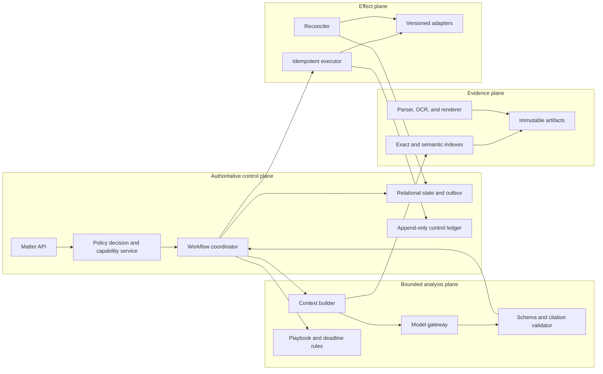
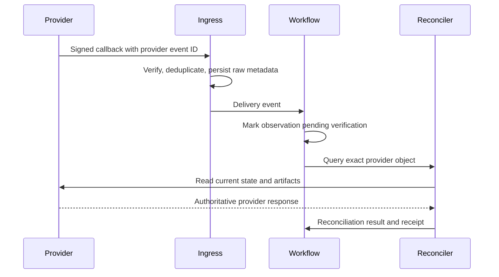

# Reference Architecture, Runtime, and Integrations

## Selected design

Use an application-owned control plane and a bounded model worker. Keep matter, contract, approval, obligation, hold, effect, and audit state in ordinary typed services and SQL. Store source bytes and renderings immutably. Run model calls as replaceable computations against a signed context manifest. Use queues and an outbox for asynchronous work. Introduce a durable workflow engine only for workflows that truly span long approvals, scheduled deadlines, or unreliable providers.

This design is intentionally less exotic than an agent mesh. Legal work benefits from clear ownership, stable identifiers, exact versions, and reviewable transitions. A second model may serve as a component evaluator; it is not an independent authority.

## Component responsibilities



| Component | Owns | Must not own |
|---|---|---|
| Matter API | Typed commands, actor context, responses | Model prompts as authority |
| Policy service | Tenant, matter, purpose, object, field, provider, and effect authorization | Legal interpretation |
| Workflow coordinator | Run state, review waits, budgets, cancellation, retries | External truth without receipts |
| Evidence plane | Exact bytes, digests, renderings, extraction lineage, indexes | Contract acceptance |
| Model gateway | Provider routing, schemas, prompt and model pinning, redaction policy | Durable task state |
| Rules engine | Approved playbooks, calendars, formulas, deterministic checks | Inferred legal rules |
| Effect executor | Authorized external writes and receipts | Reusing approval after payload change |
| Reconciler | Read-after-write and unknown-outcome resolution | Blind retry |
| Audit ledger | Unsampled control events and evidence references | Full secret or privileged payload copies by default |

## Runtime and language choices

Choose the language the owning team can operate securely. TypeScript, C#, Java, or Kotlin are good fits for a typed enterprise integration service; Python is useful for isolated parsing, OCR, or model-evaluation workers. Prefer one primary runtime. Add Python only when a document or ML library creates a measurable advantage.

Use:

- JSON Schema, Protobuf, or the project's typed equivalent for commands, model output, events, and connector contracts;
- SQL transactions for state plus outbox writes;
- object-store versioning, encryption, digest verification, and retention controls for artifacts;
- a queue with bounded retries and a dead-letter workflow;
- OpenTelemetry-compatible tracing for correlation, with sensitive data controls;
- feature flags and immutable behavior-release manifests.

Do not use a vector database as the source of truth. Exact contract, matter, clause, and version identifiers remain in SQL. Semantic retrieval returns candidates whose exact source bytes and access controls are revalidated.

## Model work contract

```json
{
  "task_type": "playbook_compare",
  "run_id": "run_71",
  "matter_id": "mat_2026_0142",
  "contract_version_id": "cv_9",
  "source_manifest_digest": "sha256:...",
  "playbook_version_id": "pb_supplier_msa_12",
  "jurisdiction_profile_id": "jp_4",
  "allowed_operations": ["classify", "compare", "draft_proposal"],
  "output_schema_version": "clause_assessment.v3",
  "model_release_id": "mr_2026_08_17",
  "budgets": {"max_tool_calls": 12, "max_tokens": 60000},
  "completion": {"all_in_scope_clauses_have_terminal_status": true}
}
```

The worker receives a capability-scoped context, not ambient connector credentials. Output is untrusted until schema validation, citation resolution, scope checks, policy checks, and any required human review succeed.

## Integration acceptance contract

Every CLM, DMS, e-signature, calendar, email, outside-counsel, and e-billing adapter documents:

| Concern | Required answer |
|---|---|
| Object identity | Which provider and tenant IDs are stable, and when can they change? |
| Version semantics | Are bytes immutable? Are labels, metadata, and renditions versioned separately? |
| Authorization | Can the app enforce matter, folder, object, field, and action scope? |
| Idempotency | Does the API accept a stable key? If not, what natural key and lookup prevent duplicates? |
| Events | Are callbacks signed, replayable, duplicated, delayed, truncated, or out of order? |
| Reconciliation | Which read API establishes current provider state after an uncertain write? |
| Rate and size limits | How are backpressure, pagination, attachment limits, and throttling exposed? |
| Retention and deletion | What provider copies, logs, backups, and legal holds remain? |
| Residency and subprocessors | Which regions and processors handle content and telemetry? |
| Audit evidence | Which request ID, actor, timestamp, object ID, version, receipt, and completion artifact are returned? |
| Change management | How are API versions, scopes, event schemas, and deprecations tested and pinned? |

If the provider cannot support exact-version recovery or effect reconciliation, restrict the adapter to read-only or require an explicit compensating manual procedure.

## Connector event posture

Callbacks accelerate a workflow; they do not establish legal truth.



This posture reflects real provider behavior: Google Drive notification payloads may be empty and channel message numbers are not sequential; Microsoft Graph delta provides the latest state rather than every intermediate change; e-signature webhooks can retry, omit large payload content, or represent manually asserted completion. Always persist provider event IDs and query the source before triggering a consequential downstream transition.

## Integration rollout and rejection decisions

| Stage | Allow | Reject |
|---|---|---|
| 1 | Read exact user-selected document version | Broad mailbox, drive, or CLM crawl |
| 2 | Read-only matter-scoped CLM/DMS; private internal result | External share, calendar write, signature creation |
| 3 | Versioned adapters, staged writes, D3 approval, receipts, reconciliation | Generic browser automation for legal effects |
| 4 | Managed identities, private networking where justified, connector SLOs and runbooks | Shared service accounts across tenants or ethical walls |
| 5 | Backpressure, provider-specific queues, degradation and replay | Unlimited retry or retrying `Unknown` effects |

Browser automation is acceptable only for a bounded read or a supervised fallback where no stable interface exists and the UI state can be captured. It is not a reliable primary channel for signature, filing, notice, or hold actions.

## Build versus adopt

| Capability | Default choice | Adopt a specialist platform when |
|---|---|---|
| Matter and contract system of record | Integrate the organization's existing CLM or matter system | It already carries accepted identity, workflow, access, and records controls |
| Agent workflow | Small application coordinator, then durable engine if needed | Waits, timers, callbacks, and recovery exceed simple queue orchestration |
| Clause representation | Versioned local schema with playbook mappings | A standard or vendor taxonomy is already governed and pinned |
| Legal taxonomy | Optional SALI LMSS mapping | Interoperability value exceeds mapping and version-governance cost |
| Computable contracts | Do not adopt by default | Counsel-approved templates contain stable executable logic with tests and clear precedence |
| Content access | Native DMS API or CMIS where capabilities suffice | Repository supports required versions, permissions, holds, and audit semantics |

SALI LMSS is useful for semantic interoperability, but its repository warns that main-branch ontology files are not final releases. Pin a reviewed release or commit and map local terms explicitly. OASIS eContracts is a 2007 committee specification, not a modern universal contract interchange format. Accord Project templates can combine text, models, and logic, but are a specialized choice rather than the default representation of negotiated contracts.

## Dependency failure modes

| Failure | Safe response |
|---|---|
| CLM API returns stale record | Preserve observation, reconcile by version and update time, block effect |
| DMS download URL expires | Resolve a fresh authorized URL; never persist bearer URLs as evidence |
| Callback duplicated or reordered | Deduplicate, then query provider object |
| Provider accepts request but times out | Mark effect `Unknown`; reconcile by idempotency or natural key |
| Annex exists outside primary file | Treat package incomplete until manifest is resolved |
| API scope expands after upgrade | Fail closed; require connector security review |
| Taxonomy changes identifier meaning | Keep old mapping immutable; migrate through reviewed version |
| Model provider unavailable | Continue deterministic workflow and queue analysis or degrade to manual |

## Architecture readiness checklist

- [ ] Authoritative state is separate from model context and telemetry.
- [ ] Every artifact and rendition has an immutable digest and version identity.
- [ ] Model inputs and outputs have versioned schemas and source manifests.
- [ ] Workers receive short-lived, purpose-bound capabilities.
- [ ] SQL state and outbox updates are transactional.
- [ ] Every external write has stable effect identity, receipt, and reconciliation query.
- [ ] Provider callbacks are authenticated, deduplicated, and treated as hints.
- [ ] Integration versions, scopes, quotas, residency, retention, and failure behavior are recorded.
- [ ] Optional taxonomies and computable-contract tooling are justified and pinned.

## Key sources

- [OASIS CMIS 1.1 standard and errata](https://www.oasis-open.org/standard/cmisv1-1/)
- [SALI Legal Matter Specification Standard repository](https://github.com/sali-legal/LMSS)
- [Accord Project documentation](https://docs.accordproject.org/)
- [Ironclad public API overview](https://support.ironcladapp.com/hc/en-us/articles/12278082472855-Ironclad-s-Public-API-Overview) and [webhooks](https://developer.ironcladapp.com/reference/webhooks)
- [Adobe Acrobat Sign webhook guide](https://opensource.adobe.com/acrobat-sign/developer_guide/webhookapis.html)
- [Microsoft Graph drive item versions](https://learn.microsoft.com/en-us/graph/api/driveitem-list-versions?view=graph-rest-1.0) and [delta behavior](https://learn.microsoft.com/en-us/graph/api/driveitem-delta?view=graph-rest-1.0)
- [Google Drive push notifications](https://developers.google.com/workspace/drive/api/guides/push) and [change log](https://developers.google.com/workspace/drive/api/guides/manage-changes)

