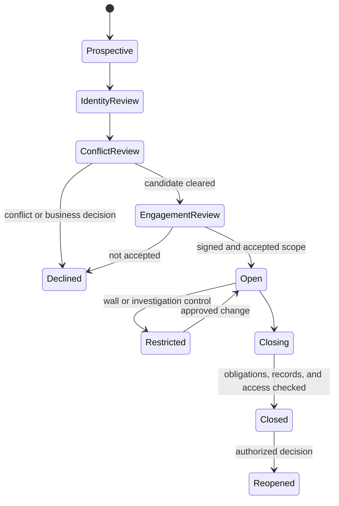

# Matter Intake, Conflicts, Privilege, and Jurisdiction

## Intake is an authority workflow

Matter intake is not merely metadata collection. It determines whether the organization may receive information, whom it represents, what it agreed to do, which professionals are responsible, and which people and systems may access the material. The agent may prepare evidence and identify ambiguity; the responsible legal function accepts the engagement and any conflict resolution.



No document analysis beyond approved prospective-client handling occurs while identity or intake authority is unresolved.

## Party resolution model

Normalize names only to generate candidates. Decide identity using evidence such as registry numbers, addresses, domains, corporate relationships, transaction roles, prior matter identifiers, and human confirmation.

```yaml
party_resolution:
  request_id: pr_108
  input_name: Acme
  role_assertion: counterparty
  candidates:
    - organization_id: org_44
      legal_name: Acme Holdings plc
      registry_id: "00991122"
      evidence: [art_registry_8, art_term_sheet_2]
      score: 0.82
    - organization_id: org_91
      legal_name: Acme Services Ltd
      registry_id: "08337711"
      evidence: [art_registry_9]
      score: 0.64
  disposition: needs_human_confirmation
  prohibited_action: conflict_clearance_from_score
```

A similarity score is not conflict clearance. Search must include current, former, and prospective clients; affiliates and adverse parties appropriate to local policy; relevant people; and matter subjects. Record query inputs, source coverage, false-positive disposition, reviewer, and expiration. New parties, lateral hires, corporate changes, or expanded scope trigger rescreening.

## Engagement boundary

| Field | Required evidence | Failure posture |
|---|---|---|
| Client identity | Accepted engagement or authorized internal representation record | Do not infer from payer, uploader, or contract party |
| Matter purpose | Written description and matter owner | Block unrelated reuse |
| Included work | Approved services and jurisdictions | Treat unlisted specialist advice as out of scope |
| Excluded work | Explicit exclusions and assumptions | Surface before analysis and in review |
| Responsible professional | Current person and delegation | Pause D3 workflow if unavailable or revoked |
| Fees and billing | Approved arrangement and billing rules | Keep fee analysis separate from merits |
| Data handling | Provider, residency, transfer, retention, and special-category approvals | Deny disallowed provider or region |
| Communications | Authorized contacts and channels | Do not send to inferred recipients |

The system versions engagement changes. A changed purpose or new jurisdiction invalidates derived context, approvals, and possibly conflict results.

## Confidentiality, privilege, and work product are different

| Concept | Engineering treatment | Reserved judgment |
|---|---|---|
| Professional confidentiality | Default protect all information relating to representation; enforce matter access and reasonable safeguards | Applicable professional duty and permitted disclosure |
| Attorney-client or legal professional privilege | Store an `asserted_privilege` label, basis, participants, purpose, jurisdiction, and counsel disposition | Whether the legal test is satisfied or privilege is waived |
| Work product or litigation privilege | Track litigation purpose, anticipation date, creator, and materials separately | Applicable doctrine, protection, substantial-need exception |
| Contractual confidentiality | Link the restriction to exact clause, parties, scope, term, and exceptions | Interpretation and enforcement |
| Privacy classification | Minimize and restrict personal or sensitive data by purpose | Lawful basis, rights response, and jurisdictional exception |

Labels are access-control inputs and review assertions, not proof. A privilege banner cannot create privilege; an accidental broad share cannot be repaired by relabeling. In U.S. federal proceedings, Federal Rule of Evidence 502 addresses disclosure and waiver in specified circumstances, but it does not create a universal privilege rule. In England and Wales, legal advice and litigation privilege have distinct requirements. Other jurisdictions differ materially.

## Privilege-aware artifact contract

```yaml
information_treatment:
  artifact_id: art_880
  matter_id: mat_2026_0142
  confidentiality: client_confidential
  privilege_assertion:
    status: asserted
    doctrine_candidate: legal_advice_privilege
    jurisdiction_profile_id: jp_eng_wales_4
    legal_purpose_assertion: contract_advice
    participant_ids: [per_client_2, per_counsel_7]
    basis_artifact_ids: [art_email_headers_880]
    counsel_disposition: pending
  work_product_assertion: none
  access_policy_id: ap_wall_18
  external_disclosure_status: prohibited_pending_review
  retention_class_id: rc_legal_matter_5
```

Do not place privileged or confidential text in logs, metrics labels, ticket titles, generic chat memory, cross-matter embeddings, or vendor feedback channels. Provider-side retention and training settings are necessary review items but do not alone establish legal protection.

## Jurisdiction profile

```yaml
jurisdiction_profile:
  profile_id: jp_4
  status: counsel_approved
  approved_at: 2026-08-20T10:00:00Z
  approved_by: per_17
  dimensions:
    governing_law: England and Wales
    forum: courts_of_england_and_wales
    professional_rules: [SRA]
    data_processing_locations: [GB, EU]
    contracting_entities: [org_client_1, org_counterparty_2]
    execution_locations: [GB]
    subject_matter: commercial_services
  rule_sources:
    - source_id: src_legal_42
      effective_from: 2026-05-01
      checked_at: 2026-08-20
  assumptions: []
  exclusions: [tax, employment, sanctions]
  refresh_on: [law_change, party_change, forum_change, scope_change]
```

Profiles are approved operational inputs, not a machine-generated legal opinion. Each rule carries source, effective period, reviewer, and applicability. If two authorities conflict, preserve both and route the question; do not rank jurisdictions using model confidence.

## AI-use intake decision

Before sending matter material to a model or external processor, record:

| Question | Evidence |
|---|---|
| Is use permitted by engagement and client instruction? | Engagement term, consent if required, internal policy |
| Does the provider retain, train on, or expose data to humans? | Contract, technical settings, subprocessor list, verified configuration |
| Where is data processed and stored? | Region and transfer documentation |
| Can the provider meet deletion, hold, audit, and incident duties? | DPA, retention behavior, operational tests |
| Is redaction or a private deployment required? | Information class and threat analysis |
| Is output reviewed by a competent professional? | Assigned reviewer and workflow gate |
| Must AI use be disclosed? | Applicable rule, client agreement, tribunal or counterparty requirement |

ABA Formal Opinion 512 identifies competence, confidentiality, communication, supervision, candor, and fees as relevant to generative-AI use by lawyers. It is influential model guidance, not binding law in every jurisdiction. SRA, Bar Standards Board, California, and other authorities publish distinct guidance; deployments must map the actual regulator and current local rules.

## Closing and reopening

Closing requires an approved checklist: final document set and digests; outstanding obligations and deadlines; funds or property handling where relevant; return or transfer instructions; access changes; records classification; holds; outside-counsel closure; and client communication. Closing a matter does not automatically delete it or release a hold. Reopening creates a new authorization event and reevaluates conflicts, scope, jurisdictions, access, providers, and stale playbooks.

## Intake failure matrix

| Failure | Detection | Response |
|---|---|---|
| Homonymous company selected | Registry and address conflict | Block and require identity confirmation |
| Affiliate added mid-negotiation | Party graph change | Rescreen and invalidate conflict-dependent approval |
| Prospective-client material rejected | Intake state and retention rule | Restrict, apply approved retention, prevent adverse reuse |
| Wrong matter selected by user | Document watermark, parties, DMS parent mismatch | Quarantine without exposing content broadly |
| Privileged content reaches telemetry | DLP or trace sampling audit | Contain, revoke access, assess disclosure, preserve incident evidence |
| Jurisdiction profile expired | Effective-date and refresh rule | Block reserved conclusions and D3 effects |
| Engagement scope expands by prompt | Capability mismatch | Refuse and route engagement change |

## Intake exit checklist

- [ ] Client and all material parties are canonically resolved or explicitly awaiting human review.
- [ ] Conflict search scope, sources, reviewer, result, and expiry are recorded.
- [ ] Engagement purpose, included work, exclusions, jurisdictions, and responsible professional are approved.
- [ ] Matter ACL and ethical wall are active before content ingestion.
- [ ] Confidentiality, privilege assertion, work-product assertion, and privacy classification are separate.
- [ ] AI provider use is purpose-approved and technically verified.
- [ ] Prospective-client, declined, closed, and reopened states have defined access and retention behavior.

## Key sources

- [ABA Formal Opinion 512 on generative AI](https://www.americanbar.org/content/dam/aba/administrative/professional_responsibility/ethics-opinions/aba-formal-opinion-512.pdf)
- [ABA Rule 1.9 former-client duties](https://www.americanbar.org/content/aba-cms-dotorg/en/groups/professional_responsibility/publications/model_rules_of_professional_conduct/rule_1_9_duties_of_former_clients/) and [Rule 1.18 prospective clients](https://www.americanbar.org/groups/professional_responsibility/publications/model_rules_of_professional_conduct/rule_1_18_duties_of_prospective_client/)
- [Federal Rule of Evidence 502](https://www.law.cornell.edu/rules/fre/rule_502) and [Federal Rule of Civil Procedure 26](https://www.law.cornell.edu/rules/frcp/rule_26)
- [SRA warning on misuse of AI in legal services](https://guidance.sra.org.uk/solicitors/guidance/misuse-ai/)
- [Law Society guidance on legal professional privilege and confidentiality](https://www.lawsociety.org.uk/topics/data-protection/lpp-and-client-confidentiality)
- [State Bar of California generative-AI practical guidance](https://www.calbar.ca.gov/sites/default/files/portals/0/documents/ethics/Generative-AI-Practical-Guidance.pdf)

