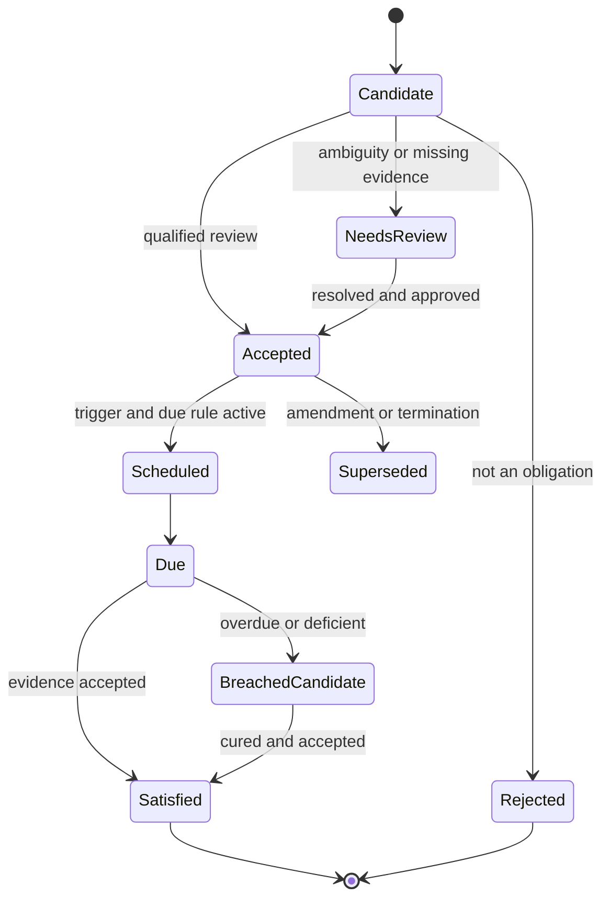
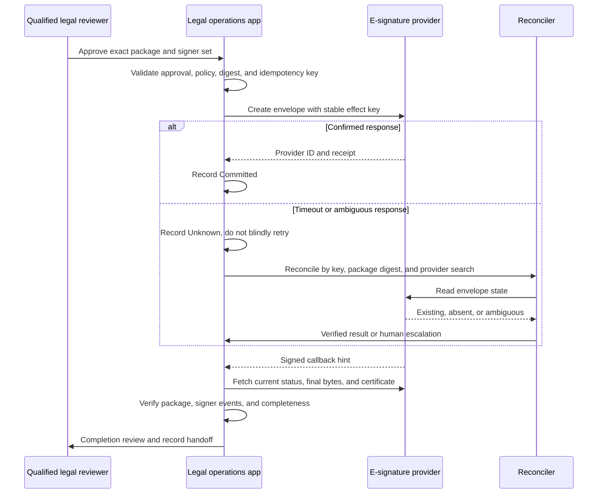

# Obligations, Deadlines, Approvals, and Signature Handoff

## From text to an accepted operational record

An extracted obligation is a candidate. It becomes operational only after the source clause, parties, trigger, rule, owner, evidence, dependencies, and review are accepted. This separation prevents plausible model output from silently becoming a legal calendar or business commitment.



`BreachedCandidate` is not a legal conclusion. Counsel or the designated owner decides breach, waiver, cure, remedy, and notice.

## Obligation schema

```yaml
obligation:
  obligation_id: obl_332
  contract_package_id: pkg_31
  governing_version_set: [dv_executed_10, amendment_1]
  source_clause_occurrence_ids: [co_611]
  obligor_party_ids: [org_supplier_2]
  beneficiary_party_ids: [org_client_1]
  action: deliver_security_assurance_report
  object: current_SOC_2_Type_II_report
  conditions: [during_term, processes_client_data]
  trigger:
    type: recurring_anniversary
    source_event: effective_date
    source_value: 2026-09-15
  due_rule:
    expression: every_12_months_on_anniversary
    calendar_id: business_calendar_gb_4
    timezone: Europe/London
    adjustment: no_adjustment_stated
    rule_version: date_rule_7
  computed_due_candidates: [2027-09-15]
  accepted_due_date: null
  owner_person_id: per_contract_owner_8
  backup_role: security_assurance
  required_evidence: [report, scope_statement, exceptions_response]
  status: needs_review
  approved_by: null
```

Store the legal language and the computation separately. If the text says “within 30 days,” retain whether days are calendar or business days, which event starts the period, whether the trigger day counts, time zone, holidays, end-of-day rule, notice receipt semantics, and any extension. Do not invent missing terms.

## Deadline calculation protocol

1. The agent identifies the candidate rule and cites the exact clause and trigger evidence.
2. A qualified reviewer accepts the rule interpretation and jurisdiction/calendar profile.
3. A deterministic, versioned date engine computes candidate dates.
4. A docketing or legal owner independently verifies critical deadlines according to policy.
5. The system records accepted date, reviewer, rule version, calendar version, source event, and later changes.
6. Reminders and escalations are deterministic effects with receipts.

RFC 5545 iCalendar can transport dates, events, tasks, recurrences, and time-zone information. It does not define the legal meaning of a deadline. Provider calendar acceptance also does not prove that the legal deadline is correct.

| Ambiguity | Safe handling |
|---|---|
| Trigger event not yet verified | Keep obligation accepted but unscheduled |
| “Business day” undefined | Apply no calendar until reviewer selects an approved definition |
| Court or regulator holiday changes | Version the calendar and recalculate as a proposal |
| DST transition | Calculate in named IANA time zone and display UTC plus local time |
| Amendment changes time period | Supersede prior rule; retain both histories |
| Notice deemed received by a special rule | Model as a separate accepted event rule |
| Renewal depends on non-receipt of notice | Represent negative-event monitoring and reconciliation explicitly |

## Approval object

Approval must bind a decision or effect, not a broad instruction such as “looks good.”

```json
{
  "approval_id": "apr_901",
  "matter_id": "mat_2026_0142",
  "decision_type": "signature_package_submission",
  "subject": {
    "contract_package_manifest_digest": "sha256:...",
    "signer_set_digest": "sha256:...",
    "recipient_set_digest": "sha256:...",
    "execution_profile_id": "ep_uk_company_4"
  },
  "allowed_effect_id": "eff_esign_create_pkg31_r1",
  "approver_id": "per_17",
  "approver_role": "responsible_counsel",
  "authority_evidence_id": "auth_legal_22",
  "policy_version": "effect_policy_8",
  "approved_at": "2026-08-30T12:00:00Z",
  "expires_at": "2026-08-31T12:00:00Z",
  "conditions": ["all_annexes_present", "business_owner_approved"],
  "status": "active"
}
```

Changing bytes, annexes, order of precedence, recipients, signer roles, authentication method, fields, routing, expiry, execution profile, or provider invalidates approval.

## Signature package contract

The package manifest includes:

- every document and annex in execution order, with digest and human-readable name;
- the agreed base and redline lineage;
- final legal and business approvals;
- contracting legal entities and addresses;
- each signer, capacity, authority evidence, authentication method, and routing order;
- signature type and jurisdiction-specific formality profile;
- witness, seal, notarization, counterpart, delivery, and effective-date requirements if applicable;
- completion evidence expected from the provider; and
- the destination repository and post-signature obligation workflow.

Electronic form alone does not settle validity. The U.S. ESIGN Act generally prevents denial of legal effect solely because a signature or record is electronic, while preserving other substantive requirements and adding consumer-consent rules in its scope. UETA depends on state enactment and transaction facts. Under EU eIDAS, electronic signatures cannot be denied effect solely for being electronic, and a qualified electronic signature has the equivalent legal effect of a handwritten signature; national law can still govern form and representation. Counsel selects the execution profile.

Identity proofing, authentication, signature creation, organizational role, signatory authority, assent, document integrity, delivery, and enforceability are separate claims.

## Signature handoff sequence



Provider status is evidence, not a universal legal conclusion. Some CLM workflows permit users to mark manually signed packets complete; webhook payloads may be retried or truncated. Fetch final bytes and provider evidence, compare their digests and signer set to the approved manifest, and require a completion review before marking the internal package executed.

## Post-signature reconciliation

| Check | Result if failed |
|---|---|
| Final bytes match approved package or documented provider transformation | Quarantine execution record |
| All annexes and signature pages present | Incomplete package review |
| Signers and capacities match approved set | Authority and validity escalation |
| Provider certificate and timestamps retained | Evidence deficiency |
| Effective date resolved under approved rule | Keep downstream triggers unscheduled |
| DMS and CLM contain same final version and metadata | Reconcile before downstream reliance |
| Obligations extracted from executed, amended version set | Do not activate draft-derived obligations |

A cryptographic digest demonstrates byte-level fixity. A trusted timestamp can support evidence that data existed at a time. Neither proves legal advice, authority, assent, delivery, enforceability, or completeness on its own.

## Obligation operations

Use a deterministic work queue for reminders, evidence requests, escalations, and recurring checks. Every event references the accepted obligation and due-date computation. Amendment, assignment, termination, renewal, waiver, dispute, or hold events may suspend or supersede the workflow only through an approved transition.

Critical obligations need named primary and backup owners, multiple reminder horizons, escalation routes, system-of-record synchronization, and periodic reconciliation. Do not depend on a model conversation or a single personal calendar.

## Failure matrix

| Failure | Control |
|---|---|
| Model misses negative obligation or exception | Clause-level recall eval, complete-package gate, human review for high risk |
| Trigger recorded twice | Stable source-event ID and deduplication |
| Calendar write times out | `Unknown` effect plus event lookup; no blind duplicate |
| Signer authenticates but lacks authority | Separate authority record and legal approval |
| Envelope callback arrives before create response | Correlate provider object and stable effect ID |
| Final PDF differs from package | Digest and visual comparison, quarantine |
| Executed amendment not applied | Version-set reconciliation before obligation activation |
| Owner leaves organization | Identity lifecycle event and backup assignment |

## Operational checklist

- [ ] Candidates cannot trigger reminders or external actions before acceptance.
- [ ] Deadline rules and calendars are deterministic, versioned, and human-approved.
- [ ] Critical dates receive independent verification.
- [ ] Approvals bind exact payloads, identities, versions, policy, conditions, and expiry.
- [ ] Signature profiles separate identity, authority, assent, formality, integrity, and delivery.
- [ ] E-signature effects use stable identity, receipts, and reconciliation.
- [ ] Final executed artifacts are fetched, verified, and reconciled across systems.
- [ ] Obligations follow the executed and amended version set, never a convenient draft.

## Key sources

- [U.S. ESIGN Act, 15 U.S.C. § 7001](https://www.law.cornell.edu/uscode/text/15/7001)
- [Uniform Electronic Transactions Act](https://www.uniformlaws.org/committees/community-home?CommunityKey=2c04b76c-2b7d-4399-977e-d5876ba7e034)
- [EU Regulation 2024/1183 amending eIDAS](https://eur-lex.europa.eu/eli/reg/2024/1183/oj)
- [ETSI EN 319 142-1 V1.2.1 PAdES](https://www.etsi.org/deliver/etsi_EN/319100_319199/31914201/01.02.01_60/en_31914201v010201p.pdf)
- [RFC 5545 iCalendar](https://www.rfc-editor.org/info/rfc5545), [RFC 3161 time-stamp protocol](https://www.rfc-editor.org/info/rfc3161), and [RFC 4998 evidence record syntax](https://www.rfc-editor.org/info/rfc4998)

