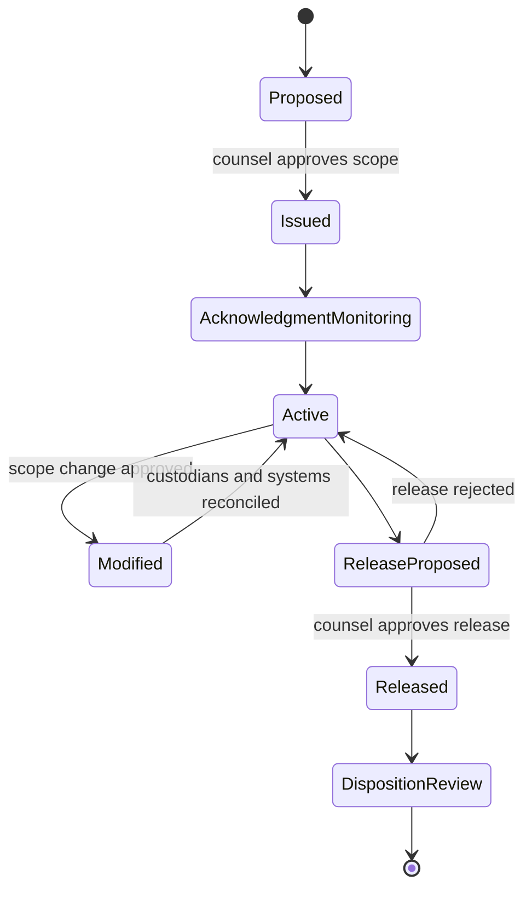
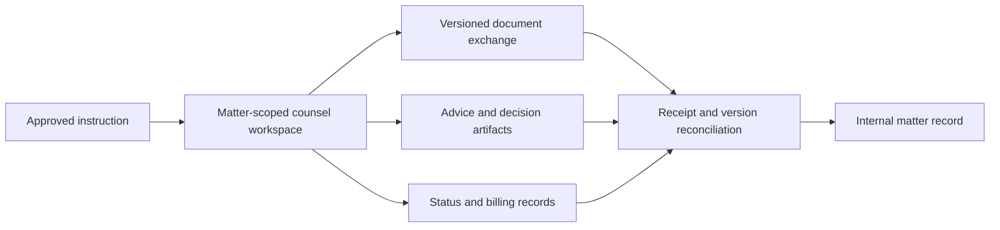

# Legal Holds, Retention, Outside Counsel, and Records

## Separate preservation from ordinary retention

Retention schedules define how records are kept and disposed of in normal operations. A legal hold or equivalent preservation instruction suspends disposition for an approved scope when relevant. The agent may identify candidate custodians, systems, date ranges, and sources; qualified counsel decides whether preservation is required, its scope, modifications, and release. Records and privacy owners implement the approved precedence rules.



Releasing a hold does not itself delete records. It returns items to the approved retention and disposition process, which may identify another hold, regulatory requirement, contract restriction, or business record need.

## Hold record

```yaml
legal_hold:
  hold_id: hold_2026_17
  matter_id: mat_lit_44
  authority:
    decision_artifact_id: art_counsel_hold_17
    approved_by: per_litigation_counsel_4
    approved_at: 2026-08-11T14:00:00Z
  preservation_basis_assertion: reasonably_anticipated_litigation
  jurisdictions: [US_federal_candidate]
  scope:
    issues: [project_orion_termination]
    date_ranges:
      - from: 2024-01-01
        to: open
    custodian_ids: [per_81, per_82]
    system_ids: [email_1, drive_3, clm_1, chat_2]
    content_categories: [contracts, negotiation_email, approvals, notices]
    excluded_categories: [unrelated_health_data]
  notice_template_version: hold_notice_6
  acknowledgement_due_rule_id: hold_ack_3days
  preservation_connectors: [pc_email_1, pc_drive_3]
  status: active
  reconciliation_schedule: weekly
  release_authority_required: litigation_counsel
```

The record retains scope history. Do not mutate away the original issuance or earlier custodian/system lists.

## Preservation workflow

1. Capture counsel's approved basis, scope, jurisdictions, date ranges, issues, custodians, systems, and exclusions.
2. Resolve identities and systems without broadening scope automatically.
3. Generate notices from an approved template and expose the exact recipients and text for approval.
4. Execute provider preservation actions with stable effect IDs and receipts.
5. Track delivery and acknowledgements separately from actual system preservation.
6. Reconcile employee changes, new data sources, connector failures, and scope changes.
7. Escalate gaps without copying the underlying material into the alert.
8. On approved release, remove only this hold's constraint, then reconcile other holds and schedules.

Federal Rule of Civil Procedure 37(e) addresses sanctions and remedies for electronically stored information that should have been preserved in anticipation or conduct of U.S. federal litigation and was lost because reasonable steps were not taken. The rule does not create the duty to preserve and is not a global hold standard. Counsel defines the applicable preservation duty.

## Retention and disposition contract

```yaml
record_classification:
  artifact_id: art_executed_contract_77
  record_class_id: executed_supplier_contract
  schedule_id: records_schedule_2026_4
  schedule_version: 4
  event_trigger: contract_termination
  trigger_event_id: null
  retention_period: P7Y
  disposition_action: review_then_delete
  jurisdiction_profiles: [jp_4]
  active_hold_ids: [hold_2026_17]
  privacy_restrictions: [purpose_limitation, access_minimization]
  disposition_state: suspended_by_hold
  classification_evidence: [pkg_31, counsel_classification_3]
```

ISO 15489-1 provides records-management concepts and controls but does not supply an organization's legal schedule. NIST SP 800-88 Rev. 2 addresses media sanitization; it does not decide when records may be disposed of. The system must keep authority to retain separate from the mechanism used to delete or sanitize.

## Hold, privacy, and access conflicts

| Situation | Required position |
|---|---|
| Valid hold overlaps scheduled deletion | Suspend disposition for the scoped copy; record precedence |
| Data-subject deletion request overlaps legal-claims need | Route to privacy and legal owners; preserve the legal basis and response decision |
| Hold covers restricted personal data | Preserve without expanding ordinary access |
| Counsel asks to “keep everything” | Require scoped, documented decision and assess proportionality and local law |
| One artifact is under multiple holds | Release only the named hold; retain other constraints |
| Provider cannot preserve in place | Approve a controlled collection with lineage, access, and duplicate-disposition plan |

Preservation does not grant discovery, review, or general access. A hold can coexist with encryption, ethical walls, data minimization, and purpose limitation.

## Outside-counsel workspace

Outside counsel receives a matter-scoped identity, role, time boundary, and resource boundary. The engagement record captures law firm entity, responsible individuals, conflicts/engagement status, approved instructions, jurisdictions, rates where relevant, data-processing terms, permitted systems, and exit requirements.



Use separate channels for substantive legal material, administrative status, and e-billing. LEDES and UTBMS can standardize billing data and task codes; an invoice line is not evidence of the legal analysis performed. Avoid embedding privileged advice in invoice descriptions or generic ticketing systems.

## Counsel exchange contract

| Field | Purpose |
|---|---|
| Instruction ID and version | Prove the authorized question and later changes |
| Matter and client IDs | Prevent firm or matter misrouting |
| Recipient identities and roles | Avoid domain-wide access |
| Source manifest and digests | Establish what counsel received |
| Information treatment | Apply confidentiality, privilege assertion, privacy, and export controls |
| Requested deliverable and due rule | Make scope and timing explicit |
| Advice artifact and assumptions | Preserve answer, basis, jurisdiction, author, and effective date |
| Decision owner | Keep internal acceptance separate from outside advice |
| Return and deletion obligations | Close access and copies subject to law and holds |

Do not use a consumer file link, shared mailbox, or model-generated address as the authoritative recipient. External sharing is a D3 effect with exact payload approval.

## Reconciliation duties

At least periodically, reconcile:

- approved hold scope against active custodians, leavers, aliases, and systems;
- hold effect receipts against provider state;
- notice recipients against delivery and acknowledgement state;
- records classifications against executed contract and amendment events;
- disposition candidates against every active hold and legal/privacy exception;
- outside-counsel access against current engagement and personnel;
- exchanged artifacts against matter manifests and DMS versions; and
- e-billing matter IDs and invoice periods against approved engagement terms.

## Failure matrix

| Failure | Safe response |
|---|---|
| Employee leaves during active hold | Transfer identity, preserve sources, update custodian contact, verify no access gap |
| Provider “hold enabled” call times out | Mark effect `Unknown`, query source, escalate if deadline at risk |
| New collaboration system discovered | Propose scope update; counsel decides |
| Hold release job removes all holds | Prevent through hold-specific keys and invariant tests |
| Backup copy cannot be selectively deleted | Document system limitation and approved lifecycle; restrict access |
| Outside counsel uploads a new “final” | Create a new version and require lineage/reconciliation |
| Invoice narrative reveals sensitive merits | Minimize description and contain disclosure |
| Counsel account remains after matter close | Automated access review plus revocation receipt |

## Records and counsel checklist

- [ ] Counsel alone issues, changes, and releases legal holds.
- [ ] Hold scope, history, notices, acknowledgements, provider effects, and reconciliations are durable.
- [ ] Preservation and access are separate controls.
- [ ] Retention schedule, privacy decisions, and every hold are checked before disposition.
- [ ] Deletion authority and sanitization mechanism are separate.
- [ ] Outside-counsel access is individual, matter-scoped, time-bounded, and reviewed.
- [ ] Substantive advice, status, and billing channels are separated.
- [ ] External exchanges preserve exact manifests, receipts, treatment labels, and destination identity.

## Key sources

- [Federal Rule of Civil Procedure 37(e)](https://www.law.cornell.edu/rules/frcp/rule_37)
- [ISO 15489-1:2016 records management overview](https://www.iso.org/standard/62542.html)
- [NIST SP 800-88 Rev. 2 media sanitization](https://nvlpubs.nist.gov/nistpubs/SpecialPublications/NIST.SP.800-88r2.pdf)
- [NARA Universal Electronic Records Management Requirements](https://www.archives.gov/records-mgmt/policy/universalermrequirements) and [records freeze FAQ](https://www.archives.gov/files/frc/freeze/records-freeze-faq-2.pdf), applicable to their stated U.S. federal context
- [LEDES standards organization](https://ledes.org/) and [UTBMS task-code resource](https://utbms.com/)
- [GDPR Article 5 principles](https://eur-lex.europa.eu/eli/reg/2016/679/art_5/oj) and [Article 17 erasure provisions and exceptions](https://eur-lex.europa.eu/eli/reg/2016/679/art_17/oj)

