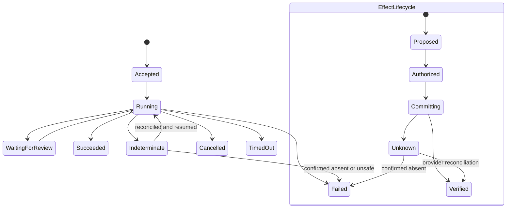

# State, Events, Context, Memory, Planning, and Recovery

## Keep six things separate

Legal workflows become unsafe when a chat transcript is treated as state or a model recollection as evidence.

| Object | Meaning | Example |
|---|---|---|
| Command | Requested intent, not a fact | `submit_signature_package` |
| Authoritative state | Current accepted workflow fact | package is `approved_for_submission` |
| Domain event | Accepted state transition | `ClauseAssessmentAccepted` |
| Effect intent and receipt | Proposed and observed external action | e-signature envelope create request and provider receipt |
| Delivery event | Transport observation | webhook received twice |
| Telemetry | Diagnostic signal, not legal record | span duration and token count |

The database transition and outbox event commit together. Telemetry can be sampled or unavailable; the control ledger and authoritative records cannot depend on it.

## Aggregate boundaries

Prefer small, explicit aggregates:

- **Matter:** identity, engagement, participants, jurisdiction assertions, restrictions, lifecycle.
- **Contract package:** members, versions, redline graph, execution state.
- **Clause assessment:** exact occurrence, playbook rule, proposal, review decision.
- **Obligation:** source, accepted rule, owner, due state, evidence.
- **Approval:** exact decision/effect subject, authority, conditions, expiry.
- **Effect:** stable identity, authorization, attempt history, receipt, reconciliation state.
- **Legal hold:** scope versions, notices, preservation effects, reconciliations, release.

Do not serialize an entire matter into one mutable JSON object. Use transactions for local invariants and version checks across aggregate commands.

## Run and effect states



`Succeeded` means the run met its typed completion condition, not that a legal proposition is true. `Verified` means the intended provider effect was found with expected invariants, not that the underlying contract is enforceable.

## Event envelope

```json
{
  "event_id": "evt_01J...",
  "event_type": "ObligationAccepted.v2",
  "occurred_at": "2026-08-31T08:45:12Z",
  "tenant_id": "ten_01",
  "matter_id": "mat_2026_0142",
  "aggregate": {"type": "obligation", "id": "obl_332", "version": 5},
  "actor": {"type": "person", "id": "per_17", "delegation_id": null},
  "run_id": "run_71",
  "attempt_id": "attempt_2",
  "step_id": "step_review_4",
  "causation_id": "cmd_991",
  "correlation_id": "corr_pkg31",
  "trace_id": "trace_...",
  "behavior_release_id": "br_2026_08_31_1",
  "policy_version": "policy_8",
  "payload_schema": "obligation_accepted.v2",
  "payload": {"obligation_id": "obl_332", "review_artifact_id": "review_42"},
  "payload_digest": "sha256:..."
}
```

Sensitive text stays in a protected artifact referenced by ID. The event carries enough metadata to authorize, replay, reconcile, and audit without becoming another unrestricted copy.

## Effect identity and retry contract

Derive a stable effect ID from the business operation, not the worker attempt:

```text
effect_id = hash(tenant_id, matter_id, effect_type, business_object_id, operation_revision)
```

Every retry reuses the same effect ID. The executor records request digest, destination, authorization, provider idempotency key, provider request ID, response, and verification evidence. If a timeout occurs after dispatch, state becomes `Unknown`. A reconciler queries by provider ID, idempotency key, or an approved natural key before another write is considered.

| Provider finding | Transition | Next action |
|---|---|---|
| Exact expected object exists | `Unknown` → `Verified` | Continue downstream workflow |
| Object definitely absent | `Unknown` → `Failed` | Retry only if authorization remains valid |
| Similar but mismatched object exists | Remain `Unknown` | Human reconciliation; prevent duplicate |
| Provider unavailable | Remain `Unknown` | Back off and escalate by consequence deadline |
| Approval expired during uncertainty | Remain `Unknown` | Reconcile; new approval only for a proven new effect |

Compensation is not rollback. Sending a correction, voiding an envelope, or deleting a draft is a new authorized effect with its own evidence; an external recipient may already have seen the original.

## Planning policy

Use a fixed macro-workflow and allow bounded planning only inside an analysis step.

```yaml
analysis_plan:
  objective: compare_supplier_msa
  fixed_phases: [verify_scope, verify_package, retrieve_rules, assess, validate, present]
  allowed_dynamic_steps: [follow_cross_reference, retrieve_defined_term, request_missing_schedule]
  forbidden_steps: [contact_counterparty, change_playbook, infer_signature_authority]
  max_steps: 18
  max_retrievals: 40
  stop_on: [scope_ambiguity, privilege_risk, missing_authority, source_conflict]
  completion_schema: clause_assessment_set.v3
```

One bounded agent loop is the default. Multi-agent delegation adds identity, scope, shared-state, and evidence problems and should be introduced only for a measured, separable workflow with explicit handoff contracts. Multiple agents do not provide independent legal review merely because they use different prompts.

## Context layers

Build context deterministically in this order:

1. task objective and prohibited actions;
2. actor capability, matter, engagement, jurisdiction, and information policy;
3. exact contract package and selected versions;
4. approved playbook and relevant accepted domain records;
5. retrieved evidence with anchors and digests;
6. current plan, completed steps, open questions, budgets, and effect states;
7. output schema and stop conditions.

Rank authority before relevance. Matter-specific approved decisions beat generic playbooks; current approved playbooks beat old examples; exact source language beats summaries. Retrieval filters by tenant, matter, access, purpose, version, effective dates, and information class before semantic ranking.

## Memory taxonomy and default policy

The seven lifetimes are separate stores and policies, not labels added to one vector index.

| Canonical lifetime | Use | Reject | Retention and deletion | Poisoning control | Evaluation control |
|---|---|---|---|---|---|
| Turn/scratch | Current call messages, temporary notes, and untrusted tool results | Approval, legal fact, durable state, or authority | Destroy at turn end unless a typed artifact is explicitly accepted | Mark every source and instruction origin; never execute an instruction found in content | Seed hostile clauses, emails, comments, and callback text; assert no scope or tool expansion |
| Working/run | Current plan, evidence manifest, budgets, open questions, and intermediate candidates | Final legal interpretation, provider truth, or sole restart state | Bound to the run; checkpoint accepted progress, then expire temporary material | Rebuild from authorized sources; quarantine unsupported summaries and conflicting evidence | Interrupt after each step and compare rebuilt plan, evidence, budget, and stop decisions |
| Session | Authenticated UI focus, selected matter, navigation, and a pending operator question | Cross-worker recovery, approval, engagement scope, or legal record | Short TTL; actor-, device-, tenant-, and matter-bound; delete on sign-out or scope change | Reauthorize selected objects and ignore client-supplied hidden state | Switch actor, matter, device, and expired login; assert no state or access bleed |
| Durable workflow/task | Accepted matter, document, assessment, obligation, approval, clock, effect, correction, and handoff facts | Model prose without acceptance, telemetry, or mutable provider callback claims | Versioned system of record; apply records schedule, erasure review, hold precedence, correction, and tombstones | Schema validation, optimistic concurrency, provenance, signed events, and two-person control for sensitive mutations | Replay duplicates, reorder events, race reviewers, fail over storage, and compare state hashes |
| Domain knowledge | Approved clause taxonomy, positions, playbooks, jurisdiction profiles, templates, and calendars | Unreviewed law, matter-specific facts, stale precedent, or vendor output | Versioned and effective-dated; retain superseded releases for reproducibility; withdraw rather than silently overwrite | Trusted publisher, citations, review, release signature, tenant scope, and freshness monitors | Historical and future effective-date tests, poisoned precedent, contradictory sources, and rollback |
| Long-term/preference | Explicit accessibility, locale, and presentation choices the person asked to reuse | Matter facts, inferred negotiation posture, privilege, signer authority, deadlines, or sensitive behavior profiles | Off by default; purpose-specific consent, short reviewable list, user correction/export/deletion | Allow-listed fields and explicit writes only; no model inference or cross-tenant sharing | Preference injection, stale consent, deletion propagation, and proof that legal outputs are unchanged |
| Episodic/outcome | Reviewed trajectories, edits, reconciliations, incidents, and outcomes for offline evaluation | Live retrieval into another matter or automatic promotion into policy/playbooks | Minimize, de-identify where viable, rights-check, time-bound, and delete/hold through governed datasets | Curated inclusion, matter/tenant partition, reviewer disposition, provenance, and no online self-learning | Time- and matter-split replay, membership leakage tests, rare-failure coverage, and promotion review |

Do not learn a negotiation position from prior matters automatically. A deliberately curated precedent or clause bank is governed domain content, not informal memory.

## Compaction and continuity contract

Compaction is a lossy state migration. A continuation artifact must preserve:

```yaml
compaction_receipt:
  receipt_version: 1
  schema_version: legal_run_continuation.v2
  run_id: run_71
  run_state_version: 18
  source_event_high_watermark: 622
  task: compare_supplier_msa
  authority_capability_id: cap_88
  matter_id: mat_2026_0142
  source_manifest_digest: sha256:...
  behavior_release_id: br_2026_08_31_1
  versions:
    workflow: legal_workflow.v7
    policy: access_policy_12
    playbook: pb_supplier_msa_12
    jurisdiction_profile: jp_4
    model_route: provider/model-version
    tool_contracts: [dms_read.v4, esign_create.v2]
    context_compiler: legal-context/v6
    compactor: legal-compactor/v3
  completed_steps: [verify_scope, verify_package, retrieve_rules]
  current_step: assess
  accepted_facts: [fact_11, fact_18]
  unresolved_questions: [security_schedule_missing]
  artifact_refs: [pkg_31, pb_supplier_msa_12]
  decisions: [decision_base_version_dv8]
  approvals:
    - {approval_id: approval_19, subject_digest: "sha256:...", expires_at: "2026-08-31T10:30:00Z"}
  clocks:
    - {clock_id: clk_response_4, due_at: "2026-09-01T17:00:00-04:00", timezone: America/New_York, source_rule_id: dr_11}
  effects:
    proposed: []
    unknown: []
    verified: []
  pending_effect_ids: []
  unknown_effect_ids: []
  budgets_remaining: {steps: 9, tool_calls: 21}
  failure_history: []
  next_safe_action: resume_at_clause_security
  omitted_refs:
    - {artifact_id: art_large_88, digest: "sha256:...", reason: size, retrieval_capability: cap_88}
  invariants_hash: sha256:...
  created_at: 2026-08-31T09:00:00Z
  digest: sha256:...
```

On resume, do not trust the receipt merely because it parses. Verify its digest and schema; require the event store to reach at least the recorded high-watermark; recompute the invariants hash from authoritative state; reauthorize the actor, matter, artifacts, and omitted references; compare every pinned release; revalidate document versions, approvals, and clocks; and reconcile every pending or `Unknown` effect. Recompile context from authoritative artifacts, then confirm that the proposed next action is still permitted. A mismatch stops the run and creates a continuity incident. Never compact away a denial, ambiguity, contradiction, citation, correction, effect receipt, deadline, hold, or human-takeover reason.

## Workflow upgrade and recovery

Pin the workflow definition and behavior release to each run. Upgrades use one of three reviewed strategies:

- finish the old run on its pinned definition;
- migrate at a declared safe point with a tested state transformer; or
- cancel and restart from authoritative artifacts, preserving the old run.

Recovery order is: load authoritative state, verify capability and release compatibility, reconcile effects, rebuild context, restore budgets, then resume. Replaying model text is not recovery; reconstructing from source artifacts and accepted state is.

## State and recovery checklist

- [ ] Commands, state, domain events, delivery events, effects, and telemetry are distinct.
- [ ] Aggregate versions and transactional outbox prevent lost updates.
- [ ] Effect identity survives retries and worker restarts.
- [ ] `Unknown` external outcomes are reconciled before retry.
- [ ] Planning is bounded by fixed phases, tools, budgets, and stops.
- [ ] Context is authority-first, version-pinned, and source-manifested.
- [ ] Turn, working, session, durable, domain, long-term, and episodic memory have explicit policies.
- [ ] Compaction preserves authority, progress, evidence, decisions, effects, failures, budgets, and lineage.
- [ ] Workflow upgrades have tested finish, migrate, or restart semantics.

## Canonical implementation references

- [Agent state and event contracts](../../runtime/agent-state-and-event-contracts.md)
- [Durable execution](../../runtime/durable-execution.md)
- [Idempotency and side effects](../../reliability/idempotency-and-side-effects.md)
- [Context engineering](../../context-memory/context-engineering.md)
- [Memory architecture](../../context-memory/memory-architecture.md)
- [Compaction and continuity](../../context-memory/compaction-and-continuity.md)
