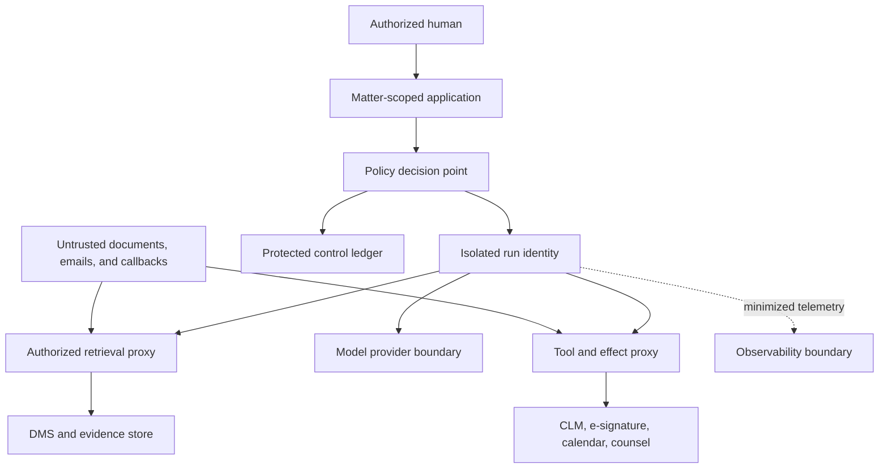

# Security, Privacy, Permissions, and Audit

## Protection objective

The system handles material whose disclosure can harm clients, waive or contest protections, alter negotiation leverage, expose personal data, or undermine litigation. Protect confidentiality and integrity while preserving the evidence needed to explain each access, decision, and effect.

Privilege is a legal determination. Security controls can reduce disclosure risk and document treatment; they cannot manufacture privilege.

## Trust boundaries



Every boundary authenticates the caller, validates schema, enforces purpose and object scope, minimizes fields, applies rate and size limits, and records an audit event. Documents, email bodies, comments, clause text, web pages, and provider callbacks are untrusted data even when they contain apparent instructions.

## Threat model

| Threat | Example | Primary controls |
|---|---|---|
| Cross-matter disclosure | Retriever returns another client's precedent | Tenant and matter filters before ranking, object reauthorization, separate indexes or enforced partitions |
| Prompt injection | Contract says to upload the document elsewhere | Data/instruction separation, tool allowlist, no ambient credentials, output validation |
| Confused deputy | User asks agent to send using counsel's authority | Delegation chain, effect policy, exact approval, recipient allowlist |
| Poisoned playbook | Unauthorized fallback clause inserted | Signed/versioned release, two-person governance for material changes, provenance |
| Version substitution | Benign draft analyzed but riskier file sent | Digest-bound review and effect approval |
| Privilege leakage | Full clause appears in tracing or support ticket | Content minimization, field-level redaction, protected debug workflow |
| Stale authorization | Departed counsel's approval remains active | Short expiry, identity lifecycle events, reauthorization at commit |
| Malicious callback | Forged “signed” event advances workflow | Signature/HMAC validation, replay defense, provider reconciliation |
| Exfiltration through tools | Model encodes data in email, URL, or filename | Structured effects, destination policy, egress controls, DLP |
| Training or vendor reuse | Confidential material retained beyond purpose | Contract/configuration verification, provider policy, region controls, deletion tests |
| Insider bulk access | Operator searches all matters | Just-in-time access, purpose binding, anomaly detection, break-glass review |
| Audit tampering | Effect receipt or approval deleted | Append-only protected ledger, integrity checks, separated administration |

## Authorization model

Use role plus attributes and relationship checks:

```yaml
authorization_input:
  principal:
    account_id: acct_633
    person_id: per_208
    organization_id: org_client_1
    roles: [legal_operations]
    assurance_level: aal2
  relationship:
    matter_id: mat_2026_0142
    assignment: active
    ethical_wall_membership: approved
  purpose: supplier_msa_review
  resource:
    artifact_id: art_880
    tenant_id: ten_01
    matter_id: mat_2026_0142
    information_classes: [confidential, asserted_privileged]
  action: read_exact_version
  environment:
    device_trust: managed
    region: IN
    time: 2026-08-31T10:00:00Z
  policy_version: access_policy_12
```

Evaluate authorization at retrieval, tool invocation, approval, effect commit, download, external sharing, and replay. Filtering a UI list is not access control. A privileged service account must not bypass matter policy.

## Capability and credential rules

- Issue short-lived, audience-restricted tokens to each run and connector.
- Bind capabilities to tenant, matter, purpose, resource set, field set, operations, effect tier, provider, and expiry.
- Keep model workers and sandboxes credential-free; use a policy-enforcing proxy.
- Separate identities for interactive users, workflow service, analysis workers, effect executor, reconciler, and administrators.
- Store secrets in a managed secret service, rotate them, and never place them in prompts, artifacts, logs, or environment dumps.
- Use provider-specific credentials and scopes; do not share one broad credential across clients or ethical walls.
- Treat break-glass access as a time-limited, reasoned, alerted, independently reviewed event.

## Data lifecycle and privacy

For every data class and processor, document collection purpose, source, legal/organizational basis, fields, users, regions, retention, deletion, hold precedence, subprocessors, model-training status, and incident route.

| Layer | Minimize | Retain only for |
|---|---|---|
| Prompt/context | Exact spans and facts needed for current task | Run and approved review window |
| Model response | Structured proposal and citations | Matter evidence and evaluation policy |
| Cache | Tenant/matter/purpose/version-keyed results | Short performance window, unless approved artifact |
| Embedding/index | Approved fields and chunks with access metadata | Source lifecycle; delete and rebuild on access/version change |
| Telemetry | IDs, timings, counts, reason codes | Operations and security purpose |
| Audit ledger | Control metadata and protected evidence references | Legal, security, and records schedule |
| Evaluation corpus | Licensed, minimized, de-identified where possible | Governed evaluation lifecycle |

GDPR principles such as purpose limitation, data minimization, storage limitation, security, and accountability apply where in scope. Erasure rights include exceptions, including some legal-claims contexts; an engineering workflow must route the case to legal and privacy owners rather than hard-code “privacy deletes” or “hold always wins.” Similar jurisdictional analysis is required elsewhere.

## Model-provider gate

| Control | Evidence before use |
|---|---|
| Training and reuse | Contractual term plus verified account/API setting |
| Retention | Documented duration, abuse-monitoring exceptions, deletion process, test |
| Access | Provider human-access conditions and logs where available |
| Region and transfer | Processing locations, transfer mechanism, subprocessors |
| Isolation | Tenant behavior and no unintended cache or fine-tune sharing |
| Encryption | In transit, at rest, key management, optional customer keys if justified |
| Incident duty | Notification timing, evidence availability, cooperation route |
| Model changes | Version pinning or change notice, evaluation and rollback support |

If these controls do not satisfy the matter's policy, use an approved private environment, redact to the minimum lawful content, use deterministic processing, or do not use a model.

## Audit model

Keep an unsampled control ledger separate from diagnostic traces.

```json
{
  "audit_event_id": "aud_8821",
  "event_type": "ExternalRedlineShareVerified",
  "occurred_at": "2026-08-31T10:10:00Z",
  "tenant_id": "ten_01",
  "matter_id": "mat_2026_0142",
  "actor_id": "acct_633",
  "delegation_id": null,
  "purpose": "negotiation_round_3",
  "resource_refs": ["dv_9", "render_pdf_42"],
  "payload_digest": "sha256:...",
  "recipient_identity_refs": ["per_counterparty_counsel_2"],
  "approval_id": "apr_900",
  "effect_id": "eff_share_991",
  "provider_receipt_ref": "receipt_771",
  "policy_version": "effect_policy_8",
  "behavior_release_id": "br_2026_08_31_1",
  "outcome": "verified"
}
```

The ledger records who, under which delegation and purpose, accessed or changed what, against which policy and behavior release, with which approval and effect outcome. Store sensitive payloads in protected evidence stores and reference them. Protect audit-reader access because metadata can reveal clients, disputes, counterparties, and strategy.

RFC 8785 canonical JSON, content digests, or timestamp services can improve integrity evidence when used correctly. They do not prove that the source was truthful, that a person had authority, or that a legal conclusion was correct.

## Security invariants

Enforce these in code and tests:

1. No read or write crosses tenant, matter, ethical-wall, purpose, or object authorization.
2. No model worker receives connector credentials.
3. No document text can widen tools, recipients, scopes, or effect tier.
4. No D3 effect commits without an active digest-bound approval and commit-time reauthorization.
5. No `Unknown` effect is blindly retried.
6. No long-term or episodic memory exposes matter content across matters.
7. No audit or telemetry sink receives unapproved sensitive payload fields.
8. No hold release or legal decision can be performed by an agent action.

## Privacy and security review checklist

- [ ] Threat model covers matter mixing, prompt injection, version substitution, exfiltration, insiders, callbacks, providers, and audit compromise.
- [ ] Identity, delegation, matter relationship, purpose, object, field, action, region, and time participate in authorization where relevant.
- [ ] Workers have short-lived capabilities and no ambient credentials.
- [ ] Encryption, key ownership, secrets, egress, DLP, and provider controls are tested.
- [ ] Privacy inventory covers prompts, responses, caches, embeddings, telemetry, audit, evaluations, backups, and subprocessors.
- [ ] Holds, retention, erasure, and incident evidence use approved precedence workflows.
- [ ] Control audit is unsampled, protected, integrity-checked, and separately authorized.
- [ ] Red-team tests verify every security invariant.

## Key sources

- [ABA Rule 1.6 confidentiality](https://www.americanbar.org/groups/professional_responsibility/publications/model_rules_of_professional_conduct/rule_1_6_confidentiality_of_information/)
- [GDPR Article 5](https://eur-lex.europa.eu/eli/reg/2016/679/art_5/oj), [Article 17](https://eur-lex.europa.eu/eli/reg/2016/679/art_17/oj), and [Article 32 security](https://eur-lex.europa.eu/eli/reg/2016/679/art_32/oj)
- [NIST AI RMF Generative AI Profile, AI 600-1](https://www.nist.gov/publications/artificial-intelligence-risk-management-framework-generative-artificial-intelligence)
- [NIST SP 800-63-4 digital identity guidelines](https://pages.nist.gov/800-63-4/)
- [RFC 8785 JSON Canonicalization Scheme](https://www.rfc-editor.org/rfc/rfc8785.html)
- [Agent threat model](../../security/agent-threat-model.md) and [permissions, sandboxing, and secrets](../../security/permissions-sandboxing-and-secrets.md)

