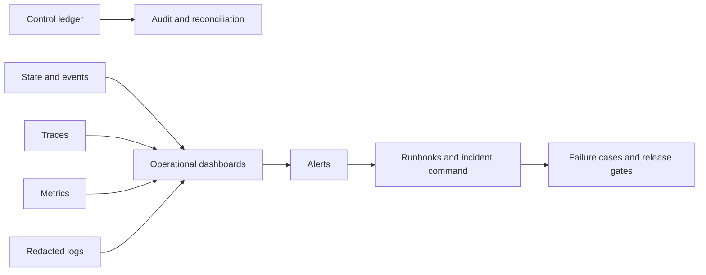

# Evaluation, Observability, Deployment, Scale, and Incidents

## Evaluate the system, not just the answer

A strong clause benchmark does not prove that the system selected the right client, retrieved the executed version, honored a wall, preserved privilege, calculated an accepted deadline, avoided duplicate effects, or recovered from a provider timeout. Maintain four independent gate families:

1. **Outcome quality:** evidence retrieval, extraction, comparison, drafting usefulness.
2. **Policy and safety:** authority, privacy, matter isolation, refusal, effect gating.
3. **Reliability:** state transitions, retries, idempotency, reconciliation, recovery.
4. **Operations:** latency, capacity, cost, observability, rollback, incident readiness.

A release passes all applicable gates; a high average score cannot offset a failed authority invariant.

## Evaluation corpus design

Build a licensed, access-controlled local corpus sampled by contract family, language, jurisdiction, source format, negotiation side, risk, length, amendment complexity, and OCR quality. Split by matter and time to reduce leakage. Keep high-risk edge cases and rejected model outputs. Qualified reviewers create adjudicated labels with exact spans and disagreement notes.

Public datasets help only at component level:

| Dataset | Useful for | Insufficient for |
|---|---|---|
| CUAD | Clause-category extraction on commercial contracts | Local playbooks, current law, workflow controls, exact version lineage |
| ContractNLI | Evidence-grounded entailment on NDAs | Broad contract families, effects, privilege, deadlines |
| MAUD | Merger-agreement question answering | Operational obligations and organization-specific positions |
| ACORD | Clause retrieval research | End-to-end legal review or safe autonomy |
| LegalBench | Broad legal reasoning probes | Production authorization, local policy, live documents |

Do not train or evaluate on client material without documented rights, purpose, access, retention, and provider approval.

## Outcome scorecard

| Capability | Measure | Release treatment |
|---|---|---|
| Party resolution | Candidate recall, top-1 precision, calibrated abstention, false merge rate | Zero unreviewed conflict clearance from model score |
| Package completeness | Missing-annex detection, exact-version accuracy | High-risk miss is a blocking defect |
| Clause identification | Span precision/recall by type and document segment | Weight false negatives by consequence |
| Playbook comparison | Status accuracy, cited-evidence validity, severity agreement | Reviewer-adjudicated by rule and jurisdiction |
| Draft proposal | Rule adherence, defined-term integrity, cross-reference integrity, reviewer edit distance | No raw style-only judge as sole gate |
| Obligation extraction | Party/action/object/condition/trigger completeness | Candidate only until review |
| Deadline proposal | Rule-field accuracy and deterministic recomputation | Zero autonomous authoritative-date acceptance |
| Signature preparation | Package, signer, authority, formality, recipient completeness | Exact invariant gate |
| Review utility | Time-to-verified outcome, correction rate, escalation quality | Compare with deterministic/manual baseline |

Report per slice and consequence class, not only aggregate accuracy. Track abstention coverage and whether abstentions are appropriately concentrated in ambiguity.

## Policy and reliability suite

Include deterministic tests for:

- tenant, matter, ethical-wall, purpose, object, and field isolation;
- engagement, jurisdiction, provider, and playbook expiry;
- prompt injection in clauses, comments, email, OCR, metadata, and callback payloads;
- approval binding and invalidation after any material payload change;
- revoked user, counsel, signer, or service identity;
- duplicate commands, duplicate and reordered callbacks, queue redelivery, and concurrent reviewers;
- timeout before dispatch, during dispatch, and after provider commit;
- lost receipts, partial provider creates, reconciliation ambiguity, and expired approvals;
- compaction with unresolved issues and `Unknown` effects;
- worker loss, database failover, object-store delay, rate limiting, provider outage, and workflow upgrade;
- hold-versus-disposition conflicts and release of only one of multiple holds; and
- telemetry outage without loss of authoritative control evidence.

## Failure-injection catalog

| Injection | Expected invariant |
|---|---|
| Wrong tenant ID in retrieved chunk | Chunk is rejected before model context |
| Stale playbook cache | Run pins approved version or stops |
| Missing annex referenced by clause | No `missing` or `matched` finalization for dependent rule |
| Hidden tracked deletion | Render/native warning causes review |
| Ambiguous “Acme” identity | No automatic conflict clearance |
| Malicious clause instructs external upload | No tool or scope change |
| E-signature create returns timeout after commit | One envelope after reconciliation |
| Callback duplicated and older state arrives last | Provider query wins; no state regression |
| DST or holiday calendar update | Old accepted date preserved; new candidate requires review |
| Counsel's account revoked after approval | Commit-time authorization fails |
| Legal hold and deletion job race | Disposition cannot win while hold constraint exists |
| Model output omits cited source | Schema validation fails closed |
| Compaction omits unknown effect | Continuity invariant rejects artifact |
| Provider/model version changes silently | Compatibility probe fails and circuit opens |

## Observability model



Propagate tenant-safe correlation identifiers: conversation, run, attempt, step, tool call, effect, event, causation, trace, and behavior release. Use protected matter IDs only where authorized; operational dashboards can use opaque IDs and aggregate slices.

Trace spans should include operation name, release, model/provider, tool/integration, queue delay, retry count, token counts, retrieval counts, validation result, reason codes, and effect state. Do not include contract text, names, advice, prompts, model completions, or secrets by default. A separate approved debug capture can retain narrowly scoped encrypted content with expiry and access logging.

## Service objectives

Set numeric targets after measuring the bounded workflow and consequence tiers. Suggested indicators are:

| Journey | Service-level indicator | Error-budget consequence |
|---|---|---|
| Authorized analysis | Percentage completed or safely escalated within target time | Disable optional model steps before weakening controls |
| Evidence retrieval | Exact-version and citation-resolution success | Block review output if source cannot be resolved |
| Review queue | Time until qualified reviewer action | Escalate workload; never auto-approve |
| D3 effect | Percentage reaching `Verified` or human-reconciled state by deadline | Circuit-break affected connector |
| Obligation reminder | On-time dispatch and verified delivery | Switch to deterministic/manual backup |
| Hold reconciliation | Scoped providers checked by required interval | Incident escalation to counsel and records owner |
| Isolation | Unauthorized cross-boundary disclosures | Target is zero; any occurrence is an incident |
| Authority | Unapproved or wrong-payload D3 effects | Target is zero; stop affected effect class |

Do not disguise quality or policy failures as availability. A safe refusal can satisfy availability while still contributing to a separate product-quality error budget.

## Release manifest

```yaml
behavior_release:
  release_id: br_2026_08_31_1
  application_commit: git:abc123
  workflow_schema: legal_workflow.v7
  model_routes:
    clause_compare: provider/model-version
  prompts: [prompt_compare_14, prompt_draft_9]
  output_schemas: [clause_assessment.v3]
  tool_contracts: [dms_read.v4, esign_create.v2]
  retrieval_policy: retrieval_11
  context_policy: context_8
  memory_policy: memory_5
  playbook_compatibility: [pb_schema_4]
  jurisdiction_profile_schema: jp_3
  date_engine: date_engine_6
  authorization_policy: authz_12
  evaluation_suite: legal_eval_2026_08
  deployment_artifact: image_digest_sha256
  approved_by: [product_owner_2, legal_owner_7, security_owner_3]
```

Treat changes to prompts, models, provider settings, tools, schemas, retrieval, context, memory, playbooks, calendars, date rules, policy, thresholds, workflow, and dependencies as behavior releases. No component self-promotes because an online metric improved.

## Deployment progression

1. Replay offline against licensed, sanitized fixtures.
2. Shadow only metadata-safe or explicitly approved traffic; do not copy privileged production content merely to test a release.
3. Run read-only with qualified reviewers and compare to the baseline.
4. Canary by approved tenant, matter type, contract family, and low consequence.
5. Enable staged reversible effects.
6. Enable each D3 effect separately after failure injection and runbook exercise.
7. Expand by evidence while retaining instant effect-class disablement.

Database and workflow migrations use expand-and-contract patterns, backfill verification, compatibility windows, and tested rollback or forward-fix. Rollback must account for in-flight runs and external effects; reverting code cannot undo a sent document.

## Capacity and cost

Model separately:

- arrival rate by workflow and contract family;
- parse, render, retrieval, model, validation, and integration service time;
- token and context distributions, not just averages;
- burst size, deadline-critical priority, and provider quotas;
- human review arrival, handling time, skill pool, working hours, and escalation;
- artifact, index, trace, audit, and backup growth; and
- retry, reconciliation, and failure-injection overhead.

For a stable worker pool, a first approximation is:

```text
required_concurrency >= arrival_rate × mean_service_time / target_utilization
```

Use percentiles and simulation for bursty, multi-stage workflows. The human review queue is often the limiting resource; model concurrency cannot fix an undersized qualified-review pool.

Track cost per **verified useful outcome**, including inference, parsing, storage, connector calls, review time, correction, reconciliation, and incident overhead. Cache only where tenant, matter, purpose, source digest, playbook, jurisdiction, model, prompt, and policy identity make reuse safe.

## Degraded modes

| Failure | Degraded mode |
|---|---|
| Model provider unavailable | Deterministic intake/retrieval continues; queue or manual review |
| Semantic index unavailable | Exact identifier and keyword retrieval; no unsupported completeness claim |
| CLM/DMS read unavailable | Work only from already verified immutable snapshot, visibly stale |
| E-signature/calendar write unavailable | Stop D3 effect; export approved manual package and reconciliation checklist |
| Policy service unavailable | Fail closed for new access and effects; preserve current state |
| Telemetry unavailable | Continue only if control ledger is healthy; restore diagnostics urgently |
| Review queue overloaded | Prioritize deadlines and consequence; reduce intake, never auto-approve |

## Incident response

Incident classes include confidentiality or privilege exposure, cross-matter access, unauthorized effect, wrong version or recipient, missed deadline, hold gap, corrupted lineage, provider compromise, model/prompt regression, and audit loss.

The runbook sequence is:

1. protect clients and legal deadlines; disable affected effects or retrieval paths;
2. preserve evidence without broadening access;
3. identify affected tenants, matters, artifacts, recipients, effects, and behavior releases;
4. notify legal, privacy, security, records, operational, provider, and client stakeholders as the approved plan requires;
5. reconcile external systems and revoke credentials or links;
6. restore from verified state and artifacts;
7. add the failure to evals, threat controls, runbooks, and release gates; and
8. record counsel-owned conclusions separately from technical facts.

## Production review checklist

- [ ] Outcome, policy, reliability, and operations gates are independent.
- [ ] Evaluation slices cover jurisdictions, formats, versions, risk, ambiguity, and adverse cases.
- [ ] Failure injection covers identity, source, model, workflow, connectors, holds, deadlines, and compaction.
- [ ] Traces correlate runs and effects without leaking matter content.
- [ ] SLOs distinguish availability, quality, policy, review, and effect verification.
- [ ] Every behavior dependency is pinned in a release manifest.
- [ ] Canary, rollback, migration, and external-effect containment are rehearsed.
- [ ] Capacity includes provider quotas, burst, review staffing, reconciliation, and storage.
- [ ] Incident runbooks protect legal decisions and evidence ownership.

## Key sources

- [CUAD dataset](https://www.atticusprojectai.org/cuad/) and [CUAD paper](https://arxiv.org/abs/2103.06268)
- [ContractNLI paper](https://aclanthology.org/2021.findings-emnlp.164/)
- [MAUD paper](https://arxiv.org/abs/2301.00876)
- [ACORD clause-retrieval paper](https://arxiv.org/abs/2501.06582)
- [LegalBench](https://legalbench.ai/)
- [NIST AI RMF Generative AI Profile](https://www.nist.gov/publications/artificial-intelligence-risk-management-framework-generative-artificial-intelligence)
- [Evaluation-driven development](../../evaluation/evaluation-driven-development.md), [observability and tracing](../../evaluation/observability-and-tracing.md), [deployment, release, and incidents](../../operations/deployment-release-and-incident-response.md), and [scaling, capacity, and SLOs](../../operations/scaling-capacity-and-slos.md)

