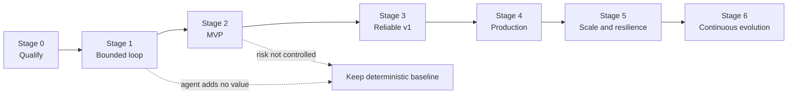

# Zero-to-Production Stages and Exit Gates

## Promotion rule

Advance only when the current stage produces durable exit evidence and the next stage solves a measured limitation. Stage promotion expands operational capability, not professional authority. Legal interpretation, advice, negotiation positions, privilege decisions, authoritative legal deadlines, hold decisions, final acceptance, and signature remain human responsibilities at every stage.

## Stage 0 — Qualify the workflow

**Goal:** prove that a model-assisted loop is preferable to a deterministic form, rules engine, search, template, or manual checklist.

Build a workflow map from intake through review and downstream effects. Measure volume, variability, ambiguity, reviewer time, error consequences, source availability, and current failure modes. Select one contract family and one bounded decision-support task. Establish a deterministic/manual baseline and authority matrix.

**Exit evidence:**

- [ ] Client, matter, party, engagement, jurisdiction, document, playbook, obligation, approval, signature, hold, and record owners are named.
- [ ] Adjacent patent, regulatory, compliance, document-intelligence, and procurement seams are written.
- [ ] The deterministic alternative is implemented or measured fairly.
- [ ] A model is justified by semantic variability, not novelty.
- [ ] Data rights, provider constraints, jurisdictional uncertainties, and qualified-review capacity are known.
- [ ] Reserved professional decisions and stop conditions are approved.
- [ ] Success measures include verified outcome, reviewer effort, safety, reliability, latency, and cost.

Do not advance if exact sources cannot be recovered or if no qualified reviewer owns the output.

## Stage 1 — Bounded read-only loop

**Goal:** test a typed agent loop without writes or durable informal memory.

Implement: user-selected matter and exact document version; one approved playbook; exact and span-based retrieval; fixed macro-plan; allow-listed read tools; typed model output; citation validation; step/tool/token/time budgets; abstention; and a complete terminal status for every in-scope clause.

**Exit evidence:**

- [ ] Tool contracts reject out-of-scope matter, source, field, and purpose access.
- [ ] Every result cites an exact source and playbook version.
- [ ] Prompt injection and malformed document tests fail safely.
- [ ] The loop terminates on completion, stop, or budget exhaustion.
- [ ] No CLM, DMS, calendar, email, counsel, or e-signature write is possible.
- [ ] Evaluation beats the baseline on a useful dimension without unacceptable review or risk cost.
- [ ] Logs and traces contain no unapproved matter text.

If templated lookup or deterministic comparison performs as well, keep the simpler system.

## Stage 2 — Matter-scoped MVP

**Goal:** run the bounded workflow in a real environment with authoritative intake, evidence, and reviewer feedback.

Add canonical party and matter identity, engagement and conflict gates, ethical walls, jurisdiction profiles, immutable artifacts and renderings, document/clause/redline lineage, private draft artifacts, reviewer decisions, outcome/evaluation records, provider policy, and signed continuation artifacts. Keep consequential external effects disabled.

**Exit evidence:**

- [ ] Matter and engagement authorization is enforced before retrieval and at every object read.
- [ ] Original, rendered, extracted, clause, redline, and playbook lineage is reproducible.
- [ ] Confidentiality, asserted privilege, work product, privacy, and access are distinct fields.
- [ ] Reviewers can accept, edit, reject, and explain; feedback is versioned.
- [ ] Compaction preserves task, authority, progress, sources, decisions, failures, budgets, and effect state.
- [ ] Local, matter-split evaluation covers ambiguity, missing annexes, tracked changes, OCR, and high-risk clauses.
- [ ] MVP runbooks cover provider outage, wrong matter, source corruption, and sensitive-data exposure.

Do not add writes merely to demonstrate autonomy.

## Stage 3 — Reliable v1

**Goal:** support long-running reviews and approved operational effects without duplicate or lost actions.

Add durable run state, versioned commands/events, transactional outbox, queues, cancellation, timeouts, concurrency control, stable effect IDs, digest-bound approvals, receipts, `Unknown` state, provider reconciliation, versioned adapters, accepted obligation records, deterministic date engine, and exact-package signature handoff. Enable one effect class at a time.

**Exit evidence:**

- [ ] State, domain events, delivery events, effects, and telemetry are separated.
- [ ] Queue redelivery and concurrent commands preserve aggregate invariants.
- [ ] Every effect is idempotent or guarded by an approved natural key and lookup.
- [ ] Timeouts after possible commit become `Unknown` and reconcile before retry.
- [ ] Approval invalidates after payload, destination, source, authority, policy, or expiry changes.
- [ ] Obligations remain candidates until accepted; critical dates receive independent verification.
- [ ] E-signature completion fetches and reconciles final artifacts and provider evidence.
- [ ] Recovery from worker loss and compaction starts from authoritative state, not chat.

Do not advance with an external write that cannot be reconciled.

## Stage 4 — Production controls

**Goal:** operate for approved users and matters with enforceable security, privacy, release, observability, and incident controls.

Add federated identity, identity lifecycle, managed workload identities, least privilege, object and field authorization, matter isolation, purpose-bound capabilities, provider and data-flow inventory, encryption and secrets management, DLP, protected audit, trace minimization, release manifests, canary/rollback, SLOs, support procedures, and incident response.

**Exit evidence:**

- [ ] Threat model and privacy assessment cover every data store, processor, tool, and trust boundary.
- [ ] Cross-tenant, cross-matter, ethical-wall, prompt-injection, exfiltration, and confused-deputy tests pass.
- [ ] D3 commit performs current identity, authority, approval, payload, destination, and policy checks.
- [ ] Control audit is unsampled, integrity-protected, access-controlled, and reconciled.
- [ ] Traces identify behavior release and effect lineage without leaking protected content.
- [ ] Outcome, policy, reliability, and operational release gates all pass.
- [ ] Rollback and containment account for in-flight runs and irreversible external effects.
- [ ] Privilege exposure, wrong recipient/version, missed deadline, hold gap, and unauthorized effect runbooks are exercised.

Production approval is deployment-specific and includes legal, security, privacy, records, product, and operational owners.

## Stage 5 — Scale and resilience

**Goal:** meet workload and deadline objectives under bursts, failures, provider limits, and disaster scenarios.

Introduce separate work queues by consequence and provider, backpressure, fair tenant scheduling, priority aging, bounded retries, circuit breakers, rate-limit budgets, autoscaling, protected high-risk capacity, reconciliation sweeps, storage lifecycle, capacity forecasting, cost attribution, recovery objectives, and tested degraded modes.

**Exit evidence:**

- [ ] Load and soak tests include parse/model tails, bursts, provider throttling, and review queues.
- [ ] Critical deadlines and holds cannot be starved by bulk review work.
- [ ] Tenant fairness and per-matter isolation survive overload.
- [ ] Provider outages enter read-only, propose-only, queued, or manual modes without bypassing controls.
- [ ] Recovery tests restore authoritative state, artifact integrity, effect history, and audit evidence.
- [ ] Regional and backup design respects residency, privilege, holds, and provider constraints.
- [ ] Cost per verified outcome includes review, correction, reconciliation, storage, and incident overhead.
- [ ] SLO and error-budget policy reduces optional work before safety controls.

Do not use higher model concurrency to hide a qualified-review bottleneck.

## Stage 6 — Continuous evolution

**Goal:** improve behavior without silent drift or loss of historical reproducibility.

Mine failures and reviewer disagreements; refresh primary sources; monitor document, counterparty, jurisdiction, provider, and model drift; maintain time-split evaluations; version prompts, models, tools, schemas, playbooks, calendars, policies, taxonomies, and context/memory rules; and deprecate old connectors and releases explicitly.

**Exit evidence:**

- [ ] Every material failure becomes a regression case, control change, runbook update, or accepted risk.
- [ ] Research and jurisdiction profiles have owners, checked dates, effective dates, and refresh triggers.
- [ ] Behavior releases are immutable, reproducible, evaluated, approved, canaried, and rollback-capable.
- [ ] Playbook and rule changes create new assessments rather than rewriting history.
- [ ] Provider/model drift probes detect unannounced behavior changes.
- [ ] Evaluation data has rights, lineage, access, retention, contamination, and leakage controls.
- [ ] Reviewer feedback is curated; the system does not learn legal positions automatically.
- [ ] Deprecated APIs, model versions, taxonomies, and standards have migration and shutdown dates.

Continuous evolution is governed release engineering, not autonomous self-modification.

## Minimum production artifact set

| Artifact | Owner | Required content |
|---|---|---|
| Scope and authority register | Legal and product | Reserved decisions, effect tiers, roles, delegations, stops |
| Matter and engagement schema | Legal operations | Identity, purpose, jurisdictions, restrictions, lifecycle |
| Evidence and lineage schema | Engineering and legal operations | Bytes, renders, extractions, versions, clauses, redlines, manifests |
| Playbook governance record | Qualified legal owner | Rules, applicability, fallbacks, severity, effective dates, approvals |
| Obligation and deadline contract | Legal and operations | Source, trigger, rule, calendar, owner, review, evidence |
| Effect and approval contract | Security and engineering | Payload binding, identity, expiry, idempotency, receipts, reconciliation |
| Hold and records contract | Counsel and records | Scope, precedence, notices, effects, release, disposition |
| Threat and privacy assessment | Security and privacy | Flows, processors, attacks, controls, residual risk |
| Evaluation suite | Product, legal, engineering | Local corpus, slices, invariants, failure injection, thresholds |
| Release manifest and runbooks | Operations | Full behavior identity, deployment, rollback, incidents, degraded modes |

## Final readiness decision

Ship a capability only when its evidence demonstrates all of the following:

- the agent adds measured value over the simplest deterministic alternative;
- the exact client, matter, engagement, jurisdiction, source, version, rule, and authority are known;
- every material claim is cited and every consequential effect is approved and reconciled;
- professional judgments remain with qualified people;
- privacy, privilege, confidentiality, access, retention, and hold constraints are enforced;
- failure, recovery, scale, cost, observation, release, and incident behavior are tested; and
- the organization can stop the capability without losing authoritative state or evidence.

## Canonical implementation references

- [Expansion program stage model](../../research/agent-blueprint-expansion-program.md)
- [Cross-cutting control decisions](../../research/packets/agent-blueprint-cross-cutting-controls.md)
- [Research packet for this blueprint](../../research/packets/legal-contract-operations-agent-blueprint.md)

