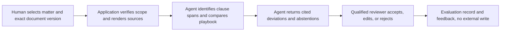
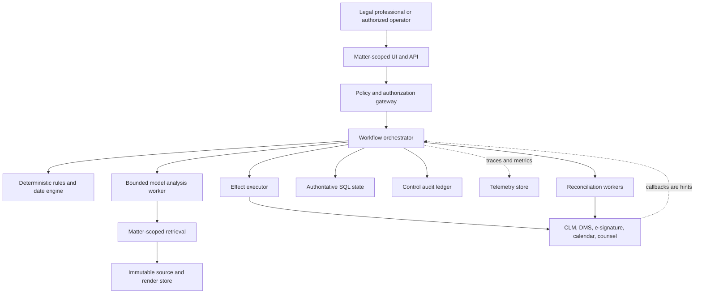

# Legal Matter and Contract Operations Agent

**Status:** production blueprint  
**Research date:** 2026-08-31  
**Evidence packet:** [research decisions, limitations, and primary sources](../../research/packets/legal-contract-operations-agent-blueprint.md)

This blueprint describes an evidence-first agent for operating a legal matter and contract lifecycle. It can organize, retrieve, compare, draft, flag, and propose. It does not practice law, decide privilege, set a negotiation position, accept contract terms, calculate a legally authoritative deadline, or sign.

The safest useful design is not an autonomous lawyer. It is a deterministic matter and contract control plane with a bounded model-assisted analysis loop. The application owns identity, authorization, authoritative state, effects, deadlines, version lineage, approvals, and audit evidence. Models produce cited proposals that qualified people can inspect.

> This is an engineering reference, not legal advice. Professional rules, privilege law, signature requirements, preservation duties, privacy law, and enforceability vary by jurisdiction and facts. Deployments require approval from the organization's qualified legal, security, privacy, records, and operational owners.

## Definition of done

A production deployment can:

- prove which client, matter, counterparty, jurisdiction, engagement, playbook, source document, and version governed a proposal;
- preserve original bytes, rendered views, extracted text, tracked changes, clause occurrences, redlines, comments, annexes, and their lineage;
- distinguish confidential, asserted-privileged, work-product, personal, restricted, and ordinary material without treating a label as a legal conclusion;
- produce evidence-linked clause comparisons, deviations, drafting suggestions, and obligation candidates while abstaining on material ambiguity;
- keep legal interpretations, negotiation positions, privilege decisions, critical deadline acceptance, final terms, releases of holds, and signature authority with qualified humans;
- execute only approved, scoped, idempotent effects and reconcile uncertain outcomes against the system of record;
- survive retries, duplicates, out-of-order callbacks, worker loss, connector drift, compaction, and model or playbook upgrades;
- demonstrate tenant and matter isolation, least privilege, audit completeness, privacy controls, evaluation gates, service objectives, rollback, and incident response.

## Ownership boundary

| Area | This agent owns | It must hand off |
|---|---|---|
| Matter operations | Matter identity, engagement boundary, participants, jurisdiction assertions, workspace, status, evidence lineage | Legal advice, conflicts clearance, representation acceptance, engagement changes |
| Contract operations | Intake, exact-version retrieval, clause and redline lineage, playbook comparison, deviation evidence, approval routing | Legal interpretation, negotiation posture, final acceptance |
| Post-signature operations | Obligation candidates, approved obligation register, reminders, evidence collection, reconciliation | Authoritative legal deadline or remedy decisions |
| Execution | Exact-package preparation and approved e-signature handoff | Signer authority, execution-formality decision, signature itself |
| Records | Hold/retention evidence and approved workflow execution | Hold issue, scope, modification, release, retention precedence |
| External work | Matter-scoped outside-counsel exchange and status reconciliation | Counsel selection, instruction on legal position, substantive advice |

Neighboring categories remain independent:

- [Patent/IP research](../patent-ip-research-agent/README.md) owns prior-art, patent-family, claim, and legal-status research.
- [Regulatory intelligence](../regulatory-intelligence-agent/README.md) owns official-source monitoring, version change, and applicability hypotheses.
- [Compliance audit](../compliance-audit-agent/README.md) owns assurance engagements and control-evidence conclusions.
- [Document intelligence](../document-intelligence-agent/README.md) owns hostile-file intake, OCR, extraction, and source-grounded document facts.
- Procurement owns sourcing strategy, supplier competition, award, and commercial supplier selection. This agent receives the selected counterparty and owns legal text, deviations, approvals, execution handoff, and obligations.

The handoff rule is simple: preserve the upstream artifact and its identity; do not silently absorb the upstream profession or workflow.

## When an agent is the wrong tool

Use a deterministic workflow, template, or database rule instead when:

| Need | Prefer | Reason |
|---|---|---|
| Required-field intake and routing | Form plus rules | Inputs and branches are known |
| Approved-template assembly with no semantic choice | Document automation | Reproducible and cheaper |
| Exact renewal calculation from an accepted rule | Tested date engine | A language model is not a calendar authority |
| Clause lookup by identifier | Indexed retrieval | No reasoning is required |
| Signature reminders | E-signature or workflow scheduler | Provider state and timers are authoritative |
| Retention disposition | Records schedule engine | Legal holds and policy precedence need deterministic enforcement |
| Standard reports | SQL or BI | Repeatable aggregation should not be regenerated by a model |

Do not deploy the agent where matter isolation cannot be enforced, source versions cannot be recovered, qualified review is unavailable, the integration cannot expose or reconcile exact effects, or the organization cannot lawfully send the material to the selected providers.

## First bounded loop

Start with one contract family, one approved playbook version, one jurisdiction profile, and read-only document access:

The loop has a fixed completion condition: every in-scope clause is `matched`, `deviates`, `missing`, `not_applicable`, or `needs_review`; every conclusion points to an exact source span and artifact digest; no contract, calendar, email, CLM, DMS, or e-signature system is changed.

## Reference architecture

The minimum reliable stack is a team-native typed service, a relational database for authoritative state, immutable object storage for source artifacts and renderings, an outbox-backed job queue, a small set of versioned connectors, and a model gateway. Add a durable workflow engine only when long waits, human approvals, callback correlation, and recovery justify it. Add vector search only for a measured retrieval problem; exact identifiers and filters remain primary. A graph database, autonomous multi-agent negotiation, and unconstrained long-term memory are not defaults.

## Autonomy and effect classes

| Class | Examples | Production rule |
|---|---|---|
| D0 local compute | Parse, render, hash, compare, draft | Allowed inside matter scope; record lineage |
| D1 bounded read | Read an authorized CLM record or DMS version | Allow-listed fields, tenant and matter checks, access log |
| D2 staged reversible | Create an internal draft task or proposed obligation | Validate, mark proposed, make undoable, notify owner |
| D3 consequential | Send a legal notice, share externally, create a critical calendar event, submit an e-signature envelope | Exact payload approval, deterministic authorization, idempotency, receipt, reconciliation |
| D4 authority change | Accept representation, waive conflict, decide privilege, approve terms, release a hold, confer signer authority | Proposal only; the agent cannot perform it |

Approval belongs to a concrete effect, not to a conversation. If the payload, destination, document digest, signer set, playbook, or jurisdiction changes, approval is stale.

## Guide path

Read in order for a new implementation, or jump to the operational concern:

1. [Mission, boundaries, identity, and authority](01-mission-boundaries-identity-and-authority.md)
2. [Reference architecture, runtime, and integrations](02-reference-architecture-runtime-and-integrations.md)
3. [Matter intake, conflicts, privilege, and jurisdiction](03-matter-intake-conflicts-privilege-and-jurisdiction.md)
4. [Documents, clauses, redlines, playbooks, and lineage](04-documents-clauses-redlines-playbooks-and-lineage.md)
5. [Obligations, deadlines, approvals, and signature handoff](05-obligations-deadlines-approvals-and-signature-handoff.md)
6. [Legal holds, retention, outside counsel, and records](06-legal-holds-retention-outside-counsel-and-records.md)
7. [State, events, context, memory, planning, and recovery](07-state-events-context-memory-planning-and-recovery.md)
8. [Security, privacy, permissions, and audit](08-security-privacy-permissions-and-audit.md)
9. [Evaluation, observability, deployment, scale, and incidents](09-evaluation-observability-deployment-scale-and-incidents.md)
10. [Zero-to-production stages and exit gates](10-zero-to-production-stages-and-exit-gates.md)

Cross-cutting contracts are canonical in [agent state and events](../../runtime/agent-state-and-event-contracts.md), [durable execution](../../runtime/durable-execution.md), [idempotency and effects](../../reliability/idempotency-and-side-effects.md), [context engineering](../../context-memory/context-engineering.md), [memory architecture](../../context-memory/memory-architecture.md), [compaction](../../context-memory/compaction-and-continuity.md), [threat modeling](../../security/agent-threat-model.md), [permissions and secrets](../../security/permissions-sandboxing-and-secrets.md), [evaluation](../../evaluation/evaluation-driven-development.md), [tracing](../../evaluation/observability-and-tracing.md), [deployment and incidents](../../operations/deployment-release-and-incident-response.md), and [capacity and SLOs](../../operations/scaling-capacity-and-slos.md).

## Delivery roadmap

| Milestone | Capability | Explicitly absent |
|---|---|---|
| Stage 0 | Deterministic baseline and measured workflow | Model effects |
| Stage 1 | Read-only bounded clause/playbook loop | Writes and persistent memory |
| Stage 2 | MVP with matter scope, exact evidence, reviewer feedback | External consequential effects |
| Stage 3 | Reliable v1 with durable state, compaction, effects, reconciliation | Unreviewed legal decisions |
| Stage 4 | Production identity, isolation, privacy, observability, release and incident controls | Authority expansion |
| Stage 5 | Queues, capacity, recovery, cost controls, degraded modes | Autonomous negotiation |
| Stage 6 | Continuous evaluation, drift management, behavior releases, source refresh | Silent self-modification |

Detailed entry criteria, tests, and exit evidence are in the [stage-gate guide](10-zero-to-production-stages-and-exit-gates.md).

## Non-negotiable stops

Stop and require qualified review when party identity, client identity, engagement scope, jurisdiction, source version, annex completeness, privilege treatment, playbook applicability, obligation trigger, deadline rule, recipient, signer authority, hold status, or effect outcome is unresolved. `Unknown` is an operational state requiring reconciliation; it is never permission to retry blindly.

