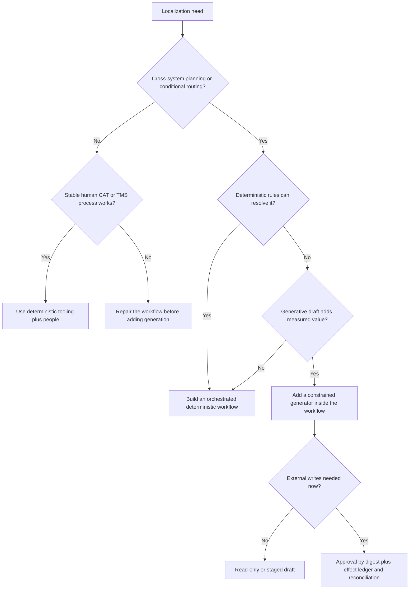

# Mission, Boundaries, and Maturity

## 1. Start with the operational outcome

The objective is not “translate every string.” It is:

> Deliver the intended localized experience for an explicitly defined audience and release, with preserved syntax and claims, qualified judgment where needed, and a provable path from source approval to external publication.

This changes the design. Translation quality is necessary but not sufficient. A fluent string tied to the wrong source revision, locale, product, legal claim, resource key, or release is a production defect.

## 2. Define the service contract before the agent

Create a translation-project specification for every durable program or release class. At minimum record:

| Field | Decision |
|---|---|
| Purpose and outcome | What the artifact enables; whether it is UI, help, marketing, support, legal, or another class |
| Source authority | System, repository revision, content owner, approval, and freeze policy |
| Audience | Users, expertise, age, accessibility needs, and reading context |
| Target | Language tag, market, jurisdictions, product, channel, script, and fallback policy |
| Content risk | Consequence of mistranslation, delay, omission, or wrong-locale exposure |
| Rights and privacy | Translation rights, confidentiality, personal data, residency, provider/reviewer eligibility, retention |
| Linguistic intent | Terminology, tone, formality, reading level, style, inclusivity, and prohibited implications |
| Technical constraints | Format, runtime, placeholders, markup, length/layout, timing, encoding, supported versions |
| Human roles | Translator, reviewer, cultural, technical, accessibility, legal/marketing, release authority |
| Acceptance | Required tests, sampling, error thresholds, parity, waiver policy, and rollback/correction target |
| Delivery | TMS/repository/CMS destination, staged review, deadlines, cadence, and support ownership |

ISO 11669:2024 is a useful foundation for translation-project specifications, but claiming conformity requires the licensed standard and qualified assessment. See the [research packet](../../research/packets/localization-transcreation-agent-blueprint.md#standards-and-version-ledger).

## 3. Bound category authority

### 3.1 Authority matrix

| Decision | Agent may | Required human/system authority |
|---|---|---|
| Extract source resources | Execute a certified deterministic adapter | Source owner defines authoritative revision and translatable scope |
| Select locale | Validate declared policy and route work | Product/market owner defines supported locales, markets, and fallback |
| Apply terms | Retrieve approved entries and detect conflict | Terminology owner resolves competing concepts/forms |
| Reuse TM | Rank policy-eligible units | Reviewer accepts actual target meaning; memory steward corrects/invalidates units |
| Generate translation | Produce a draft within a schema | Risk policy determines review; qualified human owns linguistic approval |
| Transcreate marketing copy | Propose rationale-bearing options | Marketing owns intent/claims; in-market and legal owners approve within remit |
| Repair syntax | Perform one bounded repair of an identified deterministic defect | Repeated or meaning-changing repairs return to a person |
| Approve | Never self-approve model output | Named, authenticated role approves exact artifact digest |
| Commit/stage | Execute a pre-authorized scoped effect | Workflow state and approval grant the effect; adapter verifies remote state |
| Publish | Only if separately and explicitly delegated after high maturity | Release authority owns publication; default agent scope stops at staged/reconciled artifact |
| Learn from correction | Propose a candidate memory write | Admission policy checks quality, scope, rights, privacy, retention, and holdout separation |

### 3.2 Hard stop conditions

Stop automated progression when:

- the source is unapproved, mutable, missing, stale, or ambiguous;
- target language, market, product, channel, jurisdiction, or fallback is unresolved;
- the native format cannot be parsed or round-tripped losslessly under the certified profile;
- protected tokens, terms, claims, plural branches, or markup conflict;
- the requested provider is ineligible for the data classification, region, rights, or language pair;
- a source defect makes faithful localization impossible;
- a proposed repair would change meaning or creative intent;
- required review capacity or competence is unavailable;
- an approval does not identify the exact artifact digest;
- an external effect is `dispatching` or `unknown` and a conflicting write is proposed;
- required-locale parity is incomplete without an approved waiver; or
- a deletion/correction/incident hold prohibits continued processing.

“Try a stronger model,” “ask another agent,” and “retry until it works” are not safe fallback policies.

## 4. Classify content and risk

### 4.1 Content archetypes

| Archetype | Primary risk | Typical context | Typical review |
|---|---|---|---|
| Software UI | Placeholder/message corruption, misleading controls, clipping, wrong locale | Resource key, screenshot, flow, platform runtime, character/layout constraints | Linguistic + in-context technical/accessibility |
| Help/documentation | Procedural inaccuracy, stale cross-references, inconsistent product terms | Whole section, UI labels, product/version, links, images, prerequisites | Linguistic + technical/content owner |
| Marketing transcreation | Claim drift, cultural harm, brand mismatch, weak outcome | Creative brief, campaign, visual/audio, claims, prohibited implications | In-market creative + marketing + legal as needed |
| Notifications/support | Urgency/tone, privacy, variable corruption | Trigger, user state, channel, length, variables | Linguistic + product/support; legal for sensitive notices |
| Legal/regulatory/safety | Rights, enforceability, material harm | Authoritative source, jurisdiction, controlled terminology | Separately governed qualified professional workflow |

Do not mix archetypes merely because they share a TMS project. Their context, reviewers, metrics, and authority differ.

### 4.2 Example risk tiers

| Tier | Example | Default automation ceiling |
|---|---|---|
| R0 — deterministic | Locale-neutral identifiers or files requiring no linguistic decision | Certified transformation and automated checks |
| R1 — low | Reversible internal UI/help content with no sensitive claims | Machine draft; qualified review; staged write |
| R2 — moderate | Customer-facing product, support, onboarding, or brand copy | Machine assist; independent linguistic/in-context review; explicit approval |
| R3 — high | Financial, health, safety, contractual, legal, regulated, crisis, or public claim content | Separate governed workflow; machine output only as controlled aid; multiple named approvals |
| R4 — prohibited/unsupported | No rights, no qualified reviewer, unsupported script/runtime, prohibited provider/data region | No processing until prerequisites change |

Risk is the maximum across meaning harm, technical harm, audience vulnerability, reversibility, exposure, privacy, legal/regulatory consequence, cultural consequence, and detectability. Low character count does not imply low risk.

## 5. Choose the least autonomous design that works



Start with one orchestrator. Specialized human queues, deterministic validators, and provider adapters are not “agents.” Multiple generative agents introduce duplicated context, inconsistent state, and extra failure surfaces without creating authority. Add independent model-based judging only if it beats simpler evaluation on a protected holdout and never grants release authority.

## 6. Maturity model

| Stage | Scope | What remains manual | Promotion evidence |
|---|---|---|---|
| 0 — deterministic baseline | Inventory, extraction, round trip, pseudolocalization, human CAT/TMS process | Translation, review, staging, release | Native-format fixtures pass; owners and locale policies exist; baseline quality/capacity measured |
| 1 — read-only drafts | Versioned candidate generator in a sealed data plane | All approval and effects | Holdout performance, deterministic rejection, provenance, cost/latency, and provider governance pass |
| 2 — supervised MVP | One low-risk content type/source/locale; exact staging | Every target reviewed; release still owner-controlled | No invariant/stale-source escapes; corrections explainable; rollback exercised |
| 3 — reliable effects | One or more certified TMS/repository/CMS adapters | High-impact approvals and exception resolution | Duplicate, timeout, conflict, webhook-loss, and reconciliation drills pass |
| 4 — governed production | Multiple approved locales/flows with RBAC, SLOs, audit, privacy/rights, incidents | Required risk specialists and release authority | Threat/privacy/accessibility review; deletion and incident tests; sliced quality sign-off |
| 5 — resilient scale | Cells, quotas, backpressure, capacity planning, offline/DR modes | Complex exceptions and governed high-risk judgments | Peak/recovery load, fairness, RTO/RPO, provider failover, and human-capacity drills pass |
| 6 — controlled evolution | Shadow/canary bundles, drift, failure mining, exact rollback | Bundle promotion and learning admission remain governed | Regression budgets, protected holdouts, canary stop rules, rollback, and contamination checks pass |

Maturity is per workflow. A team can be Stage 5 for low-risk UI strings and Stage 0 for legal content. A capable model does not raise process maturity.

## 7. Define success and failure before implementation

Measure four independent outcomes:

1. **Integrity:** correct source, locale, resource identity, tokens, message structure, claims, and artifact digest.
2. **Quality:** accuracy, terminology, linguistic conventions, style, locale conventions, audience fit, design/markup, accessibility, and cultural appropriateness.
3. **Operations:** latency, queue age, human capacity, provider quota, unknown effects, corrections, parity, recovery, and cost.
4. **Governance:** approved roles, rights, data routing, retention/deletion, audit coverage, and separation of duties.

A workflow fails even when translation quality is high if it publishes stale content, silently falls back, exposes private text, loses an approval, or leaves an ambiguous write unresolved.

## 8. MVP charter template

```yaml
workflow: checkout-ui-de-de
stage: supervised_mvp
source:
  system: github
  repository: storefront
  path_profile: android-resources-v1
  branch_or_release: release/2026-09
target:
  language_tag: de-DE
  market: DE
  jurisdictions: [DE, EU]
  product: storefront
  channel: android
risk:
  tier: R1
  excluded: [legal, payments_disclosure, safety]
generation:
  attempts: 1
  repair_attempts: 1
  external_tools_in_call: false
review:
  linguistic: required
  in_context: required
  self_approval: prohibited
effects:
  destination: staged_pull_request
  publish: prohibited
exit_evidence:
  - protected_token_integrity_100_percent
  - no_stale_source_publication
  - approved_staged_readback_digests_equal
  - rollback_drill_passed
```

The charter is intentionally narrow. Add a locale, content type, provider, format, destination, or risk tier as a new certification decision.

## 9. Readiness checklist

- [ ] Source authority, freeze/change policy, and owner are explicit.
- [ ] Target language, locale, market, jurisdiction, product, channel, and fallback are separate.
- [ ] Native format/runtime versions and round-trip fixtures are certified.
- [ ] Rights, privacy, data regions, retention, and provider/reviewer eligibility are recorded.
- [ ] Termbase, style, claims, and TM eligibility have owners and versions.
- [ ] Review roles and separation of duties match risk.
- [ ] Stop conditions and retry limits are implemented.
- [ ] Approvals bind to immutable artifact digests.
- [ ] Effects use optimistic concurrency/idempotency where available and always reconcile.
- [ ] Locale-sliced evaluation and human-capacity evidence exists.
- [ ] Accessibility and pseudolocalization are part of the release test plan.
- [ ] Incident, correction, deletion, rollback, and continuity drills have owners.

## 10. Sources and further reading

- [Research packet](../../research/packets/localization-transcreation-agent-blueprint.md)
- ISO 11669:2024 official abstract: <https://www.iso.org/standard/79089.html>
- ISO 17100:2015 official abstract: <https://www.iso.org/standard/59149.html>
- ISO 18587:2017 official abstract: <https://www.iso.org/standard/62970.html>
- ISO 5060:2024 official abstract: <https://www.iso.org/standard/80701.html>

