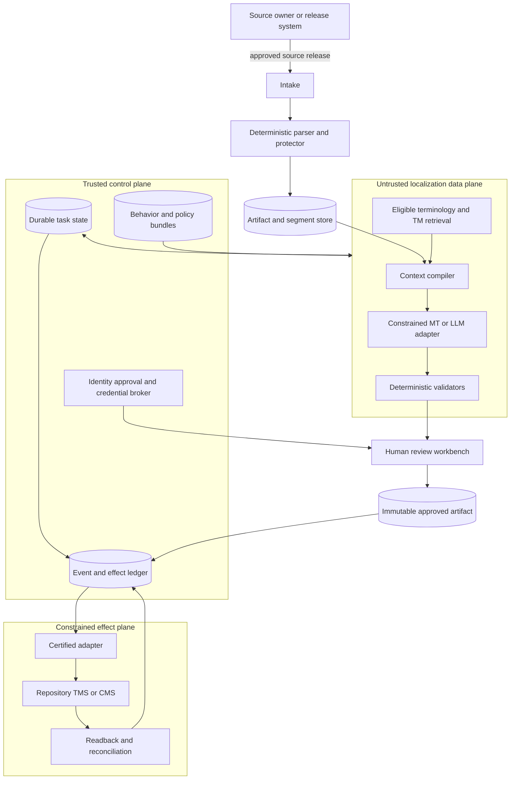
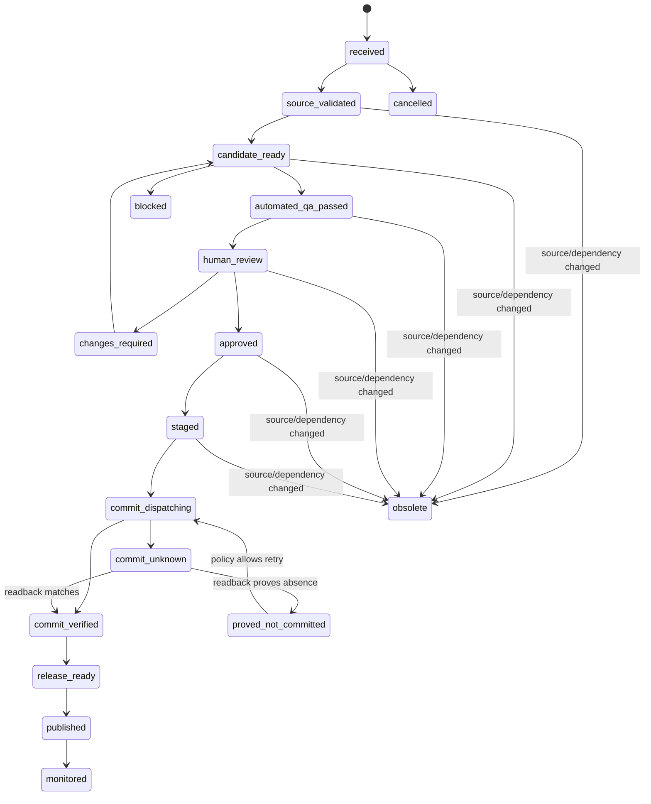

# Reference Architecture, Identities, and Contracts

## 1. Architecture objective

The architecture must make the safe path the easy path:

- content is data, never authority;
- deterministic components own format semantics;
- durable records own state;
- named roles own approval;
- scoped adapters own effects;
- readback owns completion; and
- immutable bundles make behavior reproducible.

## 2. Planes and trust boundaries



Trust-boundary rules:

1. Parser output, source comments, TM, termbase examples, screenshots, provider results, and reviewer attachments are untrusted content even when retrieved from an internal system.
2. A model-generation call receives no credential-bearing tools and cannot transition authoritative state.
3. Human approval is an authenticated record produced by the workbench, not natural language embedded in a comment.
4. Effect adapters accept typed, policy-authorized operations—not arbitrary model-authored URLs, paths, queries, or shell commands.
5. Remote completion is established by reconciliation against the intended stable identity and digest.

## 3. Identity model

Avoid a universal `id`. Use typed IDs and composite identity where meaning changes.

| Entity | Identity basis | Why it matters |
|---|---|---|
| Source release | Tenant + source system + repository/space + immutable revision/release | Prevents moving-branch or mutable-entry confusion |
| Asset | Source release + native path/entry + variant | Identifies a file, document, entry, image text layer, or catalog |
| Segment | Asset + native resource key/path + source digest + variant identity | Distinguishes same text in different grammatical/product contexts |
| Locale profile | Project + canonical language tag + market + product + channel + effective version | Prevents `fr` from silently meaning every French market |
| Behavior bundle | Digest of all behavior-defining versions | Enables reproduction, canary, rollback, and evaluation attribution |
| Localization task | Segment/asset scope + target profile + source release + workflow instance | Durable unit of work and responsibility |
| Candidate | Task + attempt + generator adapter/model/version + output digest | Preserves machine/TM/human provenance |
| Artifact | Source release + target profile + native output path + content digest | The exact review, stage, commit, and readback object |
| Approval | Artifact digest + policy + approver identity + decision time | Makes approval immutable and non-transferable |
| Effect | Deterministic operation key + intended destination identity + artifact digest | Deduplicates and reconciles external writes |
| Event | Event source + event ID | Supports deduplication without losing causation |

Do not rewrite an ID when display names, canonical tag aliases, provider codes, or source paths change. Store aliases and migration records.

## 4. Locale profile contract

BCP 47 is necessary but insufficient:

```yaml
schema: localization.locale-profile/v1
locale_profile_id: lp_storefront_de_de_android_v7
language:
  requested_tag: de-DE
  canonical_tag: de-DE
  script: Latn
market: DE
jurisdictions: [DE, EU]
product: storefront
channel: android
runtime:
  locale: de-DE
  approved_fallback_chain: [de]
  fallback_allowed_for: [noncritical_help_link]
formatting:
  cldr_version: "48"
  currency_policy: EUR
  measurement_system: metric
  timezone_policy: user_selected
linguistic:
  formality: formal
  reading_level: general
  style_bundle: style-storefront-de-de@sha256:...
accessibility:
  language_metadata: de-DE
  screen_reader_review: required_for_release
governance:
  owner: market-team-de
  effective_from: 2026-08-01T00:00:00Z
  status: approved
```

Record both requested and resolved runtime locale at render/readback. A fallback is a policy decision, not a success response from the runtime.

## 5. Core content contracts

### 5.1 Source release

```yaml
schema: localization.source-release/v1
source_release_id: sr_storefront_2026_09_rc3
tenant_id: acme
source_system:
  kind: git
  repository: storefront
  revision: 4f2c7d...
  mutable_ref: release/2026-09
source_locale_profile_id: lp_storefront_en_us_android_v5
approved_by: content-owner-184
approved_at: 2026-08-30T12:05:00Z
content_digest: sha256:...
rights_profile_id: rights-product-copy-v3
classification: internal_confidential
freeze_policy: changes_create_new_release
```

Never translate from a mutable branch, “latest” CMS entry, or unversioned export without resolving it to an immutable release identity.

### 5.2 Segment

```yaml
schema: localization.segment/v1
segment_id: seg_checkout_items_91c2
source_release_id: sr_storefront_2026_09_rc3
asset_id: asset_values_strings_xml
native_identity:
  key: checkout_items
  variant: plural_message
source:
  text: "{count, plural, =0 {No items} one {# item} other {# items}}"
  digest: sha256:...
format:
  kind: icu-message
  profile: icu-mf1-v4
  ast_digest: sha256:...
protected:
  arguments:
    - name: count
      type: integer
  tokens: []
context:
  developer_comment: "Cart item count beside checkout button"
  screenshot_ref: artifact://screens/checkout-v18.png
  neighboring_segment_ids: [seg_checkout_title, seg_checkout_total]
constraints:
  single_line: true
  visual_width_ref: checkout.counter
risk:
  tier: R1
  tags: [customer_facing, purchase_flow]
```

The raw text is never sent independently from its syntax and identity.

### 5.3 Term entry

```yaml
schema: localization.term-entry/v1
concept_id: concept_express_checkout
definition: "The product's accelerated checkout capability"
domain: commerce
owner: product-terminology
source:
  language_tag: en-US
  term: Express Checkout
targets:
  - language_tag: de-DE
    market: DE
    term: Express-Checkout
    status: preferred
    inflection_policy: allowed
  - language_tag: fr-CA
    market: CA
    term: Paiement express
    status: preferred
prohibited: []
provenance: terminology-board-2026-07-14
rights_profile_id: rights-internal-terms-v1
effective_from: 2026-07-15T00:00:00Z
effective_to: null
version: 9
```

### 5.4 Translation-memory unit

```yaml
schema: localization.tm-unit/v1
tm_unit_id: tmu_7ac93
source:
  language_tag: en-US
  text_digest: sha256:...
  text: "Remove item"
target:
  language_tag: de-DE
  market: DE
  text_digest: sha256:...
  text: "Artikel entfernen"
scope:
  domain: commerce
  product: storefront
  channel: android
  native_role: button_label
provenance:
  source_release_id: sr_storefront_2026_05
  candidate_origin: human_translation
  approved_artifact_id: artifact_...
  reviewer_id: reviewer-274
quality:
  status: approved
  corrections: 0
rights_profile_id: rights-product-copy-v3
classification: internal_confidential
segmentation_bundle: segmentation-android-v4
effective_from: 2026-05-12T00:00:00Z
invalidated_at: null
```

Matching occurs only after eligibility filtering by tenant, language/locale, domain, product, channel, rights, classification, status, effective interval, and compatible syntax/segmentation profile.

## 6. Workflow contracts

### 6.1 Localization task

```yaml
schema: localization.task/v1
task_id: ltask_01J...
version: 12
source_release_id: sr_storefront_2026_09_rc3
scope:
  segment_ids: [seg_checkout_items_91c2]
target_locale_profile_id: lp_storefront_de_de_android_v7
content_type: software_ui
risk_tier: R1
state: linguistic_review
behavior_bundle_id: bundle_2f4e...
owners:
  workflow: localization-ops
  linguistic: reviewer-pool-de-commerce
deadlines:
  review_due: 2026-09-01T10:00:00Z
attempt_budget:
  candidate: 1
  repair: 1
  connector_retry_policy: retry-provider-specific
artifacts:
  current_candidate: artifact_candidate_882
  approved: null
open_issues:
  - issue_term_conflict_44
```

Update task state with optimistic concurrency on `version`. Never accept “approve task” without resolving the current artifact digest.

### 6.2 Review decision

```yaml
schema: localization.review-decision/v1
review_id: review_01J...
task_id: ltask_01J...
artifact_id: artifact_candidate_882
artifact_digest: sha256:...
source_release_id: sr_storefront_2026_09_rc3
decision: changes_required
review_type: linguistic
reviewer:
  identity: reviewer-274
  qualification_profile: de-DE-commerce-v5
issues:
  - taxonomy: mqm-tailored-v3
    category: terminology
    severity: major
    segment_id: seg_checkout_items_91c2
    note: "Approved product term not used in the other branch"
created_at: 2026-08-31T09:22:10Z
signature: sig:...
```

An approval expires or becomes superseded if the source release, target artifact, locale profile, or approval-relevant behavior changes.

### 6.3 Artifact manifest

```yaml
schema: localization.artifact-manifest/v1
artifact_id: artifact_de_de_android_rc3_4
source_release_id: sr_storefront_2026_09_rc3
target_locale_profile_id: lp_storefront_de_de_android_v7
native_format_profile: android-resources-v3
files:
  - path: app/src/main/res/values-de-rDE/strings.xml
    digest: sha256:...
aggregate_digest: sha256:...
behavior_bundle_id: bundle_2f4e...
validation_report_id: validation_212
provenance:
  machine_segments: 84
  tm_segments: 102
  human_authored_segments: 9
  all_segments_human_reviewed: true
created_at: 2026-08-31T10:04:12Z
```

## 7. State machine



Rules:

- `obsolete` is terminal for that source release; create a new task or explicit carry-forward evidence.
- `commit_unknown` blocks conflicting writes and release. It is not equivalent to failure.
- `published` is not done; monitoring/correction is part of the lifecycle.
- Skipped states require a policy-recorded transition reason, never an ad hoc database edit.

## 8. Effect and event contracts

### 8.1 Effect record

```yaml
schema: localization.effect/v1
effect_id: effect_01J...
operation_key: "github:storefront:de-DE:sr_rc3:sha256-artifact"
task_id: ltask_01J...
intent:
  action: upsert_file
  destination: github://acme/storefront/app/src/main/res/values-de-rDE/strings.xml
  artifact_digest: sha256:...
  expected_remote_revision: 921c8a...
approval_id: approval_01J...
state: unknown
attempts:
  - number: 1
    dispatched_at: 2026-08-31T10:12:00Z
    transport_outcome: timeout
reconciliation:
  next_at: 2026-08-31T10:13:00Z
  strategy: read_content_and_compare_digest
```

Allowed effect states:

`planned → approved → dispatching → verified`

Ambiguous branch:

`dispatching → unknown → verified | proved_not_committed`

Correction branch:

`verified → corrected` or `verified → compensated` only where the external system supports a meaningful reversal. Content corrections normally move forward with a new artifact rather than pretending publication never happened.

### 8.2 Event envelope

```yaml
specversion: "1.0"
id: evt_01J...
source: urn:localization:workflow
type: localization.review.completed.v1
subject: tasks/ltask_01J...
time: 2026-08-31T09:22:10Z
datacontenttype: application/json
dataschema: urn:schema:localization.review-completed:v1
tenant_id: acme
correlation_id: run_01J...
causation_id: evt_01J_parent
classification: metadata_only
data_digest: sha256:...
data:
  review_id: review_01J...
  artifact_digest: sha256:...
  decision: changes_required
```

Consumers deduplicate by `(source, id)`, validate schema/version, authorize tenant/project scope, and update state transactionally with inbox/outbox records. Events signal facts; they do not replace authoritative task or artifact records.

## 9. Behavior bundle

Every output points to one immutable manifest:

```yaml
schema: localization.behavior-bundle/v1
bundle_id: bundle_2f4e...
source_format_adapter: android-resources@3.2.1
segmentation_rules: segmentation-android@4
unicode_version: "17.0"
cldr_version: "48"
locale_profile_version: lp_storefront_de_de_android_v7
termbase_snapshot: terms-commerce-de-de@sha256:...
tm_policy: tm-policy-r1@8
tm_snapshot: tm-commerce-de-de@sha256:...
style_bundle: style-storefront-de-de@sha256:...
claims_bundle: claims-storefront-de@sha256:...
generator:
  adapter: provider-x@2.4.0
  model_or_engine: deployment-2026-08-15
  prompt: translate-ui@sha256:...
  schema: candidate-output/v3
validators:
  - icu-ast@2.1
  - protected-token-multiset@1.4
  - locale-policy@3.0
review_policy: review-r1-ui@7
effect_adapter: github-contents@5.1
```

Avoid “latest” and mutable prompt names in completed runs. If a provider cannot pin a model, record the provider-reported version/time and treat reproducibility risk explicitly.

## 10. Contract invariants and tests

| Invariant | Test |
|---|---|
| Source is immutable | Reject mutable-only references; re-resolve revision at every resume/effect |
| Segment syntax preserved | Parse source/candidate, compare protected AST constraints, render with actual runtime |
| Locale dimensions explicit | Schema rejects target records without language tag, product, channel, and market policy |
| State transitions legal | Property/state-machine tests; optimistic concurrency conflict tests |
| Approval binds artifact | Mutation after approval produces a new digest and invalidates approval |
| Effect is not duplicated | Same operation key converges; duplicate dispatch/readback tests |
| Timeout remains ambiguous | Fault injection after remote commit/before response results in `unknown`, then verification |
| Events are replay-safe | Duplicate/out-of-order event tests with inbox/outbox |
| Tenant data isolated | Cross-tenant ID, retrieval, cache, trace, and credential tests |
| Bundle reproducible | Same fixtures + bundle produce identical deterministic stages and attributable candidate variance |

## 11. Architecture review checklist

- [ ] The model has no direct state-store or publication credential.
- [ ] Native parsers/serializers, not regex or prompts, define resource structure.
- [ ] Source, segment, task, candidate, artifact, approval, effect, and event IDs are distinct.
- [ ] Every state mutation uses version/precondition checks.
- [ ] Every approval includes source and artifact digests.
- [ ] `unknown` is a first-class effect outcome.
- [ ] Webhooks are authenticated where supported, deduplicated, queued, and reconciled with polling/readback.
- [ ] The behavior bundle contains every output-affecting dependency.
- [ ] Events carry metadata/digests by default, not raw localized content.
- [ ] Schema migrations preserve old run interpretation and auditability.

## 12. Sources and repository foundations

- [Research packet](../../research/packets/localization-transcreation-agent-blueprint.md)
- [Production agent control plane](../../architectures/production-agent-control-plane.md)
- [Agent state and event contracts](../../runtime/agent-state-and-event-contracts.md)
- [Durable execution](../../runtime/durable-execution.md)
- CloudEvents: <https://github.com/cloudevents/spec>

