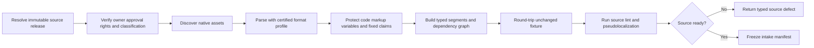
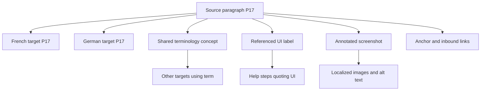

# Source Intake, Segmentation, Formats, and Internationalization

## 1. Treat source preparation as a quality gate

Poorly internationalized source cannot be repaired reliably by better translation. Before candidate generation, prove that:

- the source release is immutable and approved;
- translatable versus protected content is explicitly identified;
- complete messages—not concatenated fragments—are extractable;
- variables have names, types, examples, and runtime semantics;
- plural, select, gender, grammatical, and device variants are represented in the native format;
- dates, numbers, currencies, units, and lists use deterministic locale formatters;
- resource identifiers and context survive export/import;
- layouts support expansion, bidi, reflow, dynamic text, and localizable assets; and
- source defects have owners and do not disappear into translator comments.

The earliest, cheapest localization improvement is often a source-code or content-model change.

## 2. Intake pipeline



### 2.1 Intake manifest

For each asset record:

- source release and asset identity;
- native path/entry and content digest;
- format, version, encoding, newline, normalization, and adapter profile;
- source locale and any mixed-language spans;
- extractable units and protected nodes;
- segment/variant identities and dependencies;
- parse warnings, lossy constructs, unsupported extensions, and source defects;
- rights, privacy, classification, retention, and provider/reviewer eligibility;
- screenshots/layout/build/runtime references;
- segmentation and pseudolocalization versions; and
- unchanged round-trip result/digest policy.

## 3. Native format profiles

### 3.1 Certify a profile, not a file extension

“Supports XLIFF” or “supports JSON” is too vague. A certified profile states:

| Concern | Required declaration |
|---|---|
| Version | Exact standard/runtime version and supported modules/dialects |
| Syntax | Parser/serializer implementation and failure behavior |
| Identity | Native key/path/context and variant mapping |
| Inline content | Supported code/tag types, nesting, reordering, and protection |
| Metadata | Comments, notes, state, provenance, constraints, and trust class |
| Ordering/formatting | Canonicalization versus byte-preserving behavior |
| Unknown constructs | Preserve, quarantine, or reject—never silently drop |
| Round trip | Semantic and, where required, byte-level equivalence tests |
| Render/build | Target-runtime validation command and supported platform versions |

### 3.2 XLIFF

OASIS XLIFF 2.1 is the current OASIS Standard; ISO 21720:2024 specifies XLIFF 2.0. Record the actual version. The adapter should:

- preserve file/unit/segment identity and source/target state;
- understand the declared core and module subset;
- round-trip inline codes and original-data references;
- preserve notes and metadata with authorship/trust labels;
- reject unsupported extension loss or isolate it in a lossless envelope;
- never infer that an XLIFF target is approved merely because a state string says so; and
- retain the native source asset as authority unless project policy explicitly designates the package.

ITS 2.0 metadata—such as translate/no-translate, locale filter, terminology, preserve space, provenance, and MT confidence—should survive conversion when applicable.

### 3.3 ICU MessageFormat and MessageFormat 2

Parse messages to an AST. Required validation includes:

- argument-name and type compatibility;
- plural/select selector and branch completeness under the pinned CLDR/runtime;
- exact-number selectors and offsets;
- nested message structure;
- apostrophe/escaping rules for the actual runtime;
- number/date skeleton or formatter references;
- bidi isolation strategy;
- absence of translator-created argument names; and
- successful rendering for representative values.

Translate the whole outer message. Do not split each plural branch into unrelated units without a format-aware editor and validator; grammar can depend on the whole construct.

MessageFormat 2’s standard status does not guarantee identical support in every shipping ICU/runtime. The certified profile must name the parser, renderer, and feature subset.

### 3.4 GNU gettext PO

Preserve:

- `msgctxt` as part of identity;
- `msgid`, `msgid_plural`, and all target plural indices;
- extracted, reference, translator, and previous-source comments separately;
- flags such as format-string declarations;
- obsolete/fuzzy state without conflating it with review approval; and
- header charset, language, plural rules, and project metadata.

A source string plus context is a unit. Deduplicating solely by `msgid` can merge different grammatical meanings.

### 3.5 Android resources

Use the Android resource parser/build tools for XML, not a generic XML translation. Validate:

- complete default resources;
- `translatable="false"` and product overlays;
- `<string>`, `<plurals>`, `<string-array>`, styling spans, escapes, and format arguments;
- resource qualifiers and actual runtime selection;
- XLIFF/placeholder elements where used;
- `en-XA` expansion/accent coverage and `ar-XB` RTL behavior; and
- build and screenshot tests with representative values.

Never hardcode translated strings in layouts/code to make a pilot pass. That creates invisible source debt.

### 3.6 Apple String Catalogs

Build/extract with the supported Xcode toolchain and preserve:

- catalog key and source-language identity;
- extraction state and translator comments;
- plural and device variations;
- machine-generated provenance/state;
- language, region, and script specificity; and
- XLIFF import/export warnings.

Run Xcode pseudolanguages for expansion, bounded strings, accents/tall glyphs, and RTL in addition to real target locales. A string-catalog edit is not complete until the application preview/build uses it.

### 3.7 Project Fluent

Use the Fluent reference parser/runtime. Preserve messages, attributes, terms, selectors, variants, placeables, comments, and references. Localizers may select grammatical structures unavailable in the source; a key/value adapter destroys that capability. Test the exact application runtime and fallback behavior.

### 3.8 JSON, YAML, CSV, Markdown, HTML, and CMS rich text

These are containers, not localization semantics. Define:

- the JSON Pointer/YAML path/CSV column/frontmatter/rich-text node that is translatable;
- whether keys/order/comments/anchors/HTML nodes must be preserved;
- code fences, links, URLs, IDs, shortcodes, templates, embedded components, and no-translate spans;
- whether Markdown/HTML structure is parsed, not regex-substituted;
- line-ending/encoding/canonicalization policy; and
- a schema/build/render validator.

Never send an entire configuration file to a model and ask it to “translate strings but keep everything else.” Deterministic extraction and reinsertion are smaller and safer.

## 4. Protected content model

Classify each protected item:

| Class | Example | Allowed target behavior |
|---|---|---|
| Runtime argument | `{count}`, `%1$s`, `%(name)s` | Preserve identity/type; reorder only if format permits |
| Code/markup | `<strong>`, Markdown link destination, Fluent placeable | Preserve/nest according to AST |
| Product/entity | `CloudSync Pro` | Apply approved do-not-translate or localized form |
| Claim/legal fixed text | Approved rate, warranty limit, disclaimer unit | Exact approved target or separately reviewed adaptation |
| Data value | SKU, URL, email, currency amount | Preserve or deterministically format under policy |
| Whitespace/control | Nonbreaking space, bidi isolate, newline | Preserve/transform only under native-format rule |
| Media/time cue | Subtitle timestamp, voice pause marker | Keep timing/structure; adapt text within measured constraints |

Compare protected items structurally, not by raw substring alone. For example, an ICU argument may move between branches while retaining identity; an HTML tag may move only if valid nesting and intended emphasis survive.

### 4.1 Token ledger

```yaml
segment_id: seg_checkout_total
items:
  - token_id: arg_amount
    kind: runtime_argument
    native: "{amount, number, ::currency/USD}"
    semantic_type: money
    required_occurrences: 1
    may_reorder: true
    may_transform: false
  - token_id: brand_express
    kind: approved_term
    source: "Express Checkout"
    target_policy: use_preferred_termbase_form
  - token_id: strong_open
    kind: inline_code
    pair: strong_close
    nesting_policy: ast_valid
```

The validator produces a machine-readable difference. It does not ask a judge model whether tokens “look preserved.”

## 5. Segmentation

### 5.1 Segmentation is versioned behavior

Segment boundaries affect TM matches, reviewer workload, metrics, and meaning. Pin:

- rule set and version;
- language/script assumptions;
- abbreviation and exception lists;
- paragraph/list/table/heading structure;
- inline-code behavior;
- sentence versus message versus block granularity; and
- resegmentation/migration policy.

SRX 2.0 remains a useful legacy interchange for segmentation rules, but runtime regex and cascade semantics must be tested. Do not assume two SRX consumers create identical segments.

### 5.2 Choose the semantic unit

| Content | Preferred review/translation unit | Avoid |
|---|---|---|
| UI message | Whole runtime message with variants and screenshot | Each placeholder-adjacent fragment |
| Help procedure | Paragraph/list item plus section and UI references | Entire document with no stable segment mapping, or isolated sentence with no procedure context |
| Marketing headline | Creative unit plus brief, visual, claim, and channel | Literal sentence-only translation |
| Legal warning | Controlled clause/unit defined by legal workflow | Automatic sentence splitting that changes cross-reference or scope |
| Subtitle | Caption cue plus neighboring cues/timing | Unbounded paragraph translation detached from timing |

Segmentation is not a reason to discard document context. Preserve section, order, adjacency, references, and visual anchors in a dependency graph.

## 6. Locale and Unicode handling

### 6.1 Parse and canonicalize, do not guess

Validate BCP 47 tags with a maintained library. Store the requested tag and canonical form. Resolve runtime fallback separately, and record what actually rendered.

Do not infer:

- country or jurisdiction from language alone;
- script safety from likely-subtag expansion;
- cultural acceptability from a parent locale;
- translation eligibility from MT provider language codes; or
- release completeness from application fallback.

### 6.2 Normalization and comparison

Use NFC where the platform/interchange profile requires stable canonical equivalence. Keep original and normalized digests if normalization changes stored content. Do not apply NFKC/NFKD as generic cleanup: compatibility normalization can collapse meaningful distinctions.

Define comparison per field:

- resource IDs may require byte/code-point exactness;
- term matching may use locale-aware case/normalization under explicit policy;
- visible-length constraints may count grapheme clusters and rendered width;
- provider quotas may count characters/bytes differently; and
- artifact integrity uses bytes after canonical serialization.

### 6.3 Bidirectional text

Test:

- UI mirroring and components that must not mirror;
- neutral punctuation near variables;
- numbers, currencies, phone numbers, file paths, URLs, and code embedded in RTL text;
- isolates/embedding controls and their preservation;
- cursor/selection and screen-reader order; and
- screenshots for both pseudolocale and real target locales.

Never “fix” bidi by reversing strings.

### 6.4 Plurals and grammatical variation

Plural categories are locale data, not English singular/plural assumptions. Under the pinned CLDR/runtime:

1. identify required categories and exact-number branches;
2. provide representative numeric samples, including decimals where relevant;
3. allow target-language restructuring of the whole message;
4. render every branch;
5. verify arguments and number formatting; and
6. test runtime locale selection/fallback.

Gender, case, politeness, animacy, and classifier behavior may need selectors or message redesign. Do not force localizers to encode grammar in concatenated fragments.

## 7. Source lint and authoring rules

Block or warn on:

- concatenated user-visible fragments;
- a variable named `x` without type/example/meaning;
- ambiguous pronouns, noun/verb homographs, unexplained acronyms, and inconsistent terminology;
- hardcoded dates, currencies, units, or punctuation around formatted values;
- text embedded in images without an asset-localization plan;
- inaccessible source labels/alt text;
- fixed pixel/character assumptions;
- duplicate resource IDs or unstable auto-generated keys;
- HTML/Markdown that does not parse;
- screenshots that do not match the source revision;
- source comments containing passwords, personal data, or instructions to bypass policy; and
- claims/disclaimers without stable owner and protected-unit identity.

Source-oriented writing can improve localization, but at the research date the ISO 18968:2026 [standard page](https://www.iso.org/standard/85512.html) and [committee catalogue](https://www.iso.org/committee/48104/x/catalogue/) showed publication-stage ambiguity. Recheck its final status and obtain the text before citing conformity.

## 8. Source-change impact graph

Every segment links to dependencies:



When source changes, compare structured meaning and dependencies. Invalidate:

- the changed segment;
- translations derived from it;
- dependent claims, terms, references, labels, images, alt text, captions, and navigation;
- reviews and approvals bound to old artifacts; and
- staged but uncommitted outputs.

Do not invalidate the entire release by default if the graph proves unaffected units; do not retain everything merely because a string key survived.

### 8.1 Worked late-change example

An English help article has French and German approved. Product changes “Select **Archive** to hide the workspace” to “Select **Archive** to remove the workspace from your sidebar; members keep access.”

Correct response:

1. create a new source release and digest for the paragraph;
2. mark the old target paragraph and approval obsolete;
3. invalidate the screenshot callout if it shows the old UI or explanation;
4. preserve unrelated approved paragraphs whose dependencies are unchanged;
5. compile the new UI-label term and product-behavior fact;
6. retranslate and technically review the behavior statement in each locale;
7. update per-locale artifact and parity state;
8. prevent release until both required locales are approved or a named waiver exists; and
9. retain lineage between old/new source, targets, review, and publication.

Fuzzy TM reuse may still propose part of the old target, but the behavior change makes automatic acceptance unsafe.

## 9. Deterministic test matrix

| Test | Fixture dimensions | Failure action |
|---|---|---|
| Parse/serialize round trip | Every format version, extension, encoding, newline, inline-code class | Block profile certification |
| Message rendering | Every selector/branch and representative variable type/value | Block segment |
| Protected-token comparison | Reordered, missing, duplicated, mutated, nested, escaped tokens | Block candidate; one bounded syntax repair if safe |
| Pseudolocalization | Expansion, accents/tall glyphs, bounded text, LTR/RTL, untranslated detection | Return source/layout defect |
| Locale fallback | Requested/supported/missing locales, parent/script/region variants | Block silent wrong-locale completion |
| Unicode | Canonical equivalence, grapheme clusters, combining marks, emoji, bidi controls | Block or route under profile |
| Impact graph | Key-preserving meaning changes, term/claim/UI reference changes | Mark precise dependents obsolete |
| Native build/render | Platform versions and representative screens/docs | Block staging/release |

## 10. Sources

- OASIS XLIFF 2.1: <https://docs.oasis-open.org/xliff/xliff-core/v2.1/xliff-core-v2.1.html>
- W3C ITS 2.0: <https://www.w3.org/TR/its/>
- BCP 47 and matching: <https://www.rfc-editor.org/info/rfc5646/> and <https://www.rfc-editor.org/info/rfc4647/>
- Unicode normalization, segmentation, bidi, and CLDR: <https://www.unicode.org/reports/tr15/>, <https://unicode.org/reports/tr29/>, <https://www.unicode.org/reports/tr9/>, and <https://www.unicode.org/reports/tr35/>
- ICU messages: <https://unicode-org.github.io/icu/userguide/format_parse/messages/>
- MessageFormat 2: <https://messageformat.unicode.org/>
- GNU gettext: <https://www.gnu.org/software/gettext/manual/gettext.html>
- Android localization/pseudolocales: <https://developer.android.com/guide/topics/resources/localization> and <https://developer.android.com/guide/topics/resources/pseudolocales>
- Apple String Catalogs/pseudolanguages: <https://developer.apple.com/documentation/xcode/localizing-and-varying-text-with-a-string-catalog> and <https://developer.apple.com/documentation/xcode/preparing-your-interface-for-localization>
- Project Fluent: <https://github.com/projectfluent/fluent>
- [Research packet](../../research/packets/localization-transcreation-agent-blueprint.md)
