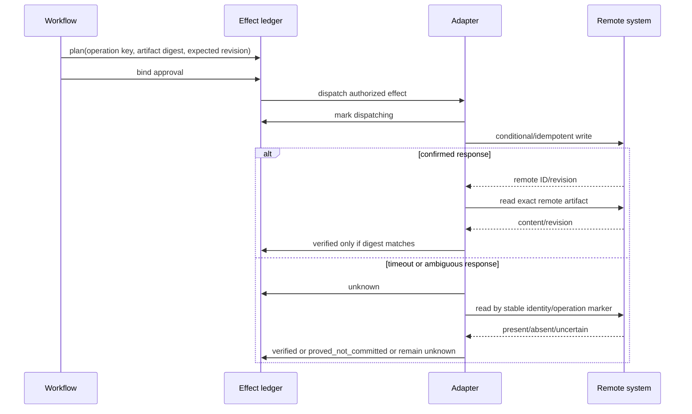

# Tools, Connectors, Effects, and Workflow

## 1. Design tools around capability, not vendor UI

An agent should call narrow tools such as:

- `resolve_source_release`
- `extract_native_asset`
- `retrieve_eligible_terms`
- `retrieve_eligible_tm`
- `generate_candidate`
- `validate_native_message`
- `create_review_task`
- `stage_artifact`
- `approve_artifact`
- `dispatch_effect`
- `read_remote_artifact`
- `reconcile_effect`

It should not receive a generic browser, shell, SQL console, TMS-admin token, or arbitrary HTTP client for normal operation. Tool schemas constrain IDs, locale, path, action, artifact digest, expected revision, and data classification. Credentials are selected by a broker after policy evaluation; they never enter prompts.

## 2. Tool contract template

```yaml
tool: stage_localized_artifact
version: 3
purpose: "Create or update a review-only localized artifact in an approved destination"
input:
  task_id: typed_id
  artifact_id: typed_id
  artifact_digest: sha256
  destination_profile_id: typed_id
  expected_remote_revision: string_or_null
preconditions:
  - task_state_is_approved
  - approval_matches_source_and_artifact_digest
  - destination_is_staging_only
  - no_conflicting_effect_is_dispatching_or_unknown
authorization:
  workflow_roles: [localization_release_operator]
  credential_scope: write_localized_staging_only
idempotency:
  operation_key: destination+source_release+locale+artifact_digest+action
outcomes:
  - verified
  - unknown
  - proved_not_committed
  - rejected_precondition
  - permanent_error
audit:
  raw_content: prohibited
  record: [caller, policy, approval, destination, artifact_digest, precondition, result, remote_revision]
```

The tool verifies preconditions itself. A caller cannot bypass them by narrating that review “already happened.”

## 3. Provider adapter contract

### 3.1 Immutable capability record

```yaml
provider_adapter_id: mt-provider-x@2026-08-17
endpoint_region: eu
supported_pairs_snapshot: artifact://capabilities/provider-x-2026-08-17.json
input:
  max_request_bytes: 131072
  max_texts: 50
  text_independence: true
  supported_native_tags: [xml_profile_1]
controls:
  glossary: language_pair_limited
  context: unbilled_but_size_limited
  formality: [de, fr]
execution:
  mode: synchronous
  timeout_ms: 20000
  provider_idempotency: none
  retryable: [429, 500, 502, 503, 504]
  max_attempts: 2
governance:
  classifications: [public, internal]
  prohibited: [restricted_personal, unreleased_legal]
  dpa_record: vendor://provider-x/dpa-2026-04
  retention_profile: vendor://provider-x/retention-enterprise-eu
evaluation:
  qualified_profiles: [de-DE-commerce-ui-r1, fr-FR-help-r1]
pricing:
  unit: source_character_per_target
  snapshot: pricing://provider-x/2026-08
```

Do not collapse language codes, glossary behavior, document translation, context, data region, quota, and price into one boolean “supports translation.”

### 3.2 Generation call

The adapter:

1. validates eligibility against task classification, rights, locale pair, content type, and behavior bundle;
2. enforces request limits without splitting a semantic message;
3. converts only through certified tag/format mappings;
4. attaches a provider request ID and client operation ID;
5. applies timeout and bounded provider-specific retry;
6. rejects partial/truncated/malformed output;
7. records usage/cost metadata without raw text in default telemetry;
8. returns a candidate, not an approved artifact; and
9. exposes provider/model/version and controls in provenance.

### 3.3 Provider fallback

Provider fallback is a behavior change, not an invisible retry. The alternate provider needs equivalent:

- data/rights eligibility;
- language/locale/domain evaluation;
- glossary/tag/format compatibility;
- behavior-bundle entry;
- cost/latency guardrail; and
- reviewer visibility.

If those do not hold, queue or route to human translation. Availability does not justify unqualified output.

## 4. TMS adapters

### 4.1 Normalize the workflow, preserve vendor semantics

Use an internal contract for projects, resources/assets, keys/segments, locales, jobs, translations, comments, reviews, webhooks, and exports. Preserve vendor-specific state in the adapter envelope rather than pretending all TMSs share one lifecycle.

| Concern | Adapter responsibility |
|---|---|
| Locale mapping | Map internal locale profile to vendor code; reject ambiguous/lossy mapping |
| Resource identity | Store vendor project/resource/key IDs and source revision/digest |
| Upload/update | Declare whether source updates retain, invalidate, or delete targets |
| Translation state | Map vendor states without converting them directly into internal approvals |
| Async jobs | Persist job ID, poll/callback state, deadlines, and cancellation semantics |
| Webhooks | Authenticate where possible, deduplicate, queue, tolerate order gaps, reconcile missed events |
| Export | Pin file format/profile and validate/read back resulting content |
| Plan limits | Treat unavailable API/features as capability failures, not transient errors |

### 4.2 Product-specific evidence

#### Phrase Strings

- Resolve US versus EU API base URLs per tenant.
- Send the required identifying `User-Agent`.
- Validate HMAC-signed webhooks.
- Do not assume every upload/repository-sync mutation produces granular translation events.
- Reconcile within the documented event-history window; retained webhook history is not a durable ledger.

Sources: <https://developers.phrase.com/en/api/strings/getting-started> and <https://support.phrase.com/hc/en-us/articles/5784125630620-Webhooks-Strings>.

#### Lokalise

- Documented webhooks use origin IP and/or custom headers rather than an intrinsic signature in the described flow; deploy layered ingress controls and reconcile.
- Expect delayed retries and possible out-of-order delivery.
- Monitor for webhook disablement after failures.
- Treat webhook data as notification, then read authoritative project state.

Sources: <https://developers.lokalise.com/reference/lokalise-rest-api> and <https://developers.lokalise.com/docs/webhooks-guide>.

#### Transifex

- Model asynchronous upload/download operations: `202 Accepted`, job resource, poll/redirect/callback, timeout, and terminal error.
- Explicitly decide source-update invalidation. `keep_translations=true` can retain targets after source changes; that may be correct for a minor metadata update or dangerously stale for a meaning change.
- Pin plan/rate limitations in the capability record.

Sources: <https://transifex.github.io/openapi/> and <https://help.transifex.com/en/articles/6236849-updating-your-source-content>.

#### Crowdin and other TMSs

Certify the current tenant/API/plan directly. Never inherit signing, idempotency, state, or retry assumptions from another vendor. Start with read-only discovery and fixture projects before a production write.

## 5. Repository adapters

### 5.1 Prefer a staged pull-request workflow

For repository-managed resources:

1. resolve the immutable source commit and current target file SHA;
2. generate the native artifact in an isolated workspace;
3. run format parser, native build, localization QA, and diff policy;
4. create/update a dedicated staging branch with operation-key metadata;
5. read back the committed file and compare its digest;
6. open/update a pull request with source release, locale, bundle, review, and validation evidence;
7. leave merge to the repository’s normal protected-branch authority unless explicitly delegated at a later stage; and
8. observe merge and release parity through repository events plus reconciliation.

Never write directly to the default branch for an MVP.

### 5.2 GitHub-specific controls

GitHub’s Contents API requires the current content `sha` for updates, and concurrent content update/delete calls can conflict. GitHub recommends webhook-driven, queued, conditional, rate-aware use. Validate webhook signatures. Because failed webhook deliveries are not automatically redelivered, reconciliation is mandatory.

Sources: <https://docs.github.com/en/rest/repos/contents>, <https://docs.github.com/en/rest/using-the-rest-api/best-practices-for-using-the-rest-api>, <https://docs.github.com/en/webhooks/using-webhooks/validating-webhook-deliveries>, and <https://docs.github.com/en/webhooks/using-webhooks/handling-failed-webhook-deliveries>.

### 5.3 Repository path safety

The adapter allowlists repositories, branches, and path patterns from the destination profile. It rejects:

- absolute or traversal paths;
- symlink escapes;
- generated/build/secrets paths outside the profile;
- model-proposed repository/owner names;
- unrelated file changes;
- executable or configuration changes in a Markdown/content-only workflow; and
- a diff whose aggregate digest differs from the approved artifact manifest.

## 6. CMS adapters

CMS identity usually includes space/project, environment, entry, field, locale, version, and release/publication state. Treat locale fallback and locale-level publishing as first-class behavior.

### 6.1 Contentful example

- Content delivery may return fallback-locale content; record requested and resolved locale and never count fallback as translated parity.
- Content management uses versioned writes; send the expected version and handle conflicts explicitly.
- Locale deletion is destructive and outside ordinary localization-agent scope.
- Locale-based publishing, where enabled, changes the publication/effect unit. Certify whether approval applies to an entry, locale, environment, or release.

Sources: <https://www.contentful.com/developers/docs/references/content-delivery-api/localization/>, <https://www.contentful.com/developers/docs/references/content-management-api/locales/>, and <https://www.contentful.com/developers/docs/references/graphql/locale-handling/>.

### 6.2 CMS staging rule

Default to a non-production environment, draft state, or named release. A production publish requires a separate effect type, narrower credential, stronger approval policy, parity precondition, and rollback/correction plan.

## 7. Durable workflow

### 7.1 Orchestrator versus activity

The workflow/orchestrator owns:

- deterministic state transitions;
- timers/deadlines;
- attempt budgets;
- human-wait state;
- policy and behavior-bundle references;
- event causation;
- effect-ledger lifecycle; and
- cancellation/obsolescence.

Activities own bounded I/O: parse asset, call provider, validate artifact, create review task, stage write, read remote state. An activity may retry according to policy, but cannot decide to change source, target locale, provider eligibility, or approval requirements.

Durable-execution products such as Temporal can replay workflows and retry Activities. They do not make external APIs exactly once; keep the effect ledger and readback protocol independent of the workflow vendor.

### 7.2 Retry matrix

| Operation | Default retry | Why |
|---|---|---|
| Deterministic parse/validate | None for same input/bundle | Repeat produces same defect; return actionable error |
| Candidate generation | One initial attempt | Additional sampling changes behavior/cost and can hide source/context defects |
| Candidate repair | One, only for exact machine-repairable validator report | Bounds loops and semantic drift |
| Provider 429/5xx before any result | Bounded exponential backoff with jitter under deadline/budget | Transient and normally side-effect-free generation |
| Create external artifact/write | Provider-specific; never blind after ambiguity | Write may have committed before timeout |
| Read/reconcile | Bounded repeated read under consistency window, then operator alert | Safe observation but should not run forever |
| Human wait | Deadline/reminder/escalation, not “retry” | People are durable dependencies |
| Webhook processing | Deduplicated queue retry plus periodic reconciliation | Delivery may duplicate, reorder, or disappear |

### 7.3 Cancellation and obsolescence

Cancellation is cooperative:

1. mark workflow intent `cancelling`;
2. stop undispatched activities;
3. let in-flight provider calls expire/cancel where supported;
4. reconcile any in-flight external effect;
5. mark staged artifacts cancelled/obsolete without deleting audit evidence;
6. revoke open approvals/review tasks; and
7. produce a continuity/final receipt.

A source change creates `obsolete`, not a mutation of history.

## 8. External effect protocol

### 8.1 Sequence



### 8.2 Idempotency key

Build from stable intent, not attempt number:

```text
SHA256(
  tenant |
  destination_profile |
  action |
  remote_object_identity |
  source_release |
  target_locale_profile |
  artifact_digest
)
```

If changing an input should create a distinct effect, it belongs in the key. Keep the same key across retries of the same intent.

### 8.3 Reconciliation proof

`verified` requires:

- correct remote tenant/project/environment/repository;
- correct object/path/key and locale;
- remote content semantically/native-format equivalent to the artifact;
- matching canonical/byte digest under the adapter profile;
- expected remote revision/commit relation;
- expected review/draft/publication state; and
- no evidence of a later conflicting source or target update.

A returned remote ID alone is insufficient.

## 9. Webhook protocol

1. Terminate TLS at an approved ingress.
2. Validate cryptographic signature where supported; otherwise use documented origin/network and custom-secret controls plus readback.
3. Enforce body/time limits and reject unknown event types/schemas.
4. Store minimal raw delivery under short retention only if incident needs justify it.
5. Deduplicate by provider delivery ID plus tenant/source.
6. Acknowledge quickly after durable queueing.
7. Process per affected resource serially or with version checks.
8. Treat event order as uncertain.
9. Fetch authoritative current state.
10. Run periodic reconciliation for missed/disabled/expired deliveries.

Never allow a webhook payload to choose a credential or arbitrary destination.

## 10. Failure matrix

| Failure | Unsafe response | Correct response |
|---|---|---|
| Provider output truncates | Accept the fluent prefix | Reject candidate; inspect size/context; do not split semantic message |
| TMS upload returns `202` | Mark complete | Persist job; poll/callback; validate resulting resource |
| Repository write times out | Retry immediately with new branch/file | Mark unknown; search/read back by operation marker and digest |
| Webhook signature invalid | Parse and “check later” | Reject, audit metadata, alert/rate-limit as policy requires |
| Webhook missed | Assume no change | Periodic reconciliation of active resources |
| CMS returns fallback locale | Count locale complete | Record actual locale; keep target missing; block/waive parity |
| Source changes during review | Merge target onto latest silently | Obsolete affected task; impact analysis and re-review |
| Provider quota exhausted | Route every locale to unqualified provider | Apply backpressure; qualified fallback or human queue |
| Duplicate event | Repeat effect | Inbox dedupe and task-version check |
| Approval artifact mutated | Keep approval | New digest invalidates approval; require re-review |

## 11. Adapter certification checklist

- [ ] Current official API/version/plan documentation reviewed.
- [ ] Locale and language-code mapping is loss-aware.
- [ ] Rate, request, async, callback, timeout, cancel, and error semantics are fixture-tested.
- [ ] Authentication, signing, token scope, region, retention, and rights constraints are recorded.
- [ ] Idempotency/optimistic concurrency is used where available.
- [ ] Timeout-after-commit and eventual-consistency tests pass.
- [ ] Webhook duplication, reordering, loss, replay, and disablement are handled.
- [ ] Readback verifies stable identity, content digest, revision, locale, and state.
- [ ] Plan/feature changes fail closed as capability drift.
- [ ] Staging, correction, and rollback/recovery have drills and owners.

## 12. Sources and foundations

- [Tool contracts](../../tools/tool-contracts.md)
- [Idempotency and side effects](../../reliability/idempotency-and-side-effects.md)
- [Durable execution](../../runtime/durable-execution.md)
- [Research packet](../../research/packets/localization-transcreation-agent-blueprint.md)
- Temporal documentation: <https://docs.temporal.io/>

