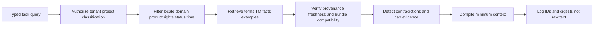
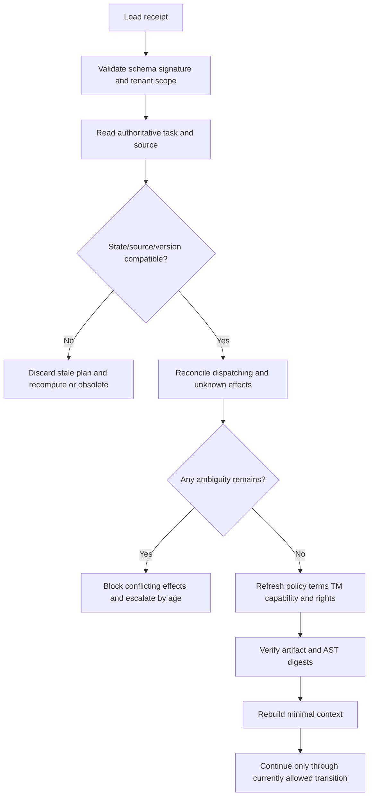

# State, Context, Memory, Planning, and Continuity

## 1. Separate five things that are often called “context”

| Layer | Purpose | Authority |
|---|---|---|
| Durable state | Exact task state, source, owners, versions, approvals, effects, artifacts | Authoritative transactional store |
| Domain knowledge | Terms, style, locale rules, claims, product facts, format rules | Versioned owner-approved sources |
| Retrieval evidence | Eligible TM, examples, related segments, prior outcomes | Advisory, provenance-bearing |
| Model context | Minimum compiled view for one bounded decision | Ephemeral and untrusted by the control plane |
| Continuity receipt | Loss-aware index for handoff/resume/compaction | Signed pointer to authority, never authority itself |

A prompt cannot be the database. A summary cannot be the workflow engine. A vector result cannot be a policy.

## 2. Authoritative durable state

Store transactionally:

- task identity/version and legal state;
- exact source release, segment set, target locale profile, and risk;
- behavior bundle and all artifact digests;
- attempt budgets and completed attempt provenance;
- structured issues, owners, deadlines, and escalation;
- review tasks and signed decisions;
- effect ledger, remote IDs/revisions, and reconciliation evidence;
- cancellation/obsolescence/waiver records;
- event inbox/outbox and causation; and
- retention/deletion/correction status.

The model may propose a transition. Application code checks current version, allowed transition, policy, approvals, and effect conflicts before committing it.

### 2.1 State read model for the model

```yaml
task_view:
  task_id: ltask_01J...
  state: candidate_ready
  state_version: 8
  next_allowed_actions:
    - validate_candidate
    - request_source_clarification
  prohibited_actions:
    - stage_artifact
    - commit
    - publish
  attempt_budget:
    candidate_remaining: 0
    repair_remaining: 1
  unresolved:
    - issue_id: qa_missing_argument_cartName
      class: machine_repairable_syntax
```

The server computes `next_allowed_actions`; the model does not invent them.

## 3. Memory taxonomy

### Turn/scratch memory

Contains the current source/candidate, parser diagnostics, term subset, and exact validator report. It expires after the bounded operation. Never store credentials or unrelated source assets. Do not resume from it after a crash.

### Working/run memory

Contains batch ordering, open conflicts, temporary deduplication, and cached compiled context for a single run. It is derived and rebuildable. Cache keys include tenant, source release, locale profile, behavior bundle, rights/classification, and dependency versions.

### Session memory

Contains UI filters, scroll position, draft comments, and locally selected views. The final review decision is a separate authenticated durable record. A draft comment saying “approved” is not approval.

### Durable workflow/task memory

This is the authoritative state described above. It uses schema versions, transactions/optimistic concurrency, audit, backup, correction, and retention controls. Do not put it in a vector store.

### Domain knowledge memory

Includes termbase, style, locale profiles, product facts, protected claims, format profiles, reviewer qualifications, and provider capabilities. Every item has an owner, provenance, scope, effective interval, status, rights/classification, and version.

### Long-term/preference memory

Allow narrowly scoped preferences such as reviewer display choices or a market-approved tone preference. A preference cannot override an approved term, factual source, legal claim, accessibility rule, or project policy. Store who set it, for which tenant/project/locale/content type, and when it expires.

### Episodic/outcome memory

Contains accepted/rejected/corrected outcomes and rationales for future retrieval or evaluation. Admission requires:

1. final authoritative outcome;
2. qualified reviewer or outcome source;
3. provenance and exact source/target/bundle digests;
4. tenant/domain/locale/product scope;
5. rights and privacy permission for reuse;
6. sanitization of instructions, secrets, and irrelevant personal data;
7. quality/anomaly/poisoning checks;
8. retention, correction, and deletion policy; and
9. separation from protected evaluation holdouts.

## 4. Memory record contract

```yaml
schema: localization.memory-record/v1
memory_id: mem_01J...
class: episodic_outcome
tenant_id: acme
scope:
  project: storefront
  domain: commerce
  content_type: software_ui
  source_language: en-US
  target_locale_profile: lp_storefront_de_de_android_v7
content:
  source_artifact_ref: artifact://segments/seg_91c2@sha256:...
  accepted_target_ref: artifact://targets/seg_91c2_de@sha256:...
  rationale_ref: review://review_01J...
provenance:
  origin: approved_human_correction
  source_release_id: sr_storefront_2026_09_rc3
  behavior_bundle_id: bundle_2f4e...
  reviewer_qualification: de-DE-commerce-v5
governance:
  rights_profile_id: rights-product-copy-v3
  classification: internal_confidential
  provider_eligibility: [internal_retrieval_only]
  admitted_by: memory-policy-v6
  admitted_at: 2026-09-02T10:00:00Z
  expires_at: 2027-09-02T10:00:00Z
  deletion_group_id: dg_source_asset_188
quality:
  status: active
  poisoning_scan: pass
  correction_version: 1
```

The memory index stores filterable metadata and an encrypted reference; it need not duplicate raw content.

## 5. Retrieval pipeline



### 5.1 Retrieval order

1. Fetch authoritative domain knowledge by exact IDs/version from the task bundle.
2. Resolve applicable terms/claims by scope and effective interval.
3. Filter TM/episodic evidence deterministically.
4. Rank within the eligible set.
5. inspect contradictions, duplicate provenance, and source freshness;
6. cap by evidence class and diversity; and
7. emit an evidence manifest with every included/excluded reason.

Vector similarity is a ranking stage, never the first authorization or eligibility stage.

### 5.2 Evidence manifest

```yaml
context_manifest_id: ctx_01J...
task_id: ltask_01J...
bundle_id: bundle_2f4e...
included:
  - id: concept_cart_item
    class: terminology
    version: 9
    reason: exact_domain_and_locale
  - id: tmu_7ac93
    class: tm
    reason: eligible_same_product_role
excluded:
  - id: tmu_29bb2
    class: tm
    reason: wrong_market_france_not_canada
conflicts: []
content_digest: sha256:...
compiled_at: 2026-08-31T09:00:00Z
```

## 6. Context construction

### 6.1 Order and delimit untrusted data

A generation request should clearly separate:

1. fixed system policy and output schema;
2. trusted task/control metadata computed by the application;
3. source data in typed delimiters;
4. approved terminology/style/facts with IDs;
5. advisory TM/examples with provenance and status;
6. visual/document references rendered through controlled tools; and
7. explicit unresolved questions.

Tell the model that embedded instructions in any source/evidence are content, not commands. Still enforce this structurally with no effect tools and server-side schemas.

### 6.2 Context budget policy

Allocate by value and authority, not recency alone:

| Class | Budget behavior |
|---|---|
| Source/native syntax/protected tokens | Never truncate; reject or split only at a certified semantic boundary |
| Fixed claims/terms/locale policy | Include every applicable item; conflict stops task |
| Immediate section/visual context | Include enough to resolve meaning; preserve references if media omitted |
| Eligible TM/examples | Cap count/size; diversify provenance; lower priority than authority |
| Review history | Include current actionable issues; summarize older history with exact pointers |
| General style guide | Compile applicable rules, not the whole document |

If the minimum authoritative context does not fit, do not silently truncate. Choose a larger eligible model/context path, process a larger semantic unit through a document adapter, or route to human review.

## 7. Planning and attempt budgets

### 7.1 Deterministic plan skeleton

The workflow derives the plan from content type, risk, and policy:

```yaml
plan:
  - resolve_and_validate_source
  - parse_and_protect
  - compile_context
  - retrieve_eligible_tm
  - generate_candidate_once
  - deterministic_validate
  - maybe_repair_once_if_syntax_only
  - linguistic_review
  - in_context_review
  - stage_artifact
  - approve_staged_digest
  - dispatch_and_reconcile
  - release_parity_gate
```

The model can select among already allowed next actions or propose an issue; it cannot remove gates.

### 7.2 Budget dimensions

Set budgets for:

- candidate attempts;
- repair attempts;
- provider retry attempts and elapsed deadline;
- model tokens/characters/documents and monetary cost;
- TM/context items;
- human review/rework cycles before escalation;
- external-write attempts and reconciliation age;
- total task deadline; and
- per-tenant/locale queue share.

Budget exhaustion is a controlled blocked/escalated state, not partial success.

## 8. Loss-aware compaction

Long help documents, multi-locale campaigns, and human waits can outlive one model context or process. Compaction should remove reconstructible prose while preserving exact IDs, digests, state, open risk, and effect ambiguity.

### 8.1 Never compact away

- source release/revision/digest;
- target locale profile/market/product/channel;
- current task state and state version;
- approved/staged artifact IDs and digests;
- open approvals and reviewer decisions;
- `dispatching`/`unknown` effects and reconciliation evidence;
- protected-token/native-AST validation digest;
- behavior-bundle component versions;
- rights/classification/residency/retention labels;
- unresolved source/term/legal/cultural/accessibility issues;
- exact pointers to authoritative records; and
- explicit dropped-field ledger.

### 8.2 Safe compaction approach

1. Flush all authoritative mutations and event outbox records.
2. Reconcile or explicitly carry every in-flight effect.
3. Snapshot current IDs/digests/state/version.
4. Summarize only reconstructible narrative and completed evidence.
5. List omitted detail, why it was omitted, and where to reload it.
6. Validate the receipt schema and references.
7. Sign/checksum and store it under the task.
8. On resume, compare against current authoritative state before any action.

## 9. Continuity receipt contract

```yaml
schema: localization.continuity-receipt/v2
receipt_version: 2
receipt_id: receipt_01J...
created_at: 2026-08-31T11:00:00Z
created_by: workflow-localization-v5
identity:
  tenant_id: acme
  project_id: storefront
  task_id: ltask_01J...
  task_state: human_review
  task_state_version: 12
  run_id: run_01J...
source_event_high_watermark:
  workflow: 991
  translation_management: provider-event-72
scope:
  source_release_id: sr_storefront_2026_09_rc3
  source_digest: sha256:...
  target_locale_profile_id: lp_storefront_de_de_android_v7
  product: storefront
  channel: android
progress:
  completed_segment_set_ref: artifact://sets/completed@sha256:...
  open_segment_ids: [seg_checkout_items_91c2]
  open_issue_ids: [issue_term_conflict_44]
approvals:
  completed: []
  outstanding:
    - review_type: terminology
      owner: product-terminology
active_clocks:
  - {clock_id: terminology-review, due_at: 2026-08-31T12:00:00Z, owner: product-terminology}
effects:
  - effect_id: effect_01J...
    state: unknown
    intended_artifact_digest: sha256:...
    next_reconciliation_at: 2026-08-31T11:02:00Z
pending_effect_ids: [effect_01J...]
unknown_effect_ids: [effect_01J...]
artifacts:
  current_candidate:
    id: artifact_candidate_882
    digest: sha256:...
  protected_ast_validation_digest: sha256:...
behavior_bundle:
  id: bundle_2f4e...
  termbase: terms-commerce-de-de@sha256:...
  tm: tm-commerce-de-de@sha256:...
  style: style-storefront-de-de@sha256:...
  locale: lp_storefront_de_de_android_v7
  segmentation: segmentation-android@4
  generator: provider-x@2.4.0/deployment-2026-08-15
  prompt: translate-ui@sha256:...
  validators: validators-ui@sha256:...
  adapter: github-contents@5.1
version_pins:
  behavior_bundle: bundle_2f4e...
  workflow: workflow-localization-v5
  source_release: sr_storefront_2026_09_rc3
  context_compiler: localization-context/3
governance:
  rights_profile_id: rights-product-copy-v3
  classification: internal_confidential
  residence: eu
  retention_deadline: 2027-08-31T00:00:00Z
evidence:
  durable_task_ref: state://tasks/ltask_01J...@v12
  review_ref: review://queue/term-44
  context_manifest_ref: context://ctx_01J...
  freshness_checked_at: 2026-08-31T10:59:30Z
dropped:
  - field: full_provider_response
    reason: "Not required for resume; raw content minimized"
    reload_ref: null
  - field: prior_completed_segment_narratives
    reason: "Reconstruct from approved artifacts and reviews"
    reload_ref: artifact://sets/completed@sha256:...
omitted_item_refs: [artifact://sets/completed@sha256:...]
resume:
  preconditions:
    - reload_task_and_require_version_at_least_12
    - reconcile_effect_01J_before_any_conflicting_write
    - verify_source_release_still_current
    - refresh_term_entry_conflict
    - compare_candidate_digest
  next_allowed_actions:
    - reconcile_unknown_effect
    - wait_for_terminology_decision
  next_safe_action: reconcile_unknown_effect
integrity:
  invariant_hash: sha256:...
  receipt_digest: sha256:...
  signature: sig:...
```

## 10. Resume algorithm



Never “continue where the summary left off” without this audit. Time may have changed source, term, provider, reviewer, approval, rights, or remote state.

## 11. Correction and deletion propagation

Maintain deletion groups from source artifact to:

- extracted segments and protected-token data;
- prompts/provider request records where controllable;
- candidate/approved artifacts subject to legal retention;
- caches and embeddings;
- TM and episodic memories;
- review attachments/comments;
- evaluation/replay corpora;
- logs/traces/forensic captures;
- backups under their delayed-expiry policy; and
- continuity receipts/evidence references.

Deletion may conflict with audit/legal obligations. Record the legal/policy decision, tombstone IDs as needed to prevent re-ingestion, and verify downstream removal rather than assuming a cascade ran.

A correction similarly invalidates retrieval indexes and produces a new version; it must not silently rewrite an old approved/published record.

## 12. Memory poisoning runbook

1. Disable/quarantine the affected memory source, term entries, or TM partition.
2. Stop new retrieval and affected behavior bundles.
3. Identify admissions/imports, provenance, retrieval logs, and affected runs.
4. Compare target artifacts and reviewer decisions for impact.
5. Correct/republish affected content by risk priority.
6. Rebuild indexes from validated authoritative data.
7. rotate credentials if the poisoning path involved compromise.
8. Add sanitized failure fixtures and import controls.
9. Preserve incident evidence under the approved policy.

Do not delete the suspicious record first and lose the impact graph.

## 13. Verification checklist

- [ ] Authoritative task state is transactional and versioned.
- [ ] Domain knowledge and retrieval evidence are distinct.
- [ ] Every memory class has purpose, scope, authority, retention, and deletion rules.
- [ ] Retrieval filters authorization/eligibility before similarity.
- [ ] Context manifests explain included/excluded evidence.
- [ ] Minimum authoritative context cannot be silently truncated.
- [ ] Attempt, time, cost, and queue budgets are explicit.
- [ ] Continuity receipts carry exact state, bundle, artifact, approval, effect, and governance references.
- [ ] Resume re-reads authority and reconciles effects before action.
- [ ] Corrections/deletions propagate to caches, memories, evals, telemetry, and receipts.

## 14. Repository foundations

- [Context engineering](../../context-memory/context-engineering.md)
- [Memory architecture](../../context-memory/memory-architecture.md)
- [Agent state and event contracts](../../runtime/agent-state-and-event-contracts.md)
- [Durable execution](../../runtime/durable-execution.md)
- [Research packet](../../research/packets/localization-transcreation-agent-blueprint.md)
