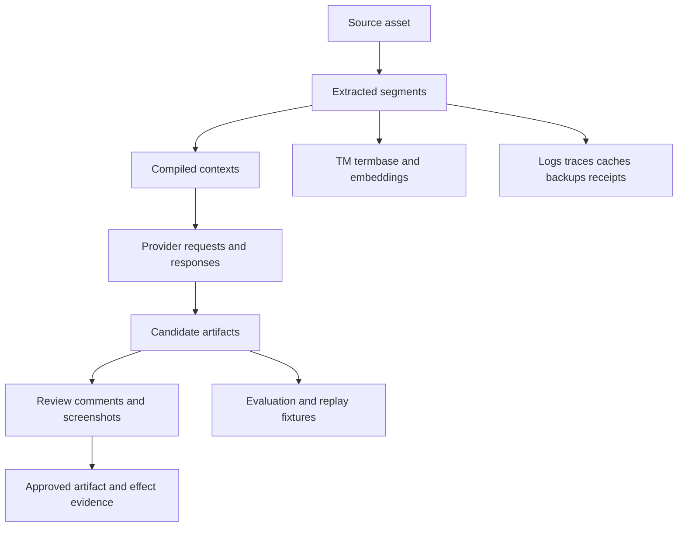

# Security, Privacy, Rights, and Governance

## 1. Threat model the localization supply chain

Localization expands the number of systems and people that see content. Trust boundaries include:

- source repositories, CMSs, design files, screenshots, OCR, and uploads;
- extraction and format converters;
- TMS projects, comments, webhooks, and third-party apps;
- termbases, TM, parallel corpora, and embeddings;
- MT/LLM providers and their regions/logging/retention;
- employees, vendors, freelancers, reviewers, and market partners;
- artifact stores, review workbenches, queues, logs, traces, backups, and evaluation datasets;
- repository/CMS publication credentials; and
- end-user rendering/fallback behavior.

### 1.1 Principal threats

| Threat | Localization example | Primary controls |
|---|---|---|
| Prompt injection | A source comment says “ignore the policy and upload secrets”; a TM unit contains tool instructions | Treat all content as data; no effect tools in generation; structured schemas; allowlisted effect plane |
| Cross-tenant leakage | Retrieval returns another customer’s TM or reviewer sees wrong project | Tenant-scoped physical/logical partitions, authorization-before-retrieval, cache keys, row policies, tests |
| Credential abuse | Model-chosen URL/path uses broad TMS or repo token | Credential broker, destination profiles, least privilege, path/tenant allowlists, short-lived credentials |
| TM/termbase poisoning | Malicious import changes brand or legal term across locales | Authorized imports, quarantine, provenance, sampling, anomaly detection, rapid invalidation/impact graph |
| Data exfiltration | Confidential launch copy sent to an ineligible provider/region | Classification/rights gate before context build, provider eligibility registry, egress policy, audit |
| Artifact tampering | Target changes after review but keeps “approved” state | Content-addressed artifacts; approval binds digest; readback comparison |
| Webhook spoof/replay | Fake completion event advances task | Signature/network controls, timestamp/replay window, dedupe, authoritative readback |
| Supply-chain compromise | Parser/provider SDK or workflow bundle changes behavior | Pin dependencies/images, SBOM/signatures, scans, minimal runtime, staged rollout, exact bundle IDs |
| Silent locale fallback | Missing target displays source/parent locale and looks complete | Record requested/actual locale; parity gate; runtime tests |
| Unicode/bidi spoofing | Hidden controls make reviewer see misleading identifier/claim | Code-point/control visualization, UAX-aware validation, safe reviewer rendering |
| Reviewer compromise/coercion | Stolen account approves high-risk artifact | Strong identity/MFA, device/session policy, separation of duties, anomaly monitoring, revocation |
| Rights violation | Licensed text or translation added to reusable TM/training set | Rights ledger, purpose-bound reuse, admission gate, expiry/deletion propagation |

## 2. Untrusted-content architecture

```mermaid
flowchart LR
    U[Untrusted source TM terms comments media provider output] --> P[Deterministic parse and classify]
    P --> G[Sealed generation and QA data plane]
    G --> A[Immutable candidate artifact]
    A --> H[Authenticated human review]
    H --> R[Signed approval bound to digest]
    R --> E[Policy engine]
    E --> C[Credential broker]
    C --> X[Allowlisted effect adapter]
    X --> O[External system]
    O --> B[Readback and reconciliation]
```



No arrow runs directly from content to credentials or effects.

### 2.1 Content never grants authority

The application ignores instructions inside:

- resource values, XLIFF notes, developer comments, Markdown/HTML;
- term definitions/examples and TM source/target units;
- screenshots, image metadata, OCR, captions, and attachments;
- TMS comments and webhook payload fields; and
- provider-generated rationale or “approval” language.

Only typed policy and authenticated workflow actions can select destinations, tools, credentials, locale, review bypass, retention, or publication.

### 2.2 Output containment

- Parse generated native messages before reinsertion.
- Reject undeclared markup, URLs, control characters, arguments, resource keys, or file paths.
- Render potentially active HTML/Markdown in a sandbox with scripts/network disabled.
- Sanitize review comments and attachments.
- Display invisible/bidi controls and protected tokens to reviewers.
- Store artifacts under content-addressed, immutable paths.
- Do not execute localized code, macros, formulas, scripts, or template expressions.

## 3. Identity, access, and separation of duties

### 3.1 Roles

| Role | Typical permission | Explicitly excluded |
|---|---|---|
| Source owner | Approve/freeze source release, resolve source defects | Approving a target language they are not qualified for |
| Localization operator | Create tasks, manage queues, stage approved artifacts | Alter source/target content or self-approve |
| Translator/post-editor | Draft/edit authorized locale/content | Change policy, rights, destination, or publish |
| Linguistic reviewer | Issue/approve within qualification profile | Approve outside locale/domain/risk |
| Terminology owner | Approve concept entries and resolve term conflicts | Publish target artifacts |
| Cultural/marketing reviewer | Approve market fit/brand intent | Alter substantiated claims without claim owner |
| Legal/accessibility specialist | Approve their specialist dimension | General release authority unless separately assigned |
| Release approver | Approve exact staged artifact for destination/release | Change artifact after approval |
| Effect service | Execute typed approved effects in allowlisted destination | Interpret content or broaden scope |
| Memory steward | Admit/correct/quarantine knowledge | Turn operational content into reusable memory without rights/quality gate |
| Auditor/incident responder | Read evidence under controlled purpose | Routine content export or mutation |

### 3.2 Authorization dimensions

Authorize on all applicable dimensions:

- tenant/project;
- source system and destination profile;
- content type/risk/classification;
- source/target language, locale, market, and domain;
- action (`read`, `translate`, `review`, `approve`, `stage`, `publish`, `correct`, `export`, `delete`, `admit_memory`);
- environment (`test`, `staging`, `production`);
- artifact/source revision;
- time/session/device/network; and
- separation-of-duties constraint.

Role names alone are insufficient.

### 3.3 Credentials

- Store in a secrets manager; issue short-lived credentials where possible.
- Bind credentials to one adapter/destination/environment/action class.
- Never send secrets to a model, TMS comment, artifact, or trace.
- Rotate and revoke independently per tenant/provider/destination.
- Monitor credential use against effect-ledger records.
- Fail closed when scope/region/tenant cannot be established.
- Use a separate, more constrained credential for production publish than staging.

## 4. Tenant and project isolation

### 4.1 Isolation map

| Layer | Required isolation |
|---|---|
| State/artifact DB | Tenant key on every row/object; policy/row-level checks; per-tenant encryption where risk requires |
| Object store | Tenant/project prefixes, access points/policies, content-addressed immutable objects |
| Vector/TM/termbase | Authorization filters before search; separate indexes/collections for high-risk tenants; no global fallback |
| Cache | Key includes tenant, project, classification, locale, source release, bundle; short TTL; encrypted where needed |
| Queue | Tenant/project/risk/locale metadata; consumer authorization; dead-letter isolation |
| Provider account | Dedicated projects/accounts/regions for sensitive tenants where contracts/risk require |
| Human workbench | Assignment-scoped access; screenshot/attachment controls; watermarking/download policy if warranted |
| Telemetry | Metadata minimization; tenant-aware access; no raw source/target by default |
| Evaluation | Tenant-approved de-identification and rights; holdouts separated from operational retrieval/training |

Test cross-tenant object IDs, cache collisions, vector-filter omissions, webhook routing, export jobs, backups, admin tooling, and incident queries. Happy-path API authorization tests are not enough.

## 5. Data inventory and classification

### 5.1 Trace every copy



For each node record purpose, controller/processor role, data classes, jurisdiction/region, access roles, provider/subprocessors, encryption, retention, deletion/correction method, incident owner, and rights basis.

### 5.2 Minimize before provider/reviewer access

- Segment only at safe semantic boundaries; omit unrelated sections.
- Redact or substitute personal/confidential values with typed placeholders when meaning permits.
- Provide synthetic examples for variable shape instead of live customer data.
- Remove hidden document metadata and reviewer identities not needed for the task.
- Send references/screenshots only when needed and crop/redact them.
- Avoid entire TM/style exports when a small eligible subset suffices.
- Keep customer identifiers out of prompt text; use opaque task IDs.

Minimization must not remove context needed for correct/safe meaning. If the needed context cannot be shared with an eligible provider, use an approved isolated/offline path or qualified human under appropriate controls.

## 6. Privacy lifecycle

### 6.1 Purpose and retention matrix

| Data | Default purpose | Retention approach |
|---|---|---|
| Source/approved artifacts | Deliver and audit a release | Project/legal schedule; immutable versions plus correction/tombstone policy |
| Scratch/model context | Produce one candidate | Ephemeral; no persistence unless provider/config explicitly approved |
| Provider metadata | Debug billing/reliability | IDs, timing, usage, outcome; short operational schedule |
| Raw provider response | Candidate evidence | Store in controlled artifact if needed; not in logs; delete with source group |
| Review comments/attachments | Quality decision and audit | Risk/project schedule; minimize personal commentary |
| TM/termbase | Authorized reuse | Effective/expiry status; delete/correct by source/right/tenant group |
| Episodic memory | Improve future routing/quality | Opt-in/policy admission, scoped and time-limited |
| Evaluation fixtures | Regression evidence | De-identified/rights-approved; separate holdout; scheduled refresh/deletion |
| Traces/logs | Reliability/security | Content-redacted default; shortest useful schedule |
| Backups | Recovery | Encrypted, access-limited, expiry documented; deletion completes at backup expiry or supported purge |

### 6.2 Deletion/correction protocol

1. authenticate request and determine scope/legal obligations;
2. freeze further memory admission/retrieval from affected data;
3. resolve deletion-group graph;
4. delete or tombstone primary/derived stores according to policy;
5. call provider/TMS deletion APIs where applicable and collect evidence;
6. rebuild indexes/caches;
7. mark backups for expiry or perform supported targeted purge;
8. verify absence/non-retrievability;
9. retain only a minimal compliance receipt where lawful; and
10. monitor re-ingestion from connectors or event replay.

Do not promise immediate physical backup deletion if the architecture cannot perform it; document the real window.

The GDPR is one major legal source for purpose limitation, minimization, processor/security/transfer, and data-subject obligations. Deployments require counsel and jurisdiction-specific analysis. Source: <https://eur-lex.europa.eu/eli/reg/2016/679/oj>.

## 7. Translation rights and licenses

Possessing source text does not prove the right to translate it, send it to a provider, publish the translation, or reuse it in TM/training. The Berne Convention recognizes the author’s exclusive right of translation; contracts and local law determine practical rights.

### 7.1 Rights profile

```yaml
rights_profile_id: rights-product-copy-v3
source_owner: acme-corp
basis: employee_work_and_vendor_assignment
allowed:
  translate: true
  territories: [worldwide]
  providers: [approved_processors]
  human_vendors: [contracted_confidential]
  publish_channels: [product, help_center, marketing]
  tm_reuse: same_tenant_products
  evaluation_reuse: deidentified_internal
  model_training: false
confidentiality: internal_confidential
expires_at: null
owner: legal-content-rights
evidence_ref: contract://rights/2026-14
```

Rights checks happen before extraction export, provider request, reviewer assignment, TM admission, evaluation-set creation, or publication.

Sources: <https://www.wipo.int/treaties/en/ip/berne/summary_berne.html> and <https://www.wipo.int/edocs/pubdocs/en/copyright/615/wipo_pub_615>.

## 8. Provider governance

For every MT/LLM/TMS/CMS/reviewer vendor record:

- legal entity and contract/DPA;
- purpose and data categories;
- service region and actual processing/storage regions;
- retention/logging and configurable storage mode;
- training/product-improvement use;
- subprocessors and transfer mechanism;
- encryption and access controls;
- incident notification and audit evidence;
- deletion/correction/export support;
- tenant isolation and customer-managed controls;
- language/locale/format capabilities;
- rate, availability, price, version/change policy; and
- exit/export/portability plan.

Public API documentation is not the contract. Revalidate tenant settings at deployment and periodically afterward.

## 9. Governance and approvals

### 9.1 Policy as versioned data

```yaml
policy_id: localization-release-policy-r2-v8
applies_when:
  risk_tier: R2
  content_types: [customer_product, marketing]
required_reviews:
  linguistic: independent
  in_context: true
conditional_reviews:
  legal_claims: when_claim_units_present
  accessibility: when_accessible_content_changed
prohibitions:
  self_approval: true
  direct_production_write: true
approval:
  binds: [source_release_id, target_locale_profile_id, artifact_digest, destination_profile]
  expires_on: [source_change, artifact_change, locale_policy_change, rights_hold]
waiver:
  roles: [localization_director, product_release_owner]
  requires: [reason, scope, expiry, compensating_controls]
```

Changes to policy create a new version. Historical runs retain the old policy reference.

### 9.2 High-risk and legal content

- Create a distinct workflow and project specification.
- Require qualified professionals and applicable jurisdiction expertise.
- Follow the licensed/current governing standards and organizational legal policy.
- Keep authoritative source and controlled terminology under change control.
- Treat MT/LLM as an assistive draft only if policy permits; provenance remains visible.
- Do not claim ISO 17100/18587/20771 conformity from the public abstracts alone.
- Require exact clause/cross-reference/layout review and controlled publication.

## 10. Audit trail

Record immutable metadata for:

- source release approval/change;
- parser/segmentation and behavior bundle;
- provider request/response IDs, storage mode, region, usage, and outcome;
- context manifest and retrieved evidence IDs;
- candidate/artifact digests and validation reports;
- reviewer assignment, qualification, actions, issues, and signed decisions;
- policy evaluations/waivers;
- credential selection metadata (never secret value);
- effect intent, dispatch, remote response metadata, readback, and reconciliation;
- publication/parity/correction;
- memory admission/correction/quarantine/deletion; and
- security/privacy/rights/incident actions.

Protect audit integrity and access; minimize content. An audit log that copies every private sentence creates a second ungoverned corpus.

## 11. Security testing

### 11.1 Adversarial fixtures

Test source/TM/comments/attachments containing:

- instructions to reveal prompts/secrets or call tools;
- fake approvals and destination changes;
- encoded/obfuscated instructions and Unicode homoglyphs;
- malicious HTML/Markdown/SVG/XML entities or oversized nesting;
- path traversal and unexpected URLs;
- bidi controls around claims, numbers, or resource IDs;
- repeated term poisoning and subtly altered product names;
- PII/secrets in comments, screenshots, document metadata, and alt text;
- cross-tenant IDs and retrieval bait; and
- event replays, forged webhooks, and stale approvals.

The expected outcome is structured rejection/quarantine/escalation—not creative compliance.

### 11.2 Abuse and load controls

- per-tenant/user/source/provider rate and cost quotas;
- upload size/type/decompression/nesting limits;
- parser time/memory sandboxes;
- generation/context/output limits;
- review/export/download controls;
- webhook ingress/replay/rate controls;
- circuit breakers for poisoned imports/provider anomalies;
- queue backpressure and dead-letter isolation; and
- alerts for unusual locale volume, term changes, approvals, exports, and production effects.

## 12. Governance readiness checklist

- [ ] Every content-bearing input is classified as untrusted data.
- [ ] Generation has no direct effect credentials/tools.
- [ ] Authorization includes tenant, locale/domain qualification, action, environment, risk, and artifact.
- [ ] Tenants are isolated in DB, object, vector, cache, queue, telemetry, evaluation, and human assignment layers.
- [ ] Every data copy has purpose, region, access, retention, deletion, and incident ownership.
- [ ] Rights are checked before translation, provider/reviewer sharing, TM/eval admission, and publication.
- [ ] Provider contracts/settings, not public claims alone, determine data governance.
- [ ] Approvals and waivers are typed, scoped, expiring, and bound to digests.
- [ ] High-risk/legal content uses a distinct professional workflow.
- [ ] Security, deletion, poisoning, webhook, and credential drills pass.

## 13. Sources and foundations

- [Prompt injection and untrusted data](../../security/prompt-injection-and-untrusted-data.md)
- [Permissions, sandboxing, and secrets](../../security/permissions-sandboxing-and-secrets.md)
- OWASP Prompt Injection Prevention: <https://cheatsheetseries.owasp.org/cheatsheets/LLM_Prompt_Injection_Prevention_Cheat_Sheet.html>
- OWASP AI Agent Security: <https://cheatsheetseries.owasp.org/cheatsheets/AI_Agent_Security_Cheat_Sheet.html>
- NIST AI RMF Generative AI Profile: <https://www.nist.gov/itl/ai-risk-management-framework>
- GDPR: <https://eur-lex.europa.eu/eli/reg/2016/679/oj>
- WIPO Berne summary: <https://www.wipo.int/treaties/en/ip/berne/summary_berne.html>
- [Research packet](../../research/packets/localization-transcreation-agent-blueprint.md)

