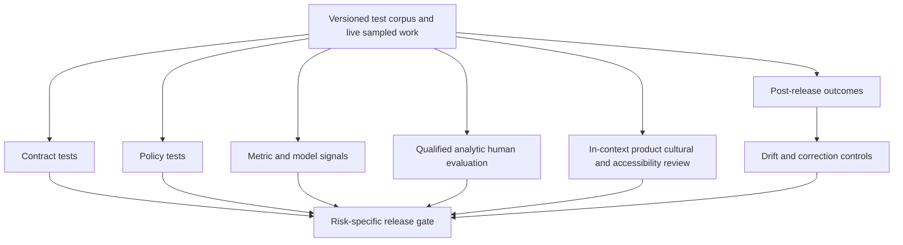

# Quality, Evaluation, Observability, and Release Gates

## 1. Quality is a system property

Judge the delivered localized experience, not only the target sentence. A release can fail through:

- incorrect meaning, omission, addition, terminology, grammar, tone, culture, or claim;
- broken placeholders, message syntax, markup, bidi, encoding, or plural branches;
- stale source, wrong key, wrong locale, silent fallback, or incomplete parity;
- clipped UI, broken navigation, mismatched screenshot/alt text, or inaccessible name;
- wrong repository/CMS/TMS state despite a fluent candidate; or
- unacceptable latency, capacity, cost, privacy, rights, or correction behavior.

## 2. Evaluation architecture



Each evidence class answers a different question. Do not replace one with another merely because it is cheaper.

## 3. Build the evaluation corpus

### 3.1 Sampling dimensions

Represent:

- every target language, script, locale/market, and fallback path;
- content type, domain, product, channel, and risk tier;
- short/long text, headings, lists, tables, links, markup, and mixed-language content;
- placeholders, plurals/selects, gender/case, numbers, dates, currencies, units, names, negation, and ambiguity;
- source defects and late changes;
- exact/context/fuzzy/no-TM cases;
- mandated, inflected, prohibited, conflicting, and expired terms;
- layout expansion, tall glyphs, bidi, grapheme clusters, screen-reader content, and language metadata;
- provider timeouts, quota, malformed/truncated output, async jobs, webhook loss, and ambiguous writes;
- PII, rights restrictions, injection, poisoned memory, cross-tenant attempts, and policy conflicts; and
- rollback, deletion, correction, resume, and disaster-recovery cases.

### 3.2 Corpus partitions

| Partition | Use | Contamination rule |
|---|---|---|
| Development fixtures | Parser, validator, prompt, and workflow iteration | May be visible to developers/models |
| Regression suite | Known historical failures and invariant cases | May guide fixes; version changes tracked |
| Qualification holdout | Provider/bundle promotion and threshold calibration | Excluded from retrieval, prompt examples, tuning, and failure-mining admission |
| Live audit sample | Detect production drift and reviewer/provider effects | Selected independently; protected from operational gaming |
| Adversarial/security | Injection, poisoning, isolation, malformed formats/effects | Isolated; no harmful payload leakage to production knowledge |

Use rights-approved or synthetic/de-identified content. A production correction does not enter a corpus automatically.

## 4. Deterministic contract tests

These are hard gates when applicable:

- source release/revision and segment identities match;
- native source and target parse under certified profiles;
- protected arguments/tokens/inline-code relationships match policy;
- all required plural/select variants exist and render;
- encoding, Unicode normalization, prohibited controls, escaping, and markup pass;
- required/prohibited exact terms and fixed claims pass;
- URLs, anchors, references, image/alt pairs, and resource keys remain valid;
- output contains no undeclared resource/file/schema changes;
- requested and rendered locales match allowed fallback policy;
- approved, staged, committed, and read-back digests agree; and
- task/source/approval remain current at effect and release time.

Deterministic pass means structurally eligible for review/release—not linguistically correct.

## 5. Human analytic evaluation

### 5.1 Tailor the taxonomy

MQM’s useful top-level dimensions are:

- terminology;
- accuracy;
- linguistic conventions;
- style;
- locale conventions;
- audience appropriateness; and
- design/markup.

Use a smaller subcategory set with examples for the content type. Add workflow-specific categories such as source defect, accessibility, stale reference, claim deviation, and wrong locale when those decisions need ownership.

### 5.2 Severity

Define severity by impact, not annoyance:

| Severity | Example effect | Default response |
|---|---|---|
| Critical | Reverses safety/legal meaning, wrong price/claim, severe cultural harm, blocks essential action, exposes wrong locale/private data | Block/stop release; incident if escaped; complete affected-scope review |
| Major | Material meaning/terminology/function error, missing instruction, broken accessible name, unusable/clipped interface | Changes required; investigate systemic pattern |
| Minor | Local nonmaterial grammar/style/locale issue that does not mislead or block | Correct according to release policy; trend |
| Neutral/preference | Valid alternative with no policy/meaning impact | Do not penalize; may record reviewer preference narrowly |

Publish locale/content-specific examples. Do not use sentence length or edit distance as severity.

### 5.3 Scoring and sampling

If using weighted error rates:

- define weights and normalization unit (words, segments, messages) before evaluation;
- handle repeated/systemic errors consistently;
- report confidence intervals/sample size;
- slice results by locale/domain/content/risk/bundle;
- adjudicate disagreements and report them;
- keep zero-tolerance critical invariants separate from an aggregate score; and
- recalibrate when taxonomy, reviewer population, content mix, or workflow changes.

ISO 5060:2024 is the current official reference for human analytic evaluation scope, but conformity requires the licensed text. MQM is a practical configurable taxonomy, not a W3C Recommendation or universal certification.

## 6. Automated metrics and model judges

### 6.1 Appropriate use

Use automated signals to:

- compare behavior bundles on a representative corpus;
- rank candidates or prioritize human sampling;
- detect large regressions/drift;
- find omissions, untranslated spans, term divergence, or unusual length;
- estimate where review capacity is most valuable; and
- supplement—not replace—analytic/in-context evidence.

### 6.2 Inappropriate use

Do not:

- approve a segment because its reference score exceeds a threshold;
- compare scores across languages/domains without calibration;
- treat reference wording as the only valid translation;
- accept round-trip agreement as semantic proof;
- let the same unqualified model generate and approve;
- hide poor locale slices behind a global average; or
- optimize a live workflow on the protected promotion holdout.

WMT/ACES work shows metric weaknesses on omissions, hallucinations, and untranslated content. Round-trip translation can be one useful feature in some settings, but not ground truth.

### 6.3 Judge-model controls

If a model judge adds measured value:

- pin model/prompt/schema and separate it from the generator where practical;
- supply source, target, locale, criteria, and relevant context without candidate-provider confidence;
- require structured issue spans/category/severity/rationale;
- validate against calibrated human judgments by locale/domain;
- measure false negatives for critical phenomena;
- prohibit effect/approval authority; and
- include judge version in the behavior/evaluation record.

A judge is a noisy sensor.

## 7. In-context evaluation

### 7.1 Software UI

Test real builds/screens for:

- every message branch and representative variable value;
- expansion, wrapping, truncation, overlap, and responsive reflow;
- LTR/RTL mirroring and embedded numbers/code;
- navigation, shortcuts, label/action consistency, and referenced UI terms;
- missing/untranslated strings and runtime fallback;
- screen-reader name/description/language/order/pronunciation;
- dynamic text/zoom and contrast where localized assets change; and
- target-locale date/number/currency/unit/input behavior.

Pseudolocalization runs earlier and continuously; it does not replace real locale testing.

### 7.2 Help/documentation

Render the complete target and verify headings, lists, tables, code, links/anchors, cross-references, UI labels, screenshots, alt text, captions/transcripts, search/index metadata, navigation, page/part language, and responsive/print/PDF output.

### 7.3 Marketing

Review the assembled channel artifact: headline, body, image/video/audio, captions, CTA, product name, fixed claim, disclaimer, landing page, character/timing limits, cultural associations, accessibility, and audience/brand fit. Validate any outcome experiment with safety/claim guardrails and locale-specific statistical design.

## 8. Accessibility release gate

WCAG 2.2-relevant localization checks include:

- correct page/document language and language of parts;
- localized text alternatives, captions, transcripts, labels, instructions, errors, and status messages;
- visible label contained in/consistent with accessible name;
- programmatic name/role/value after localization;
- meaningful reading/focus order in bidi layouts;
- reflow at required viewport/zoom and dynamic text;
- no clipping of tall glyphs/diacritics;
- culturally valid examples and understandable wording; and
- no false “authorized translation” label.

Record assistive technology, platform/browser/app version, locale, build, fixture, reviewer, and result. Accessibility sign-off is on the localized experience and can become stale after layout/content changes.

Sources: <https://www.w3.org/TR/WCAG22/>, <https://www.w3.org/WAI/WCAG22/Understanding/language-of-parts>, and <https://www.w3.org/WAI/standards-guidelines/wcag/translations/>.

## 9. Release gate model

### 9.1 Gate contract

```yaml
release_gate_id: release-storefront-2026-09
source_release_id: sr_storefront_2026_09_rc3
required_locale_profiles:
  - lp_storefront_de_de_android_v7
  - lp_storefront_fr_fr_android_v5
  - lp_storefront_ar_sa_android_v4
per_locale_requirements:
  source_fresh: true
  protected_integrity: pass
  native_build_render: pass
  linguistic_review: approved
  in_context_review: approved
  accessibility_review: risk_based
  artifact_effect: verified
  fallback_for_required_content: prohibited
global_requirements:
  no_unknown_effects: true
  critical_incidents_open: false
  bundle_status: promoted
  correction_and_rollback_ready: true
waivers:
  allowed: true
  require: [locale, scope, risk, reason, owner, expiry, customer_behavior, compensating_controls]
```

### 9.2 Parity states

| State | Meaning |
|---|---|
| Not requested | Locale is outside this release; not a failure |
| Requested | Work exists but no approved artifact |
| Approved | Exact target approved for current source |
| Staged | Exact target in destination staging |
| Verified | Readback matches approved artifact |
| Release-ready | All locale-specific gates pass |
| Waived | Named owner accepted defined gap until expiry |
| Fallback-served | Runtime supplied another locale; never equivalent to localized completion |
| Stale/obsolete | Source/dependency changed after work |
| Correcting | Released target is under controlled correction |

The release dashboard displays every required locale and actual runtime behavior. “95% strings translated” is not enough.

## 10. SLOs and error budgets

Set targets by risk/content/locale. Illustrative classes:

| Objective | Indicator | Gate/alert principle |
|---|---|---|
| Source integrity | Releases with target tied to current source digest | Stale-source publication is zero-tolerance |
| Structural integrity | Protected-token/AST validations passed | 100% for released supported messages |
| Locale integrity | Wrong-locale/fallback exposure in required content | Zero-tolerance wrong-locale; fallback explicit |
| Effect integrity | Age/count of `unknown`; approved/staged/readback digest equality | Block conflicting writes/release; page on age threshold |
| Quality | Critical/major error escape and correction by locale/risk | Zero critical in sampled high-risk work; tailored major budget |
| Parity | Required locale profiles release-ready or valid waiver | Exact release set, not portfolio average |
| Review service | Queue age/time-to-review by locale/risk | Protect critical deadlines; no low-volume starvation |
| Correction | Detection-to-correction/republish by severity | Highest severity fastest; verify every destination/cache |
| Provider service | latency, failure, quota, retry amplification by adapter/region | Backpressure/circuit break before queue collapse |
| Cost | cost per approved/released unit and rework cost | Budget by tenant/locale/content; investigate retry/rejection waste |

Do not publish universal numeric thresholds from this guide. Baseline the organization, set risk-based objectives, and validate that reviewer/provider capacity can meet them.

## 11. Observability model

### 11.1 Correlation dimensions

Every trace/event/metric can correlate:

- tenant/project;
- source release/asset/segment/task/run;
- target locale profile/market/product/channel;
- content type/risk;
- behavior bundle/provider/adapter;
- review/approval/artifact/effect; and
- destination/release.

Use IDs/digests and classifications; exclude raw source/target by default.

### 11.2 Trace spans

```text
localization.run
├── source.resolve
├── asset.parse
├── context.compile
│   ├── terminology.retrieve
│   └── tm.retrieve
├── candidate.generate
├── candidate.validate
├── review.wait
├── artifact.stage
├── effect.dispatch
└── effect.reconcile
```

Record status, version, counts/sizes, latency, provider request ID, usage/cost, retry, validation issue codes, reviewer role (pseudonymous where appropriate), and effect outcome. Never attach prompt/completion or screenshot content by default.

OpenTelemetry semantic conventions are useful, but dedicated GenAI conventions were still marked Development in the researched version. Pin an internal schema/mapping and migrate deliberately rather than letting experimental names become permanent storage.

### 11.3 Metrics

At minimum:

- intake/throughput/queue age/completion by locale and risk;
- source churn, obsolete work, and late-change rework;
- TM leverage by eligibility/match band and later correction;
- provider/model latency, errors, token/character/page use, quota, and cost;
- validator failures by type/format/bundle;
- review time, rework rounds, error categories/severity, disagreement, and capacity;
- term conflicts/compliance and memory quarantine;
- effect state/age/retry/reconciliation and webhook gaps;
- parity, fallback, stale, waiver, and correction states;
- accessibility/render defects; and
- security/privacy/rights denials and deletion completion.

High-cardinality IDs belong in traces/logs, not unbounded metric labels.

### 11.4 Audit versus observability

| System | Purpose | Character |
|---|---|---|
| Trace | Diagnose one workflow path/latency | Sampled, correlated, content-minimized |
| Metric | Detect population trends/SLOs | Aggregated, bounded labels |
| Operational log/event | Explain state/system events | Structured, retained to operational need |
| Audit trail | Prove who/what/why for governed actions | Immutable/tamper-evident, access-controlled, complete for required actions |

Do not assume sampled traces satisfy audit obligations.

## 12. Drift detection

Detect:

- provider/model/version behavior changes;
- glossary/TM/style/locale/CLDR/runtime changes;
- source content-mix shifts;
- reviewer composition, disagreement, or correction shifts;
- locale-specific quality/latency/cost changes;
- TM match-band correction increase;
- term/claim violations;
- provider fallback usage;
- silent fallback/wrong-locale behavior;
- input/Unicode/format anomaly changes; and
- memory/retrieval distribution changes.

Use control charts or change-detection suited to volume, with minimum sample requirements. Small locales need qualitative scheduled audit and longer windows, not absence of monitoring.

## 13. Evaluation checklist

- [ ] Corpus covers every locale/script/content/risk and native construct.
- [ ] Rights-approved partitions separate development, regression, holdout, live audit, and adversarial cases.
- [ ] Deterministic invariants are hard gates.
- [ ] Human taxonomy/severity/examples are tailored and calibrated.
- [ ] Automated metrics/judges are sensors, not approval authority.
- [ ] UI, document, marketing, runtime fallback, and accessibility are tested in context.
- [ ] Release gate enumerates exact required locale profiles and waivers.
- [ ] SLOs include integrity, quality, operations, governance, capacity, and cost.
- [ ] Telemetry is content-minimized and locale-sliced.
- [ ] Drift and post-release corrections feed controlled stop/rollback decisions.

## 14. Sources and foundations

- [Evaluation-driven development](../../evaluation/evaluation-driven-development.md)
- [Observability and tracing](../../evaluation/observability-and-tracing.md)
- MQM typology: <https://www.themqm.org/mqm-pillars/typology/>
- ISO 5060:2024: <https://www.iso.org/standard/80701.html>
- WMT 2024 and ACES: <https://aclanthology.org/events/wmt-2024/> and <https://direct.mit.edu/coli/article/51/1/73/124465/Machine-Translation-Meta-Evaluation-through>
- Round-trip translation study: <https://aclanthology.org/2023.findings-acl.22/>
- OpenTelemetry semantic conventions: <https://opentelemetry.io/docs/specs/semconv/>
- [Research packet](../../research/packets/localization-transcreation-agent-blueprint.md)

