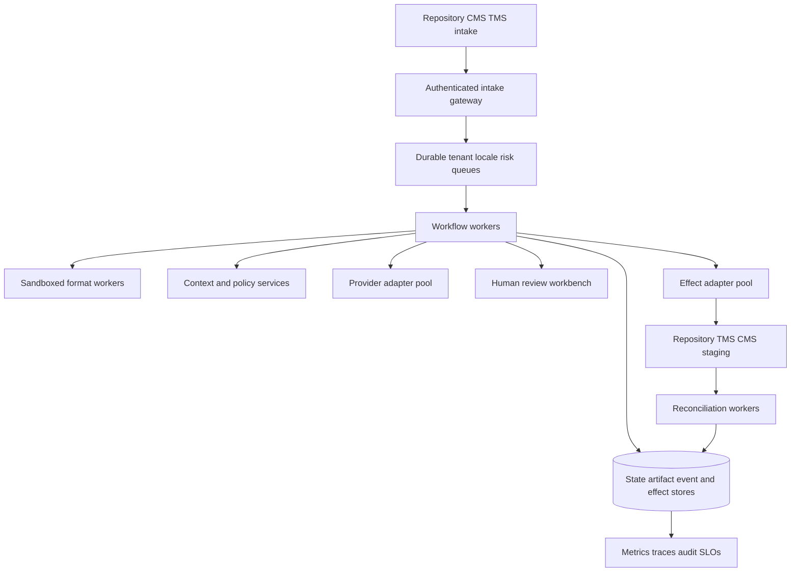

# Deployment, Scaling, Reliability, and Incidents

## 1. Deploy a workflow system, not a model endpoint

A production topology includes:



Separate worker pools by risk and capability. A malformed document parser should not starve effect reconciliation; a slow provider should not consume all human-review orchestration capacity.

## 2. Deployment units

| Unit | Scaling key | Isolation/failure concern |
|---|---|---|
| Intake gateway | Requests/webhooks/tenant | Authentication, replay, body limits, source rate |
| Format workers | Format/size/runtime | Parser exploits, CPU/memory bombs, toolchain version |
| Workflow workers | Active tasks/events | Determinism, state-store load, timers |
| Context/retrieval | Tenant/locale/domain/index | Cross-tenant leakage, stale indexes, hot terms/TM |
| Provider adapters | Provider/region/language pair | Quota, latency, price, data region, capability drift |
| Review workbench | Concurrent reviewers/media | Identity, privacy, assignment, download/render risk |
| Effect adapters | Destination/environment/action | Credentials, concurrency, ambiguous writes |
| Reconciliation | Destination/effect age | Eventual consistency, rate limits, backlog priority |
| Artifact/state stores | Tenant/region/retention | Integrity, durability, encryption, RPO, deletion |
| Telemetry/audit | Volume/retention/access | Content leakage, high cardinality, evidence loss |

Keep the provider adapter and effect adapter separate even when one vendor supplies both generation and TMS. Their data, authority, retry, and credential models differ.

## 3. Queue and scheduling design

### 3.1 Queue dimensions

Tasks need schedulable attributes:

- tenant/project;
- source release and deadline;
- target language/locale/market;
- content type/domain/risk;
- format/toolchain;
- data region/classification/provider eligibility;
- human qualification requirements;
- estimated characters/tokens/pages/segments;
- dependency/approval state; and
- correction/incident/release-blocking priority.

Avoid a separate physical queue for every combination unless scale justifies it. A durable task table plus priority/lease indexes and a small number of isolation queues is often simpler. Physically isolate high-risk/regulated/offline work and effect reconciliation.

### 3.2 Fair scheduling

Global FIFO favors high-volume locales and noisy tenants. Use weighted fair scheduling with:

- per-tenant concurrency/cost limits;
- reserved or guaranteed capacity for low-volume locales;
- priority for critical corrections and release blockers;
- aging so ordinary work eventually advances;
- risk-aware reviewer assignment;
- provider quota/region constraints; and
- explicit override/audit for emergencies.

Measure wait time and completion by locale and tenant. “System p95” can conceal a locale that waits days.

### 3.3 Backpressure

Apply at admission, not after every downstream system is saturated:

- reject/defer an unbounded bulk release without a capacity plan;
- cap active tasks per tenant/release/locale/provider;
- stop generation when reviewer backlog exceeds the sustainable horizon;
- stop dispatch when reconciliation backlog or destination errors exceed threshold;
- rate-limit source churn that repeatedly obsoletes work;
- reserve effect/reconciliation resources during provider or TMS incidents; and
- expose estimated completion/blocked state to owners.

Generating drafts faster than people can review them increases staleness, anchoring, storage, and cost.

## 4. Capacity planning

### 4.1 Demand model

Estimate per release and steady state:

```text
review_hours =
  sum_by_locale_content_risk(
    new_units * new_review_time
    + leveraged_units * leveraged_review_time
    + expected_rework_units * rework_time
    + in_context_screens_or_pages * context_review_time
    + calibration_and_incident_reserve
  )
```

Also model:

- source extraction/build time;
- provider characters/tokens/pages per target and concurrency/quota;
- context/retrieval and artifact storage;
- effect/write/readback calls;
- source-churn obsolescence;
- holidays/time zones and reviewer attrition;
- specialist review bottlenecks; and
- recovery catch-up after downtime.

Translation volume multiplied by target locales is not the whole load. One source change can fan out across locales, screenshots, help references, claims, and approvals.

### 4.2 Human capacity is a hard dependency

Maintain:

- qualified primary and backup reviewers by locale/domain/risk;
- calibration and onboarding lead time;
- sustainable daily throughput and batch-size limits;
- availability calendar and response deadlines;
- conflict-of-interest and access status;
- emergency correction coverage; and
- vendor exit/transition plans.

Do not declare a locale supported because an MT provider lists it. Production support includes qualified review, incident correction, and release capacity.

## 5. Cell architecture and regional deployment

At sufficient scale, use cells containing workflow workers, queues, context/retrieval partitions, provider/effect adapters, and local telemetry routing for a bounded tenant/region set.

### 5.1 Cell partition options

| Partition | Strength | Risk |
|---|---|---|
| Tenant | Strong isolation and blast-radius control | Uneven utilization; more operational units |
| Data region | Residency/latency alignment | Cross-region release coordination and provider variance |
| Product/domain | Cache/term/reviewer locality | Tenant/data boundaries can become complex |
| Risk class | Strong control separation | Duplicate infrastructure; tasks may change risk |
| Language group | Reviewer/provider/tool locality | A language group is not a legal/data region; cross-tenant leakage risk |

Usually start with environment + data region, then dedicate high-risk/large tenants. Keep global control metadata minimal and avoid moving raw content across cells.

### 5.2 Cell invariants

- a task has one authoritative home cell at a time;
- effects execute only from the home/leased cell;
- artifact and state replication preserve tenant/region policy;
- failover fencing prevents dual dispatch;
- behavior bundles are signed and identically identifiable across cells;
- global parity reads cell evidence without rewriting task state; and
- migration drains/reconciles in-flight effects before changing ownership.

## 6. Offline and air-gapped operation

Some regulated, unreleased, or sovereign content cannot reach external providers.

An offline profile should include:

- locally mirrored and signed parser/runtime/container dependencies;
- approved local MT/LLM model or human-only path;
- offline termbase/TM snapshots with provenance and expiry;
- local identity/approval and immutable audit;
- controlled import/export media or gateway with malware/content/rights checks;
- no runtime dependency on public CDN, fonts, license server, model download, telemetry, or webhook;
- deterministic bundle manifest and checksum;
- delayed reconciliation protocol for permitted external delivery; and
- secure destruction/update process for snapshots and devices.

Do not copy production content to an unofficial workstation because the cloud provider is disallowed. The offline environment is a governed deployment, not an exception.

### 6.1 Disconnected handoff receipt

Export a signed work package with source release/digest, locale profile, native format/profile, protected AST, applicable terms/style/claims, rights/classification, review policy, allowed output schema, expiry, and package digest. Import returns candidate/artifact, provenance, validation, review, toolchain/bundle versions, timestamps, and a signed result manifest. Reject expired, wrong-source, wrong-locale, or modified packages.

## 7. High availability and disaster recovery

### 7.1 Recovery priorities

1. protect source, approved artifacts, approvals, audit, and effect ledger;
2. restore ability to determine whether external writes occurred;
3. stop new conflicting effects;
4. resume critical correction/release workflows;
5. restore ordinary review/generation; and
6. rebuild disposable caches/embeddings from authority.

Generation is easier to rerun than an approval or ambiguous publication effect. Prioritize accordingly.

### 7.2 RPO/RTO by store

| Store | Data-loss consequence | Typical objective principle |
|---|---|---|
| Task/event/effect ledger | Duplicate/wrong effects, lost work/ambiguity | Near-zero RPO for committed transitions; fastest RTO |
| Approvals/audit | Cannot prove authorization | Near-zero RPO; immutable replicated backup |
| Source/approved artifacts | Cannot reproduce/release/correct | Content-addressed durable replication |
| Domain knowledge | Wrong term/style/claims | Versioned backup; restore before generation |
| TM/episodic memory | Lost leverage/history | Rebuild where possible; never outrank state/effects |
| Cache/embeddings | Performance degradation | Rebuild from authority; validate tenant/version isolation |
| Telemetry | Reduced diagnosis/SLO evidence | Durable enough for policy; audit separate |

Set actual objectives from business/risk requirements.

### 7.3 Failover protocol

1. fence the old cell/worker leases and effect credentials;
2. restore/verify state-event-effect consistency;
3. mark all `dispatching` effects `unknown` if completion proof is absent;
4. reconcile external destinations before permitting new writes;
5. verify source/artifact/bundle object integrity;
6. refresh policy/provider/reviewer capability;
7. resume critical tasks with continuity receipts;
8. apply backpressure for catch-up load; and
9. compare parity and remote state after recovery.

Test catch-up capacity. Meeting a database RTO while reviewer queues take a week to recover is not service recovery.

## 8. Reliability patterns

### 8.1 Timeouts and deadlines

Every I/O has connect/read/total timeout and workflow deadline. The timeout must be below the activity lease and leave time for state recording. Human deadlines use reminders/escalation; they are not transport timeouts.

### 8.2 Circuit breakers

Trip by provider/region/operation when failures, quality anomalies, quota, or ambiguous effects exceed thresholds. Generation circuits can route to a qualified fallback/human queue. Effect circuits stop new writes but keep read/reconciliation available.

### 8.3 Bulkheads

Isolate:

- high-risk from routine content;
- generation from effects/reconciliation;
- parser formats with different resource risk;
- tenants/regions with data obligations;
- provider adapters/quotas;
- production publish from staging; and
- live operations from evaluation/backfill/reindex jobs.

### 8.4 Reconciliation and anti-entropy

Periodic jobs compare internal tasks/artifact/effect state with TMS, repository, CMS, and publication reality. Detect missing/extra/stale/wrong-locale/wrong-digest objects, disabled/missed webhooks, manual edits, approval drift, and publication mismatch. Anti-entropy is normal operation, not only incident response.

## 9. Release and rollback

### 9.1 Deployment of the agent system

- immutable signed images and behavior bundles;
- infrastructure/policy/schema migrations with compatibility tests;
- dev fixture → staging shadow → single-locale canary → bounded production cohort;
- no simultaneous workflow, model, termbase, validator, and adapter change in the same canary unless testing the full bundle intentionally;
- automated stop rules on integrity, critical quality, privacy/security, unknown effects, queue/cost, or parity regression;
- exact prior bundle retained and rollback rehearsed; and
- old workers able to finish or safely hand off tasks created under their schema/bundle.

### 9.2 Content correction versus rollback

After publication, deleting history or reverting to a stale source may be wrong. Choose:

- **artifact rollback:** restore prior approved target when its source/claim remains valid;
- **forward correction:** publish a new corrected artifact and preserve lineage;
- **locale disable/fallback:** only under explicit incident policy, with user impact understood;
- **publication hold:** prevent further releases while current content remains; or
- **source correction fan-out:** create new source release and re-run affected locales.

Read back every destination and invalidate caches/CDNs/search indexes as applicable.

## 10. Incident command pattern

Every incident runbook starts with:

1. classify severity and affected tenants/products/locales/releases;
2. freeze relevant bundles, effects, providers, imports, or locales;
3. preserve task/effect/audit/provider/remote evidence without copying unnecessary content;
4. determine source and external ground truth;
5. contain user/data/rights impact;
6. correct or roll back through approved artifacts/effects;
7. read back every destination and runtime locale;
8. notify owners/users/regulators/vendors according to policy;
9. monitor recurrence and queue/catch-up effects; and
10. add sanitized regression fixtures and systemic controls.

## 11. Runbooks

### 11.1 Wrong-locale publication or silent fallback

**Detect:** runtime telemetry/support report/parity reconciliation shows requested locale differs from served locale or a target contains another locale.

**Contain:** stop affected release/locale, disable cache/CDN artifact if safe, block new effects from the bundle/destination, preserve actual rendered evidence.

**Diagnose:** distinguish missing target, locale-code mapping, runtime fallback, CMS fallback, wrong path/key, stale cache, and target-language generation error.

**Correct:** publish verified target, or apply an explicitly approved temporary behavior; read back CMS/repository/CDN/runtime; enumerate all affected pages/screens/variants.

**Prevent:** requested-versus-actual locale telemetry, parity hard gate, pseudolocale/real-locale runtime tests, adapter mapping fixtures.

### 11.2 Stale source or late change

**Contain:** mark affected tasks/artifacts/approvals obsolete; hold release/effects.

**Diagnose:** compare source releases and dependency graph; identify translations, terms, UI references, screenshots, links, claims, and staged/committed artifacts.

**Correct:** create new tasks for affected units, re-review by risk, update parity, forward-correct published content.

**Prevent:** immutable source releases, change webhooks plus polling, task/effect source precondition, impact graph, freeze/change policy.

### 11.3 Token, markup, plural, or bidi corruption

**Contain:** block affected format/bundle/locale; remove/disable corrupt artifact if it breaks safety/function.

**Diagnose:** compare native AST/token ledgers, parser/runtime versions, provider tag handling, repair history, and renderer output.

**Correct:** regenerate from source through certified adapter or human-edit native structure; build/render every branch; verify artifact digest/readback.

**Prevent:** AST-based extraction/validation, one bounded repair, native runtime fixtures, pseudolocalization and RTL tests.

### 11.4 Terminology/TM poisoning

**Contain:** quarantine corpus/entries/bundles and stop retrieval; do not delete evidence first.

**Diagnose:** import/admission provenance, authorization, retrieval logs, affected concepts/locales/runs/artifacts, rights and tenant impact.

**Correct:** invalidate/correct entries, rebuild indexes, re-review/publish affected artifacts, rotate credentials if compromised.

**Prevent:** signed imports, eligibility before similarity, sampling/two-person high-impact approval, anomaly monitoring, scoped retrieval caps.

### 11.5 Provider outage, quality regression, or quota exhaustion

**Contain:** trip provider/region/language circuit; stop wasteful retry; preserve reviewer/effect capacity.

**Diagnose:** transport versus capability/quota versus quality drift; slice by locale/content/bundle.

**Correct:** backpressure, qualified fallback or human path, re-run affected drafts under new bundle, keep provenance visible.

**Prevent:** capability/price/quota monitoring, multiple qualified paths for critical locales, canary/shadow, capacity reserve.

### 11.6 Unknown external effect

**Contain:** keep `unknown`; block conflicting write/release; retain read capability.

**Diagnose:** operation key, intended digest, remote object identity, API request/delivery IDs, current remote revision/content, eventual consistency window.

**Correct:** mark `verified` if exact content exists; `proved_not_committed` only with evidence, then retry same intent/key; otherwise escalate and continue reconciliation.

**Prevent:** idempotency/optimistic concurrency, dispatch-before-call ledger, operation markers, readback, webhook + polling.

### 11.7 Privacy or confidential-content exposure

**Contain:** stop provider/connector/export, revoke credentials/access, quarantine data, preserve minimal evidence, invoke privacy/security incident plan.

**Diagnose:** source and every derived copy, recipients/regions, provider retention/training settings, logs/traces/caches/TM/evals/backups, rights/tenant impact.

**Correct:** provider/internal deletion and access revocation, index/cache rebuild, correction if exposed content was published, required notifications.

**Prevent:** classification gate, minimization/redaction, eligible-provider registry, content-free telemetry, DLP/egress tests, deletion drills.

## 12. Operational dashboards

### 12.1 Release view

Show source release, required locale profiles, current/stale/approved/staged/verified/release-ready/waived/fallback/correcting state, age, bundle, open critical issues, effect ambiguity, and responsible owner.

### 12.2 Capacity view

Show intake/queue age/throughput by tenant/locale/risk, reviewer capacity/utilization/calibration, provider quota/latency/cost, source churn/obsolescence, reconciliation backlog, and deadline risk.

### 12.3 Reliability/security view

Show unknown-effect age, webhook gaps, adapter errors/circuit state, wrong-locale/fallback, integrity failures, privacy/rights denials, cross-tenant/security events, memory quarantine, deletion completion, and incident/correction progress.

Avoid raw content on dashboards.

## 13. Production readiness checklist

- [ ] Worker pools isolate parser, generation, review, effects, and reconciliation failure.
- [ ] Scheduling prevents tenant and locale starvation.
- [ ] Backpressure is tied to human and destination capacity, not only compute.
- [ ] Provider, human, storage, effect, and recovery catch-up capacity are modeled.
- [ ] Cell/failover fencing prevents dual external effects.
- [ ] Offline paths are fully governed and reproducible.
- [ ] RPO/RTO prioritize state, approvals, artifacts, audit, and effects.
- [ ] Reconciliation/anti-entropy runs continuously.
- [ ] Agent-system rollout uses signed bundles, shadow/canary, stop rules, and rollback.
- [ ] All seven incident classes have owners, drills, evidence, and correction verification.

## 14. Repository foundations

- [Deployment, release, and incident response](../../operations/deployment-release-and-incident-response.md)
- [Durable execution](../../runtime/durable-execution.md)
- [Idempotency and side effects](../../reliability/idempotency-and-side-effects.md)
- [Research packet](../../research/packets/localization-transcreation-agent-blueprint.md)

