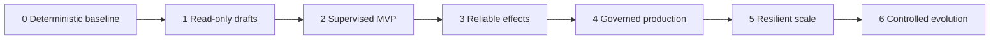
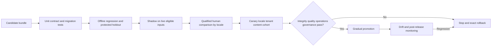
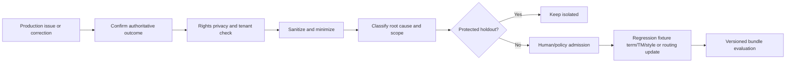

# Staged Delivery, Controlled Evolution, and Exercises

## 1. Promotion principle

Add autonomy only after the lower layer is observable, reversible, and proven. Promotion is per content type × source system × native format × target locale/market × risk tier × destination—not a one-time approval for “the localization agent.”



Every stage retains the controls from prior stages.

## 2. Stage 0 — Deterministic baseline

### 2.1 Objective

Make the current localization system explicit and safe without generative automation.

### 2.2 Build

- content/source/destination inventory and immutable source-release process;
- locale profiles separating language, market, jurisdiction, product, channel, and fallback;
- content/risk/rights/privacy classification;
- qualified human roles, capacity, and project specifications;
- certified native format parser/serializer profiles;
- stable segment/resource identity and dependency graph;
- termbase and TM import/eligibility/provenance baseline;
- deterministic protected-token, message, link, and build/render validation;
- pseudolocalization and real-locale smoke tests;
- staged human CAT/TMS/repository/CMS workflow; and
- baseline quality, latency, correction, parity, cost, and incident measurements.

### 2.3 Exit gates

- [ ] 100% of in-scope assets resolve to approved immutable source releases.
- [ ] Every target has an approved locale profile and named reviewers.
- [ ] Unchanged native-format fixture round trips pass for the supported profile; unsupported constructs fail explicitly.
- [ ] Protected-token and native message fixture tests detect every seeded corruption.
- [ ] Pseudolocalization exposes seeded untranslated/expansion/RTL defects.
- [ ] Source changes mark the intended dependency fixtures obsolete without invalidating proven-unrelated units.
- [ ] Rights/classification determine permitted reviewers/providers even though generation is not yet active.
- [ ] Human baseline has enough per-locale/domain samples to compare later stages.

Do not proceed if source owners, locale policy, format semantics, reviewer capacity, or baseline failure rates are unknown.

## 3. Stage 1 — Read-only candidate generation

### 3.1 Objective

Measure whether a constrained MT/LLM draft improves the human workflow without writing external systems.

### 3.2 Build

- immutable provider capability and behavior-bundle registry;
- context compiler with authorization/eligibility before retrieval;
- strict candidate output schema, no tools/effects, explicit storage mode;
- one candidate attempt and one syntax-only repair limit;
- deterministic validation and typed stop/escalation;
- development/regression/holdout/adversarial corpora;
- human analytic and in-context evaluation by locale/domain/content/risk;
- provider latency/quota/cost/data-path telemetry; and
- memory admission disabled or proposal-only.

### 3.3 Exit gates

- [ ] Every candidate has source, locale, context manifest, provider/model/prompt/schema, bundle, and output digest provenance.
- [ ] Malformed, truncated, injection-bearing, token-corrupt, wrong-locale, and policy-ineligible outputs fail closed.
- [ ] Candidate + one repair cannot loop or change the workflow plan.
- [ ] On protected holdout, the bundle meets predeclared per-locale quality/noninferiority and critical-error criteria against the Stage 0 baseline.
- [ ] Qualified reviewers confirm measured effort/latency benefit without unacceptable automation bias or correction increase.
- [ ] Costs and provider limits remain within a modeled budget at expected multi-target volume.
- [ ] Privacy/rights review confirms exact data region, retention/storage, and permitted content classes.

If generation adds no measured value, keep the deterministic/human design.

## 4. Stage 2 — Supervised single-path MVP

### 4.1 Objective

Run one low-risk content type, one source system/native format, and one target locale through staging with mandatory qualified review.

### 4.2 Suggested scope

Example: Android UI resources, `en-US → de-DE`, one product, R1 content only, staged pull request, no merge/publish.

Exclude legal/safety/payment disclosure, transcreation, arbitrary uploads, long-term learning, provider fallback, and production publish.

### 4.3 Build

- durable task/state/event contracts and optimistic concurrency;
- reviewer workbench with exact artifact/digest approvals;
- source-change obsolescence and impact graph;
- native build/render and in-context review;
- staged immutable artifact manifest;
- continuity receipt and resume audit;
- correction/rollback path; and
- pilot dashboard and on-call ownership.

### 4.4 Exit gates

- [ ] All pilot work follows the legal state machine; no manual state/database bypass.
- [ ] No stale-source, wrong-key/locale, protected-token/AST, or approval-digest escape occurs in the agreed pilot volume/time.
- [ ] Every segment is reviewed by a qualified person and every release artifact passes in-context checks.
- [ ] Reviewer corrections are categorized, attributable to source/TM/term/provider/context/workflow, and within the predeclared threshold.
- [ ] Pause/resume drills reload authority and reject a deliberately stale receipt.
- [ ] Source-change and artifact-mutation drills invalidate affected approval/work correctly.
- [ ] A correction/rollback drill restores a verified artifact without bypassing approval.
- [ ] Pilot latency, reviewer capacity, and cost meet objectives without hidden backlog.

## 5. Stage 3 — Reliable external effects

### 5.1 Objective

Add one certified repository, TMS, or CMS staging adapter with durable effect handling.

### 5.2 Build

- narrow typed tool and destination profile;
- least-privilege credential broker;
- deterministic operation key and effect ledger;
- optimistic concurrency/provider idempotency where available;
- webhook authentication/deduplication/queueing;
- readback/reconciliation and periodic anti-entropy;
- `unknown` effect blocking/escalation;
- correction/forward-fix path; and
- destination-specific capability/version/plan monitoring.

### 5.3 Exit gates

- [ ] Approved, staged, remote, and read-back digests match in every successful fixture/pilot effect.
- [ ] Duplicate dispatch converges on one intended remote result.
- [ ] Timeout after remote commit becomes `unknown`, then `verified` without duplicate write.
- [ ] Proven non-commit permits a bounded retry with the same operation key.
- [ ] Remote version conflict/manual edit fails without overwriting user content.
- [ ] Lost, replayed, invalidly signed, delayed, and out-of-order webhooks are handled; periodic reconciliation recovers state.
- [ ] Source/artifact/policy change between approval and dispatch blocks the effect.
- [ ] Credential/path/tenant/environment escape tests fail closed.
- [ ] Adapter rollback/correction and provider-plan drift drills pass.

Only after this stage consider production publication, and only under a separate explicit policy.

## 6. Stage 4 — Governed production

### 6.1 Objective

Operate multiple qualified workflows with complete governance, accessibility, observability, and incident response.

### 6.2 Build

- tenant/project isolation across every store/cache/index/queue/provider/reviewer/telemetry path;
- RBAC/ABAC, separation of duties, short-lived scoped credentials;
- data inventory, minimization, regions, provider contracts, retention, deletion/correction;
- rights ledger for translation/provider/reviewer/TM/evaluation/publication use;
- risk-specific human and specialist review policies;
- tailored MQM/ISO 5060-style analytic evaluation and live audit sampling;
- in-context and WCAG-related localized testing;
- locale-sliced SLOs, parity/waiver gate, trace/metrics/audit;
- security/privacy/rights/accessibility threat testing; and
- staffed incident/correction runbooks.

### 6.3 Exit gates

- [ ] Threat, privacy, rights, accessibility, and architecture reviews close all launch blockers.
- [ ] Cross-tenant and untrusted-content adversarial tests fail safely.
- [ ] Deletion/correction reaches source derivatives, provider path, caches, TM/memory, evals, telemetry, and backup policy with verification.
- [ ] Per-locale/risk quality and critical-error results meet predeclared gates; no global average masks a failed slice.
- [ ] Required locales are exact and fallback/waiver visible.
- [ ] Audit can reconstruct one release from source through approval, effect, readback, and correction without raw-content logging dependence.
- [ ] Wrong-locale, stale-source, token corruption, poisoning, provider, unknown-effect, and privacy incident drills pass.
- [ ] On-call, reviewer, specialist, and correction capacity covers the support commitment.

## 7. Stage 5 — Resilient scale

### 7.1 Objective

Scale tenants, locales, volume, regions, and recovery without starving low-volume work or weakening evidence.

### 7.2 Build

- fair tenant/locale/risk scheduling and priority aging;
- backpressure tied to human/provider/destination capacity;
- cell architecture and blast-radius controls;
- provider/region bulkheads and qualified fallbacks;
- reviewer capacity forecasting, backups, and calibration;
- offline/air-gapped profiles where required;
- replicated authoritative stores, fencing, backup/restore;
- tested RPO/RTO and recovery catch-up load;
- continuous reconciliation across destinations; and
- cost allocation/guardrails by locale/content/tenant.

### 7.3 Exit gates

- [ ] Peak and burst load meets SLOs without queue collapse or review-quality degradation.
- [ ] Low-volume/low-resource locales meet wait objectives under high-volume tenant load.
- [ ] Provider quota/outage triggers backpressure or a qualified path, not unreviewed output.
- [ ] Cell loss/failover produces no dual effects and reconciles every in-flight effect.
- [ ] Backup restore meets state/artifact/approval/effect RPO/RTO and integrity requirements.
- [ ] Catch-up workload, reviewer capacity, and destination rate limits recover within the service objective.
- [ ] Offline work packages reject expired/modified/wrong-source results and retain complete provenance.
- [ ] Cost/retry/rework amplification stays within budgets by locale and content type.

## 8. Stage 6 — Controlled evolution

### 8.1 Objective

Change prompts, models, MT engines, terminology, TM, locale data, format adapters, validators, and workflow policies without uncontrolled behavior drift.

### 8.2 Behavior bundle as release unit

A bundle includes:

- source-format adapter and segmentation rules;
- Unicode/CLDR/ICU/runtime versions;
- locale profile/fallback policy;
- termbase, TM snapshot/eligibility, style, claims, and product-fact bundles;
- provider adapter/region/model/engine and controls;
- prompt/output schema/safety policy;
- validators and thresholds;
- review/routing/retry/approval policy;
- effect adapter; and
- telemetry/evaluation schema mapping.

Changing any component creates a new bundle ID. Do not mutate a completed run’s bundle.

### 8.3 Promotion pipeline



### 8.4 Change-specific tests

| Change | Additional evidence |
|---|---|
| Model/MT engine | Locale/domain/phenomenon quality, truncation/tag behavior, cost/quota/latency, data governance |
| Prompt/schema | Parse/rejection, missing/extra fields, injection, repair behavior, token budget |
| Termbase/claims | Conflict/impact analysis, owner approval, affected artifact review |
| TM policy/snapshot | Eligibility/poisoning, match-band correction, rights/tenant leakage, holdout contamination |
| Unicode/CLDR/ICU/runtime | normalization, plural branches, formatting, locale fallback, bidi/render regression |
| Segmentation/format adapter | identity migration, TM leverage change, lossless round trip, old/new artifact diff |
| Validator/threshold | false-positive/negative calibration, critical escape, reviewer load |
| Review/routing policy | competence, independence, capacity, queue latency, approval invalidation |
| Effect adapter/API | capability/version/plan, timeout-after-commit, conflict, webhook, reconciliation, rollback |

### 8.5 Canary design

Canary by target locale profile, content type, risk, tenant, provider region, and destination—not random segments scattered across one release if that creates mixed behavior inside an artifact. Start with reversible R1 staged work. Keep high-risk and low-resource locales out until separately qualified; do not use them as experimental leftovers.

Automated stop rules include:

- any stale-source/wrong-locale/protected-token/artifact-digest escape;
- critical human error or material claim/cultural/accessibility incident;
- cross-tenant/privacy/rights violation;
- increased unknown effects or reconciliation failure;
- reviewer correction/disagreement/latency beyond budget;
- provider cost/quota/retry amplification; and
- per-locale quality regression beyond the predeclared budget.

### 8.6 Exact rollback

Rollback restores the prior signed behavior bundle and routes new tasks to it. For in-flight tasks:

1. stop candidate bundle admission;
2. let deterministic safe reads finish;
3. reconcile all external effects;
4. obsolete candidate outputs whose approval assumptions changed;
5. re-run affected tasks under the prior bundle as policy requires;
6. forward-correct already published artifacts; and
7. preserve both bundles/results for audit.

Rolling back application code without terminology/TM/prompt/model/locale/adapter versions is not an exact rollback.

## 9. Controlled failure mining

### 9.1 Admission pipeline



### 9.2 Root-cause destinations

| Root cause | Improve |
|---|---|
| Source ambiguity/concatenation | Source authoring/lint/content model |
| Parser/token/format loss | Deterministic adapter/validator fixture |
| Missing/wrong term | Termbase concept/governance/impact graph |
| Stale/poisoned TM | Eligibility, invalidation, import/admission controls |
| Insufficient context | Dependency graph/context compiler, not indiscriminate context growth |
| Provider quality | Provider/bundle routing, evaluation, fallback/human path |
| Human inconsistency | Guidelines/examples/calibration/workbench context |
| Wrong reviewer | Qualification/routing/capacity policy |
| Effect ambiguity | Idempotency/precondition/ledger/readback adapter |
| Wrong locale/fallback | Locale profile/mapping/parity/runtime test |
| Governance/data leak | Classification/rights/provider/telemetry/access control |

Do not turn every correction into a prompt example. Fix the lowest deterministic or authoritative layer that owns the root cause.

## 10. Exercises and drills

### 10.1 Design exercises

1. **Locale profile:** Define `pt-BR` consumer mobile UI and `pt-PT` legal help profiles. List every field that cannot safely be inherited.
2. **Format profile:** Certify an ICU plural/select message with nested markup; state supported runtime versions and seeded failures.
3. **TM eligibility:** Given five exact/fuzzy matches across tenants, products, markets, rights, and dates, decide eligible versus excluded before similarity.
4. **Transcreation brief:** Convert a slogan request into fixed claims, prohibited implications, cultural reviewers, channel constraints, and option evidence.
5. **Effect contract:** Design a CMS locale update under optimistic concurrency and show the timeout-after-commit path.
6. **Continuity:** Compact a 10,000-segment help release while one TMS upload is `unknown`; prove safe resume.

### 10.2 Fault-injection drills

| Drill | Expected proof |
|---|---|
| Provider drops one placeholder and adds an instruction | Deterministic rejection; no tool/effect; one bounded syntax repair or human route |
| Source changes after target approval | Approval/staged artifact becomes obsolete; impact graph scopes rework |
| Write commits then connection times out | Effect stays unknown; readback verifies; no duplicate |
| TMS webhook arrives twice/out of order, then is disabled | Dedupe/version checks; periodic reconciliation restores truth |
| CMS serves fallback locale | Requested/actual mismatch; parity remains incomplete; release blocks/waives |
| Poisoned TM import contains plausible bad brand term | Quarantine/anomaly/retrieval filters; impact trace; no cross-project spread |
| Reviewer account tries self-approval outside locale | Authorization denies and audits |
| Cross-tenant segment ID used in retrieval | Authorization fails before search/cache/provider call |
| Raw content appears in trace attribute | Telemetry policy/test blocks/redacts; incident scope determined |
| Region cell fails with effects dispatching | Fence, mark ambiguous, reconcile, resume without dual writes |
| New CLDR/runtime changes plural behavior | Bundle qualification catches required-branch/render difference |
| Memory deletion request arrives | Cascade/tombstone/index rebuild/provider evidence/backups schedule verified |

### 10.3 Worked capstone

Build a paper or staging implementation for this release:

- source: mobile checkout strings plus one linked help article and one campaign banner;
- source locale: `en-US`;
- targets: `de-DE`, `fr-CA`, and `ar-SA`;
- source changes one UI label after French review;
- German marketing requires a claim review;
- Arabic exposes bidi/layout defects;
- provider quota exhausts mid-run;
- repository write for one locale times out after commit; and
- a reviewer corrects a term that exists in imported TM.

Required outputs:

1. project specification, category boundary, and risk classification;
2. source release, typed segments, locale profiles, term/TM eligibility;
3. behavior bundle and provider capability choices;
4. workflow state/event/effect records;
5. late-change impact graph and parity states;
6. reviewer assignments/decisions and transcreation evidence;
7. validation, accessibility, and in-context results;
8. timeout reconciliation proof;
9. memory admission/quarantine decision for the correction; and
10. release/waiver/correction decision with complete audit lineage.

Passing means the system stops correctly as often as it advances.

## 11. Promotion review template

```yaml
promotion:
  scope:
    content_type: software_ui
    source_system: github
    format_profile: android-resources-v3
    target_locale_profile: lp_storefront_de_de_android_v7
    risk: R1
    destination: staged_pull_request
  from_stage: 2
  to_stage: 3
  candidate_bundle: bundle_2f4e...
evidence:
  contract_tests: artifact://eval/contract@sha256:...
  holdout_results: artifact://eval/holdout@sha256:...
  human_signoff: review://promotion/de-de-r1-2026-09
  security_privacy_rights: review://governance/2026-144
  effect_fault_drills: artifact://drills/github@sha256:...
  capacity_cost: artifact://capacity/de-de@sha256:...
stop_rules:
  integrity_escape: 0
  critical_error: 0
  unknown_effect_age: policy://effects/staging-v4
rollback:
  previous_bundle: bundle_91ba...
  exercised_at: 2026-08-28T10:00:00Z
decision:
  owner: null
  status: pending
```

The promotion owner signs evidence for a precise scope. Approval for `de-DE` Android R1 staging does not authorize Arabic, marketing, legal content, CMS publication, or a new provider.

## 12. Final production checklist

### Foundation

- [ ] Project specifications, boundaries, source authority, locale profiles, risk, rights, and reviewers exist.
- [ ] Native format extraction/round-trip/pseudolocalization and dependency impact are deterministic.

### Agent behavior

- [ ] Context is eligible, minimal, provenance-bearing, and conflict-aware.
- [ ] Provider/model/prompt/schema and attempt budgets are immutable and bounded.
- [ ] Models cannot mutate authority, approve, or perform effects.

### Human authority

- [ ] Translation/transcreation/post-editing and specialist roles are distinct.
- [ ] Qualifications, independence, capacity, exact artifact approvals, and calibration are enforced.

### Effects

- [ ] Typed tools, scoped credentials, operation keys, preconditions, effect ledger, `unknown`, readback, and reconciliation pass drills.

### Memory and continuity

- [ ] Memory classes, admission, rights/privacy/retention/correction/deletion/poisoning controls are explicit.
- [ ] Compaction receipts and resume audits preserve state, artifacts, approvals, bundles, and ambiguous effects.

### Quality and governance

- [ ] Per-locale deterministic, human, in-context, accessibility, outcome, SLO, parity, and waiver evidence passes.
- [ ] Tenant isolation, injection, supply chain, telemetry minimization, rights, and privacy controls pass.

### Operations and evolution

- [ ] Scheduling/backpressure/human capacity/cells/offline/HA/DR/recovery are tested.
- [ ] Incident correction and readback work for every major failure class.
- [ ] Bundle shadow/canary/stop/rollback/drift/failure-mining controls preserve holdouts and rights.

## 13. Repository foundations

- [Production agent control plane](../../architectures/production-agent-control-plane.md)
- [Evaluation-driven development](../../evaluation/evaluation-driven-development.md)
- [Deployment, release, and incident response](../../operations/deployment-release-and-incident-response.md)
- [Research packet](../../research/packets/localization-transcreation-agent-blueprint.md)

