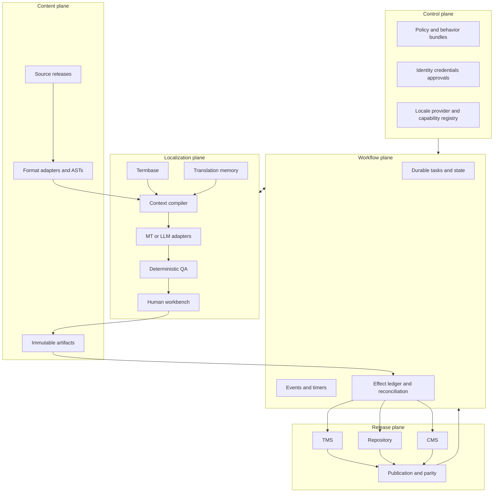

# Localization and Transcreation Operations Agent

**Status:** Production-oriented category playbook  
**Last researched:** 2026-08-31  
**Primary evidence packet:** [Localization and Transcreation Operations Agent Research Packet](../../research/packets/localization-transcreation-agent-blueprint.md)

## Mission

A localization and transcreation operations agent turns an immutable, approved source release into reviewed, release-ready localized artifacts while preserving meaning, native message syntax, terminology, rights, provenance, approvals, and external-system lineage.

It coordinates software strings, help content, and marketing assets across repositories, content-management systems (CMSs), translation-management systems (TMSs), terminology, translation memory (TM), machine translation (MT), large language models (LLMs), and qualified human reviewers. It does not own source truth, campaign strategy, legal advice, product behavior, or the decision to publish.

The core production invariant is:

> No localized artifact can advance unless its exact source revision, target locale policy, behavior bundle, validation evidence, human authority, and external effect are identifiable and reconcilable.

## When an agent is justified

Use this category when work requires several of these at once:

- multiple source systems, native resource formats, products, channels, or locales;
- deterministic parsing, protected-token handling, context assembly, and conditional routing;
- terminology and TM eligibility decisions with provenance;
- different review paths for UI, help, marketing, accessibility, legal, or regulated content;
- durable coordination across vendor APIs, webhooks, human queues, repositories, and CMS releases;
- late-source-change impact analysis and locale parity controls;
- externally auditable approvals, effect reconciliation, and correction history; or
- controlled provider/model evolution with per-locale quality evidence.

Prefer a CAT/TMS workflow plus qualified human translators when the job is stable, low-volume, and does not need cross-system planning. Do not add a generative agent merely to replace an existing deterministic extractor, formatter, or reviewer checklist.

## Category boundary

| This agent owns | It must not silently assume |
|---|---|
| Source-release intake, extraction, segmentation, token protection, context compilation, candidate generation/import, validation, review routing, staging, effect reconciliation, and localization parity | That source copy is true, lawful, accessible, culturally appropriate, or approved |
| Termbase/TM provenance, eligibility, versioning, correction, and poisoning controls | That a term hit or fuzzy match is correct for this meaning, market, or date |
| Localized artifact and evidence lineage | That a language tag determines market, jurisdiction, currency, tone, or release authority |
| Risk-based linguistic, cultural, technical, accessibility, and legal review orchestration | That an automated metric or model confidence can approve meaning or publication |
| Bounded repository/TMS/CMS effects after approval | That an HTTP success, timeout, or webhook alone proves the intended remote state |

Neighboring categories keep their own authority:

- editorial/content operations owns source content and editorial approval;
- marketing operations owns campaign objective, claims, audience, and outcome decisions;
- document intelligence owns source-document extraction when OCR/layout understanding is the primary problem;
- software delivery owns application behavior, builds, and the broader release train;
- legal/regulatory owners approve controlled legal or regulated meaning; and
- accessibility owners approve the localized user experience where policy requires specialist review.

## Smallest safe loop

```mermaid
flowchart LR
    A[Admit exact source release] --> B[Parse and protect deterministically]
    B --> C[Compile minimal eligible context]
    C --> D[Generate or import candidate]
    D --> E[Validate syntax terms and policy]
    E -->|machine-repairable once| D
    E -->|meaning or risk| F[Qualified human review]
    E -->|clean and low risk| F
    F --> G[Stage exact artifact]
    G --> H[Approve artifact digest]
    H --> I[Dispatch effect]
    I --> J[Read back and reconcile]
    J --> K[Release gate and monitor]
```

The default is one translation attempt and, only for a clearly machine-repairable deterministic defect, one repair attempt. Repeated invariant failures, unresolved ambiguity, source defects, terminology conflicts, legal/cultural judgment, or unknown external outcomes stop the loop and route to an owner. Recursive agent debate and automatic publish are not MVP features.

## Reference architecture

The model is inside the localization plane. It does not own durable state, credentials, approvals, or publication. Deterministic parsers and target runtimes—not prompts—define resource syntax.

## Guide map

| Guide | Outcome |
|---|---|
| [01 — Mission, boundaries, and maturity](01-mission-boundaries-and-maturity.md) | Decide what to automate, define risk/authority, and select the smallest viable maturity stage. |
| [02 — Reference architecture, identities, and contracts](02-reference-architecture-identities-and-contracts.md) | Establish stable IDs, schemas, states, events, artifact lineage, and invariants. |
| [03 — Source intake, segmentation, formats, and internationalization](03-source-intake-segmentation-formats-and-i18n.md) | Extract and round-trip native resources safely; handle locale, Unicode, plurals, bidi, and source changes. |
| [04 — Translation, transcreation, terminology, and human review](04-translation-transcreation-terminology-and-human-review.md) | Assemble evidence, govern TM/termbase use, adapt creative work, and route qualified people. |
| [05 — Tools, connectors, effects, and workflow](05-tools-connectors-effects-and-workflow.md) | Build provider/TMS/CMS/repository adapters with bounded retries and verified effects. |
| [06 — State, context, memory, planning, and continuity](06-state-context-memory-planning-and-continuity.md) | Keep authoritative state outside prompts, scope memory, compact without losing safety, and resume correctly. |
| [07 — Security, privacy, rights, and governance](07-security-privacy-rights-and-governance.md) | Separate untrusted content from effects, isolate tenants, minimize data, enforce rights, and govern approvals. |
| [08 — Quality, evaluation, observability, and release gates](08-quality-evaluation-observability-and-release-gates.md) | Combine deterministic, human, in-context, and outcome evidence with meaningful SLOs and parity gates. |
| [09 — Deployment, scaling, reliability, and incidents](09-deployment-scaling-reliability-and-incidents.md) | Operate queues, cells, human capacity, providers, offline modes, HA/DR, and incident correction. |
| [10 — Staged delivery, controlled evolution, and exercises](10-staged-delivery-controlled-evolution-and-exercises.md) | Progress from deterministic baseline to governed evolution with measurable exit gates and drills. |

## Recommended implementation order

1. Inventory content, formats, source owners, target locale/market policies, rights, and qualified reviewers.
2. Build deterministic extraction, format round trips, pseudolocalization, and source-release identity.
3. Define task, review, event, artifact, effect, and continuity contracts.
4. Operate the human workflow without generative automation and measure its failure modes.
5. Add read-only candidate generation behind strict validation and offline evaluation.
6. Pilot one low-risk content type, one source system, and one target locale with mandatory review.
7. Add one external write adapter with staged artifacts, approval by digest, and reconciliation.
8. Establish security, rights, audit, SLOs, incidents, accessibility, and recovery.
9. Scale only after per-locale quality, human capacity, provider quotas, and failure drills pass.
10. Evolve immutable behavior bundles through shadow, canary, drift detection, and exact rollback.

## Non-negotiable invariants

- Every target points to an immutable source revision and digest.
- Every run points to one immutable behavior bundle.
- Protected tokens, message structure, and required plural/select branches pass native-runtime validation.
- Requested locale, resolved runtime locale, market, and jurisdiction remain distinct.
- Older work becomes stale when its source or a relevant dependency changes.
- Machine and TM provenance is never erased.
- A reviewer approves an exact artifact digest, not a mutable task label.
- The committed digest must match the approved and staged digest.
- Ambiguous effects remain `unknown` until reconciled.
- Source strings, comments, TM, terminology, attachments, and provider output are untrusted data, never authority.
- Durable state and approvals live outside model context.
- Long-term learning is an explicit governed write.
- Silent locale fallback is not evidence of release completeness.
- Logs and traces exclude raw content by default.

## Definition of done

The category is production-ready only when the organization can prove, for every released localized artifact:

- who approved the source and target;
- which source, locale/market policy, format rules, terminology, TM, model/provider, prompt, and validators produced it;
- which automated and human checks passed;
- that the approved, staged, committed, and read-back artifact digests agree;
- how late source changes and corrections propagate;
- how personal/confidential/licensed content was handled and deleted;
- how an unknown effect, provider outage, wrong-locale release, token corruption, or poisoned memory is detected and corrected; and
- that quality, latency, cost, capacity, and accessibility remain acceptable for this locale and risk tier—not merely on average.

## Canonical repository foundations

This category specializes, rather than duplicates, the repository’s general production guidance:

- [Production agent control plane](../../architectures/production-agent-control-plane.md)
- [Agent state and event contracts](../../runtime/agent-state-and-event-contracts.md)
- [Durable execution](../../runtime/durable-execution.md)
- [Tool contracts](../../tools/tool-contracts.md)
- [Idempotency and side effects](../../reliability/idempotency-and-side-effects.md)
- [Context engineering](../../context-memory/context-engineering.md)
- [Memory architecture](../../context-memory/memory-architecture.md)
- [Prompt injection and untrusted data](../../security/prompt-injection-and-untrusted-data.md)
- [Permissions, sandboxing, and secrets](../../security/permissions-sandboxing-and-secrets.md)
- [Evaluation-driven development](../../evaluation/evaluation-driven-development.md)
- [Observability and tracing](../../evaluation/observability-and-tracing.md)
- [Deployment, release, and incident response](../../operations/deployment-release-and-incident-response.md)

