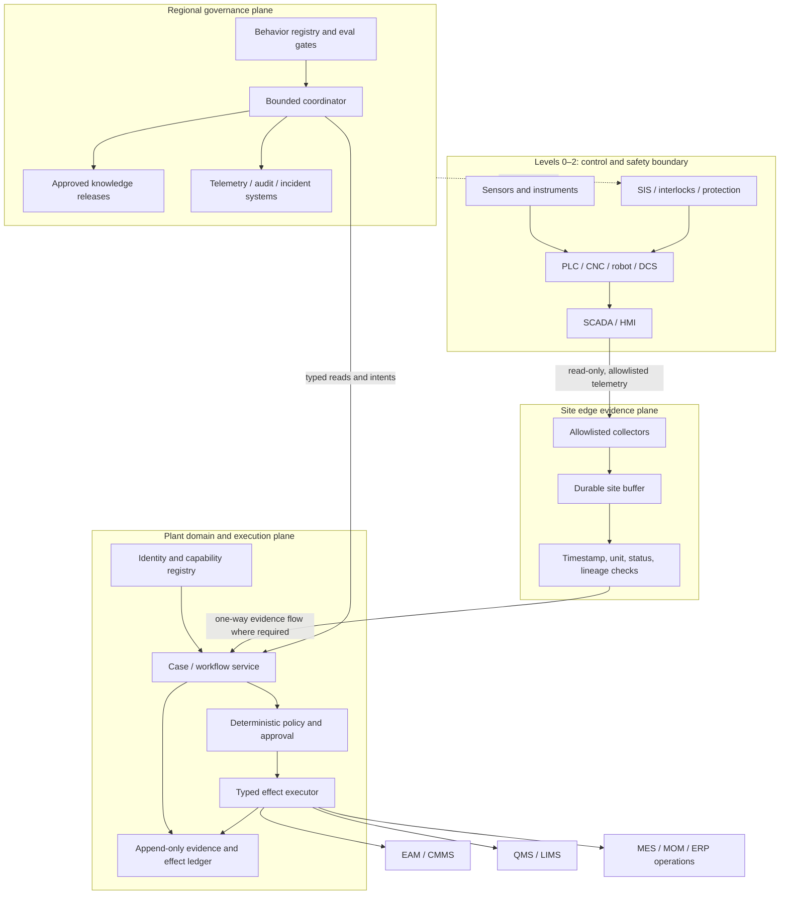
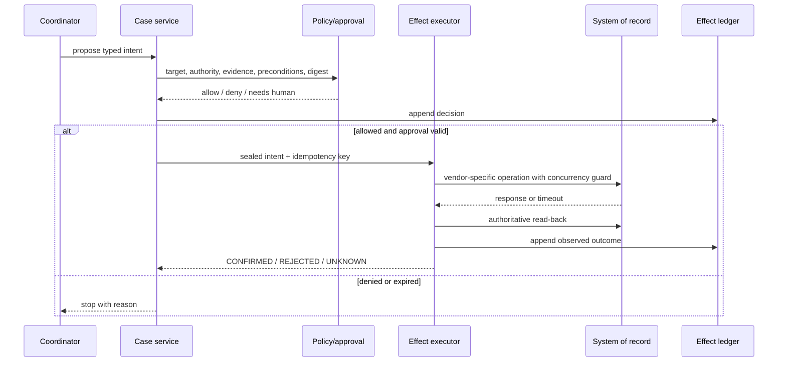

# Reference Architecture and OT Safety Boundaries

The safest useful design separates physical control, operational evidence, business effects, and model reasoning. The agent receives curated northbound evidence and can call only typed domain operations. It has no route, credential, protocol client, or generic execution capability that could reach a PLC, SIS, robot, CNC controller, drive, protection relay, or safety workstation.

## Use three planes and a hard control boundary



This aligns operational integration with ISA-95-style separation without assuming every plant implements identical levels. The local network architecture and zones/conduits must follow the site’s risk assessment and IEC 62443 program, not a generic diagram.

## Assign plane responsibilities

| Plane | Owns | Must not own |
|---|---|---|
| OT control and safety | deterministic sensing, control, sequencing, permissives, interlocks, alarms, protective action | model decisions or conversational approval |
| Edge evidence | protocol termination, allowlisting, buffering, source timestamps, status/quality, sequence tracking, unit normalization, local health | business approval, quality disposition, inferred “safe” state |
| Plant domain | canonical identities, cases, resource locks, workflow, policy, approval, adapter execution, effect/reconciliation ledger | control logic or undocumented cross-site identity |
| Regional governance | behavior release, approved knowledge, evaluation, fleet telemetry, incident coordination, policy distribution | bypassing a disconnected site’s local authority or replaying expired work |

Prefer keeping execution close to the system of record while central reasoning produces signed intents. This limits credentials crossing zones and permits a site to stop accepting effects during isolation.

## Constrain every crossing with a contract

An integration contract needs more than a JSON schema. Record:

```yaml
contract_id: plant-a.opcua.pump-evidence.v4
producer: edge-gateway-07
consumer: plant-domain-evidence-api
site_scope: plant-a
direction: read_only_northbound
identity_namespace: plant-a/area-2/rotating-equipment
schema_version: 4.1.0
protocol_profile: opc-ua-binary-qualified-profile-2026q2
source_time_required: true
server_time_required: true
status_required: true
sequence_policy: detect_and_mark_gaps
unit_policy: ucum_allowlist-v3
max_age_by_signal_class: freshness-policy-v7
delivery_semantics: at_least_once
deduplication_key: source_id+boot_id+sequence
retention: PT72H-edge
security_zone: ot-dmz-plant-a
fail_mode: stop_effect_eligibility
owner: plant-a-ot-integration
```

Also specify authentication, certificate trust, endpoint allowlists, rate limits, payload limits, compression, ordering, clock requirements, schema compatibility, maintenance windows, replay bounds, error mapping, observability, and decommissioning.

## Treat telemetry as evidence, not truth by arrival

An OPC UA, MQTT, Sparkplug, or MTConnect message can be duplicated, delayed, reordered, stale, or incomplete. OPC UA retransmission support is capability-dependent; transport QoS does not make a business effect exactly once. The edge should emit an evidence envelope:

```json
{
  "event_id": "01J...",
  "site_id": "plant-a",
  "source": {"kind": "opcua", "endpoint_id": "gw-07", "node_id": "ns=4;s=Pump7.Vibration"},
  "asset_ref": {"namespace": "plant-a", "id": "P-204", "component": "DE-bearing"},
  "observed_at": "2026-08-31T03:12:04.318Z",
  "ingested_at": "2026-08-31T03:12:05.107Z",
  "value": 7.3,
  "unit": "mm/s",
  "status": "UNCERTAIN_LAST_USABLE",
  "sequence": {"publisher": "gw-07", "boot_id": "b91...", "number": 88321, "gap_before": true},
  "calibration_ref": "CAL-ACC-778@2026-06-10",
  "lineage": ["raw:sha256:...", "normalize-mm-s:v2"],
  "schema": "condition-observation/2.2"
}
```

The domain service decides whether this envelope is eligible for a particular decision. The model receives the decision result and the relevant evidence, not permission to invent freshness rules.

## Eliminate hidden control paths

Block these capabilities from the agent runtime:

- generic OPC UA method calls or writes;
- unrestricted MQTT publish, shell, PowerShell, SSH, RDP, SQL, browser automation, or vendor engineering tools;
- controller program upload/download, recipe parameter changes, robot/CNC program edits, firmware actions, setpoint writes, force/bypass operations, and alarm inhibition;
- generic HTTP clients that can reach OT addresses;
- shared service accounts spanning sites, zones, or read/write roles;
- model-generated code execution against plant networks.

Use separate read collectors and business-effect executors. The collector credential must be technically incapable of writes. The executor should expose semantic operations such as `create_work_order_draft`, not `post_any_url` or `update_record`.

## Put deterministic policy outside reasoning



The approval binds the exact action digest, target identity, site, procedure/specification version, relevant preconditions, authority tier, approver role, and expiry. Editing the intent invalidates approval.

## Preserve nondelegable human ownership

Some responsibilities are not approval gates around an agent action; they are work the agent never owns.

| Responsibility | Accountable owner | Agent boundary |
|---|---|---|
| Safety interlocks, SIS, guarding, machine safety, control logic | qualified controls/functional-safety and operations roles | no route, credential, tool, acknowledgement, bypass, or change authority |
| Operating envelope, alarm limits, modes, recipes, setpoints | process/control engineering under site change control | read effective values when authorized; never select, expand, waive, or write them |
| Permit, LOTO, isolation verification, line clearance | authorized employees under the site energy-control/permit program | identify required handoff and display signed status; never perform, verify, or attest |
| Maintenance execution and as-found/as-left evidence | authorized technician and maintenance supervision | prepare package and correlate evidence; never claim work was performed or equipment is ready |
| Return to service and machine start | operations and designated engineering/safety roles | wait for authoritative human-controlled state; never issue permission or command |
| Product disposition, concession/deviation, usage decision, release, recall/reportability | accountable Quality/Regulatory roles | assemble evidence and draft options; never execute or sign the decision |

Approval cannot convert these responsibilities into agent authority. A human accepting a generated recommendation remains responsible for checking the actual plant, procedure, and current conditions through the controlled workflow.

## Treat alarms as protected operator workflow

The agent may read qualified alarm/event evidence, correlate it with maintenance history, group likely common causes, and prepare a handoff. It must not acknowledge, shelve, suppress, inhibit, reprioritize, change limits/deadbands, or clear an alarm. Those operations alter the operator's protection and awareness layer and belong to the plant's alarm-management lifecycle, authorized operators, and controlled engineering change.

Preserve original alarm identity, source and server times, activation/return/acknowledgement transitions, priority, shelving/inhibit status, configuration version, sequence gaps, and operator actions. During a flood, present uncertainty and source limitations; do not summarize away a standing critical alarm or treat acknowledgement as resolution. Use the site's current alarm philosophy and applicable [ISA-18.2 lifecycle guidance](https://www.isa.org/intech-home/2016/may-june/departments/isa18-alarm-management-standard-updated), with the exact current edition verified by the site.

## Keep safety workflows as handoffs

The agent may identify that a work package requires LOTO, a permit, guarding review, or safety plan. It may retrieve the approved procedure and route the task to the authorized role. It must never:

- decide that hazardous energy is fully controlled;
- instruct someone to skip a site procedure;
- apply or remove a lock or attest that another person did;
- infer a safe state from a telemetry value;
- clear a safety interlock, safety alarm, permit, or return-to-service gate;
- convert absence of evidence into evidence of safety.

Represent safety state only as a signed fact from its accountable system and actor, with expiry. Even then, it is a precondition for an authorized human workflow, not an agent-issued permission to act physically.

## Design site isolation deliberately

Each site needs:

- a unique tenant/site identifier carried in tokens, records, logs, queues, and cryptographic scope;
- separate credentials, certificate trust, secret rotation, adapter instances, and storage partitions;
- egress allowlists and no lateral site-to-site route through the agent platform;
- a local kill switch that disables effect acceptance without disabling evidence capture;
- signed policy and knowledge bundles with activation and expiry windows;
- an offline authority table defining which reads, drafts, and locally approved effects remain available;
- per-site resource quotas, backpressure, dead-letter quarantine, and recovery throttles.

A regional service must never “help” by substituting another site’s identity mapping, procedure, specification, calibration, or credentials.

## Model degradation as explicit states

| Condition | Evidence path | Reasoning path | Effect path |
|---|---|---|---|
| Regional model unavailable | continue local capture | deterministic views and human workflow | only independently approved, non-expired local operations |
| Site-to-region link down | buffer with bounded retention | optional local read-only retrieval if qualified | central-authority effects stop; drafts may queue with expiry |
| OT source degraded | mark gaps/status/freshness | show uncertainty and stop affected decisions | block effects whose preconditions depend on source |
| EAM/QMS unavailable | preserve intent; no blind retry | show authoritative state unavailable | `UNKNOWN` until reconciliation, not assumed failure |
| Policy service unavailable | continue evidence | allow explanation | fail closed for effects |
| Clock uncertainty beyond budget | capture clock diagnostics | do not order ambiguous evidence | block time-sensitive decisions |

Do not collapse all degradation into “service unavailable.” Each state has different evidence and action consequences.

## Make manual mode a first-class operating state

Every plant needs a documented, rehearsed path that works without model reasoning. The UI must state `NORMAL`, `READ_ONLY_DEGRADED`, `MANUAL_CONTROLLED`, or `EFFECTS_DISABLED`; hiding degradation behind slower responses invites unsafe workarounds.

In manual mode:

- operators, technicians, engineers, and Quality use the existing alarm, CMMS/EAM, QMS/LIMS, MES/MOM, permit, LOTO, and controlled-document procedures directly;
- the agent may continue bounded evidence capture if that does not interfere with OT, but it must not claim continuity for missing intervals;
- pending approvals and effects remain visible and fenced; switching modes neither cancels nor proves absence of an external effect;
- a named coordinator owns the handoff list, including open cases, active holds, unresolved identity, expiring approvals, due clocks, and every pending or unknown effect;
- restart requires external-state reconciliation and fresh authorization, not replay of a queue accumulated during manual work;
- return to assisted mode is an operations decision with a recorded time, reason, responsible person, and verification that manual actions have been ingested or conservatively marked missing.

The manual path must not depend on the same model provider, regional link, identity cache, or effect executor whose failure triggered it.

## Review the architecture with threat and hazard lenses

For every flow, ask:

1. Can untrusted plant content become an instruction to the model?
2. Can the model select a broader target or site than the user requested?
3. Can a retry duplicate a work order, hold, reservation request, or vendor case?
4. Can missing status, unit, calibration, or timestamp be treated as good data?
5. Can an approval survive a changed target or changed precondition?
6. Can a compromised regional service reach control networks or another plant?
7. Can a queued action execute after its evidence, approval, or maintenance window expires?
8. Can an operator distinguish recommendation, authoritative fact, inferred state, and confirmed effect?

Document controls and tests for every “yes.”

## Standards anchors

Use [ISA-95](https://www.isa.org/standards-and-publications/isa-standards/isa-95-standard) for enterprise/control integration concepts, [NIST SP 800-82 Rev. 3](https://csrc.nist.gov/pubs/sp/800/82/r3/final) for OT-specific security constraints, and the [ISA/IEC 62443 series](https://www.isa.org/standards-and-publications/isa-standards/isa-iec-62443-series-of-standards) for lifecycle and shared-responsibility security. These are inputs to the site architecture; none creates a universal topology or compliance claim.

## Read next

The architecture fails without disciplined object resolution. Continue with [Identity, state, events, evidence, and traceability](03-identity-state-events-evidence-and-traceability.md).
