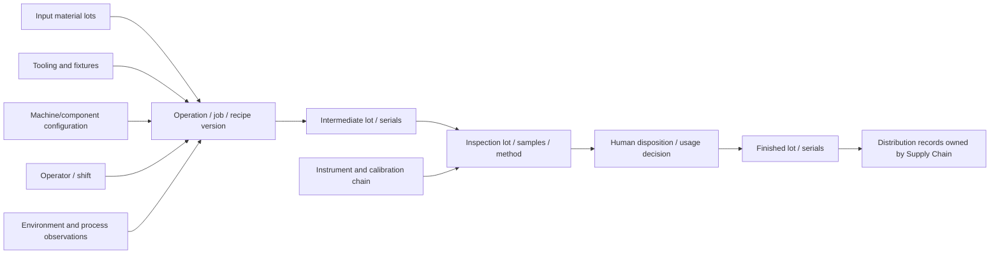

# Identity, State, Events, Evidence, and Traceability

False identity joins are among the most dangerous agent failures in a plant. A tag, serial, equipment number, functional location, material, lot, inspection lot, work order, and physical component are different identifiers with different owners and lifetimes. Resolve them explicitly and preserve effective time; never let the model join by name similarity.

## Build a federated identity graph

Do not replace system-of-record identifiers with one invented “global ID.” Create a stable internal object identifier and retain every source identifier with namespace, type, owner, validity, and confidence.

```sql
-- Conceptual schema; adapt to the repository's chosen data platform.
asset_object(
  object_id UUID PRIMARY KEY,
  site_id TEXT NOT NULL,
  object_class TEXT NOT NULL,
  reference_designation TEXT,
  lifecycle_state TEXT NOT NULL,
  valid_from TIMESTAMPTZ NOT NULL,
  valid_to TIMESTAMPTZ,
  version BIGINT NOT NULL
)

asset_alias(
  site_id TEXT NOT NULL,
  namespace TEXT NOT NULL,
  identifier TEXT NOT NULL,
  identifier_type TEXT NOT NULL,
  object_id UUID NOT NULL,
  authority TEXT NOT NULL,
  valid_from TIMESTAMPTZ NOT NULL,
  valid_to TIMESTAMPTZ,
  evidence_ref TEXT NOT NULL,
  UNIQUE(site_id, namespace, identifier, valid_from)
)

asset_relationship(
  parent_object_id UUID NOT NULL,
  child_object_id UUID NOT NULL,
  relationship_type TEXT NOT NULL,
  valid_from TIMESTAMPTZ NOT NULL,
  valid_to TIMESTAMPTZ,
  evidence_ref TEXT NOT NULL
)
```

Relevant identifier classes include:

- site, area, line, cell, functional location, and IEC 81346 reference designation;
- enterprise equipment, EAM asset, MES equipment, OPC UA machine/component, historian tag, controller address, and OEM identifier;
- manufacturer, model, serial, firmware, installed component, and rotating position;
- material/product, batch/lot, serial unit, handling unit, carrier, recipe, job, operation, inspection lot, and sample;
- work request/order/task, notification, permit/LOTO reference, deviation, nonconformance, CAPA, and recall case;
- instrument, measurement function, calibration event, reference standard, and uncertainty statement.

IEC 81346 supports unambiguous reference designation, but the 2026 manufacturing-specific part does not identify individual manufactured products. Use lot/serial/genealogy standards or authoritative product systems for those objects.

## Give every reference scope, version, and two times

An external identifier is never sufficient by itself. Resolve and persist this tuple:

```text
(enterprise_or_tenant, site, source_system, namespace, object_class, external_id,
 source_record_version, valid_from, valid_to, recorded_at, supersession_or_correction_ref)
```

`valid_from`/`valid_to` describe when the assertion was true in the plant or business domain. `recorded_at` describes when the platform learned it. Keep both: a backdated component correction recorded today must not appear to have been known to yesterday's decision. A current-state read without an as-of contract cannot reconstruct historical decisions.

Use immutable internal IDs for references, but never hide the source namespace or convert source versions into a false global revision. The identity service returns the source-of-authority, resolution rule, validity interval, transaction-time knowledge, mapping evidence, and expiry of the resolution token.

## Define object semantics before integration

| Object family | Identity and version contract | Effective-time rule and fail-closed case |
|---|---|---|
| Enterprise, site, area, line, cell | Stable organization/location IDs plus source namespace; hierarchy relationship has its own version | Relocation, renaming, split, merge, ownership, or timezone change appends a dated relationship. Never infer site from a reused line name. |
| Equipment, asset, component | Separate functional location, maintainable asset, equipment instance, and installed component/position; preserve OEM model/serial and source IDs | Installation/removal/refurbishment and tag/controller changes are dated events. Resolve the physical component at the observation time, not the one installed now. |
| Production order, batch, lot, serial | Separate production/order execution, batch-process execution, material lot, inspection lot, handling unit, and serialized unit; retain split/merge/transformation links | An order revision does not rename produced material. A batch is not automatically a material lot, and a lot is not an individual serial. Missing split/merge edges widen trace scope. |
| Sensor, signal, calibration | Separate physical sensor, channel/measurement function, semantic signal, controller/tag address, acquisition endpoint, and calibration event/certificate | Tag reuse and sensor replacement close old relationships. Calibration validity is evaluated at observation time; a current valid certificate cannot retroactively validate earlier data. |
| Work order and task | Immutable source work-order ID; task/operation IDs are children with independent state/version; semantic operation ID links creation intent | Description, plan, schedule, status, labor, parts, and actuals can change independently. A stale ETag/version blocks update, and completion does not prove return to service. |
| Permit and LOTO | Source-system record, equipment/energy scope, authorized persons, procedure, issue/expiry, signatures, and status transitions | Treat as short-lived signed human facts. A permit or lock transfer across shifts follows the site procedure; absence, expiry, ambiguity, or telemetry inference blocks agent-dependent continuation. |
| Procedure and version | Logical document ID plus immutable approved revision, applicability, approval, language, content hash, effective and withdrawal times | “Latest” is not a version. Resolve the revision applicable to the equipment/product and event or execution time; withdrawn content remains historical evidence only. |
| Inspection, measurement, specification | Separate inspection plan/lot/operation/sample/characteristic, measurement result/revision, method, specification/drawing, and deterministic decision-rule versions | Corrections supersede results without erasure. Specification and method must be applicable at production/inspection time; a later limit cannot silently revalue history. |
| Nonconformance, deviation, CAPA, change | Distinct case IDs and lifecycles; link correction, containment, causal hypothesis, corrective action, effectiveness plan, deviation/concession, and change record | A deviation approval has explicit scope and expiry. CAPA closure does not approve a change, and change implementation does not prove effectiveness. |
| Material and spare | Separate material master/revision, manufacturer part, approved alternate, stocked item, lot/serial, condition, bin, shelf-life, reservation, issue, and installation | Availability is a versioned observation. Reservation is not custody, issue is not installation, and a substitute requires the controlled engineering/quality decision effective for the job. |
| Person, qualification, shift | Workforce identity is separate from role, site assignment, qualification/certification, contractor employer, shift, and crew membership | Check qualification scope and validity at planned execution time and again at dispatch. Minimize personal data; a shift assignment or badge event does not prove competence or task performance. |
| Evidence | Immutable evidence ID, source record/version, content hash, observation/record times, classification, retention, and supersession/correction links | Corrections append; they never mutate the evidence used by a prior decision. Missing source bytes or an unverifiable hash makes reconstruction incomplete. |
| Approval | Unique approval event bound to actor, role, site, action digest, target resolution, governing versions, preconditions, issue/expiry, and one-use policy | Any material change invalidates it. Chat consent, an old signature, or role membership alone is not approval for a new effect. |
| Effect and correction | Separate intent ID, semantic operation ID, attempt IDs, vendor correlation, external business record/version, outcome, verification, and correction/recovery effect | A timeout is `UNKNOWN`. A correction is a new accountable event referencing the erroneous assertion/effect; it does not rewrite the original or reuse its approval. |

These are canonical distinctions, not a requirement to centralize all data. Each source remains authoritative for its own state; the graph records qualified references and conflicts.

## Require deterministic resolution

Resolution returns one of four results:

```json
{
  "query": {"site_id": "plant-a", "namespace": "eam-asset", "identifier": "P-204"},
  "as_of": "2026-08-31T03:12:00Z",
  "result": "RESOLVED",
  "object_id": "9509e320-...",
  "matched_alias_version": 17,
  "relationship_snapshot": "sha256:...",
  "evidence_refs": ["eam-asset-export:8821"],
  "expires_at": "2026-08-31T03:17:00Z"
}
```

- `RESOLVED`: exactly one valid authoritative match;
- `AMBIGUOUS`: multiple valid candidates or disputed lineage;
- `NOT_FOUND`: no valid mapping;
- `STALE`: a mapping existed but cannot support the requested as-of time.

Only `RESOLVED` can become an effect target. Fuzzy search may propose candidates for a human identity steward; it may not authorize a join.

Resolution tokens must be single-site, single-object-class, purpose-bound, short-lived, and cryptographically bound to the alias version and relationship snapshot. Re-resolve after pause, handoff, component change, restore, or source-version conflict. Never let a user-facing name or an LLM-produced ID replace the token in an effect request.

## Model lifecycle changes without rewriting history

Handle installation, removal, refurbishment, serialization, relabeling, asset split/merge, line relocation, controller replacement, and tag reuse as time-bounded relationships. Do not overwrite an alias when a bearing, motor, instrument, or controller is replaced. Historical events must resolve against the identity graph that was effective when they occurred.

For OPC UA Machinery identity, retain both component and machine context. A protocol-provided identifier may be unique only on one server at one time; qualify it with endpoint identity and validity before treating it as plant-wide or historical.

## Separate seven kinds of state

“Current state” is not a single value.

| State class | Example | Authority |
|---|---|---|
| Intended | maintenance order should be in progress | approved plan or workflow intent |
| Authoritative business | EAM reports `INPRG`; QMS reports lot on hold | named system of record at a version/ETag |
| Observed physical | vibration sample, valve feedback, counter | instrument/control source with quality and time |
| Inferred | probable bearing defect | versioned algorithm/model with uncertainty |
| Effect | create-order request accepted | adapter and external response/read-back |
| Workflow | waiting for quality approver | durable coordinator state |
| Diagnostic | adapter degraded, clock offset high | platform/edge health system |

Never use “latest value wins” to reconcile these classes. An EAM work-order status cannot prove that a machine is stopped; a telemetry value cannot prove an approved quality disposition; a model inference cannot replace either.

## Make domain events replayable and correctable

Every state transition or observation should use a stable event envelope:

```yaml
event_id: 01J...
event_type: maintenance.case_evidence_added
event_schema: maintenance.case-event/3.2
site_id: plant-a
aggregate: {type: maintenance_case, id: MC-2026-008812, expected_version: 18, new_version: 19}
occurred_at: 2026-08-31T03:12:04.318Z
recorded_at: 2026-08-31T03:12:05.107Z
source: {system: historian-gateway, record_id: ev-771, version: 4}
actor: {type: service, id: edge-normalizer-07}
correlation_id: WF-MC-2026-008812
causation_id: alarm-event-881
deduplication_key: plant-a:gateway-07:boot-b91:88321
payload_ref: evidence:sha256:...
correction_of: null
```

The aggregate version detects concurrent transitions; the deduplication key handles redelivery; causation/correlation preserve the trajectory. A correction appends a new event pointing to the earlier event and states whether prior decisions need re-evaluation. Consumers checkpoint a per-partition high-water mark and make projection rebuilds version-aware. Event arrival order alone is not domain order.

## Preserve event time and uncertainty

Every observation needs at least:

| Field | Purpose |
|---|---|
| `observed_at` | When the source says the phenomenon occurred. |
| `source_clock_id` and offset/uncertainty | Whether events can be ordered across sources. |
| `ingested_at` | When the platform received it. |
| `status` or quality code | Good, uncertain, bad, substituted, manual, or source-specific status. |
| `unit` and original representation | Safe comparison and reproducibility. |
| `sequence` plus boot/session identity | Duplicate and gap detection. |
| `calibration_ref` | Whether measurement traceability and interval were valid. |
| `transform_lineage` | Normalization, resampling, feature extraction, and algorithm versions. |
| `schema_version` | Replay and compatibility. |

Derive freshness at decision time from a versioned policy. Never persist a timeless boolean `is_fresh`.

```text
eligible = status in allowed_statuses
        AND decision_time - observed_at <= max_age(signal_class, operation)
        AND clock_uncertainty <= max_clock_uncertainty
        AND required_sequence_window_has_no_unresolved_gap
        AND calibration_valid_at(observed_at)
        AND unit_is_convertible_and_allowlisted
```

## Distinguish measurement traceability from data lineage

Metrological traceability is a property of a measurement result supported by a documented, unbroken calibration chain in which each calibration contributes uncertainty. It does not by itself prove the measurement is fit for a particular decision. Data lineage shows how a datum moved and changed. Record both.

For measurement-based decisions, store:

- measurand and measurement method;
- instrument and measurement-function identity;
- calibration certificate, interval, status at observation time, reference standards, and uncertainty;
- environmental or setup conditions that materially affect the result;
- original result and unit, rounding/significant-digit rules, and transformations;
- operator or automated acquisition identity and applicable procedure/specification versions;
- result revision, reason, approval, and immutable audit linkage.

The 2026 edition of [ISO 10012](https://www.iso.org/standard/10012) is a useful measurement-management reference; [NIST’s traceability guidance](https://www.nist.gov/calibrations/traceability) explains why the result provider still owns the claim and fitness-for-purpose assessment.

## Represent evidence immutably

```sql
evidence_item(
  evidence_id TEXT PRIMARY KEY,
  site_id TEXT NOT NULL,
  object_id UUID,
  evidence_type TEXT NOT NULL,
  source_system TEXT NOT NULL,
  source_record_id TEXT NOT NULL,
  source_version TEXT,
  observed_at TIMESTAMPTZ,
  ingested_at TIMESTAMPTZ NOT NULL,
  content_hash TEXT NOT NULL,
  classification TEXT NOT NULL,
  retention_class TEXT NOT NULL,
  supersedes_id TEXT,
  payload_ref TEXT NOT NULL
)

decision_evidence(
  decision_id TEXT NOT NULL,
  evidence_id TEXT NOT NULL,
  usage TEXT NOT NULL,
  eligibility_policy_version TEXT NOT NULL,
  eligibility_result TEXT NOT NULL,
  PRIMARY KEY(decision_id, evidence_id)
)
```

Corrections append a new item that supersedes the old one; they do not erase the historical basis for an earlier decision. EPCIS uses an additive correction pattern and transformation events that can be useful for product genealogy where the enterprise has adopted it.

## Build product and process genealogy



Genealogy should answer both directions:

- forward: which output lots/serials and customers may be affected by an input, process, tool, machine, software, calibration, or deviation?
- backward: which materials, operations, equipment states, measurements, and controlled versions produced a given output?

Missing relationships must remain visible. The agent may propose a candidate population with confidence and explicit gaps; it must not silently narrow a recall or containment population.

## Use OPC UA result semantics carefully

OPC UA Machinery Result Transfer can carry job, product, part, recipe, step, partial/final result, metadata, and file/evaluation content. Qualify identifiers with source endpoint and time, preserve the result’s acknowledgement state, and distinguish:

- result available from equipment;
- result successfully transferred;
- result acknowledged by a consumer;
- result ingested and validated by QMS/MES;
- result accepted in a quality decision.

These are separate events. Acknowledgement is not product acceptance.

## Prevent unit and semantic failures

Maintain an allowlisted semantic registry for each signal/characteristic:

```yaml
semantic_id: pump.vibration.velocity.rms
object_class: rotating-equipment-bearing-position
quantity_kind: velocity
canonical_unit: mm/s
allowed_units: [mm/s, in/s]
aggregation: rms
frequency_band: site-policy-ref
sample_window: PT10S
required_context: [operating_state, speed_rpm, load_band]
quality_policy: condition-monitoring-v5
```

Reject conversion when quantity kind, reference condition, aggregation, sampling window, coordinate system, sign convention, or temperature/pressure compensation is ambiguous. A numerically convertible unit is not necessarily semantically comparable.

## Test identity and evidence contracts

Include these cases in deterministic replay:

- tag reused after controller replacement;
- motor moved between two functional locations;
- asset renamed while an old work order remains open;
- serial transposed or leading zeros removed;
- historian data arrives after a clock correction;
- duplicate sequence after publisher reboot;
- OPC UA retransmission unavailable and a gap occurs;
- unit changes from `in/s` to `mm/s` without schema change;
- calibration expires between observation and decision;
- quality result corrected after a disposition draft;
- one input lot split into multiple outputs and later recombined;
- two sites use the same equipment number.

The pass condition is not merely “no exception.” The system must produce the correct resolution, preserve history, mark uncertainty, and stop any affected effect.

## Read next

Apply the identity and evidence contracts to [Maintenance strategy, condition monitoring, and work orders](04-maintenance-strategy-condition-monitoring-and-work-orders.md) and [Quality plans, inspection, nonconformance, CAPA, and release](05-quality-plans-inspection-nonconformance-capa-and-release.md).
