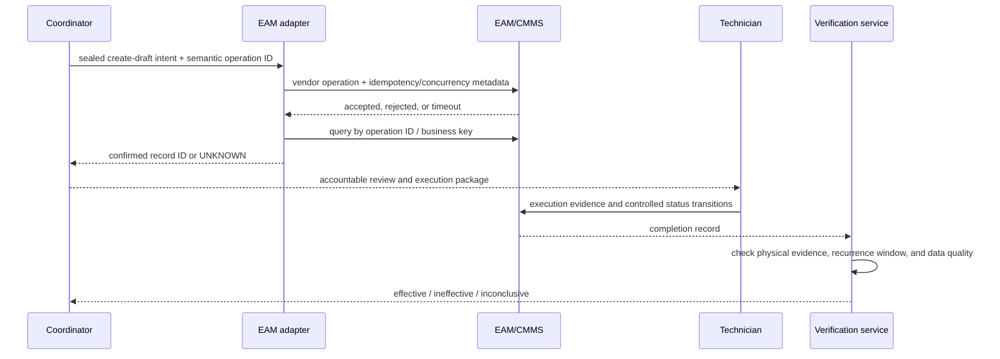

# Maintenance Strategy, Condition Monitoring, and Work Orders

An effective maintenance agent connects evidence to an accountable workflow; it does not turn every anomaly into a job. The production loop must distinguish detection, diagnosis, prognosis, maintenance policy, work authorization, scheduling, execution evidence, return to service, and effectiveness verification.

## Choose the maintenance policy outside the model

| Policy | Appropriate when | Agent contribution | Primary failure to avoid |
|---|---|---|---|
| Corrective/run-to-failure | failure consequence is acceptable and recovery is planned | classify request, assemble history, draft scope | applying it to safety, environmental, quality-critical, or high-consequence assets |
| Time/calendar preventive | age-based failure and known interval justify intervention | surface due work and conflicts | blindly preserving obsolete intervals |
| Usage/meter preventive | cycles, runtime, throughput, or starts drive wear | reconcile meter evidence and forecast due window | bad rollover, unit, replacement, or meter hierarchy |
| Condition-based | measurable condition changes before functional failure | contextualize trend and recommend inspection | treating an isolated threshold as a diagnosis |
| Predictive/prognostic | validated model supports a bounded failure mode and decision horizon | rank evidence and produce uncertainty-aware options | presenting remaining useful life as fact |
| Risk-based/reliability-centered | consequence and failure mode justify differentiated tasks | retrieve FMEA/RCM basis and feedback outcomes | allowing an LLM to invent failure modes, criticality, or policy |

Asset strategy, criticality, failure coding, and task intervals require controlled engineering governance. The agent can collect evidence for review but cannot self-modify them.

## Build a condition-monitoring pipeline


Condition data should be interpreted against operating state, speed, load, product/recipe, ambient conditions, recent maintenance, sensor health, and component configuration. ISO 17359, ISO 13374, ISO 13379-1:2025, and ISO 13381-1:2025 provide useful program, processing, diagnostic, and prognostic anchors; they do not validate a specific model for a plant.

## Use a typed maintenance case

```yaml
case_id: MC-2026-008812
site_id: plant-a
asset_resolution:
  object_id: 9509e320-...
  alias_version: 17
  component: DE-bearing
  as_of: 2026-08-31T03:12:00Z
trigger:
  type: condition_anomaly
  rule_or_model: bearing-trend-v6.2
  detection_time: 2026-08-31T03:13:00Z
  evidence_refs: [ev-771, ev-772, ev-779]
evidence_quality:
  freshness_policy: rotating-equipment-v5
  sequence_gaps: 1
  calibration_status: valid
  operating_regime: steady-load-80pct
hypotheses:
  - code: outer-race-defect
    support: [ev-771, manual-section-4.7]
    conflicts: [ev-779]
    confidence_band: medium
recommended_next_step:
  operation: vibration_route_inspection
  procedure_ref: WI-VIB-014@9
authority_tier: M1
stop_reasons: [unresolved_sequence_gap]
```

Confidence is decision support, not a probability unless the model is calibrated for that exact population and horizon. Preserve negative and conflicting evidence.

## Normalize work-order lifecycle semantics

Vendor status names differ, and transitions can cause side effects such as reservations, cost commitments, notifications, or asset-state changes. Map them to a canonical lifecycle without erasing the source value:

```text
DRAFT -> AWAITING_APPROVAL -> APPROVED -> READY_TO_SCHEDULE
      -> SCHEDULED -> READY_FOR_EXECUTION -> IN_PROGRESS
      -> TECHNICALLY_COMPLETE -> ADMINISTRATIVELY_CLOSED

Side paths: ON_HOLD, CANCEL_REQUESTED, CANCELLED, REJECTED
```

`TECHNICALLY_COMPLETE` is not `ADMINISTRATIVELY_CLOSED`, and neither proves physical return to service. IBM Maximo, for example, distinguishes completed and closed states and can apply inventory or asset consequences during transitions. SAP can require approval before order release and concurrency controls on API calls. The adapter must expose the exact installed configuration.

## Separate planning from constraint solving

The model may propose job scope, tasks, evidence, and alternatives. A deterministic planner validates:

- authorized worker skills, certifications, shifts, fatigue rules, and labor agreements;
- asset availability, production window, changeover, and approved outage;
- tools, calibrated instruments, lifting equipment, scaffolding, and test equipment;
- parts/substitutes status supplied by Supply Chain without taking over allocation or issue;
- permits, LOTO handoff, safety plan, environmental controls, and required accountable roles;
- procedure and drawing versions, revision applicability, and OEM constraints;
- predecessor/successor tasks, resource conflicts, travel/access time, and simultaneous-operation rules.

If constraints cannot be proven, return an infeasible plan with reasons. Never “best effort” schedule around a safety, competency, or calibration requirement.

## Follow the work-order effect pattern



The agent does not report success when the HTTP call succeeds. It reports a confirmed work-order identity only after authoritative read-back.

## Work through a pump anomaly safely

1. Resolve Pump P-204 and its installed drive-end bearing as of the evidence window.
2. Validate sensor identity, calibration, sequence continuity, unit, clock, operating regime, and recent configuration changes.
3. Compare trend features against the site-approved rule/model and relevant manual procedure; capture evidence against the leading hypothesis.
4. Check active work, quality impact, safety events, holds, permits, and conflicting condition cases.
5. Recommend `inspect`, `monitor`, or `plan` with uncertainty. Do not command shutdown.
6. Human reliability review selects a response and approved work scope.
7. A deterministic scheduler checks competence, tools, window, parts status, and safety handoffs.
8. The adapter creates a non-released order using a semantic operation ID, then reads it back.
9. Authorized personnel perform LOTO and work under site procedures; the agent does not attest either.
10. The technician records findings, as-found/as-left measurements, parts installed, component serials, failure codes, deviations, and procedure version.
11. Accountable personnel handle return to service. Independent observation then checks expected condition change and recurrence over a defined window.
12. Reliability engineering, not online model memory, approves any task-strategy or model update.

## Work through a spare-constrained maintenance window

This flow keeps maintenance planning distinct from inventory, engineering substitution, production scheduling, and execution authority:

1. Resolve the asset, installed component/serial, approved bill of material, job-plan revision, due window, production order conflicts, and failure consequence.
2. Read part availability, shelf-life/condition, reservations, purchase/repair status, and approved alternatives as versioned facts from ERP/EAM and Supply Chain. Do not equate `available`, `reserved`, `staged`, `issued`, and `at point of work`.
3. The deterministic scheduler tests labor qualifications, shift calendars, outage/window, tools, calibrated test equipment, predecessor work, simultaneous operations, and permit/LOTO handoffs.
4. If the primary spare is unavailable, return `INFEASIBLE` with the missing constraint. The agent may assemble an alternate-part evidence request; engineering/Quality/OEM roles make the applicability decision under change control.
5. Supply Chain owns allocation, reservation, purchasing, repair exchange, and goods movement. Maintenance receives authoritative status and does not silently take stock from another order.
6. A planner approves the exact job/window/resource version. Recheck component identity, part status, qualifications, production window, procedure, and active holds immediately before dispatch.
7. Authorized personnel stage the job, execute energy control and work, and record actual part/lot/serial, as-found/as-left state, unused returns, and deviations. The agent cannot convert a reservation or issue transaction into installation evidence.
8. Reconcile EAM actuals, ERP material movements, component genealogy, new condition baseline, warranties, and repairable-core return. Partial mismatches remain open exceptions with named owners.

If production reschedules, the component is replaced by another job, a qualification expires, or an approved substitute changes, invalidate the plan rather than repairing it conversationally.

## Preserve parts and component identity

Maintenance needs parts evidence but should not become an inventory agent. Record:

- requested part and approved engineering interchangeability/substitute decision;
- Supply Chain availability/reservation/issue status as externally owned facts;
- removed and installed serial/lot, position, as-found condition, shelf-life/status, and certificates;
- repairable/rotable lifecycle, warranty, OEM/vendor case, and chain of custody;
- effect of component replacement on tag, meter, baseline, calibration, and model applicability.

A reservation status does not prove physical possession. A goods issue does not prove installation. A work-order completion does not prove the installed serial unless execution evidence records it.

For shift-spanning work, hand off the exact work-order/task version, equipment boundary, personal/group LOTO status from its authoritative human-controlled system, permits, incomplete steps, as-found state, tools/parts custody, active hazards, clocks, and accountable incoming person. The coordinator may verify bundle completeness and wait; it cannot attest continuity of protection or accept the handoff for the crew.

## Handle predictive maintenance uncertainty

For each model, pin:

- population and excluded configurations;
- target failure mode and label definition;
- horizon, lead-time, censoring, and minimum observation history;
- required sensors, context, missing-data behavior, and out-of-distribution tests;
- calibration and error by site/asset class/operating regime;
- cost of false positive, false negative, late detection, and unnecessary intervention;
- abstention criteria, degradation monitor, approved decision policy, owner, and retirement date.

Do not convert a probability or remaining-useful-life estimate directly into a work order. Apply the asset strategy and consequence model, then obtain the required accountable review.

## Verify maintenance effectiveness

Use three layers:

| Layer | Question | Example evidence |
|---|---|---|
| Transaction | Was the intended EAM record created or updated exactly once? | operation ID, ETag/version, read-back |
| Work execution | Was approved work performed and recorded? | technician, procedure version, findings, parts, measurements, controlled statuses |
| Physical/operational | Did the targeted condition improve without new harm? | post-work baseline, recurrence window, quality output, alarms, operator observations |

Classify the outcome `EFFECTIVE`, `INEFFECTIVE`, or `INCONCLUSIVE`. Missing post-work evidence is inconclusive, not success.

## Maintenance acceptance checklist

- [ ] Asset and installed-component identity is effective-dated.
- [ ] Meter rollovers, replacements, units, and hierarchy are tested.
- [ ] Condition evidence includes status, source time, lineage, calibration, and operating regime.
- [ ] The failure mode and decision policy are controlled, not improvised.
- [ ] Work-order state mappings and transition side effects are qualified per installation.
- [ ] Scheduling constraints are deterministic and fail closed.
- [ ] LOTO, permits, safety, and return to service are explicit human handoffs.
- [ ] Operation IDs, concurrency checks, read-back, and `UNKNOWN` reconciliation are proven.
- [ ] Installed/removed component genealogy is captured.
- [ ] Effectiveness is verified beyond record completion.

## Read next

For the parallel product-quality loop, continue with [Quality plans, inspection, nonconformance, CAPA, and release](05-quality-plans-inspection-nonconformance-capa-and-release.md). Connector details are in [Tools, connectors, adapters, and vendor coordination](06-tools-connectors-adapters-and-vendor-coordination.md).
