# Quality Plans, Inspection, Nonconformance, CAPA, and Release

A quality agent can shorten evidence assembly and investigation, but it cannot become the quality unit. Inspection specifications, sample selection, result valuation, containment scope, disposition, concession, deviation approval, final usage decision, lot/batch release, recall classification, regulatory reporting, and CAPA closure remain governed by validated deterministic systems and accountable roles.

## Keep the quality lifecycle explicit

```mermaid
flowchart LR
    PLAN[Approved control / inspection plan] --> SAMPLE[Deterministic sample selection]
    SAMPLE --> MEASURE[Measurement / test execution]
    MEASURE --> VALIDATE[Method, unit, calibration, data checks]
    VALIDATE --> VALUE[Deterministic characteristic valuation]
    VALUE --> REVIEW[Accountable quality review]
    REVIEW -->|conforming evidence| RELEASE[Human usage decision / release]
    REVIEW -->|nonconforming or uncertain| CONTAIN[Containment and trace population]
    CONTAIN --> NCR[Nonconformance record]
    NCR --> INVEST[Investigation and root-cause evidence]
    INVEST --> DISP[Human disposition / regulatory decisions]
    INVEST --> CAPA[CAPA if required]
    CAPA --> EFFECT[Implementation and effectiveness check]
    EFFECT --> CLOSE[Human closure]
```



The model may draft or explain at several points. It must not collapse the lifecycle into “pass/fail” or infer release from an absence of failed tests.

## Pin the governing context

Every quality case must bind:

- site, legal manufacturer or responsible organization, product/material, batch/lot/serial, process order/job/operation, and inspection lot/sample;
- market/jurisdiction and quality-system applicability where relevant;
- approved control plan, inspection plan, specification, drawing, method, sampling plan, and effective versions;
- characteristic, nominal/tolerances, unit, rounding/guard-band decision rules, and environmental/setup requirements;
- instrument/measurement-function identity, calibration status, uncertainty, reference standards, and laboratory accreditation scope if applicable;
- process/equipment/tooling/software/recipe versions and genealogy;
- operator/analyst and accountable approver roles;
- holds, deviations, concessions, prior nonconformances, and superseding/corrected results.

If applicability or version cannot be resolved for the event time, stop. “Use the latest document” is unsafe for historical evaluation and controlled production.

## Use deterministic sampling and valuation

The agent must never invent an AQL, code letter, sample size, acceptance number, rejection number, SPC rule, tolerance, or rounding convention. A validated service calculates them from an approved plan.

```json
{
  "sampling_decision_id": "SD-99172",
  "plan_ref": "ISO2859-SITE-PROC-14@8",
  "lot_ref": "LOT-2026-81881",
  "lot_size": 12400,
  "inspection_level": "II",
  "aql": "site-controlled-value",
  "switching_state": "normal",
  "sample_size": 200,
  "acceptance_number": 5,
  "rejection_number": 6,
  "algorithm_version": "sampling-engine/3.4.1",
  "input_hash": "sha256:...",
  "calculated_at": "2026-08-31T05:01:00Z"
}
```

ISO 2859-1:2026 is a current attribute-sampling reference, but a site must own the selected scheme and application. Sampling is not evidence that every unit conforms, nor a substitute for legally required testing or process controls.

## Capture quality evidence as a controlled record

```yaml
result_id: QR-88210
site_id: plant-b
inspection_lot: IL-619921
sample_id: S-027
product_identity: LOT-2026-81881
characteristic: bore_diameter
method_ref: WI-CMM-004@12
specification_ref: DWG-771@C
observed_at: 2026-08-31T04:42:12Z
reported_value: 49.982
unit: mm
decision_rule_ref: guard-band-policy-v4
instrument:
  object_id: cmm-04
  measurement_function: probe-2
  calibration_ref: CAL-CMM-2026-104
  calibration_valid_at_observation: true
  uncertainty_ref: UNC-CMM-04@7
source_record:
  system: lims-plant-b
  record_id: 881991
  version: 3
  content_hash: sha256:...
status: ORIGINAL_VALIDATED
supersedes: null
```

Electronic records and signatures may be subject to jurisdiction- and product-specific requirements. For FDA-regulated records, 21 CFR Part 11 includes validation, access control, time-stamped audit trails, record retention/copying, authority and sequencing checks, training, and change control. A chat transcript alone is not an adequate controlled record.

## Separate result states from disposition states

| Class | Example states | Owner |
|---|---|---|
| Acquisition | expected, received, missing, invalid, superseded | instrument/LIMS/MES integration |
| Characteristic valuation | not evaluated, conforming, nonconforming, indeterminate | validated rule plus authorized review where required |
| Inspection lot | open, results pending, review required, completed | QMS/MES workflow |
| Material/product | unrestricted, quarantine/hold, restricted, rejected, rework, scrap, deviation/concession | accountable quality and inventory systems |
| Release | not eligible, awaiting decision, released, rejected, revoked | quality authority |

An inspection lot being “complete” does not mean the product is released. In SAP, a usage decision can trigger stock postings, so it is a human boundary and a cross-domain effect. The agent may prepare the decision bundle; it cannot execute the final usage decision.

## Contain uncertainty without overclaiming

When an anomaly or nonconformance is detected:

1. Preserve the original evidence, its source version, and who/what detected it.
2. Determine whether the result is valid, invalid, missing, corrected, or disputed using controlled procedures.
3. Resolve the forward and backward genealogy population with explicit gaps.
4. Propose a containment population and rationale; do not silently narrow ambiguous scope.
5. Route the proposed hold/containment to accountable quality and the inventory owner.
6. Record the authoritative hold/disposition response and any stock/system consequences.
7. Maintain separate containment, investigation, disposition, corrective-action, and release states.

Where local procedure permits a pre-authorized business hold, it can be an M3 effect only after exact policy validation, identity resolution, idempotency, concurrency checks, read-back, and a named owner. It is still not final disposition or release.

## Structure nonconformance and CAPA work

```sql
quality_case(
  case_id TEXT PRIMARY KEY,
  case_type TEXT NOT NULL, -- deviation, nonconformance, complaint, capa, recall_support
  site_id TEXT NOT NULL,
  product_scope_ref TEXT NOT NULL,
  detected_at TIMESTAMPTZ NOT NULL,
  specification_ref TEXT,
  status TEXT NOT NULL,
  owner_role TEXT NOT NULL,
  governing_procedure_ref TEXT NOT NULL,
  source_version BIGINT NOT NULL
)

quality_case_evidence(
  case_id TEXT NOT NULL,
  evidence_id TEXT NOT NULL,
  role TEXT NOT NULL, -- trigger, supporting, conflicting, exculpatory, effectiveness
  added_by TEXT NOT NULL,
  added_at TIMESTAMPTZ NOT NULL,
  PRIMARY KEY(case_id, evidence_id, role)
)

quality_action(
  action_id TEXT PRIMARY KEY,
  case_id TEXT NOT NULL,
  action_type TEXT NOT NULL, -- correction, containment, corrective, preventive
  hypothesis_ref TEXT,
  owner TEXT NOT NULL,
  due_at TIMESTAMPTZ,
  approval_ref TEXT,
  completion_evidence_ref TEXT,
  effectiveness_plan_ref TEXT,
  status TEXT NOT NULL
)
```

Distinguish:

- **correction**: addresses a detected nonconformity now;
- **containment**: controls exposure while facts are unresolved;
- **root-cause analysis**: tests causal hypotheses and alternatives;
- **corrective action**: removes or controls a verified cause to prevent recurrence;
- **preventive/risk action**: addresses potential nonconformity where the governing system uses that concept;
- **effectiveness check**: tests whether the action achieved the predefined outcome over a suitable window.

The model may generate hypotheses, but it must display evidence for and against them, missing tests, confounders, and whether an experiment is safe/authorized. A fluent “five whys” narrative is not proof of causality.

## Keep deviation, change, and correction semantics separate

| Record | Purpose | Required scope/time | What it never proves |
|---|---|---|---|
| Correction to a record | repair an erroneous or incomplete assertion with an auditable supersession | original record, corrected fields, reason, actor, review, correction time, effective applicability | that product or equipment consequences were reversed |
| Deviation/concession | accountable authorization for a defined departure where the quality system permits it | product/process/equipment population, requirement, rationale, conditions, approver, start/expiry, jurisdiction/customer impact | blanket approval for later lots or another site |
| Engineering/process change | alter an approved product, process, equipment, software, method, procedure, or specification | change object/version, impact assessment, validation/qualification, training, activation and rollback plan | that implementation succeeded or output conforms |
| CAPA | investigate systemic cause and implement action when required | affected system/population, evidence, causal assessment, action owners, due dates, effectiveness plan | release, disposition, or causal certainty merely because tasks closed |

A case can contain all four, but IDs, approvals, owners, lifecycle states, and evidence remain distinct. When a measurement correction changes a prior containment or disposition basis, append an impact-assessment event and route the case back to accountable Quality; do not silently recalculate history.

## Work through dimensional drift

1. A deterministic SPC/measurement service flags bore-diameter drift; the agent receives the event, not raw permission to define a limit.
2. Resolve lot/serials, machine, tool, fixture, program/recipe, instrument, operator/shift, method, drawing, and calibration versions.
3. Validate measurement status, uncertainty, setup, environment, unit, correction history, and whether the gauge is fit for this decision.
4. Retrieve preceding and subsequent results and process changes; preserve evidence that conflicts with tool-wear or thermal-drift hypotheses.
5. Generate a trace population covering all possibly affected output, explicitly marking genealogy gaps.
6. Draft a nonconformance and containment proposal. Quality approves scope; Supply Chain executes inventory movement or quarantine semantics.
7. Investigation uses authorized remeasurement or process studies. The agent never directs an unsafe machine trial.
8. Accountable quality selects disposition and makes any usage/release decision.
9. CAPA, if required, has owners, due dates, implementation proof, and a predefined effectiveness metric/window.
10. Closure occurs only after evidence review; a lower alert count or model confidence alone is insufficient.

## Run a governed change-control flow

1. Open a change record that names the affected product, process, equipment, software/model, method, procedure, specification, sites, and planned effective window.
2. Freeze the proposed artifact versions and assemble quality, safety, validation, cybersecurity, supplier, training, regulatory, and genealogy impacts; preserve unresolved dissent.
3. Accountable functions decide whether validation, requalification, customer/regulatory notification, first-article inspection, enhanced sampling, or inventory containment is required.
4. Approve an immutable change package with activation prerequisites and a rollback/forward-recovery plan. The agent may check completeness but cannot sign the change.
5. Deploy the whole approved package to a bounded site/line/window. Verify installed versions, trained/qualified personnel, calibrated equipment, recipe/program checksums, and controlled-document availability before use.
6. Observe first output under the approved inspection/control plan. Quality owns product disposition and release; operations owns process execution.
7. Reconcile MES/MOM, QMS/LIMS, EAM, ERP, document-control, and configuration records. Any partial activation produces `CHANGE_STATE_UNKNOWN` or `PARTIALLY_APPLIED`, stops further rollout, and invokes the recovery plan.
8. Close only after implementation evidence and the predefined effectiveness/stability window pass. Mine the outcome into future evaluations only after review and de-identification.

## Support recall without deciding it

Recall support should produce:

- issue definition and decision authority;
- potentially affected product population with inclusion rationale, exclusions, and unresolved genealogy;
- distribution/customer records requested from Supply Chain and authoritative status;
- risk, complaint, adverse-event, and investigation evidence references;
- correction/removal chronology, communications, effectiveness checks, and reconciliation;
- record freeze/legal hold and access controls where required;
- jurisdiction-specific escalation and reporting owners.

ISO 10393 provides general consumer-product recall guidance, while FDA device recall sources define US-specific concepts and reporting expectations. Neither permits an agent to classify or initiate a recall autonomously.

## Design data-integrity controls

Use controls that make records attributable, legible, contemporaneous, original or verified copies, accurate, complete, consistent, enduring, and available:

- source-system identity, person/service identity, role, site, and device where material;
- server-side trusted time plus source time and clock diagnostics;
- immutable original, append-only corrections, reason, review, and supersession links;
- least-privilege access and segregation of duties;
- controlled export with metadata and verification hashes;
- retention, legal hold, backup, restoration, and readable-format testing;
- no model rewriting or summarizing the only copy of a regulated record;
- provenance from generated text to evidence and behavior release.

For US drug CGMP, procedures and changes require appropriate review and approval, deviations must be recorded and justified, and unexplained discrepancies/failures require investigation. Applicability must be mapped by qualified legal and quality personnel.

## Quality production gates

- [ ] One authoritative source and state model exists for each inspection, hold, disposition, and release state.
- [ ] Specification, method, control plan, sampling plan, and decision-rule versions resolve at event time.
- [ ] Sampling and characteristic valuation are deterministic and validated.
- [ ] Calibration, uncertainty, unit, environment, lineage, and corrections are preserved.
- [ ] Genealogy can be queried forward and backward and reports missing coverage.
- [ ] The UI distinguishes evidence, inference, draft, authoritative disposition, and release.
- [ ] The agent has no final release, usage-decision, concession, recall-classification, regulatory-submission, or CAPA-closure tool.
- [ ] Controlled electronic records meet applicable validation, signature, audit-trail, retention, and access requirements.
- [ ] Recall and CAPA effectiveness exercises pass with authoritative reconciliation.

## Read next

Use [Tools, connectors, adapters, and vendor coordination](06-tools-connectors-adapters-and-vendor-coordination.md) to preserve these semantics across QMS, LIMS, MES, ERP, and EAM products.
