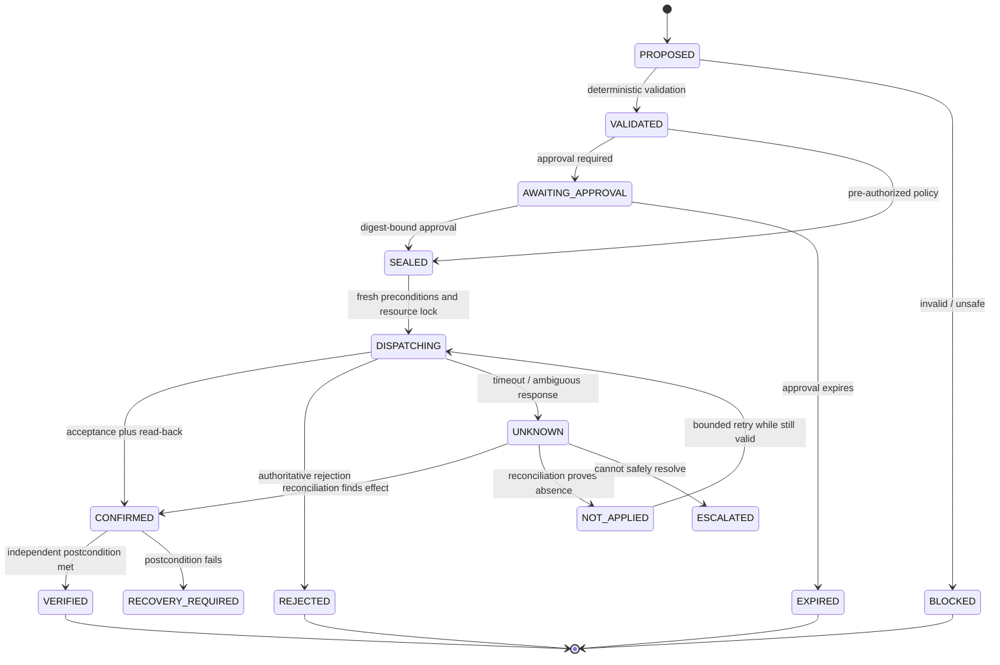
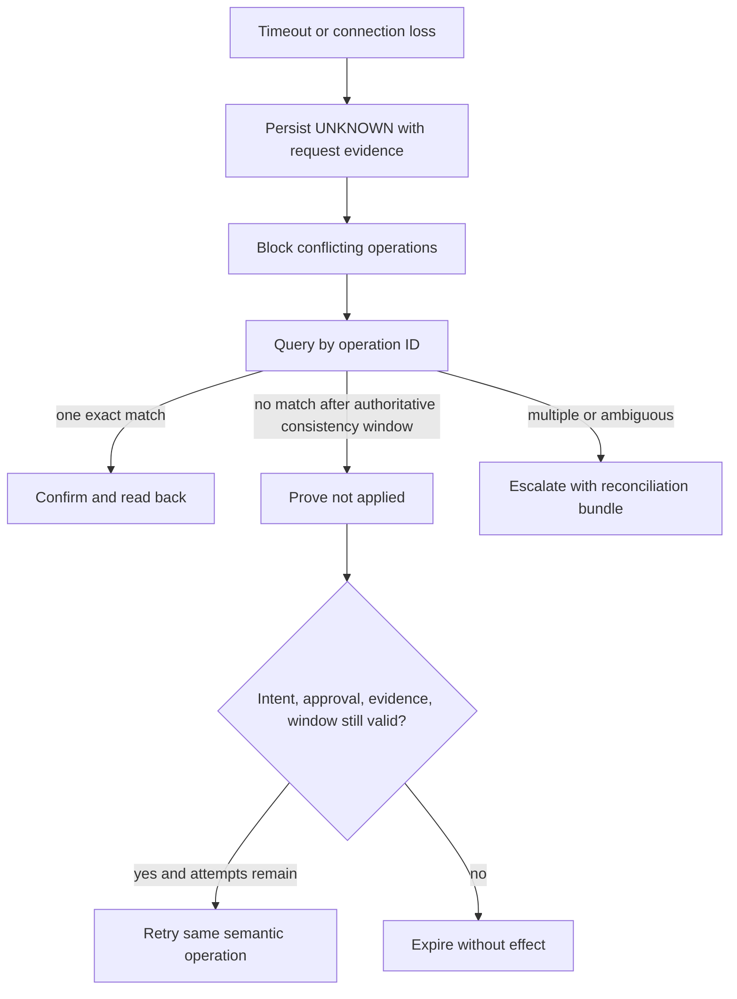

# Planning, Effects, Reliability, and Post-Action Verification

Production reliability depends on treating every external effect as a state machine with durable intent, preconditions, an immutable operation identity, an uncertain network boundary, authoritative reconciliation, and independent postcondition checks. “Retry on error” is not a safe effect model.

## Separate plan, approval, and execution



Never represent `UNKNOWN` as failure or success. Block conflicting effects until it is reconciled or a human accepts a documented recovery plan.

## Persist an effect intent

```sql
effect_intent(
  intent_id TEXT PRIMARY KEY,
  semantic_operation_id TEXT NOT NULL,
  site_id TEXT NOT NULL,
  operation_type TEXT NOT NULL,
  target_resolution_token TEXT NOT NULL,
  parameters_canonical_hash TEXT NOT NULL,
  evidence_snapshot_hash TEXT NOT NULL,
  policy_version TEXT NOT NULL,
  authority_tier TEXT NOT NULL,
  preconditions_json JSON NOT NULL,
  approval_id TEXT,
  approval_digest TEXT,
  valid_until TIMESTAMPTZ NOT NULL,
  behavior_release TEXT NOT NULL,
  state TEXT NOT NULL,
  UNIQUE(site_id, semantic_operation_id)
)

effect_attempt(
  attempt_id TEXT PRIMARY KEY,
  intent_id TEXT NOT NULL,
  attempt_number INTEGER NOT NULL,
  adapter_contract TEXT NOT NULL,
  request_hash TEXT NOT NULL,
  dispatched_at TIMESTAMPTZ,
  response_at TIMESTAMPTZ,
  vendor_correlation TEXT,
  raw_evidence_ref TEXT,
  outcome TEXT NOT NULL,
  UNIQUE(intent_id, attempt_number)
)
```

The semantic operation ID is stable across transport retries. A new intent with materially different parameters gets a new ID and approval.

## Make approval precise

An approval record binds:

- approver identity, role, site, and segregation-of-duties context;
- exact operation, target resolution, immutable parameters, evidence snapshot, and procedure/specification version;
- current authoritative versions/ETags used as preconditions;
- allowed execution window, expiry, maximum attempts, and cancellation rules;
- expected result, verification method, and compensation/forward-recovery plan;
- behavior release and adapter capability version.

Approval is invalid after a target, material parameter, evidence requirement, governing version, authority, or critical precondition changes. The UI must show the digest-bound human-readable action, not a generic “approve agent plan” button.

## Plan with bounded graphs

Represent a plan as typed steps and dependencies:

```yaml
plan_id: MP-4821
objective: create non-released inspection work order for P-204
resource_locks: [plant-a:asset:P-204:maintenance-case]
steps:
  - id: resolve
    operation: resolve_asset
    effect: false
  - id: evidence
    operation: assemble_condition_evidence
    depends_on: [resolve]
    effect: false
  - id: validate
    operation: validate_maintenance_case
    depends_on: [evidence]
    deterministic: true
  - id: approve
    operation: request_exact_approval
    depends_on: [validate]
    human: true
  - id: create
    operation: create_work_order_draft
    depends_on: [approve]
    effect: true
  - id: verify
    operation: read_back_work_order
    depends_on: [create]
    deterministic: true
stop_conditions: [identity_changed, evidence_expired, existing_order_conflict, active_safety_hold]
```

Limit maximum steps, tool calls, wall time, tokens, retries, branching, evidence bytes, and total effects per run. Dynamic replanning cannot remove already required approvals or weaken stop conditions.

## Implement idempotency at the business boundary

Transport-level exactly-once claims do not prove exactly-once business behavior. Use layered controls:

1. generate the semantic operation ID before dispatch and persist it transactionally with intent;
2. pass the ID to the vendor when supported, such as a transaction ID or external reference;
3. maintain a local unique index on site plus operation ID;
4. query by operation ID after timeout;
5. if unavailable, query a carefully designed business key and compare immutable fields;
6. only retry after reconciliation proves absence and intent remains valid;
7. verify the authoritative source record and version after acceptance.

Deduplication retention must exceed the longest retry, offline, restore, and replay horizon. Backups must preserve the ledger and vendor correlation.

## Treat multi-system work as a saga, not a transaction

MES, EAM, QMS, ERP, workflow, and communications systems rarely share one atomic commit. Do not hide a sequence of writes behind `complete_case` or report success because most steps succeeded.

```yaml
composite_operation_id: co_01J...
objective: create maintenance draft and request planner review
steps:
  - {id: eam_draft, system: eam, state: CONFIRMED, external_ref: WO-88192, version: 1}
  - {id: workflow_task, system: workflow, state: UNKNOWN, external_ref: null, version: null}
  - {id: notification, system: communications, state: NOT_DISPATCHED, depends_on: workflow_task}
aggregate_state: PARTIALLY_CONFIRMED
blocked_resources: [plant-a:asset:P-204:maintenance-case]
next_action: reconcile workflow_task before notification or retry
```

Rules:

1. Persist each step intent before dispatch with its own semantic operation ID, approval scope, validity, and reconciliation method.
2. Advance only on authoritative confirmation, not an upstream message acknowledgement.
3. When a later step is rejected or unknown, preserve earlier confirmed effects and set `PARTIALLY_CONFIRMED`; do not pretend they rolled back.
4. Retry only the unresolved step after revalidating dependencies. Never replay the whole composite operation.
5. Compensate a confirmed earlier step only through a separately authorized, qualified operation and only when downstream state makes it semantically valid.
6. Otherwise use forward recovery: create the missing task manually, mark the record for accountable review, or cancel the unchanged draft through source procedure.
7. Reconcile every participating system and close the composite only when its defined convergence invariant holds or a human accepts a documented terminal exception.

Cross-system read models are evidence, not a distributed transaction coordinator. A QMS hold and an ERP stock status can legitimately disagree during propagation; the workflow must expose and own the interval.

## Handle uncertain outcomes



The reconciliation bundle includes intent, attempt history, vendor correlations, query evidence, source versions, business-key collisions, and what operations remain blocked.

Reconciliation itself is durable work. Record its attempt ID, query scope, source consistency window, result cardinality, observed versions, next due time, and owner. After a bounded number or age of inconclusive queries, escalate; indefinite polling can overload the dependency while giving operators false confidence.

## Define cancellation by phase

| Phase | Cancellation behavior |
|---|---|
| Proposed/awaiting approval | terminate locally; record reason |
| Sealed but not dispatched | invalidate intent and release locks |
| Dispatching/unknown | request cancellation, but keep reconciling; do not claim cancelled |
| Confirmed but external workflow unstarted | use qualified vendor cancellation if state/version unchanged |
| Work started or downstream effects exist | forward recovery under accountable owner; no automatic rollback |
| Physical work, disposition, or release occurred | cannot be “undone” by deleting a record; use controlled recovery/recall/deviation processes |

Cancellation is an intent until the external authoritative state confirms it.

## Make handoff and override explicit events

A human taking control does not erase the workflow. Append an override/handoff event containing:

- case, site, object, current workflow and source versions;
- reason and category: `TAKEOVER`, `REJECT_RECOMMENDATION`, `CHANGE_PLAN`, `EMERGENCY_MANUAL_PROCESS`, or `STOP_AUTOMATION`;
- authenticated actor, accountable role, shift, time, applicable procedure, and comment/evidence references;
- resource locks, pending clocks, approvals, confirmed/pending/unknown effects, and operations disabled;
- exact responsibility accepted and the expected return or closure condition.

The platform immediately stops new agent dispatch for the scoped resources. It does **not** mark unknown effects absent, cancel external work, release a quality hold, or declare equipment safe. Manual actions are later imported as authoritative events or recorded as evidence gaps. Resume requires reconciliation, fresh target/evidence/policy/approval checks, a new fencing token, and an explicit return-to-assisted-mode event.

Emergency or break-glass procedures remain outside agent credentials and are governed by the plant. The agent may present the site contact/runbook and preserve evidence; it cannot invoke emergency authority on anyone's behalf.

## Prefer compensation only when semantically valid

Compensation is a new effect, not time reversal. Examples:

- cancel an unreleased, unchanged work-order draft;
- remove a nonauthoritative note by appending a correction if the system supports it;
- withdraw a vendor case before commercial or remote-access commitment;
- request release of a provisional reservation through Supply Chain.

Do not compensate by deleting audit records, erasing corrected quality results, reopening a closed controlled record without procedure, or automatically reversing a product disposition. Use forward recovery when consequences have propagated.

## Verify postconditions independently

For every effect define:

```yaml
operation: create_work_order_draft
transaction_postcondition:
  query: work_order_by_semantic_operation_id
  expected: exactly_one
  compare_fields: [site, asset, work_type, case_id, job_plan_version]
workflow_postcondition:
  expected_state: DRAFT
  forbidden_states: [RELEASED, IN_PROGRESS, COMPLETE, CLOSED]
physical_postcondition:
  required: false
verification_deadline: PT5M
on_mismatch: freeze_case_and_escalate
```

For maintenance completion, add post-work physical/condition verification. For containment, verify authoritative QMS state and request inventory-status confirmation from Supply Chain. Never let the same model-generated statement serve as action and proof.

## Use resource locks and optimistic concurrency

Locks prevent the agent from initiating conflicting plans; source versions prevent stale updates in external systems. Scope locks narrowly:

- maintenance case plus asset/component;
- quality case plus lot/serial/inspection lot;
- effect intent plus semantic operation;
- controlled document/version under review.

Locks need owner, lease, fencing token, renewal, expiry, and recovery. A lease expiry does not prove an external effect stopped, so uncertain outcomes remain fenced after coordinator failover.

## Bound retries and budgets

Retry only transient, classified failures. Apply exponential backoff with jitter, maximum attempts, absolute intent expiry, and per-dependency circuit breakers. Recheck authorization, target resolution, source version, evidence freshness, approval, maintenance window, and safety/quality holds before every attempt.

Budget dimensions:

- effect attempts per intent and per site/time window;
- read/tool calls, evidence bytes, model tokens, and wall time;
- concurrent cases per adapter and business object;
- regional/site queue depth and age;
- vendor rate/cost quota;
- recovery-drain rate after an outage.

Budget exhaustion produces a durable handoff; it does not grant a larger budget automatically.

## Test the effect state machine

Inject failures:

- before request leaves executor;
- after vendor accepts but before response;
- after response but before ledger commit;
- during read-back and while vendor indexing is delayed;
- after coordinator failover with an expired lease;
- during approval expiry or target-version change;
- with duplicate delivery from the queue;
- with one matching and one conflicting external record;
- during cancellation at every phase;
- during adapter rollback with inflight `UNKNOWN` intents.

Pass only if no duplicate external effect occurs, audit order is recoverable, conflicting effects stay fenced, and the correct authoritative state is eventually reported.

## Read next

Durability also requires context discipline. Continue with [Context, memory, compaction, and durable orchestration](08-context-memory-compaction-and-durable-orchestration.md).
