# Security, Governance, Controlled Procedures, and Audit

Manufacturing agent security is defense in depth across OT zones, site tenancy, identities, tools, content, behavior releases, vendor dependencies, and accountable operations. Model refusal is not a security control. The system must remain safe when the model is mistaken, manipulated, or compromised.

## Start with assets, hazards, and trust boundaries

Protect at least:

- human safety, environmental protection, process containment, and machine integrity;
- controller logic, recipes, programs, setpoints, alarm/interlock configuration, and credentials;
- product specifications, genealogy, inspection results, disposition/release records, and regulated evidence;
- asset strategy, maintenance procedures, drawings, failure history, and OEM intellectual property;
- plant availability, production schedules, vulnerabilities, network topology, and incident details;
- service identities, approvals, signatures, policy/knowledge/behavior releases, effect ledgers, and audit evidence.

Threat actors include external attackers, compromised suppliers/connectors, malicious insiders, overprivileged services, cross-site mistakes, poisoned documents, vulnerable model/tool dependencies, and ordinary operational errors.

## Apply zones, conduits, and site isolation

Use the site’s ISA/IEC 62443 and NIST SP 800-82 program to define zones and conduits. A typical invariant set is:

- no inbound model-runtime route to controllers or safety systems;
- read-only collectors with separate identities from business-effect executors;
- protocol termination and filtering at an industrial DMZ or approved boundary;
- deny-by-default egress and destination allowlists;
- separate site credentials, trust roots, queues, storage partitions, encryption keys, and rate quotas;
- one-way gateways where the risk assessment requires them;
- locally enforceable kill switches and effect-policy cache expiry;
- monitored administrative access through approved jump and change-control paths, outside agent tools.

Validate segmentation with technical tests. A network diagram is not evidence that a route is absent.

## Use workload identity and least privilege

```text
human identity -> session identity -> coordinator identity
               -> site-scoped read broker
               -> operation-specific executor identity
               -> vendor role limited to one qualified semantic operation
```

Requirements:

- short-lived workload credentials and mutual authentication where supported;
- separate identities for read, draft, effect, administration, and break-glass operations;
- authorization based on site, object, role, operation, workflow state, and authority tier;
- secrets stored outside prompts, workflow payloads, logs, traces, and model context;
- key/certificate/token rotation and revocation drills;
- no shared user API key or service account across sites;
- privileged-access and break-glass actions outside agent autonomy, with after-action review.

Vendor API keys often inherit the full permissions of their bound account. Qualify the account’s effective privileges, not just the endpoint documentation.

## Counter agent-specific threats

| Threat | Required controls |
|---|---|
| Goal or prompt hijacking | immutable system mission, typed state machine, retrieved content marked untrusted, server-side policy |
| Tool misuse | semantic allowlist, input schema, target resolution token, authority tier, rate/effect budgets |
| Identity and privilege abuse | site-scoped workload identity, approval binding, segregation of duties, no credential delegation by text |
| Supply-chain compromise | signed artifacts, SBOM/provenance, dependency and model/provider review, pinned versions, staged rollout |
| Unexpected code execution | no shell/browser/general HTTP/SQL/OT clients; sandbox nonproduction transforms; content scanning |
| Memory/context poisoning | approved ingestion, provenance, source trust labels, correction/withdrawal propagation, cross-site tests |
| Cascading failures | circuit breakers, queue quotas, bulkheads, backpressure, bounded autonomy, local kill switch |
| Human overtrust | evidence-linked UI, uncertainty/conflict display, precise approvals, challenge sampling and training |
| Rogue or drifted behavior | behavior-release registry, eval gates, shadow/canary, telemetry, rollback, no online self-update |

The [OWASP Top 10 for Agentic Applications 2026](https://genai.owasp.org/resource/owasp-top-10-for-agentic-applications-for-2026/) is a useful threat checklist. Map it to plant hazards and controls rather than treating checklist completion as assurance.

## Protect semantic, measurement, and time integrity

An attacker or configuration error does not need to alter model weights to cause harm. Changing a tag mapping, unit, source timestamp, calibration status, specification revision, equipment relationship, or result correction can make valid reasoning target the wrong reality.

Control these assets like code and quality data:

- sign and version namespace maps, semantic registries, unit conversions, clock/timezone configuration, calibration mappings, source-quality translations, and effective-dated identity relationships;
- require two-person or accountable owner review for safety-, quality-, release-, and effect-relevant mapping changes; record before/after values, reason, activation window, and rollback;
- monitor NTP/PTP/source clock identity, offset, uncertainty, steps, holdover, leap/timezone configuration, and gateway time rewriting; block time-sensitive decisions outside the qualified budget;
- preserve OPC UA source and server timestamps and status separately; a gateway must not manufacture a good source time when the source did not provide one;
- validate quantity kind, canonical unit, scale, sign, coordinate frame, aggregation, sampling window, and reference condition before numeric conversion;
- verify calibration certificate authenticity, measurement-function scope, interval, uncertainty, out-of-tolerance findings, and impact on results taken since the last known valid state;
- detect improbable simultaneous mapping/unit/calibration changes and quarantine affected evidence, cases, models, and derived features;
- include semantic registry, time configuration, calibration resolver, and identity graph versions in behavior releases, decisions, effects, restores, and incident scope.

Metrological traceability belongs to a measurement result, not merely to an instrument label. Cybersecurity of the acquisition, transformation, and presentation chain is part of preserving that result's integrity.

## Control procedures, specifications, and policies

An agent-facing knowledge release needs the same lifecycle discipline as other controlled content:

```mermaid
flowchart LR
    AUTHOR[Authorized authoring] --> REVIEW[Technical / quality / safety review]
    REVIEW --> APPROVE[Accountable approval]
    APPROVE --> PACKAGE[Signed scoped knowledge release]
    PACKAGE --> VALIDATE[Retrieval and applicability tests]
    VALIDATE --> ACTIVATE[Effective-dated activation]
    ACTIVATE --> MONITOR[Usage and incident monitoring]
    MONITOR --> SUPERSEDE[Supersede / withdraw / archive]
```



Require owner, revision, approval, applicability, effective dates, site/object/product scope, language, classification, source hash, and supersession. A newer edition is not automatically applicable to in-process or historical work.

## Keep approvals and signatures accountable

An electronic signature or approval must be performed by the authorized person through the controlled system. The agent cannot impersonate, infer, reuse, or generate it. Controls include:

- strong authentication and reauthentication where policy requires;
- clear display of exact action, target, consequences, evidence gaps, and immutable digest;
- role and segregation-of-duties validation at approval and execution time;
- expiry and one-purpose use;
- revocation and changed-precondition invalidation;
- signed server-side event with trusted time and source-system receipt.

“The user said yes in chat” is not an operational approval unless a validated approval service converts that interaction into the required controlled record under applicable rules.

Segregation of duties is checked twice: when approval is recorded and immediately before execution. At minimum, evaluate whether the requester, evidence preparer, approver, executor identity, record owner, and postcondition verifier may be the same person/service for this operation. Emergency role changes, temporary assignments, and delegated approvals need effective/expiry times; a directory group snapshot is not timeless authority.

## Build evidence-grade audit without leaking secrets

Record:

- human/service identity, site, role, session, device/channel risk signals, and authentication context;
- workflow, case, object resolution, source versions, evidence references, and decision eligibility;
- model/provider/release, prompt/template hashes, tool registry, policy and knowledge release;
- proposed plan, validation results, approval digest, effect intents/attempts/outcomes/read-backs;
- stop, override, cancellation, compensation, escalation, and rollback decisions;
- original vendor responses in a protected evidence store with integrity hashes.

Do not indiscriminately log full prompts, raw telemetry, personal information, secrets, proprietary manuals, or regulated records. Store classified evidence separately, link by opaque identifiers, encrypt, restrict access, define retention/legal hold, and test export/readability.

Apply data minimization to workforce identity, qualifications, shifts, badge/location evidence, performance observations, health/accommodation information, communications, and vendor contacts. The agent normally needs a qualification decision and accountable role, not a full personnel file. Keep employee-relations, surveillance, labor-agreement, and jurisdictional privacy decisions with qualified owners; do not reuse maintenance/quality traces for individual productivity scoring without a separately lawful, disclosed purpose.

## Govern changes through behavior releases

A deployable behavior release is an immutable manifest:

```yaml
release_id: mfg-agent/2026.08.4
model: provider-model-snapshot-or-pinned-routing-policy
system_instruction_hash: sha256:...
tool_registry: manufacturing-tools/5.2
adapter_contracts: [maximo-plant-a/7.9.2, qms-plant-a/4.1]
policy_bundle: mfg-policy/8.0
knowledge_releases: [plant-a-procedures/2026.08.3]
workflow_definitions: manufacturing-workflows/4.0
eval_digest: sha256:...
security_review: SEC-2026-188
approved_sites: [plant-a]
authority_ceiling: M2
rollback_release: mfg-agent/2026.07.9
activated_at: 2026-08-31T02:00:00Z
```

Changing a model alias, prompt, tool schema, policy, adapter, knowledge corpus, retrieval algorithm, or workflow may change behavior and needs impact-based re-evaluation. Do not silently route to a new model snapshot.

Promote the manifest as one behavior bundle. Canary and rollback the compatible set of model/routing policy, instructions, context compiler, tool registry, operation manifests, deterministic policy, workflow definitions/migrations, identity/semantic mappings, knowledge release, telemetry schema, and UI approval rendering. Testing only the model while changing adapters or policy independently does not test deployed behavior.

## Secure the software and model supply chain

- inventory source, package, container, model/provider, prompt, tool, connector, firmware-facing library, and knowledge dependencies;
- pin and verify artifact digests; sign builds and release manifests;
- generate SBOM/provenance where applicable and monitor vulnerabilities/support status;
- review model/provider data handling, retention, residency, subprocessor, and outage behavior;
- prevent unreviewed marketplace tools, plugins, or remote MCP servers from entering the production runtime;
- isolate build, test, and production credentials; use protected promotion and two-person review for high-risk changes;
- test rollback while preserving effect-ledger compatibility;
- procure OT products for strong authentication, vulnerability handling, logging, secure update, and lifecycle support.

CISA’s 2025 [Secure by Demand guidance for OT owners and operators](https://www.cisa.gov/sites/default/files/2025-01/joint-guide-secure-by-demand-priority-considerations-for-ot-owners-and-operators-508c.pdf) is a useful procurement input.

## Protect regulatory and quality integrity

Applicability differs by product and jurisdiction. Build a regulation/control register with owner, interpretation, system controls, validation evidence, retention, and periodic review. For example, FDA’s Quality Management System Regulation became effective on 2 February 2026 and incorporates ISO 13485:2016 by reference with specified provisions; it does not make future ISO revisions automatically effective law. FDA can inspect records that older exemptions had treated differently. Qualified quality/legal owners must maintain the site-specific mapping.

Do not claim compliance because the agent logs events or follows a standard-shaped workflow. Validation covers intended use, infrastructure, interfaces, data, procedures, security, training, operation, and change control.

## Prepare security incident actions

On suspected compromise:

1. disable effect acceptance at the local/site boundary while preserving evidence capture if safe;
2. revoke affected workload identities and isolate connectors without altering controlled records;
3. freeze behavior release, knowledge release, workflow/event, and audit evidence;
4. identify affected sites, cases, objects, effect intents, external records, and product genealogy;
5. reconcile all pending/unknown effects through trusted channels;
6. route safety, quality, regulatory, privacy, legal, supplier, and customer decisions to accountable roles;
7. restore from verified artifacts, rotate trust, requalify adapters, and canary under reduced authority;
8. document corrective action and effectiveness without training directly on unreviewed incident data.

Never erase or “clean up” the effect ledger to recover faster.

## Security acceptance checklist

- [ ] Threat model includes agentic, OT, insider, vendor, cross-site, and data-integrity threats.
- [ ] Network and credential tests prove the agent cannot reach safety/control interfaces.
- [ ] Site isolation is enforced in identity, data, queues, keys, connectors, and telemetry.
- [ ] Retrieved content cannot grant authority or redefine tools.
- [ ] Approval and electronic-signature controls match the governing workflow.
- [ ] Behavior, knowledge, policy, adapter, and dependency releases are immutable and traceable.
- [ ] Audit evidence is complete, exportable, restorable, access-controlled, and privacy-minimized.
- [ ] Kill switch, credential revocation, incident containment, and trusted recovery drills pass.

## Read next

Security claims require evidence. Continue with [Observability, evaluation, simulation, and failure injection](10-observability-evaluation-simulation-and-failure-injection.md).
