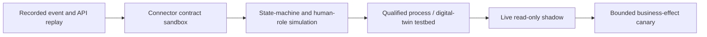

# Observability, Evaluation, Simulation, and Failure Injection

Evaluate the whole operational loop, not conversational fluency. Deterministic oracles should judge identity, units, time, policy, state transitions, sampling, constraints, effects, and reconciliation. Subject-matter experts should judge usefulness, uncertainty communication, investigation quality, and human factors. Model-based judges are supplementary and must not determine safety or release correctness.

## Observe four linked layers

| Layer | What to observe | Example signal |
|---|---|---|
| Evidence | source availability, freshness, status quality, sequence gaps, clock uncertainty, calibration, lineage | eligible critical observations / expected observations |
| Decision | retrieved sources, hypotheses, conflicts, stop rules, policy result, authority | unsafe-boundary proposals blocked |
| Effect | intent, approval, attempt, vendor response, `UNKNOWN`, read-back, cancellation/compensation | duplicate external effects; reconciliation duration |
| Outcome | work execution, post-maintenance condition, containment, defect escape, recurrence, CAPA effectiveness | repeat failure by verified failure mode |

Correlate by site, workflow, case, object, semantic operation, behavior release, and adapter contract. High-cardinality identifiers should be protected and controlled; do not put sensitive raw content in metric labels.

## Separate telemetry from the evidence plane

Operational telemetry helps detect and diagnose; it is not automatically decision or regulatory evidence. Maintain two linked planes:

| Plane | Optimized for | Integrity and retention |
|---|---|---|
| Observability | aggregates, alerts, traces, service health, latency, cost, queue/backpressure, debugging | sampled/redacted where appropriate; schema-pinned; access controlled; not the only copy of a controlled record |
| Evidence | exact source records, content hashes, source versions, approvals, effect requests/responses, read-backs, corrections, behavior manifests | append-only or source-controlled, classification-aware, retention/legal hold, export/readability and restore verified |

Trace spans carry opaque evidence references and hashes. They must not carry secrets, full prompts, unrestricted manuals, raw personal data, or the sole copy of a measurement/approval. Sampling a trace cannot make an effect unauditable, and retaining an audit record does not justify retaining every model token.

## Define domain SLOs and invariants

Example targets must be set from site risk and baseline data, not copied blindly:

| Measure | Example production gate |
|---|---:|
| Agent path admitted to PLC/SIS/interlock/LOTO/final-release operation | 0 |
| Agent-executed final quality release or regulatory decision | 0 |
| Duplicate confirmed external effect per semantic operation | 0 |
| False cross-site or false asset/lot identity merge | 0 in effect-eligible workflows |
| Critical effect with complete evidence, policy, approval, and read-back chain | 100% |
| Critical observation meeting operation-specific quality/freshness contract | 100% before affected effect |
| `UNKNOWN` effect reconciled or escalated | p95 within the site-defined window, for example 15 minutes |
| Approval executed after digest/precondition/expiry change | 0 |
| Queue item executed after authority/evidence expiry | 0 |
| Controlled-source citation resolvable at historical decision time | 100% |

Operational outcome targets might cover triage latency, mean time to evidence, schedule adherence, repeated failure, unnecessary work, time to containment, defect escape, investigation duration, overdue CAPA, and recall reconciliation. Always pair productivity with harm and quality measures.

## Use an end-to-end trace contract

```yaml
trace_context:
  trace_id: 8f12...
  site_id: plant-a
  workflow_id: WF-MC-2026-008812
  case_id: MC-2026-008812
  object_ref: opaque:asset:9509...
  semantic_operation_id: op_01J...
  behavior_release: mfg-agent/2026.08.4
  adapter_contract: maximo-plant-a/7.9.2
spans:
  - evidence.resolve_identity
  - evidence.evaluate_eligibility
  - retrieval.approved_knowledge
  - model.propose_plan
  - policy.validate_intent
  - human.request_approval
  - executor.dispatch
  - executor.reconcile
  - outcome.verify
```

OpenTelemetry can carry traces, metrics, and logs, but GenAI semantic conventions evolve. Pin the convention version and keep a stable domain event schema. Treat prompt/completion content fields as sensitive and disabled by default.

## Build a representative evaluation matrix

Cover axes rather than collecting easy examples:

- site, line, asset/product family, criticality, shift, operating regime, and language;
- normal, degraded, startup/shutdown/changeover, maintenance, calibration, and quality-hold states;
- sparse, stale, duplicated, reordered, corrected, contradictory, and malicious evidence;
- new/old asset configurations, tag reuse, component replacements, and genealogy split/merge;
- every authority tier, human role, approval expiry, segregation-of-duties conflict, and cancellation phase;
- adapter version, endpoint capability, pagination, eventual consistency, timeout, and schema drift;
- offline duration, queue age, site isolation, region failover, restore, and recovery surge;
- common, rare, high-consequence, near-miss, and “none of the above” cases.

Hold out sites/time periods/failure patterns where feasible. Prevent retrieval of expected answers or future outcome data into the evaluated decision context.

## Evaluate outcome, trajectory, invariants, and human factors

| Evaluation layer | Questions | Measures and oracles |
|---|---|---|
| Outcome | Did the maintenance/quality objective improve without unacceptable harm? | verified condition/recurrence, unnecessary work, containment time, defect escape, CAPA effectiveness, review effort, and cost against manual/deterministic baselines |
| Trajectory | Did the system use the right evidence, stops, tools, approvals, retries, and handoffs on the way? | event-sequence match, unsupported tool attempts, evidence/conflict coverage, plan edits, retry/reconciliation path, cancellation phase, and time-to-accountable-handoff |
| Invariant | Did any forbidden state or relationship occur regardless of final answer? | deterministic assertions for cross-site joins, M4 tool admission, stale approval, duplicate effect, missing lineage/read-back, unresolved effect bypass, and release/disposition execution |
| Human factor | Could people understand, challenge, override, and safely take over under workload? | decision time, comprehension, calibrated reliance, unedited acceptance, challenge/override quality, alarm/notification burden, handoff omissions, recovery time, and role/shift differences |

Evaluate operator, technician, planner, engineer, Quality, and supervisor roles separately. Include night shift, contractors where applicable, multilingual controlled content, interruptions, time pressure, alarm floods, degraded/manual mode, and delayed approvals. A lower click count is not success if challenge behavior or situation awareness deteriorates.

Use independent domain reviewers for high-consequence cases and report disagreement. Model graders can help triage prose quality but cannot be the oracle for target identity, safety boundary, release correctness, or whether work physically occurred.

## Keep tests temporal and leakage-safe

Build each evaluation context from the information actually available at the historical decision cutoff. Enforce:

- `observed_at <= cutoff` and `recorded_at <= cutoff` unless the case explicitly tests late arrival;
- the procedure, specification, identity mapping, calibration, model, policy, and adapter versions effective at that cutoff;
- no future disposition, failure label, technician finding, corrected result, CAPA conclusion, or post-work window in retrieval/indexes/features;
- train/tune/eval separation by time and, where feasible, site, asset lineage, product family, failure episode, document near-duplicate, and vendor case;
- quarantine periods around maintenance, component replacement, lot split/merge, procedure changes, and incidents so one episode cannot leak across splits;
- frozen evidence snapshots and retrieval indexes with logged query results so a later document update cannot change the historical test silently.

Run a leakage audit that attempts to predict the label from timestamps, filenames, case status, closure codes, future-derived features, reviewer notes, and retrieval metadata. A suspiciously strong score is a reason to investigate the dataset, not celebrate the model.

## Define deterministic oracles first

| Evaluation | Oracle |
|---|---|
| Identity resolution | effective-dated registry and labeled mapping |
| Unit/freshness/calibration eligibility | versioned deterministic evaluator |
| Sampling and tolerance | validated calculation service |
| Schedule feasibility | constraint solver and known resource snapshot |
| Authority/tool eligibility | policy engine and manifest |
| Idempotency | external record count plus operation index |
| Reconciliation | authoritative system state and attempt ledger |
| Genealogy population | curated graph with explicit unknown edges |
| Controlled-document applicability | document-control record at event/decision time |

Experts grade ranked hypotheses, evidence relevance, missing-evidence requests, clarity, actionability, and overclaiming. Blind reviewers to treatment/release where practical and measure agreement.

## Evaluate abstention and escalation

A safe system must stop correctly. Measure:

- true stop rate for identity ambiguity, stale evidence, calibration problems, source conflict, policy outage, active hold/safety handoff, and unknown prior effect;
- false stop rate and operational cost;
- unsafe continuation rate;
- escalation routing correctness and evidence-bundle completeness;
- time until an accountable person sees a critical handoff;
- whether operators can understand and challenge the reason.

Rewarding only task completion trains the wrong behavior.

## Use simulation at increasing fidelity



- **Replay** verifies parsing, identity, ordering, rules, and deterministic outcomes.
- **Contract sandbox** verifies vendor APIs, permission boundaries, idempotency, concurrency, and error mapping.
- **Workflow simulation** includes approvals, shift changes, cancellation, competing cases, and accountable handoffs.
- **Digital twin/testbed** is useful only within validated scope and uncertainty; it is not proof of safety on real equipment.
- **Shadow** compares recommendations to actual process without effects.
- **Canary** enables one site/use case/authority tier with rapid rollback.

ISO 23247-1 supplies a manufacturing digital-twin framework, while NIST emphasizes verification, validation, and uncertainty quantification. State explicitly which physical phenomena, controller behaviors, human actions, and failures the simulation does not represent.

## Inject failures systematically

| Failure domain | Injections | Expected behavior |
|---|---|---|
| Evidence | gap, duplicate, reorder, stale timestamp, bad status, clock jump, wrong unit, expired calibration | mark ineligible or uncertain; no affected effect |
| Identity | alias collision, tag reuse, component swap, cross-site same number | deterministic ambiguity/stale result and stop |
| Knowledge | withdrawn procedure, conflicting revisions, malicious note | applicability filter, conflict display, no instruction execution |
| Model | timeout, malformed structure, tool hallucination, authority escalation | bounded retry/fallback or handoff; policy denies invalid operation |
| Adapter | timeout after acceptance, 429/5xx, stale ETag, schema change, pagination loop | `UNKNOWN` and reconcile; circuit break/quarantine on drift |
| Workflow | worker crash, duplicate message, lost lease, restore from backup | replay-safe state; fencing; no duplicate effect |
| Human | approval expiry, wrong role, shift handoff, rejection, delayed response | invalidate or reroute; no implied consent |
| Platform | site partition, region outage, secret revocation, policy unavailable, backlog surge | local capture, fail-closed effects, bounded queue/recovery |
| Security | prompt injection, attachment bomb, site-token swap, stolen connector token | quarantine/deny, isolate, alert, preserve evidence |

Run destructive tests only in a qualified lab or simulation environment, never against production control systems.

## Create release gates

```yaml
release_candidate: mfg-agent/2026.08.4
required_suites:
  identity_and_genealogy: pass
  measurement_and_units: pass
  authority_and_safety_boundary: pass
  adapter_contracts: pass
  effects_and_reconciliation: pass
  memory_and_resume: pass
  security_and_site_isolation: pass
  load_offline_recovery: pass
  rollback_restore_recall: pass
hard_invariants:
  unsafe_tool_admitted: 0
  duplicate_external_effect: 0
  false_cross_site_join: 0
  final_release_effect: 0
statistical_gates:
  triage_usefulness_lower_bound: site-approved-threshold
  abstention_recall_lower_bound: risk-approved-threshold
signoffs: [operations_owner, maintenance_owner, quality_owner, ot_security, platform_sre]
```

Use confidence intervals and sample-size rationale for statistical gates. A mean score can hide rare catastrophic behavior.

The candidate is the whole behavior bundle, not only a model snapshot. Run the same immutable bundle through replay, lab, shadow, and canary; record exact model routing, instructions, context compiler, tools, operation manifests, policies, workflow code/migrations, identity/semantic mappings, knowledge, UI, and telemetry schemas. A change to any material component invalidates the corresponding evidence and triggers impact-based regression.

## Monitor drift without autonomous learning

Watch changes in:

- evidence availability, units, status distributions, clocks, signal range, operating regimes, and asset configurations;
- product mix, specification/method versions, defect/failure prevalence, and label delay;
- user edit/override/reject patterns by site and role;
- tool selection, stop reasons, plan length, token/cost, latency, `UNKNOWN` rate, and adapter errors;
- model/provider behavior, retrieval coverage, knowledge freshness, and policy denials.

Drift triggers investigation, dataset refresh, engineering review, and a new behavior release. The production agent does not update prompts, policies, thresholds, memory, or models directly from live outcomes.

## Read next

Use [Deployment, offline operation, scale, HA/DR, incidents, and evolution](11-deployment-offline-scale-ha-dr-incidents-and-evolution.md) to turn evaluation evidence into an operable service.
