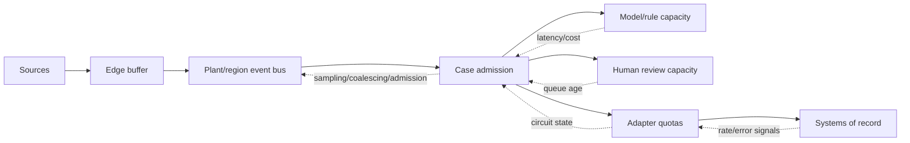
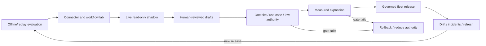

# Deployment, Offline Operation, Scale, HA/DR, Incidents, and Evolution

Production design must assume intermittent plant links, vendor maintenance windows, regional outages, event bursts, stale approvals, delayed quality outcomes, and recovery backlogs. Availability is not “always proceed.” For high-risk operations, the correct degraded behavior is evidence capture plus accountable manual operation with agent effects disabled.

## Place capabilities by failure domain

| Layer | Keep local | Keep regional/enterprise | Isolation behavior |
|---|---|---|---|
| Edge | protocol collectors, quality/timestamp checks, bounded buffer, health, read-only views | fleet configuration and long-term analytics | continue capture until capacity limit; never create control path |
| Plant | identity cache/source, case/workflow, policy enforcement, effect executor, site ledger, local knowledge release, kill switch | cross-site behavior registry, governance, aggregated telemetry | accept only prequalified local authority; stop central-dependent effects |
| Region | model routing, behavior/knowledge/policy distribution, evaluation, fleet observability, incident coordination | enterprise systems and governance | no assumption that plant state remained unchanged |

The exact placement follows latency, data classification, regulatory, vendor, and site-risk requirements. A local model does not make an unsafe operation safe.

## Define offline authority explicitly

```yaml
offline_profile: plant-a/2026.08
max_isolation: PT8H
allowed:
  - capture_and_buffer_evidence
  - read_cached_approved_procedure_if_not_expired
  - create_local_unsubmitted_draft
  - continue_existing_human_workflow_under_site_procedure
denied:
  - cross_site_lookup
  - new_central_approval
  - execute_expired_or_central_authority_intent
  - final_quality_release
  - controller_or_safety_action
queue_policy:
  drafts_ttl: PT4H
  effects_ttl: PT10M
  approvals_may_queue: false
reconnect_policy:
  reconcile_before_dispatch: true
  revalidate_identity_policy_evidence_approval: true
```

Queued drafts can be useful; queued approvals and effects are dangerous. After reconnection, treat each pending action as a new authorization check.

## Size queues and recovery capacity

Use workload-specific calculations:

```text
required_edge_events = peak_event_rate × maximum_isolation_seconds × safety_factor
required_bytes = required_edge_events × encoded_event_bytes × replication_overhead
recovery_net_rate = drain_rate - live_arrival_rate
recovery_time = queued_events / recovery_net_rate, only when recovery_net_rate > 0
```

For workflows/effects, size by objects and age, not only messages. Enforce per-site quotas, priority classes, maximum age, maximum attempts, payload bytes, and dead-letter quarantine. Preserve critical evidence before low-value high-frequency telemetry according to an approved data-loss policy.

Recovery drain must not overload historians, EAM/QMS APIs, model endpoints, networks, operators, or approval queues. Use adaptive throttling and fairness so a noisy site cannot starve another.

## Apply backpressure end to end



Coalesce repeated anomaly updates into one case where semantics allow; never coalesce distinct lots, components, measurements, approvals, or effects. Drop only data classes with an explicit policy and emit a gap marker.

## Plan capacity and cost per useful outcome

Track:

- evidence events/bytes per asset, line, and site;
- cases per shift, concurrency, tool calls, retrieved bytes, model input/output/cache tokens, and latency;
- human review minutes and queue age;
- adapter requests, throttles, business effects, reconciliation reads, and unknown outcomes;
- storage growth for raw evidence, controlled records, audit, workflow history, and evaluation datasets;
- cost per correctly triaged case, confirmed work-order draft, resolved unknown effect, and completed investigation.

Route deterministic extraction, rules, and calculations outside the general model. Use smaller or local models only after workload-specific quality, security, support, and cost tests.

Build a per-site capacity worksheet from measured distributions, not averages:

```text
case_arrival_peak          = max cases admitted per minute during alarm/quality bursts
service_capacity           = min(model, evidence services, policy, adapters, human review)
human_backlog_time         = queued review minutes / staffed review minutes per wall-clock minute
adapter_safe_drain         = min(vendor quota, tested rate, site network budget) - live request rate
storage_growth             = evidence + workflow + audit + traces + evaluation copies - governed expiry
recovery_headroom          = tested recovery throughput - peak live workload
```

Segment by read-only triage, human handoff, effect dispatch, reconciliation, and evidence replay because each bottleneck and consequence differs. Model tokens are often not the limiting resource; engineer/quality review, historian queries, ERP/EAM/QMS quotas, attachment scanning, and reconciliation can dominate.

Define overload states before rollout:

| State | Admission and shedding | Effects |
|---|---|---|
| `NORMAL` | all qualified cases within budgets | qualified operations allowed |
| `CONSTRAINED` | coalesce identical updates; prioritize existing high-consequence cases; defer low-value enrichment | no authority expansion; shorter expiry and tighter concurrency |
| `PROTECTIVE` | admit safety/quality evidence and human handoffs; stop new speculative cases | new effects disabled; reconcile existing unknowns only |
| `RECOVERY` | live traffic first, bounded fair backlog drain, expired items discarded with audit | revalidate every intent; no automatic queue replay |

Never drop distinct lots, serials, alarms, approvals, corrections, effect attempts, or gap markers. Shed generated explanations before source evidence.

## Design high availability around authority

- single active owner or strongly consistent transition for each workflow aggregate;
- leases with fencing tokens for failover, plus durable effect intents before dispatch;
- quorum/partition behavior that prevents two sites or regions from owning the same effect;
- independent site kill switch and fail-closed effect policy;
- replicated immutable artifacts and configuration with signed activation;
- separate failure domains for evidence capture and effect execution;
- no automatic cross-region credential substitution or site migration without reauthorization.

An active-active API does not make an effect workflow active-active safe. Test concurrent failover at the exact boundary between vendor acceptance and local commit.

## Define recovery objectives by data class

| Data class | Loss/restore concern | Recovery validation |
|---|---|---|
| Raw high-rate telemetry | bounded loss may be accepted by policy | gap markers, retention tier, replay and clock ordering |
| Qualified evidence used in a decision | must remain reproducible for required period | content hash, source metadata, readable restore |
| Controlled quality/maintenance record | governed by source system and retention | authoritative export/restore and audit trail |
| Workflow and effect ledger | no loss that could cause duplicate/unknown effect | point-in-time restore plus external reconciliation |
| Approval/signature | integrity, identity, digest, expiry | signature verification and source-system record |
| Behavior/knowledge/policy release | exact historical reconstruction | signed immutable artifact restore |
| Evaluation/incident dataset | privacy and provenance | controlled restoration, lineage, deletion/legal hold |

RPO/RTO values must follow hazard and business impact. Restore tests must prove semantic integrity, not merely that files exist.

[NIST SP 1339](https://csrc.nist.gov/pubs/sp/1339/final), published in June 2026, is a useful OT backup anchor: integrate backups with change management, create and test them regularly, and review them during recovery exercises. It does not define this agent's RPO/RTO or authorize restoring controller configuration through the agent platform.

## Reconcile after disaster recovery

After restoring state:

1. keep effect execution disabled;
2. establish trusted time, identity, secrets, certificates, policy, and artifact integrity;
3. determine the restored event/ledger cursor and possible loss window;
4. query each external system for intents that could have been accepted in that window;
5. rebuild confirmed/rejected/unknown outcomes and detect duplicates/conflicts;
6. validate asset/product identities, holds, approvals, and workflow/source versions;
7. drain evidence with bounded rate and mark gaps;
8. canary read-only workflows, then approved low-risk effects;
9. obtain operations/quality/security approval before normal authority resumes.

Recovery load is a planned capacity scenario, not an afterthought.

## Run incidents by consequence, not component

| Incident | Immediate priorities | Accountable partners |
|---|---|---|
| Unsafe-boundary attempt | disable effects, preserve trace, prove no control route/effect | operations, EHS/safety, OT security |
| Duplicate/mis-targeted work record | freeze case, reconcile source, prevent execution, correct through controlled workflow | maintenance, planner, system owner |
| Quality hold/release conflict | stop agent effects, identify product population, reconcile QMS/ERP states | quality unit, Supply Chain, legal/regulatory as applicable |
| Identity/genealogy corruption | freeze affected joins/effects, preserve versions, expand trace population conservatively | data owner, quality, maintenance |
| Compromised connector/knowledge | revoke/isolate, freeze artifacts, find affected workflows/effects/product | security, vendor, quality/operations |
| Region/site outage | local degraded procedure, queue expiry, communicate authority state | site operations, platform SRE |
| Recall/CAPA evidence issue | preserve records, reconstruct chronology/population, route decisions | quality/regulatory/legal/customer teams |

The agent may assemble incident evidence; it does not declare equipment safe, product releasable, reportability, recall class, or incident closure.

## Release behavior progressively



Canary by site, workflow, object class, shift, and authority tier. Do not canary a safety boundary. Maintain a kill switch and tested rollback for model, prompt, tools, adapters, workflow, policy, and knowledge.

## Roll back without losing workflow truth

Before rollback, inventory active workflows and effect states. The previous release must understand or safely quarantine newer state schemas. Pin old workflows to a compatible runtime where necessary. Never redispatch inflight effects merely because the model or adapter rolled back. Reconcile unknowns first, preserve release identifiers, and validate source versions before resume.

## Govern drift and learning

Learning is an offline, reviewed release process:

1. select cases under documented inclusion and privacy criteria;
2. reconcile true outcomes and remove unresolved/biased labels;
3. review incidents, overrides, failure modes, site/product coverage, and distribution change;
4. update deterministic rules, knowledge, prompt, model, or workflow only where evidence supports it;
5. run regression, safety, security, site, load, and human-factor evaluations;
6. approve and deploy a new behavior release through shadow/canary;
7. monitor predefined leading and lagging metrics and retain rollback.

No online self-training, self-editing prompts, self-granted tools, or automatic conversion of model output into approved knowledge.

## Mine failures under governance

Failure mining turns incidents, near misses, overrides, false stops, unknown effects, rejected recommendations, adapter drift, and recovery exercises into candidate improvements without teaching the production system directly.

1. Freeze the complete trajectory and behavior bundle, then reconcile the real outcome and affected population.
2. Classify the failure across identity, evidence, time/unit/calibration, retrieval, reasoning, policy, human factors, adapter, workflow/effect, security, capacity, and governance; allow multiple causes.
3. Separate model failure from missing source data, bad procedure, unsafe process design, inadequate staffing, vendor behavior, or a wrong deterministic rule.
4. Remove secrets and minimize personal/regulated data; retain lineage, legal hold, and access restrictions.
5. Have maintenance, Quality, operations, safety/security, platform, and data owners adjudicate the label and proposed control at the required consequence level.
6. Add a minimal reproducible case plus neighboring nonfailure cases to a versioned regression set. Preserve temporal cutoff and prevent outcome leakage.
7. Prefer fixing identity, source quality, policy, tool contract, UI, procedure, training, or capacity when that is the root cause; do not default to prompt tuning.
8. Release the change only through full bundle evaluation and staged rollout. Track the corrective action and predefined effectiveness window.

Mining metrics include time from discovery to reconciled classification, percentage with reproducible trajectory, recurrence by failure class, regression coverage, corrective-action effectiveness, privacy removals, and cases deliberately excluded because truth remained unresolved. Unresolved cases stay evidence, not training labels.

## Operations readiness checklist

- [ ] Offline authority and queue expiry are documented and tested per site.
- [ ] Queue sizing includes worst credible outage, event burst, and recovery drain.
- [ ] Backpressure protects sources, adapters, people, and sites fairly.
- [ ] Capacity/cost metrics tie to useful outcomes and harm metrics.
- [ ] Workflow ownership, fencing, and partition behavior prevent duplicate effects.
- [ ] RPO/RTO and restore tests cover ledgers, controlled records, releases, and reconciliation.
- [ ] Incident roles include operations, maintenance, quality, EHS/safety, OT security, SRE, Supply Chain, and legal/regulatory where applicable.
- [ ] Shadow, canary, kill switch, rollback, drift, and retirement procedures are rehearsed.

## Read next

Use [Zero-to-production roadmap, runbooks, and exercises](12-zero-to-production-roadmap-runbooks-and-exercises.md) to convert these controls into staged evidence and operational practice.
