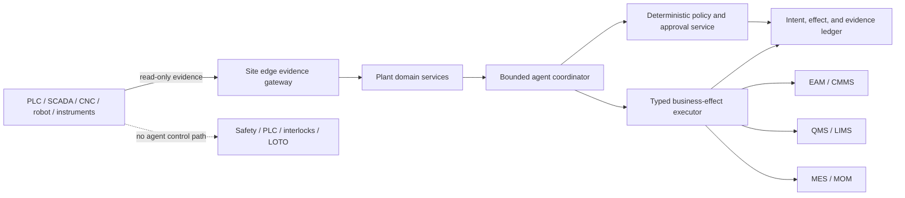

# Manufacturing Maintenance and Quality Agent

This playbook describes a production system that helps plant maintenance and quality teams assemble evidence, triage cases, draft controlled records, coordinate approved work, and verify outcomes. It is deliberately **not** an autonomous plant controller. Safety instrumented systems, PLC logic, interlocks, machine motion, energy isolation and lockout/tagout (LOTO), final product release, regulatory judgments, and other unsafe physical effects remain deterministic and accountable-human responsibilities.

The recommended starting point is one bounded coordinator, typed tools, read-only OT evidence, and a durable effect ledger. Add write authority only after the read-only loop meets measured identity, evidence, and safety gates. A multi-agent swarm is neither the default nor a maturity goal.

## Scope contract

The agent may support:

- condition and alarm triage using contextualized, quality-marked evidence;
- maintenance-request and work-order drafting, deterministic scheduling inputs, and post-work verification;
- inspection-plan lookup, result review, nonconformance and CAPA drafting, containment coordination, and recall evidence assembly;
- asset, component, lot, serial, measurement, calibration, procedure, and work-record correlation;
- safe coordination across MES/MOM, ERP, CMMS/EAM, QMS/LIMS, historians, edge gateways, and approved OEM services.

It does not own:

- control-loop outputs, PLC/robot/CNC programs, setpoints, interlocks, bypasses, alarm suppression, SIS actions, or machine start/stop;
- LOTO, permits, line clearance, safety sign-off, guarding decisions, or statements that equipment is safe;
- final usage decisions, material disposition, batch/lot release, concession/deviation approval, regulatory submission, recall classification, or CAPA closure;
- inventory allocation, goods movement, transportation, purchasing, or network-wide supply planning, which belong to Supply Chain;
- utility dispatch or energy-control optimization, which belong to Energy; or enterprise incident automation, which belongs to IT/SRE.

## Learning path

Read the guides in order when building a new system. Experienced teams can use the decision and runbook guides directly, but should not skip identity or effect semantics.

| Order | Guide | Outcome |
|---:|---|---|
| 1 | [Mission, boundaries, and workload fit](01-mission-boundaries-and-workload-fit.md) | Select an appropriate use case, authority ceiling, and smallest safe loop. |
| 2 | [Reference architecture and OT safety boundaries](02-reference-architecture-and-ot-safety-boundaries.md) | Separate evidence, decision, and effect paths across plant and enterprise zones. |
| 3 | [Identity, state, events, evidence, and traceability](03-identity-state-events-evidence-and-traceability.md) | Prevent false joins and preserve source, time, quality, and genealogy. |
| 4 | [Maintenance strategy, condition monitoring, and work orders](04-maintenance-strategy-condition-monitoring-and-work-orders.md) | Build the maintenance loop without confusing a prediction with an authorized job. |
| 5 | [Quality plans, inspection, nonconformance, CAPA, and release](05-quality-plans-inspection-nonconformance-capa-and-release.md) | Support quality work while keeping disposition and release accountable. |
| 6 | [Tools, connectors, adapters, and vendor coordination](06-tools-connectors-adapters-and-vendor-coordination.md) | Qualify typed integrations and isolate vendor/version differences. |
| 7 | [Planning, effects, reliability, and post-action verification](07-planning-effects-reliability-and-post-action-verification.md) | Handle retries, unknown outcomes, cancellation, compensation, and reconciliation. |
| 8 | [Context, memory, compaction, and durable orchestration](08-context-memory-compaction-and-durable-orchestration.md) | Preserve continuity without turning model memory into operational truth. |
| 9 | [Security, governance, controlled procedures, and audit](09-security-governance-controlled-procedures-and-audit.md) | Enforce site isolation, least privilege, procedure control, and evidence-grade audit. |
| 10 | [Observability, evaluation, simulation, and failure injection](10-observability-evaluation-simulation-and-failure-injection.md) | Prove behavior with deterministic oracles, traceable telemetry, and fault drills. |
| 11 | [Deployment, offline operation, scale, HA/DR, incidents, and evolution](11-deployment-offline-scale-ha-dr-incidents-and-evolution.md) | Operate at edge, plant, and region without unsafe backlog replay or uncontrolled learning. |
| 12 | [Zero-to-production roadmap, runbooks, and exercises](12-zero-to-production-roadmap-runbooks-and-exercises.md) | Advance through Stage 0–6 with measurable gates and rehearsed recovery. |

The evidence base, version caveats, and refresh record are in the [dated research packet](../../research/packets/manufacturing-maintenance-quality-agent-blueprint.md).

## System promise

For every recommendation or effect request, an operator must be able to answer:

1. Which site, line, asset, component, lot, serial, characteristic, and procedure version were involved?
2. Which observations were used, when were they observed and ingested, and what were their quality and calibration states?
3. Which facts came from authoritative systems, which were inferred, and which remain disputed?
4. What authority allowed the action, what preconditions were checked, and who approved it?
5. Did the external system accept the effect, did read-back confirm it, and what happened physically afterward?
6. Can the behavior release, tool schema, policy bundle, knowledge snapshot, and complete evidence chain be reproduced?

If the system cannot answer all six, it must not increase authority.

## Minimum production gates

The first production release should satisfy all of these conditions:

- zero direct paths from the agent runtime to safety or machine-control interfaces;
- zero agent-executed final quality releases or regulatory decisions;
- exact, effective-dated identity for every effect target and no unresolved alias collision;
- typed observation quality, source time, ingest time, unit, calibration reference, and lineage;
- an append-only intent/effect/reconciliation ledger with idempotency and explicit `UNKNOWN` outcomes;
- approval bound to the immutable action digest, target, procedure version, and expiry;
- deterministic policy enforcement outside the model and fail-closed behavior when policy is unavailable;
- read-back or independent postcondition verification for every write;
- site-scoped credentials and queues, tested offline behavior, recovery throttling, and queue expiry;
- representative evaluation, security, failure-injection, rollback, backup-restore, and recall/genealogy drills.

These are minimums, not a claim of regulatory compliance. Each plant must map local law, collective agreements, quality-system requirements, machine risk assessments, vendor support, and change-control procedures before deployment.

## Architectural stance

The dotted boundary is an architectural invariant, not a prompt instruction. Safety and control interfaces are absent from the agent's credential set, network route, and tool registry.

## What “done” means

A team has not finished because the model can create a plausible work-order draft. It is ready only when the entire socio-technical loop—identity, evidence quality, human accountability, business-system semantics, failure recovery, observability, site isolation, offline behavior, behavior release, and operational runbooks—has been tested against site-specific hazards and acceptance criteria.
