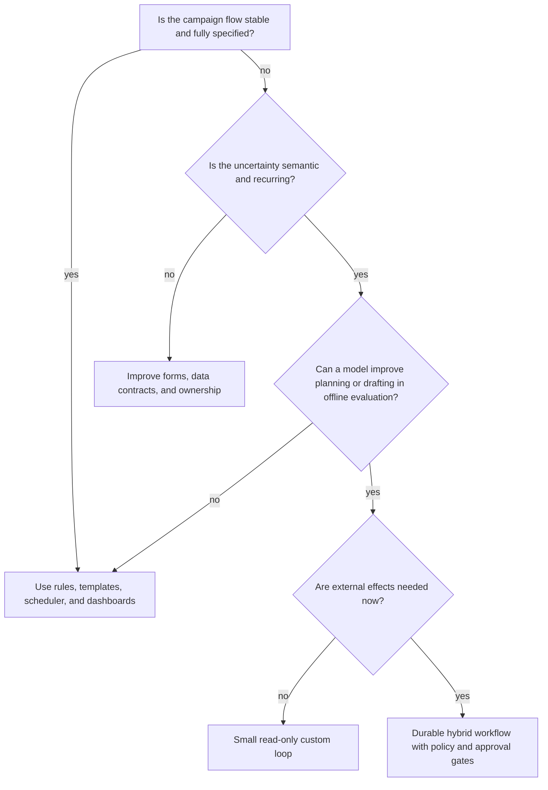
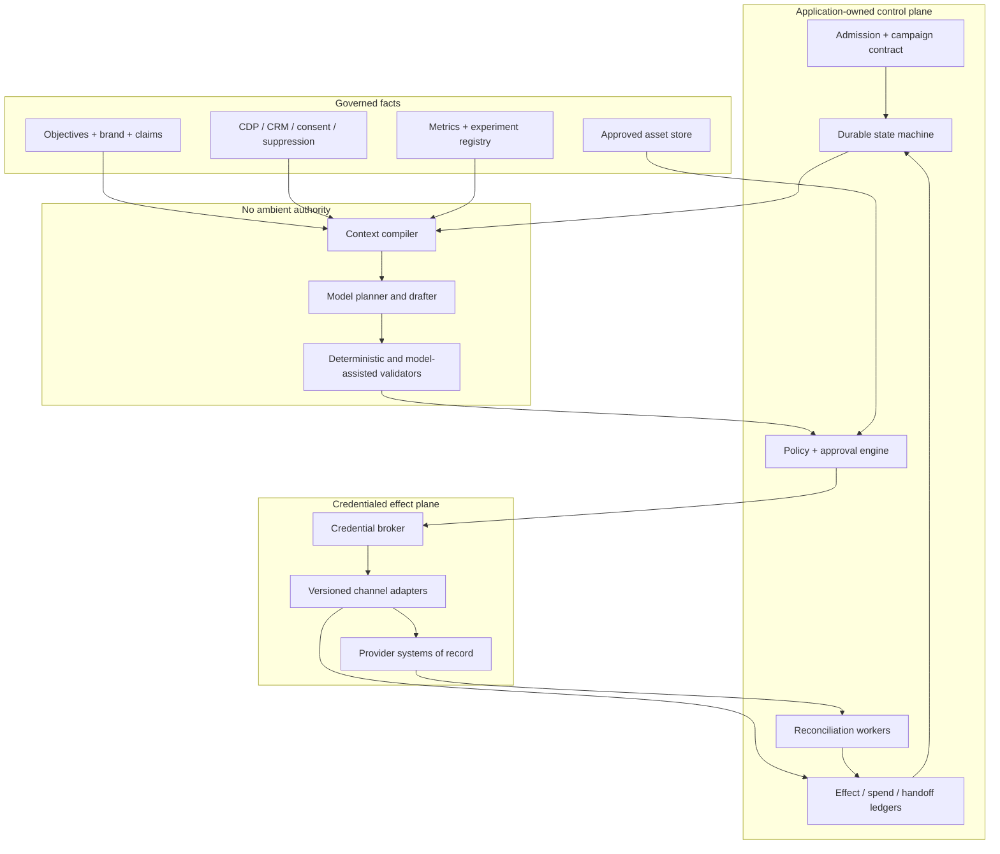
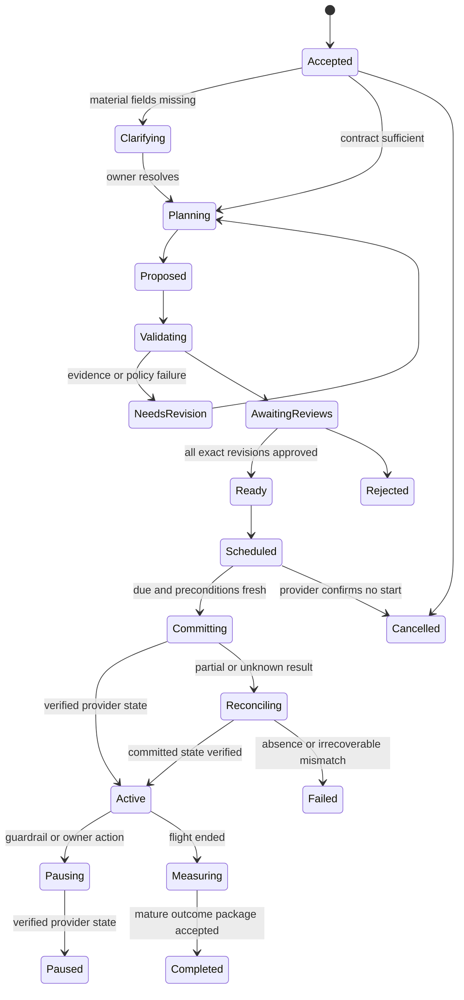

# Operating Model and Architecture

[Blueprint home](README.md) · Next: [Objectives, audiences, consent, and handoff](02-objectives-audiences-consent-and-handoff.md)

## Production position

The safest useful design is a deterministic campaign workflow with a bounded reasoning worker inside it. The model interprets briefs, proposes structured plans, drafts content, compares allowed options, and explains exceptions. Application code owns campaign state, policy inputs, audience compilation, approvals, spend reservations, provider credentials, publication effects, and completion.

This division follows the workload. Marketing combines uncertain semantic work with high-impact, externally visible, privacy-sensitive, and financially consequential effects. No single prompt, agent SDK, or channel platform has all the facts or authority needed to decide them.

## Qualify the problem before adding a model

Use this decision tree on a representative task set, not a slide-deck aspiration.



An agent is not justified merely because campaigns span several tools. Integration complexity should first be solved with explicit schemas, adapters, and workflow states. A model becomes useful when it reduces ambiguity or human synthesis work without becoming the enforcement layer.

## Workload requirements

Capture these before selecting a runtime:

| Requirement | Questions | Architectural consequence |
|---|---|---|
| Campaign duration | Minutes, days, weeks, or recurring? | Long waits and schedules require durable timers and version-aware resume |
| Channel set | Email, paid search, display, social, SMS, landing page? | Each effect needs a separate capability and reconciliation contract |
| Audience sensitivity | Personal data, minors, health, finance, politics, location, protected traits? | Some use cases are prohibited or require specialized legal/platform review; do not solve with a generic agent |
| Spend authority | Draft only, existing cap, reallocation, or new funding? | Reservations and approval tiers belong outside the model |
| Publication risk | Internal draft, reversible staging, live send, public post, paid serving? | Live external effects are D3 and need exact commit evidence |
| Data freshness | How quickly do consent, suppression, inventory, price, and CRM facts change? | Approval expiry and commit-time revalidation must match the shortest material lifetime |
| Evidence quality | What proves a claim, delivery, spend, lead, or outcome? | Artifact store, effect ledger, provider reads, and data vintages are first-class |
| Tenancy | One brand/account or many clients/regions? | Tenant/account isolation must precede retrieval, caching, and connector calls |
| Failure tolerance | Can a send be duplicated, a budget be exceeded, or an audience be incomplete? | Unknown outcomes, fences, stop controls, and reconciliation are mandatory |
| Evaluation | Can fixtures reproduce decisions and destination state? | Build a simulator and provider sandboxes before writes |

## Architecture choices

| Pattern | Control | Durability | Operational burden | Best fit | Reject when |
|---|---|---|---|---|---|
| Deterministic application | Highest | Whatever the application implements | Lowest model risk | Stable journeys, templates, thresholds, schedules | Semantic ambiguity is the measured bottleneck |
| Small custom loop | Explicit and inspectable | Usually run-scoped | Low | Stage 1 plan/draft copilot | It would manage waits, retries, approvals, or live effects in memory |
| Agent SDK | Good tool/message ergonomics | Provider/framework specific | Medium | Teams need streaming, structured tools, and eval hooks | SDK state is being mistaken for campaign truth or authorization |
| Workflow engine with model activities | Strong state and timers | Strong inside documented runtime boundary | Medium to high | Approval waits, schedules, callbacks, restarts, reconciliation | Work is short-lived and read-only, making the engine unnecessary |
| Constrained hybrid | Highest practical fit | Durable workflow plus application ledger | Medium | Real multi-channel production campaigns | Team cannot operate the workflow/store/adapter boundaries |
| Multi-agent system | Distributed and harder to inspect | Complex shared-state needs | High | Only independently scoped specialists with measured lift | Roles share context, tools, authority, or one bounded loop is sufficient |

The recommended path is hybrid, introduced incrementally: custom read-only loop first; durable workflow only when external effects or long waits make it necessary. See [custom loop versus framework versus workflow engine](../../comparisons/custom-loop-vs-framework-vs-workflow-engine.md) for cross-cutting mechanics.

## Reference architecture



### Component responsibilities

| Component | Owns | Must not own |
|---|---|---|
| Admission | Initiator, tenant, purpose, objective owner, budgets, deadline, requested effects | Free-form authorization inferred from prompt |
| Durable workflow | Campaign state, waits, revision transitions, cancellation, resume | Provider truth or creative judgment |
| Context compiler | Minimal authorized projection with provenance and freshness | Broad data dump or secret material |
| Model worker | Plan/draft proposal, uncertainty, evidence references, bounded recovery suggestion | Policy, spend, consent, recipient, or publish decision |
| Validators | Schema, brand rules, links, claims evidence, accessibility, provider dry-run results | Final legal judgment or unsupported factual approval |
| Policy/approval engine | Current deterministic eligibility and exact-effect grant | Model-scored “safe” decision |
| Credential broker | Account-bound, operation-bound, short-lived access | Token exposure to model or general worker |
| Adapter | Canonical provider request, timeout, request/response evidence, postcondition read | Cross-provider business policy |
| Ledgers | Intended effect, approval, spend reservation, receipt, outcome, corrections | Sampled telemetry as truth |
| Reconciler | Resolve mixed, late, duplicate, drifted, and ambiguous outcomes | Blind retry based on transport error |

## First bounded loop

Stage 1 should have no live channel credentials. Give the model only read-only, derived tools over synthetic or scrubbed fixtures:

```text
accept typed brief
while budget remains:
    assemble minimal evidence projection
    request exactly one of:
        ask_material_question
        inspect_approved_policy
        inspect_campaign_fixture
        propose_campaign_plan
        draft_asset_variant
        finish_with_artifact
    validate tool schema and remaining budget
    append evidence-bearing result
stop on explicit artifact, user decision, deadline, or limit
```

Hard limits should include model turns, tool calls, retrieved bytes, variants, elapsed time, and token/cost budget. Completion means a schema-valid proposal with unresolved items and evidence references—not a persuasive message. Any request to publish, upload an audience, change budget, or hand off a lead returns `capability_unavailable` and an explanation.

### Minimal plan output

```yaml
campaign_plan:
  campaign_id: "cmp_01K..."
  objective_revision: 3
  audience_definition_ref: "auddef_42@7"
  channels: ["email", "paid_search"]
  offer_ref: "offer_spring@4"
  claim_refs: ["claim_18@2", "claim_27@1"]
  creative_brief_ref: "brief_9@5"
  schedule_window: {start: "2026-09-10T09:00:00Z", end: "2026-09-24T23:59:59Z"}
  flight_currency: "USD"
  flight_cap_minor: 2500000
  experiment_ref: "exp_17@1"
  required_reviews: ["brand", "claims", "budget_owner", "channel_owner"]
  unresolved: ["landing_page_accessibility_review"]
  evidence_refs: ["artifact://objectives/31", "artifact://claims/18"]
```

This is framework-neutral illustrative YAML. Production schemas need field-level classification, versioning, validation, authorization, and canonical identifiers.

## Lifecycle and ownership



The application owns every transition. Model output is only a proposed event payload. Provider callbacks are hints until authenticated, deduplicated, and reconciled to current state.

## Model strategy

Select models by task slices rather than a single “marketing quality” score:

| Slice | Needed capability | Safer fallback |
|---|---|---|
| Brief normalization | Instruction following, schema fidelity, calibrated uncertainty | Rule-based extraction plus required fields |
| Evidence-bound planning | Long-context selection, citation fidelity, constraint tracking | Human planner using compiled brief |
| Creative variants | Style control, diversity within claims and brand limits | Approved templates and copy blocks |
| Exception triage | Compare provider evidence and propose bounded next steps | Deterministic error map and operator queue |
| Outcome synthesis | Separate observation, attribution, and causal claims | Fixed report template or analytics handoff |

Use snapshot/version identifiers where available, structured output with schema validation, and smaller/cheaper models only after they pass the same critical slices. A fallback model cannot silently inherit a broader context window, tool set, or authority. Never let the model's self-reported confidence select the risk tier.

## Language and runtime selection

| Runtime | Strength in this workload | Watch-outs |
|---|---|---|
| TypeScript/Node.js | API/webhook ecosystem, shared schemas with review UI, async I/O | CPU/statistical work belongs in bounded workers; cancellation and promise cleanup need tests |
| Python | Evaluation, experimentation, data tooling, provider libraries | Keep notebook/data-process authority separate from campaign commit services |
| Java/Kotlin or C# | Mature business-service, type, identity, and workflow ecosystems | Avoid creating a separate scripting control plane merely for model calls |
| Go | Simple operational binaries, concurrency, predictable deployment | Some provider/model SDK parity may lag; verify required APIs |

Prefer the existing service language and a single schema source. A Python evaluation/analytics worker can consume immutable artifacts without receiving channel write credentials. Framework choice follows tested lifecycle needs; it does not define the architecture.

## Architecture acceptance tests

- [ ] Removing the model still leaves a valid deterministic approval, commit, reconciliation, and incident path.
- [ ] A model can neither mint credentials nor call a raw provider SDK.
- [ ] Campaign and effect state survives worker death without replaying a verified effect.
- [ ] A connector outage does not erase or silently advance state.
- [ ] Changing an audience, asset, destination, schedule, spend cap, or provider account invalidates the relevant approval.
- [ ] A read-only Stage 1 deployment contains no transitive route to a live send or spend capability.
- [ ] One campaign cannot consume unbounded turns, variants, tool calls, API quota, or worker time.
- [ ] Multi-agent delegation remains disabled unless a measured specialist slice justifies it.
- [ ] A human can inspect the objective, evidence, proposal, policy result, approval, provider receipt, and outcome without reconstructing chat history.

## Sources

- [Anthropic: Building effective agents](https://www.anthropic.com/engineering/building-effective-agents)
- [OpenAI: A practical guide to building agents](https://openai.com/business/guides-and-resources/a-practical-guide-to-building-ai-agents/)
- [Google Ads API structure and `validate_only`](https://developers.google.com/google-ads/api/docs/concepts/api-structure)
- [Google Ads API batch processing](https://developers.google.com/google-ads/api/docs/batch-processing/overview)
- [Mailchimp Marketing API fundamentals](https://mailchimp.com/developer/marketing/docs/fundamentals/)

