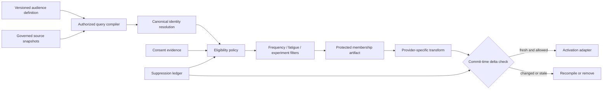

# Objectives, Audiences, Consent, and Lead Handoff

[Blueprint home](README.md) · Previous: [Operating model and architecture](01-operating-model-and-architecture.md) · Next: [Content, brand, channels, and publication](03-content-brand-channels-and-publication.md)

## The root problem

A marketing brief such as “grow qualified pipeline with mid-market finance leaders” contains neither a safe objective nor an executable audience. It omits the metric definition, time horizon, exclusions, consent purpose, jurisdictions, source rights, channel eligibility, sensitive inferences, frequency rules, sales boundary, and acceptable spend. The agent may identify these gaps; it must not fill material ones by guessing.

Use three distinct records:

1. **Objective contract:** what outcome is sought and what constraints define acceptable pursuit.
2. **Audience definition and snapshot:** how candidates are selected, which exact eligible members were frozen, and why each could be activated.
3. **Lead handoff contract:** the minimal evidence transferred to sales when a marketing-defined threshold is met.

These records evolve independently. A new suppression event can change the eligible activation set without changing the business objective. A changed objective can invalidate an experiment without altering historical audience evidence.

## Objective contract

```yaml
campaign_objective:
  campaign_id: "cmp_01K..."
  revision: 4
  tenant_id: "tenant_72"
  owner_principal: "team:growth-emea"
  objective_type: "qualified_lead_generation"
  target_metric_ref: "metric://mql_accepted@6"
  guardrail_metric_refs: ["metric://unsubscribe_rate@3", "metric://complaint_rate@2"]
  evaluation_window: {start: "2026-09-01", end: "2026-10-31"}
  target_geographies: ["GB", "IE"]
  allowed_channels: ["email", "paid_search"]
  prohibited_methods: ["purchased_email_list", "sensitive_trait_inference"]
  flight_cap: {currency: "GBP", minor_units: 1800000}
  lead_handoff_policy_ref: "policy://mql-handoff-emea@9"
  attribution_policy_ref: "policy://marketing-measurement@12"
  approved_at: "2026-08-30T14:32:00Z"
```

The metric reference identifies an externally governed definition; it is not model-created prose. “Increase conversions” is incomplete if conversion event, unit, population, value, attribution window, data latency, and owner are unknown.

## Audience records

### Audience definition

An audience definition is versioned query intent, not a materialized recipient list:

| Field | Purpose |
|---|---|
| `audience_definition_id`, `revision` | Stable identity and optimistic-concurrency boundary |
| `purpose` and `campaign_id` | Prevent reuse for an unrelated campaign |
| `population_source_refs` | Name governed tables, CDP segments, first-party events, or provider-native audiences |
| `inclusion_predicate` | Machine-readable business criteria using approved fields |
| `exclusion_predicate` | Employees, customers, recent recipients, competitors, minors, unavailable regions, or other policy exclusions |
| `channel` and `sender_identity` | Consent and suppression are channel/sender specific |
| `jurisdiction_resolution` | Deterministic method plus `unknown` handling |
| `sensitive_data_classification` | Prohibited, restricted, or ordinary attributes and derived segments |
| `freshness_limit` | Maximum age of source and eligibility facts |
| `estimated_size` | Planning estimate only; not approval evidence |
| `compiler_version` | Reproducibility and upgrade boundary |

### Audience snapshot

A snapshot freezes the candidate population and the evidence needed to reproduce it:

```yaml
audience_snapshot:
  snapshot_id: "audsnap_8X..."
  definition_ref: "auddef_42@7"
  data_snapshot_refs: ["warehouse://customer360/2026-09-09T23:00Z"]
  compiled_at: "2026-09-10T01:00:00Z"
  candidate_count: 184200
  eligible_count_at_compile: 121540
  identity_namespace: "tenant_72:person_v3"
  membership_artifact_ref: "vault://audiences/audsnap_8X"
  membership_digest: "sha256:..."
  suppression_cursor: "suppression:00088421"
  policy_version: "marketing-eligibility@31"
  expires_at: "2026-09-10T07:00:00Z"
```

Membership stays in a protected audience service or activation vault. The model receives aggregate counts and carefully sampled, redacted diagnostics—not the raw list.

## Consent and suppression are decisions, not booleans

Store evidence and compute eligibility at a particular time. Do not collapse consent into `marketable=true`.

```yaml
communication_eligibility_decision:
  subject_ref: "person:93F..."
  channel: "email"
  sender_identity: "brand:example-uk"
  purpose: "product_marketing"
  destination_ref: "contact-point:email:7B..."
  jurisdiction_inputs: ["GB"]
  decision: "deny"
  reasons: ["GLOBAL_EMAIL_SUPPRESSION"]
  consent_evidence_refs: ["consent:441@2"]
  suppression_evidence_refs: ["suppression:88421"]
  policy_version: "marketing-eligibility@31"
  evaluated_at: "2026-09-10T08:59:57Z"
  expires_at: "2026-09-10T09:04:57Z"
```

The policy bundle is counsel- and privacy-owner approved for the organization's actual senders, channels, recipient types, products, countries, and data sources. Legal sources differ by jurisdiction: the FTC's CAN-SPAM guide covers US commercial email and opt-outs; current ICO guidance distinguishes UK electronic-mail contexts and recommends suppression records; CRTC CASL guidance distinguishes express and time-bounded implied consent. No model should translate those materials directly into a universal `allow` rule.

### Precedence and fail-closed behavior

Evaluate in this order:

1. tenant, brand, sender, account, and purpose must be unambiguous;
2. prohibited audience/data classes and source-rights restrictions deny immediately;
3. explicit objection, opt-out, deletion-related marketing prohibition, legal hold, safety block, or global suppression denies;
4. channel-specific eligibility policy evaluates current evidence and jurisdiction;
5. campaign exclusions, frequency caps, fatigue limits, deliverability quarantine, and experiment assignment apply;
6. provider-specific upload/targeting policy applies;
7. unknown, stale, contradictory, or unavailable required facts deny or route to review.

An opt-out that arrives after audience compilation but before send must win. Therefore every addressable activation rechecks the latest suppression state at commit or uses a provider-side audience that is proven to receive sufficiently fresh suppressions. The test is end-to-end latency, not the existence of a nightly sync.

## Audience compilation pipeline



The identity service returns a canonical subject or `ambiguous`; it does not let the model choose between similar names, emails, device IDs, or households. Hashing an email for upload changes representation, not sensitivity, purpose, or consent obligations.

## Audience decision table

| Situation | Default decision | Reason and required evidence |
|---|---|---|
| First-party subscriber with current purpose/channel evidence and no suppression | Eligible after full policy check | Preserve collection notice, event, scope, sender, and time |
| Address on purchased list | Deny by default | Supplier possession does not prove permitted collection, sharing, or communication |
| Publicly listed business address | Not automatically eligible | Public availability is not consent; apply jurisdiction/recipient/purpose policy |
| Customer asked to unsubscribe | Suppress | Keep minimum suppression record needed to prevent reintroduction |
| Consent exists for email but campaign uses SMS | Deny absent SMS basis | Channel specificity matters |
| Jurisdiction cannot be resolved | Deny or review | Model inference is not a legal fact |
| Segment derived from health, finance, political, or other sensitive signals | Prohibit or specialist review | Law and platform policies may restrict collection and personalized targeting |
| Provider reports a high match rate | No eligibility change | Match is technical reach, not permission |
| Audience snapshot is older than policy freshness | Recompile | Approval does not freeze mutable rights or objections |
| Experiment requires a holdout | Preserve assignment | Optimization cannot move members across arms after assignment |

Google's current Customer Match guidance is a useful example of provider drift: it recommends the Data Manager API for new workflows, limits uploads to first-party context data, and requires consent signals in relevant EEA use cases. Treat such requirements as versioned connector policy and capability tests, not generic audience truth.

## Preference and suppression ledger

The ledger should be append-only at the event layer and project current state deterministically:

| Event | Required fields | Projection consequence |
|---|---|---|
| `consent_granted` | subject/contact point, channel, purpose, sender/brands, notice/version, method, source, time | Adds evidence; does not override a later objection |
| `consent_withdrawn` | same identity dimensions, received time, source | Denies matching future use |
| `marketing_objected` | subject/contact point, scope, received time | Creates minimum suppression state |
| `bounce_hard` or `complaint` | provider message and campaign IDs, destination, observed time | Quarantines destination/sender scope per policy |
| `contact_point_changed` | old/new canonical references, provenance | Does not silently transfer consent |
| `suppression_imported` | source, scope, digest, effective time | Must be idempotent and auditable |
| `resubscription_confirmed` | new evidence and verification path | Creates a new evidence event; history remains |

Deletion workflows must distinguish removal of marketing-profile data from retaining the minimum lawful suppression token needed to respect an objection. Privacy/legal owners define the implementation; the model does not.

## Lead handoff boundary

Marketing owns qualification evidence and delivery to a sales-owned intake. Sales owns account/contact consolidation, assignment, opportunity stages, seller actions, forecasting, and direct revenue workflow.

```yaml
lead_handoff:
  handoff_id: "mhl_01K..."
  tenant_id: "tenant_72"
  marketing_subject_ref: "person:93F..."
  campaign_ref: "cmp_01K@4"
  qualification_policy_ref: "policy://mql-handoff-emea@9"
  qualification_facts:
    event_refs: ["event://form_submit/991", "event://webinar_attendance/77"]
    evaluated_at: "2026-09-18T10:30:00Z"
  permitted_fields: ["business_email", "company_name", "declared_interest", "source_campaign"]
  consent_and_notice_refs: ["consent:441@2", "notice:lead-form@6"]
  deduplication_key: "tenant_72:person_93F:policy_9"
  requested_disposition: "accept_or_reject"
```

The sales intake returns a receipt such as `accepted`, `duplicate`, `rejected_invalid`, `rejected_policy`, or `unknown`, plus its own canonical lead reference if permitted. Marketing stores the receipt and stops. It does not create an opportunity, change a sales stage, choose an account owner, or send account-specific follow-up.

### Closed-loop outcomes

Sales may return governed events or aggregates such as lead accepted, rejected, meeting held, or opportunity outcome for measurement. The contract must specify allowed purpose, fields, lag, correction behavior, identity join, retention, and aggregation. Marketing cannot use revenue feedback to silently broaden targeting or reclassify an individual. Any optimization feature derived from downstream outcomes is a versioned analytical artifact with leakage, bias, and drift tests.

## Failure modes and recovery

| Failure | Detection | Containment | Recovery |
|---|---|---|---|
| Suppression feed late or cursor gap | Freshness SLO and sequence gap | Stop affected activation | Backfill, compare authoritative source, recompile, document residual sends |
| Wrong tenant/brand audience | Tenant/account mismatch, canary identity | Disable upload/send and quarantine artifact | Remove provider audience where possible, revoke token, notify, incident review |
| Consent evidence missing after merge | Identity/version conflict | Deny affected subjects | Human resolution; never transfer evidence by similarity |
| Snapshot differs from approved count/digest | Digest or row-count mismatch | Block commit | Recompile from pinned sources and reapprove material change |
| Provider audience partially uploads | Per-row errors and provider job result | Do not mark entire audience active | Reconcile every row/class; fix only safe failures; preserve exclusions |
| Opt-out races scheduled send | Event time after compile, before commit | Remove or cancel affected member | Confirm provider removal; if already sent, record unavoidable residual effect |
| Handoff timeout after sales accepted | No receipt but matching dedupe key exists | Mark `unknown`, do not create another lead | Query sales intake by handoff ID; attach existing receipt |
| Sales rejects invalid/duplicate lead | Typed rejection | No opportunity work by marketing | Correct source if factual, update marketing quality evaluation, or close |

## Acceptance checklist

- [ ] Objective, metric, guardrails, audience, channels, cap, and sales boundary are machine-readable and versioned.
- [ ] Audience compilation runs under tenant/purpose-filtered identity and produces a protected, hashed snapshot record.
- [ ] Raw audience membership never enters model context, generic artifact storage, or telemetry.
- [ ] Consent evidence preserves channel, purpose, sender, scope, source, notice, and time.
- [ ] Suppression latency is measured end to end and activation fails closed when stale.
- [ ] Provider-native consent fields are mapped explicitly; unsupported opt-out values never disappear in transformation.
- [ ] Sensitive-targeting cases have an explicit prohibition or specialist approval path.
- [ ] Audience changes after approval trigger a documented materiality/reapproval rule.
- [ ] Lead handoff is idempotent and cannot mutate sales opportunity state.
- [ ] Closed-loop outcomes include purpose, provenance, data vintage, and correction semantics.

## Sources

- [FTC CAN-SPAM compliance guide](https://www.ftc.gov/business-guidance/resources/can-spam-act-compliance-guide-business)
- [ICO: Plan direct marketing](https://ico.org.uk/for-organisations/direct-marketing-and-privacy-and-electronic-communications/direct-marketing-guidance/plan-direct-marketing/)
- [ICO: Respect people's preferences and suppression lists](https://ico.org.uk/for-organisations/direct-marketing-and-privacy-and-electronic-communications/direct-marketing-guidance/respect-peoples-preferences/)
- [CRTC CASL guidance on consent](https://crtc.gc.ca/eng/com500/guide.htm)
- [California Attorney General: Global Privacy Control](https://www.oag.ca.gov/privacy/ccpa/gpc)
- [Google Ads Customer Match policy](https://support.google.com/google-ads/answer/6299717)
- [Google Ads: Provide consent for Customer Match](https://support.google.com/google-ads/answer/14546648)

