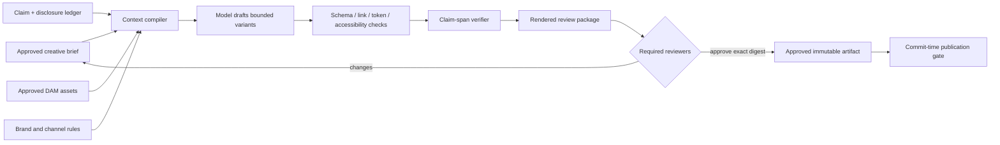
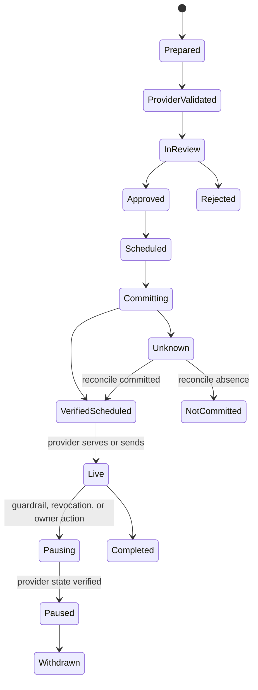

# Content, Brand, Channels, and Publication

[Blueprint home](README.md) · Previous: [Objectives, audiences, consent, and handoff](02-objectives-audiences-consent-and-handoff.md) · Next: [Budget, pacing, experiments, and attribution](04-budget-pacing-experiments-and-attribution.md)

## Production position

The model may create candidate content only from an approved brief, governed claims, allowed assets, and channel constraints. It must not invent product availability, price, customer results, endorsements, legal terms, competitive claims, or disclosures. Publication is a separate effect that binds an immutable asset revision to an exact account, audience, destination, schedule, and approval set.

Separate four decisions that vendor interfaces often combine:

1. **Content validity:** does the artifact conform to schema, links, dimensions, accessibility, and required fields?
2. **Claim support:** does each factual or comparative statement have current evidence and permitted scope?
3. **Brand/editorial approval:** does an accountable reviewer approve this exact representation for this context?
4. **Publication eligibility:** may this exact asset be published to this channel, account, audience, geography, schedule, and budget now?

A platform acceptance or `validate_only` response addresses only part of the first and fourth questions. Google Ads, for example, exposes validation and policy-review fields, but its review cannot establish the advertiser's factual substantiation, brand intent, or legal compliance.

## Creative artifact contract

```yaml
creative_artifact:
  artifact_id: "creative_01K..."
  revision: 6
  campaign_ref: "cmp_01K@4"
  format: "responsive_search_ad"
  channel: "google_ads"
  locale: "en-GB"
  content:
    headlines: ["...", "..."]
    descriptions: ["...", "..."]
    final_url_ref: "landing-page:summer-offer@9"
  source_brief_ref: "brief_9@5"
  claim_bindings:
    - span_ref: "headline:1"
      claim_ref: "claim_18@2"
      substantiation_ref: "evidence://study/88"
  disclosure_refs: ["disclosure:pricing-conditions@3"]
  media_asset_refs: ["dam://hero/172@4"]
  generated_by: {model_release: "release://marketing-agent/31", prompt_policy: "creative@12"}
  content_digest: "sha256:..."
  created_at: "2026-09-08T11:20:00Z"
```

The final URL is a versioned destination, not arbitrary text. The review package renders the actual channel representation, resolved URL/redirect chain, media, localization, personalization tokens, sender identity, disclosures, and fallback behavior.

## Claim ledger

Every material claim should resolve to a record with:

| Field | Why it matters |
|---|---|
| Claim text and normalized proposition | Detect paraphrases that exceed approved meaning |
| Allowed product, audience, geography, channel, and time scope | Evidence may not generalize across contexts |
| Evidence and owner | Reviewer can inspect substantiation |
| Evidence date and expiry | Prices, availability, certifications, and performance change |
| Required qualifier/disclosure | Prevent omission during compression or localization |
| Prohibited transformations | Block “up to” becoming guaranteed, correlation becoming causation, or customer-specific results becoming typical |
| Review class | Legal, medical, financial, regulatory, brand, or ordinary factual review |
| Revocation reason and effective time | Pause affected active assets when truth changes |

FTC advertising guidance states that claims must be truthful, non-deceptive, and evidence-based; sector-specific requirements can add stronger substantiation. The agent should therefore retrieve approved claim records, not browse for convenient support while drafting. If new evidence is needed, open a bounded research/review task and leave the claim unresolved.

## Drafting flow



Variation budgets matter. Limit the number of variants per brief, require distinct hypotheses rather than surface paraphrases, and reject variants that cannot be connected to a permitted experiment or editorial purpose. More content is not automatically more learning.

## Review roles and invalidation

| Review | Owns | Approval invalidated by |
|---|---|---|
| Marketing owner | Objective, offer, audience fit, channel plan | Objective, offer, channel, audience, or schedule material change |
| Brand/editorial | Voice, representation, visual system, content quality | Any content/media/layout/personalization change |
| Claims/legal specialist | Substantiation, disclosures, regulated language | Claim, qualifier, evidence, geography, audience, destination, or law/policy change |
| Privacy/consent | Data use, targeting, personalization, tracking | Audience source, purpose, consent mapping, pixel/tag, destination, or vendor change |
| Accessibility reviewer/tool | Required accessible alternatives and interaction quality | Render, media, template, component, or destination change |
| Channel owner | Account identity, sender reputation, platform rules, operational timing | Account, sender, campaign type, provider policy, schedule, or destination change |

An approval record contains reviewer principal/role, artifact digest, resolved destination digest, audience and channel references, policy versions, approval scope, expiry, and use count. “Approve all variants” is permitted only if the approved set and transformation rules are finite and immutable.

## Channel authority matrix

| Capability | Danger tier | Default mode | Commit evidence |
|---|---:|---|---|
| Render preview or lint asset | D0 | Automatic | Validator versions and result artifact |
| Read provider policy/review status | D1 | Automatic within account scope | Account/resource ID, observed time, request ID |
| Create provider draft in a sandbox/staging account | D2 | Automatic after policy | Draft ID and canonical read-back |
| Create live-account draft that cannot serve/send | D2 | Bounded | Account, status, content digest, cleanup path |
| Upload a customer audience | D3 | Exact approval or narrow deterministic runbook | Audience digest, consent mapping, provider job and row outcomes |
| Schedule or send marketing email/SMS | D3 | Exact approval | Sender, recipient snapshot, content, time, policy/suppression check, receipt |
| Publish public social/landing content | D3 | Exact approval | Account, destination, revision, canonical URL/post ID, read-back |
| Enable/pause paid campaign or change targeting | D3 | Exact approval or narrow runbook | Campaign/account, before/after state, budget/targeting digest, provider receipt |
| Install integration, grant account access, change brand/policy safeguards | D4 | Proposal only | Separate administrative process |

D3 does not mean every individual recipient must be manually clicked. A campaign-level approval can bind an exact audience snapshot, content digest, schedule, sender, cap, and deterministic per-recipient suppression recheck. Any changed material fact invalidates it.

## Prepare, validate, approve, commit

### Prepare

- create provider objects disabled, paused, draft, or unpublished when the provider supports that state;
- attach internal `campaign_id`, `artifact_revision`, and `effect_id` through supported labels/names/metadata without exposing sensitive data;
- render the real provider format and resolve personalization tokens against synthetic fixtures;
- run link, redirect, malware, accessibility, disclosure, tracking, and destination-health checks;
- record provider capability and API version.

### Validate

- run local schema and policy validation first;
- use provider dry-run/checklist/policy validation when documented;
- read back the provider object and compare material fields;
- treat provider review as asynchronous when its status says so;
- fail if a limited/disapproved/reviewing state violates the campaign's launch policy.

Google Ads' `validate_only` can validate many mutate requests without execution, while `ad_group_ad.policy_summary` exposes review and policy findings. Mailchimp exposes a send-checklist endpoint and distinct draft, schedule, send, unschedule, and cancel actions. These are useful provider mechanisms, but the application still owns the complete gate.

### Approve

Present the reviewer with the actual render, account/sender, destination, audience size and definition, schedule/time zone, budget, tracking, claims and disclosures, experiment arm, and rollback/cancellation limits. Show what cannot be reversed once sending or serving starts.

### Commit

Immediately before commit:

1. resolve canonical provider account and resource IDs;
2. verify the approved artifact and destination digests;
3. re-evaluate consent/suppression and audience expiry;
4. confirm schedule window, campaign revision, experiment assignment, and spend reservation;
5. check current policy revocations and provider capability;
6. fence competing attempts;
7. dispatch once and enter `committing` or `unknown` until verified.

## Scheduling semantics

A schedule is a durable intent, not proof that publication will occur. Store IANA time zone, local wall-clock intent when relevant, UTC execution time, daylight-saving resolution, provider account time zone, latest-valid start, expiry, and cancellation deadline.

At wake-up, refresh every mutable precondition. Do not reuse context summaries or approvals that predate an asset, audience, offer, inventory, policy, consent, sender-reputation, destination, or budget change. When a provider accepts a schedule, store its resource ID and read back the effective time/status.

## Publication and withdrawal state



Withdrawal cannot unsend an email or erase impressions already served. It is a new audited effect: stop future delivery, pause serving, remove or correct content where possible, update claims/asset ledgers, and account for residual exposure.

## Personalization boundaries

Prefer finite, reviewed templates and deterministic field substitution. Do not generate recipient-specific claims at send time unless every allowed transformation is bounded and tested. Never expose one person's data to another recipient through cache keys, examples, model context, fallback tokens, or review previews.

Reject personalization based on inferred sensitive traits, unverified identity, private free text, or opaque long-term memory. Provider-native optimization and automatically created assets may modify delivery or creative behavior; treat enabling them as a separate approved capability with documented experiment and audit implications.

## Failure matrix

| Failure | Signal | Safe response |
|---|---|---|
| Claim evidence expires before launch | Ledger expiry/revocation | Block affected assets, require new evidence and review |
| Model drops required disclosure | Span/disclosure validator | Reject variant; add deterministic template guard |
| Provider accepts invalid brand representation | Local reviewer disagreement | Provider acceptance never overrides brand/claims gate |
| Asset edited in provider UI after approval | Change feed/read-back digest mismatch | Pause or block launch; import change as new unapproved revision |
| Link redirects to another domain or unavailable offer | Redirect/destination monitor | Block commit or pause live asset |
| Schedule interpreted in wrong time zone | Read-back differs from intent | Unschedule if possible; correct and reapprove timing |
| Send/publish response lost | Transport timeout | Mark `unknown`; query by provider resource/effect metadata before retry |
| Partial campaign creation | Per-operation provider results | Keep disabled; reconcile each resource; compensate or repair explicitly |
| Provider policy status changes after launch | Status poll/change event | Apply predeclared pause/escalation rule; preserve provider evidence |
| Public correction needed | Incident/review decision | Publish approved correction or withdraw through a new effect; retain history |

## Release checklist

- [ ] Every material claim maps to current evidence, allowed scope, qualifier, and owner.
- [ ] Render tests cover all locales, devices, fallback tokens, tracking parameters, and accessibility requirements in scope.
- [ ] Review approvals bind exact content, media, destination, account, audience, schedule, and policy versions.
- [ ] Provider UI edits are detected and cannot bypass approval.
- [ ] Draft/checklist/dry-run status is stored separately from live publication state.
- [ ] Schedules revalidate mutable facts and have explicit expiry/cancellation behavior.
- [ ] Send/publish adapters have effect IDs, receipts, read-back, unknown-outcome reconciliation, and stop controls.
- [ ] Provider automated creative/targeting features are disabled by default or explicitly approved and evaluated.
- [ ] Withdrawal/correction limitations are communicated before approval and drilled operationally.

## Sources

- [FTC: Advertising and marketing](https://www.ftc.gov/business-guidance/advertising-marketing)
- [FTC: Endorsement Guides](https://www.ftc.gov/system/files/ftc_gov/pdf/P204500%20Guides%20Concerning%20Endors%20and%20Testimonials.pdf)
- [Google Ads policies](https://support.google.com/adspolicy/answer/6008942)
- [Google Ads API validation](https://developers.google.com/google-ads/api/docs/concepts/api-structure)
- [Google Ads ad policy-summary fields](https://developers.google.com/google-ads/api/fields/v25/ad_group_ad)
- [Mailchimp Marketing API and send checklist](https://mailchimp.com/developer/marketing/api/)
- [Mailchimp schedule campaign](https://mailchimp.com/developer/marketing/api/campaigns/schedule-campaign/)

