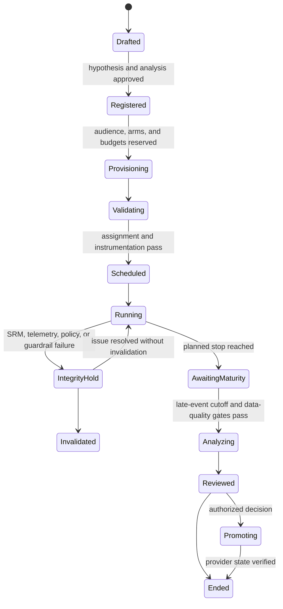

# Budget, Pacing, Experiments, and Attribution

[Blueprint home](README.md) · Previous: [Content, brand, channels, and publication](03-content-brand-channels-and-publication.md) · Next: [Tools, effects, integrations, and reconciliation](05-tools-effects-integrations-and-reconciliation.md)

## Separate money, delivery, and evidence

Three ledgers must not be collapsed:

- **Authority ledger:** how much may be committed, by whom, for which campaign/channel/account/time window.
- **Delivery and spend ledger:** what providers report as budget configuration, impressions, delivery, billable spend, credits, and adjustments.
- **Outcome evidence ledger:** what events were observed, how they were attributed, whether data is mature, and what causal claims are justified.

The model can recommend a budget scenario or explain a pacing deviation. It cannot create money, raise a cap, reinterpret an attribution report as causal proof, or promote a treatment by itself.

## Spend authority contract

```yaml
spend_authorization:
  authorization_id: "spauth_01K..."
  tenant_id: "tenant_72"
  campaign_ref: "cmp_01K@4"
  currency: "USD"
  flight_cap_minor: 2500000
  channel_caps_minor:
    google_ads: 1700000
    paid_social: 800000
  permitted_accounts:
    - "google_ads:customers/1234567890"
    - "paid_social:account_88"
  valid_window: {start: "2026-09-10T00:00:00Z", end: "2026-09-30T23:59:59Z"}
  budget_change_policy_ref: "policy://campaign-spend@11"
  approver_principal: "role:regional-budget-owner"
  approval_digest: "sha256:..."
  expires_at: "2026-10-01T00:15:00Z"
```

Amounts are integer minor units with explicit currency. The application rejects currency conversion unless a separately governed rate and approval exist. Taxes, fees, credits, platform billing thresholds, and agency margins are either included in the cap model or explicitly excluded and reported; never assume a provider “budget” equals final invoice cost.

## Reservations and commit-time checks

Before a platform budget or enable action:

1. acquire a campaign/account fence;
2. calculate current committed, reserved, reported, and worst-case unsettled spend;
3. reserve the maximum incremental exposure this effect can create;
4. verify provider-account currency and budget type;
5. validate the requested budget against campaign, channel, account, and organizational caps;
6. bind approval to the exact before/after values and time window;
7. commit once, read back provider state, and settle or retain the reservation;
8. reconcile later billable spend and adjustments.

The reservation must model provider semantics rather than use a naive “daily budget × days” formula. Google Ads currently distinguishes average daily and campaign total budgets; its average-daily documentation says daily spend may vary while monthly charging is bounded using 30.4, and total budgets are available only for specified campaign types. Microsoft Advertising likewise warns that a budget is a target and actual spend may be higher or lower. Connector capability tests and finance review determine the safe internal headroom.

## Budget actions and authority

| Action | Default | Approval and evidence |
|---|---|---|
| Read configured budget, spend, and delivery | Automatic D1 | Scoped account identity, report time, provider request ID |
| Produce forecast/scenario | Advisory | Assumptions, data vintage, uncertainty, no commit |
| Lower budget or pause for a tripped safety guardrail | Narrow preauthorized D3 runbook may be acceptable | Deterministic threshold, bounded targets, reason, read-back, owner notification |
| Increase budget within already approved per-channel envelope | Approval or tightly bounded deterministic rule | Remaining reservation, exact change, experiment integrity, provider semantics |
| Reallocate between channels | Human budget owner | Opportunity cost, experiment impact, caps, before/after plan |
| Extend dates while preserving daily budget | Human budget owner | Raises possible total exposure; calculate new flight maximum |
| Change currency, billing account, payment method, or create credit authority | D4 proposal only | Separate finance/admin workflow |

“Pause” is safer than “increase,” but it can still harm a live experiment, contracted delivery, or business commitment. Preauthorized pauses need explicit scope, alerting, and resume ownership.

## Pacing controller

Use deterministic pacing calculations. The model may classify context or draft a recommendation after the controller produces facts.

```text
expected_to_date = pacing_curve(campaign_time, approved_flight_cap, calendar)
reported_spend = provider_reports(vintage)
unsettled_upper_bound = reservations + known_reporting_lag_buffer
exposure = reported_spend + unsettled_upper_bound
deviation = exposure - expected_to_date

if hard_cap_risk or policy_guardrail_breach:
    execute approved pause runbook or require emergency approval
elif deviation outside review_band:
    open recommendation with evidence
else:
    continue and record observation
```

The curve can be linear, day-of-week weighted, event weighted, or platform-specific, but it is versioned and approved. The reporting-vintage and lag buffer are visible. A model must not “correct” a lagging report by inventing spend.

### Pacing invariants

- Use event time, provider account time zone, report-generation time, and ingestion time separately.
- Treat provider-reported recent metrics as provisional when the provider documents latency or conversion lag.
- Do not optimize against spend or conversions whose correction/restatement window is still material.
- Preserve experiment allocation and shared-budget constraints before changing spend.
- Fence simultaneous UI, API, batch, and automation changes; Google Ads explicitly documents concurrent-modification errors and provides change-event evidence with a finite query window.
- A recommendation never reserves funds. Only an authorized effect does.

## Experiment contract

Pre-register before any treatment can serve:

```yaml
marketing_experiment:
  experiment_id: "exp_17"
  revision: 1
  campaign_ref: "cmp_01K@4"
  hypothesis: "Approved claim framing B increases qualified-form completion without increasing complaints"
  unit: "eligible_person"
  assignment_method: "deterministic_hash_v2"
  arms:
    control: {weight: 0.5, artifact_ref: "creative_40@3"}
    treatment: {weight: 0.5, artifact_ref: "creative_41@2"}
  primary_metric_ref: "metric://qualified_form_completion@5"
  guardrail_metric_refs: ["metric://complaint_rate@2", "metric://unsubscribe_rate@3"]
  minimum_detectable_effect: 0.08
  planned_sample_size: 120000
  analysis_window: {start: "2026-09-10", end: "2026-09-30"}
  late_event_cutoff: "2026-10-14T23:59:59Z"
  multiplicity_family: "autumn_acquisition_primary"
  stopping_policy_ref: "policy://experimentation@8"
  exclusions: ["employees", "prior_converters", "active_sales_opportunity"]
  analyst_owner: "team:growth-analytics"
```

The analytics or experimentation owner defines statistical methods. The agent can populate a draft, verify completeness, create approved provider resources, monitor integrity, and assemble the evidence package. It does not select favorable metrics after seeing results.

## Experiment lifecycle



Google Ads supports several experiment workflows with traffic splitting, scheduling, reporting, and end/promote/graduate operations. Those mechanics are provider-specific. The application still preserves the registered hypothesis, assignment, budget independence, integrity checks, and decision record.

## Integrity checks before effect estimates

| Check | Release/decision consequence |
|---|---|
| Assignment reproducibility | Block if the same unit can enter inconsistent arms |
| Sample-ratio mismatch (SRM) | Diagnose before effect interpretation; unresolved SRM invalidates the result |
| Pre-treatment balance | Investigate material differences; do not “adjust until significant” |
| Exposure contamination | Quantify cross-arm or provider-optimization leakage; invalidate when it destroys estimand |
| Instrumentation parity | Verify event definitions, logging paths, and loss rates by arm |
| Guardrails | Pause/escalate per registered policy; quality cannot average away harm |
| Concurrent campaign edits | Freeze or version; unregistered changes confound interpretation |
| Novelty/seasonality | Do not generalize beyond tested time/population without evidence |
| Attrition and missingness | Report by arm and test sensitivity |
| Multiple testing and peeking | Apply registered family/stopping rules |

Microsoft's production experimentation research treats SRM as a high-value symptom of assignment or data-quality defects. Google Ads itself recommends clear hypotheses, preselected metrics, limited variables, and avoiding uncontrolled base-campaign edits. These are stronger foundations than model-generated winner narratives.

## Attribution evidence ladder

| Evidence | What it can support | What it cannot support by itself |
|---|---|---|
| Delivery receipt / impression / send | The provider recorded delivery or serving under its definition | Human attention, persuasion, or incremental outcome |
| Click/open/engagement | A tracked interaction under a specific measurement system | Identity certainty, causality, or revenue |
| First-party conversion event | A governed event occurred | Which touchpoint caused it |
| Platform-attributed conversion | The provider assigned credit under a named model/window | Cross-platform deduplication, unbiased incrementality, direct-revenue truth |
| Rule- or data-driven multi-touch attribution | Credit under explicit observational assumptions | Randomized causal effect |
| Randomized channel/creative/geo holdout | Incremental effect for the tested population, period, assignment, and compliance | Universal future effect or every subsegment |
| Marketing-mix model | Aggregate association/estimated contribution under model assumptions | Individual-path truth; stable causal effect without validation/calibration |

GA4 currently offers data-driven, paid-and-organic last-click, and Google-paid-channels last-click attribution; older first-click, linear, time-decay, and position-based models were removed in 2023. This evolution demonstrates why every stored result needs model and configuration versions. Attribution reports also have path coverage limits, and recent conversions can be reattributed. Treat the numbers as revisable observations.

## Outcome record and maturity

```yaml
outcome_observation:
  observation_id: "obs_01K..."
  campaign_ref: "cmp_01K@4"
  provider_account_ref: "google_ads:customers/1234567890"
  metric_ref: "provider_metric://conversions"
  event_window: {start: "2026-09-10", end: "2026-09-30"}
  report_generated_at: "2026-10-15T03:00:00Z"
  ingested_at: "2026-10-15T03:08:42Z"
  attribution_model_ref: "ga4:data_driven@2026-09-config-4"
  conversion_window_days: 30
  data_vintage: "final_for_campaign_policy"
  value: 184.2
  modeled_or_fractional: true
  correction_of: null
  source_request_ref: "provider-request:..."
  limitations: ["platform_scope_only", "not_incrementality"]
```

Recent results may be `provisional`, `lag_adjusted`, `mature_for_operational_use`, or `restated`. Google Ads documents conversion lag and supports conversion restatement/retraction operations. Never overwrite history silently; append corrections and recompute derived reports.

## Decision rights

| Decision | Model role | Owner |
|---|---|---|
| Recommend testable hypothesis | Draft and identify missing design facts | Marketing + analytics owner |
| Register metric and estimand | None beyond schema assistance | Analytics/experimentation governance |
| Assign subjects/traffic | None | Deterministic experimentation system/provider |
| Pause on safety guardrail | Explain evidence; may invoke preauthorized deterministic path only | Policy/runbook owner |
| Declare winner | Summarize reviewed evidence and uncertainty | Named experiment decision owner |
| Promote treatment | Produce exact proposal | Budget/channel owner through D3 commit |
| Increase or reallocate budget | Scenario analysis only | Authorized budget owner |
| Call attributed revenue “incremental” | Prohibited without causal evidence | Analytics owner under defined method |

## Failure matrix

| Failure | Signal | Containment and recovery |
|---|---|---|
| Provider daily spend exceeds naive expectation | Spend reconciliation and internal cap forecast | Pause/reduce via policy, retain buffer, revise connector budget model |
| Two workers adjust same budget | Fence/version conflict or provider concurrent-modification error | One owner per account/campaign; refresh and re-propose |
| Spend report is late | Freshness/vintage SLO | Freeze increases; use conservative unsettled bound |
| Batch partially creates campaign resources | Per-operation status | Keep resources disabled, reconcile each, repair or compensate |
| Experiment shared budget or external edit contaminates arms | Config diff/change event | Hold analysis, stop or invalidate according to registered policy |
| SRM or arm-specific event loss | Integrity monitor | Do not compute winner; diagnose and rerun if needed |
| Attribution model/configuration changes mid-flight | Version drift detector | Split vintages or recompute; disclose discontinuity |
| Offline conversion duplicated or later retracted | Stable conversion identity and correction events | Deduplicate, restate/retract, append audit trail |
| Outcome arrives after campaign completion | Late-event policy | Reopen measurement artifact only; do not replay campaign effects |
| Model recommends chasing provisional ROAS | Data-vintage gate | Reject recommendation until maturity rule passes |

## Production checklist

- [ ] Every spend action is bounded by currency, account, campaign, channel, time, and worst-case exposure.
- [ ] Provider budget semantics and billable-spend reconciliation are tested in sandbox and low-risk canary accounts.
- [ ] Pacing uses deterministic curves, event/report/ingestion times, and conservative lag buffers.
- [ ] Pause, resume, increase, and reallocation are separate authority classes.
- [ ] Experiments are registered before serving with unit, assignment, arms, metric, guardrails, sample/power plan, stopping, and late-event policy.
- [ ] SRM, instrumentation parity, contamination, concurrent changes, and guardrails run before winner analysis.
- [ ] Attribution observations store provider, model, window, configuration, vintage, revisions, and limitations.
- [ ] Causal language is limited to designs that justify it.
- [ ] Corrections, retractions, credits, and late outcomes append history and trigger controlled recomputation.
- [ ] The model cannot promote a treatment or raise a spend cap.

## Sources

- [Google Ads campaign budgets](https://developers.google.com/google-ads/api/docs/campaigns/budgets/overview)
- [Microsoft Advertising budget and bid strategies](https://learn.microsoft.com/en-us/advertising/guides/budget-bid-strategies?view=bingads-13)
- [Google Ads experiments overview](https://developers.google.com/google-ads/api/docs/experiments/overview)
- [Google Ads experiment guidance](https://support.google.com/google-ads/answer/7281575)
- [Microsoft Research: Diagnosing sample-ratio mismatch](https://www.microsoft.com/en-us/research/publication/diagnosing-sample-ratio-mismatch-in-online-controlled-experiments-a-taxonomy-and-rules-of-thumb-for-practitioners/)
- [Google Research: Measuring ad effectiveness using geo experiments](https://research.google/pubs/measuring-ad-effectiveness-using-geo-experiments/)
- [Google Analytics attribution](https://support.google.com/analytics/answer/10596866)
- [Google Ads conversion lag](https://support.google.com/google-ads/answer/9347141)
- [Google Ads conversion adjustments](https://developers.google.com/google-ads/api/reference/rpc/v22/ConversionAdjustmentTypeEnum.ConversionAdjustmentType)

