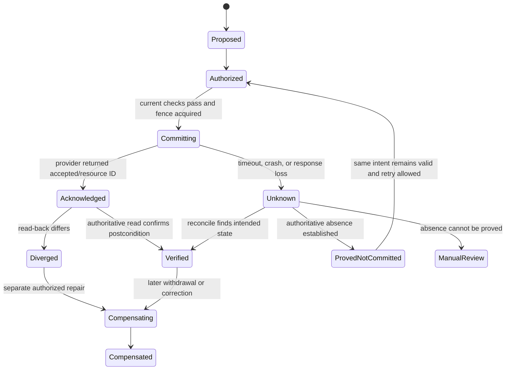
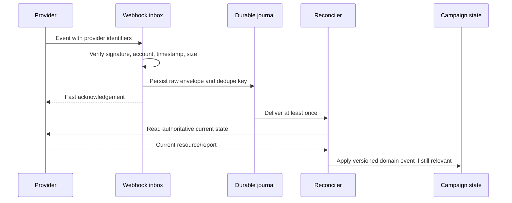

# Tools, Effects, Integrations, and Reconciliation

[Blueprint home](README.md) · Previous: [Budget, pacing, experiments, and attribution](04-budget-pacing-experiments-and-attribution.md) · Next: [State, context, memory, and orchestration](06-state-context-memory-and-orchestration.md)

## Integrations are semantic contracts

A generic `publish_campaign`, `sync_audience`, or `set_budget` tool hides the details most likely to cause production harm. Providers differ in draft/live states, budget types, policy review, partial failure, batch behavior, rate limits, API lifetimes, idempotency, cancellation, report freshness, account hierarchy, and webhook guarantees.

Build a small internal capability vocabulary, then implement and test one provider-specific adapter per capability. The model receives logical references and typed proposals; it never receives raw SDK clients, OAuth tokens, arbitrary HTTP, generic browser control, or dynamic plugin installation.

## Integration map

| System | Read capabilities | Write/effect capabilities | Authoritative for | Default posture |
|---|---|---|---|---|
| Campaign/objective service | Brief, owners, approvals, policy refs | Versioned plan state | Internal campaign intent | Required and application-owned |
| CRM/CDP/warehouse | Governed traits/events/segments | Protected snapshot/materialization | Source records under their own contracts | Read through purpose/tenant filters; no opportunity writes |
| Consent/preference service | Evidence, objections, suppression cursor | Append preference/suppression events through dedicated flows | Current marketing eligibility inputs | Required; fail closed when stale |
| DAM/CMS/brand registry | Assets, claims, templates, destinations | Draft or approved revision | Approved source content | No arbitrary filesystem or URL fetch |
| Email/marketing automation | Draft/checklist/status/report | Audience sync, schedule, send, cancel where supported | Provider delivery/send state | D3 gate; reconcile recipients and status |
| Advertising platform | Account/campaign/budget/policy/report/change data | Draft, audience, experiment, budget, enable/pause | Provider serving and spend state | D3 gate; versioned account-scoped adapter |
| Social/landing-page platform | Draft/render/status | Publish/unpublish/schedule | Provider public state | D3 exact-account and destination gate |
| Experiment/analytics platform | Metric, assignment, integrity, readout | Register/close experiment through governed workflow | Experiment design and analytical artifact | Agent cannot invent metric or promote treatment |
| Sales intake | Handoff status and limited outcomes | Idempotent lead handoff only | Sales disposition after receipt | No account/opportunity/direct outreach authority |
| General MCP/plugin/tool marketplace | Discovery metadata | Potentially broad dynamic effects | Nothing by default | Reject for live writes unless admitted, pinned, wrapped, and policy-tested |

Third-party tools are justified where they are the actual system of record or execution channel. Integration is not justified merely to give the model more options. If a provider lacks a safe API, produce a human-executable package. Browser/desktop automation is a last-resort, supervised, dedicated-session adapter with the separate [browser](../browser-automation-agent/README.md) or [computer-use](../computer-use-agent/README.md) control model; it must not silently expand this blueprint's authority.

## Capability registry

Store provider mechanics as tested facts:

```yaml
connector_capability:
  connector_id: "google-ads-prod-emea"
  provider: "google_ads"
  api_version: "v25"
  account_scope: ["customers/1234567890"]
  operation: "campaign_budget.update"
  danger_tier: "D3"
  request_schema: "schema://google-ads/budget-update@25.0"
  supports_validate_only: true
  supports_provider_idempotency_key: false
  partial_failure_mode: "request-configurable"
  concurrency: "provider_rejects_concurrent_object_mutation"
  reconciliation_reads: ["campaign_budget", "change_event"]
  rate_limit_profile: "quota://google-ads/basic-access@2026-08"
  credentials: "broker://google-ads/account-scoped"
  tested_at: "2026-08-31T00:00:00Z"
  expires_at: "2026-11-29T00:00:00Z"
```

The values above illustrate the schema, not a deployable capability declaration. Production tests must confirm the exact endpoint, account, client-library/API version, product configuration, and error behavior. Google Ads releases major versions frequently and documents sunset dates; HubSpot now exposes dated API tracks; Mailchimp documents plan/role-dependent capabilities. Expired capability evidence blocks or downgrades writes.

## Typed tool results

Every adapter response separates transport, provider acceptance, and verified business state:

```yaml
tool_result:
  tool_call_id: "tc_01K..."
  connector_id: "mail-provider-brand-a"
  operation: "campaign.schedule"
  attempt: 1
  request_digest: "sha256:..."
  transport: {status: "response_received", http_status: 204}
  provider_request_id: "req_..."
  provider_resource_ref: "provider-campaign:abc123"
  provider_outcome: "accepted_for_scheduling"
  verification:
    status: "verified"
    observed_state: "scheduled"
    observed_at: "2026-09-10T08:00:01Z"
    evidence_ref: "artifact://provider-readback/992"
  retry_disposition: "do_not_retry"
  next_reconcile_at: "2026-09-10T08:05:00Z"
```

Free-form success text is never sufficient. Large reports and recipient-level errors live in protected artifacts with count, digest, schema, classification, and retention metadata; model context receives only the minimum projection.

## Effect envelope

```yaml
effect_intent:
  effect_id: "eff_01K..."
  semantic_key: "tenant_72:cmp_01K:google_ads:enable:campaign_881:rev_4"
  run_id: "run_01K..."
  campaign_ref: "cmp_01K@4"
  operation: "campaign.enable"
  canonical_target:
    connector_id: "google-ads-prod-emea"
    account_id: "customers/1234567890"
    resource_id: "campaigns/881"
  parameters_ref: "artifact://effects/eff_01K/payload"
  parameters_digest: "sha256:..."
  expected_state_version: "provider-read:2026-09-10T08:55:00Z"
  approval_ref: "approval_01K..."
  policy_version: "marketing-effects@18"
  not_before: "2026-09-10T09:00:00Z"
  expires_at: "2026-09-10T09:05:00Z"
  attempt_fence: 3
```

The semantic key means “this exact business operation,” not “this HTTP attempt.” Parameter mismatch under the same key is a hard conflict. A new desired change gets a new effect ID even if it compensates an earlier effect.

## Effect state machine



`failed` is reserved for a known non-commit or terminal business rejection. A connection reset after dispatch is `unknown`. Cancellation stops future attempts; it does not prove an in-flight provider operation did not happen.

## Commit algorithm

1. Load the effect, campaign, current policy, approval, budget reservation, audience/asset revisions, and connector capability.
2. Canonicalize provider account/resource IDs and compare with the approval digest.
3. Reject expired, used, superseded, changed, revoked, cross-tenant, or out-of-budget intent.
4. Acquire a target/effect fence and persist `committing` before network dispatch.
5. Ask the credential broker for an operation/account/audience-bound token or proxy execution; never reveal it to model context.
6. Dispatch once with the provider idempotency/conditional mechanism when documented.
7. Persist provider request/resource IDs, per-item outcomes, and protected response artifacts.
8. Read authoritative provider state; transition only from verified evidence.
9. On timeout or process death, remain `unknown` and let a separate reconciler inspect provider state.
10. Release, settle, or retain spend and quota reservations according to verified outcome.

See the canonical [idempotency and side-effects guide](../../reliability/idempotency-and-side-effects.md) for the reusable pattern. Marketing-specific identity is the exact campaign revision, channel/account, provider resource, audience/content/budget operation, and scheduled window.

## Provider-specific consequences

### Google Ads

- Most mutate requests support `validate_only`; validation does not commit.
- Partial failure is available only on methods that expose the field. It commits valid operations while returning errors for invalid ones; dependent operations should often be atomic instead.
- Batch jobs always use partial-failure behavior; successful operations are not rolled back if other operations fail or a job is cancelled.
- Batch results are per operation, and concurrent changes to the same object can fail.
- Change-event data helps reconcile mutations but has a documented recent-window and row limit; it is not an infinite audit store.
- API versions have short, explicit lifetimes. A connector release must track sunset dates and upgrade tests.

Therefore a campaign is never marked created/updated from a batch-level `DONE` status alone. Reconcile every operation and read back critical budgets, status, targeting, experiments, and assets.

### Mailchimp-style campaign APIs

Mailchimp's current Marketing API exposes distinct create, content, checklist, schedule, unschedule, send, cancel, and report surfaces. Its status vocabulary includes saved, scheduled, sending, and sent states. The API documents connection limits and timeouts; a client-side timeout may coexist with continued backend work. The blueprint therefore uses provider campaign IDs, read-back, signed/deduplicated webhooks where available, and no blind resend.

Mailchimp also marks newer Audiences endpoints as beta and notes consent-mapping limitations. Do not adopt preview audience surfaces into the critical suppression path until product-specific contract and deletion tests pass.

### HubSpot-style dated APIs and webhooks

HubSpot documents dated marketing-email and webhook API surfaces and evolving field names. Pin the dated path, store provider object revisions/timestamps, validate brand/business-unit scope, and run upgrade fixtures. Authenticate webhooks, acknowledge after durable receipt, preserve offsets/cursors where provided, and periodically reconcile snapshots because event delivery is not the sole source of truth.

### Providers without proven idempotency

If a send/publish endpoint does not document an idempotency key:

- create a stable provider draft/resource first when possible;
- approve the immutable provider resource and submit it once;
- store provider IDs before advancing state;
- query status, sent items, change history, or campaign reports on ambiguity;
- require manual review if presence/absence cannot be proved;
- never use a random retry key and assume it prevents duplication.

## Webhook and change ingestion



Webhook bodies, provider names, and error messages are untrusted content. They cannot authorize effects or inject model instructions. Sequence gaps, signature failures, schema changes, and sustained delivery lag trigger connector degradation and polling reconciliation.

## Reconciliation jobs

| Job | Key comparison | Safe action |
|---|---|---|
| Effect reconciler | Intended effect vs provider state/resource/change evidence | Verify, prove absence, mark diverged, or escalate unknown |
| Audience reconciler | Approved snapshot and latest suppressions vs provider membership/job errors | Remove newly suppressed, retry proven omissions, quarantine unexpected members |
| Campaign-config reconciler | Approved revision vs provider budget/status/targeting/assets/schedule | Pause on high-risk drift; import UI change as unapproved revision |
| Spend reconciler | Reservations/commits vs provider reports/invoice-quality data | Settle, retain buffer, append adjustment, alert overrun |
| Delivery reconciler | Scheduled/sent/served intent vs provider status/report | Close known outcomes; retain partial and late statuses |
| Conversion reconciler | Stable event IDs vs provider uploads/retractions/restatements | Deduplicate and append corrections |
| Handoff reconciler | Marketing handoff ID vs sales intake receipt | Attach accepted/duplicate/rejected receipt; never create opportunity |
| Deletion reconciler | Privacy deletion/suppression scope vs audiences, caches, artifacts, provider data | Prove propagation or open an exception with owner |

## Retry matrix

| Condition | Retry? | Rule |
|---|---|---|
| Local validation/policy denial | No | Correct proposal or obtain proper authority; do not back off around policy |
| Authentication expired before dispatch | Yes after refresh | Revalidate approval/policy and use same semantic effect |
| Rate limit before provider accepted work | Bounded | Honor provider delay, jitter, deadline, and quota budget |
| 5xx/timeout after request may have arrived | Not immediately | Mark unknown; reconcile first |
| Partial batch failure | Per operation only | Never replay successful members; repair dependency groups coherently |
| Provider business rejection | Usually no | Route typed reason to owner; do not mutate intent to “make it pass” |
| Concurrency/version conflict | Re-propose | Refresh state; old approval may no longer apply |
| Webhook duplicate/out of order | Process idempotently | Reconcile current provider state and ignore stale transition |

## Connector admission checklist

- [ ] Official API, version, scopes, account hierarchy, terms, sandbox, quotas, and deprecation policy are recorded.
- [ ] Every operation has a danger tier, canonical target, schema, timeout, retry disposition, and maximum result size.
- [ ] Draft, validate, commit, cancel, and read-back capabilities are distinguished.
- [ ] Idempotency and partial-failure behavior are proven with duplicate and crash tests, not inferred from HTTP method names.
- [ ] Webhook signature, dedupe, order, retry, gap, replay, and reconciliation behavior is tested.
- [ ] Credentials are brokered, account/audience restricted, revocable, and absent from prompts, artifacts, and traces.
- [ ] API/client versions and capabilities appear in the behavior release manifest.
- [ ] Provider UI/manual edits are detected.
- [ ] Deletion, suppression, and data-rights propagation is tested end to end.
- [ ] Failure mode can degrade to proposal/manual execution without silently bypassing controls.

## Sources

- [Google Ads partial failures](https://developers.google.com/google-ads/api/docs/best-practices/partial-failures)
- [Google Ads batch processing](https://developers.google.com/google-ads/api/docs/batch-processing/overview)
- [Google Ads batch best practices](https://developers.google.com/google-ads/api/docs/batch-processing/best-practices)
- [Google Ads change events](https://developers.google.com/google-ads/api/docs/change-event)
- [Google Ads deprecation and sunset](https://developers.google.com/google-ads/api/docs/sunset-dates)
- [Mailchimp Marketing API fundamentals](https://mailchimp.com/developer/marketing/docs/fundamentals/)
- [Mailchimp API errors](https://mailchimp.com/developer/marketing/docs/errors/)
- [Mailchimp audience webhooks](https://mailchimp.com/developer/marketing/guides/sync-audience-data-webhooks/)
- [HubSpot Marketing Email API](https://developers.hubspot.com/docs/api-reference/legacy/marketing/marketing-emails/guide)
- [HubSpot webhooks guide](https://developers.hubspot.com/docs/api-reference/latest/webhooks/guide)

