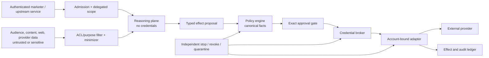

# Security, Privacy, Permissions, and Governance

[Blueprint home](README.md) · Previous: [State, context, memory, and orchestration](06-state-context-memory-and-orchestration.md) · Next: [Reliability, observability, evaluation, and incidents](08-reliability-observability-evaluation-and-incidents.md)

## Threat model

The highest-risk path is not only code execution. It is **attacker- or user-influenced content plus customer data, public communication, paid reach, and spend authority**. A malicious landing page, form submission, uploaded asset, CRM note, provider error, tool description, or prior campaign example can steer a model toward exfiltration, harmful targeting, unsupported claims, excessive spend, or unauthorized publication.

Protect these assets:

- audience membership, identifiers, consent evidence, suppression state, behavioral events, and downstream sales outcomes;
- brand/claims evidence, unreleased offers, creative, experiments, and strategy;
- ad, email, social, CMS, CDP, CRM, analytics, and warehouse credentials;
- spend authority, billing configuration, provider account reputation, sending domains, and public identities;
- approvals, policy bundles, effect/spend ledgers, audit records, evaluation corpora, and incident evidence.

Principal threats include cross-tenant audience access, suppression bypass, indirect prompt injection, raw-list exfiltration, malicious asset/link publication, recipient or account substitution, approval replay, provider-UI drift, budget escalation, compromised connector/webhook, dependency or SDK supply-chain compromise, abusive insider access, coerced or rubber-stamped approval, deliverability/account-reputation abuse, dark-pattern generation, data-poisoned episodic learning, and traces that become a second customer-data store.

## Trust boundaries



Prompt defenses reduce bad proposals; deterministic enforcement bounds impact when they fail. Credentials are attached after authorization and outside the model-visible environment.

## Identity and delegated authority

Keep these identities distinct in every D2/D3 record:

| Identity | Example | Required binding |
|---|---|---|
| Human principal | Marketing operator or reviewer | Organization, tenant, role, authentication/session strength |
| Initiating service | Scheduled campaign service | Tenant, purpose, registered workload, task contract |
| Agent workload | Planner or effect-worker deployment | Attested build/release and runtime identity |
| Campaign/run | `campaign_id`, `run_id` | Objective revision, tenant, deadline, budgets |
| Delegation | Resource × operation × constraints × time | Named accounts, brands, channels, audiences, caps, destinations |
| Provider principal | OAuth user/app/service account | Exact provider account and scopes |
| Approval actor | Brand, privacy, claims, budget, channel reviewer | Role authority over exact approval class |
| Effect | `effect_id` and semantic key | Canonical target, parameters, policy, approval, fence |

OAuth establishes delegated access to an API; it does not decide whether a campaign is appropriate. Follow the current OAuth 2.0 Security BCP for redirect, audience, token, and client security, then apply application-level operation and resource policy.

## Permission model

Use capabilities such as:

```text
tenant_72 / google_ads:customers/1234567890 / campaign.read
tenant_72 / google_ads:customers/1234567890 / campaign.draft
tenant_72 / google_ads:customers/1234567890 / campaign.pause_if_guardrail
tenant_72 / mail:brand_a / campaign.schedule / max_recipients=125000 / expires=...
tenant_72 / sales-intake:emea / lead_handoff.create / schema=mql@9
```

Avoid broad roles such as `marketing_admin`. Selectors resolve to canonical resources before authorization. Batch breadth, cross-account access, audience sensitivity, external disclosure, and spend raise the danger tier.

### Authority ceiling

| Tier | Marketing examples | Policy |
|---|---|---|
| D0 | Lint, render synthetic preview, compute deterministic diff | Automatic within resource budgets |
| D1 | Read approved campaign/provider/metric state | Purpose-, tenant-, account-, and field-scoped |
| D2 | Create internal artifact or disabled provider draft | Bounded workspace/account, reversible, auditable |
| D3 | Upload audience, send, publish, enable/target/pause ads, change budget, hand off lead | Exact approval or narrow deterministic runbook with equivalent controls |
| D4 | Grant connector access, add ad account, alter suppression/policy/audit, create payment authority, install privileged tool | Proposal only through independent administration |

## Control declaration

```yaml
control_profile:
  reviewed_on: "2026-08-31"
  task_boundary:
    initiator: "authenticated user or registered campaign service"
    authoritative_system: "campaign ledger plus channel system of record"
    out_of_scope: ["sales opportunity workflow", "market monitoring", "personal delegation"]
  identity:
    user_principal: "tenant IdP subject and reviewer role"
    workload_principal: "attested planner/effect worker identity"
    delegation: "tenant × brand × provider account × operation × cap × time"
  authority:
    autonomous_ceiling: "D2"
    d3_effects: ["audience activation", "external publication", "budget mutation", "lead handoff"]
    d4_effects: ["credential, account, billing, policy, suppression, audit, or tool administration"]
    approval_invalidation: ["audience", "asset", "destination", "account", "schedule", "budget", "policy", "consent", "provider state"]
  execution:
    isolation_boundary: "separate reasoning and credentialed adapter workers"
    filesystem: "artifact handles only; no ambient customer exports"
    egress: "allowlisted provider endpoints through account-bound proxy"
    credentials: "brokered, short-lived, scoped, revocable, never model-visible"
  effects:
    effect_id: "semantic campaign/account/operation/revision identity"
    commit_preconditions: ["current policy", "fresh suppression", "exact approval", "spend reservation", "target fence"]
    receipt_and_postcondition: "provider ID plus canonical state/report read"
    unknown_outcome: "separate reconciliation queue and owner"
  durability:
    source_of_truth: "application campaign/effect stores"
    version_policy: "pin behavior bundle; migrate or quarantine waiting runs"
    cancellation: "stop future work; reconcile in-flight external effects"
  data:
    classes: ["campaign confidential", "personal audience data", "consent/suppression", "public content", "spend/outcome"]
    retention_and_deletion: "class/purpose-specific across state, artifacts, caches, memory, traces, evals, and backups"
  evidence:
    event_contract: "marketing domain events with stable local schema"
    content_capture: "off by default; separately authorized diagnostic samples"
    audit_retention: "unsampled structured control records with restricted access"
  release:
    evaluation_slices: ["suppression", "tenant/account", "claims", "spend", "duplicate/unknown effects", "injection", "drift"]
    hard_gates: ["zero unauthorized D3 effects", "no cross-tenant access", "kill/revoke/reconcile drills"]
    kill_switches: ["admission", "audience uploads", "publication", "budget changes", "connector/account", "tenant/cell"]
    incident_owner: "marketing platform on-call plus privacy/security/brand escalation"
```

The declaration is a review artifact, not runtime configuration. Every line needs deployed policy and a passing test.

## Prompt injection and data-flow control

Treat all external and user-generated content as untrusted, including landing pages, web research, form text, uploaded documents/images, email replies, CRM notes, social comments, provider recommendations, tool descriptions, and webhook error messages.

Controls:

1. retrieve only from allowed sources for a named purpose;
2. tag provenance, trust, rights, data class, and observation time;
3. parse/render active content in isolated services; block macros, scripts, remote fetches, and hidden metadata from gaining authority;
4. pass a minimized representation to the model;
5. expose no raw egress, credentials, arbitrary URL fetch, or general provider client to reasoning workers;
6. validate all outputs against typed schemas and approved claim/policy records;
7. recompute audience, budget, destination, and permission facts in trusted code;
8. show exact external payload and destination at D3 approval;
9. run adversarial injection tests across delayed memory, tool results, images/OCR, and encoded content.

A model classifier can flag suspicious content but cannot be the only boundary between a hostile page and a customer-list upload, live publication, or budget effect.

## Data classes and minimization

| Class | Examples | Model/context rule | Storage/egress rule |
|---|---|---|---|
| Public approved content | Published product facts, approved public assets | Include with version/provenance | Govern rights and freshness |
| Campaign confidential | Briefs, launch dates, offers, spend, results | Minimum campaign slice | Tenant/role access and retention |
| Personal audience data | Email, phone, device IDs, behavior, declared interests | Exclude raw membership; aggregates or synthetic samples | Protected activation service; provider-purpose egress only |
| Consent/suppression | Evidence, objections, preference history | Decision result and opaque refs only | Highest-integrity, minimum access, proven propagation |
| Sensitive/restricted traits | Health, finance, politics, precise location, minors, protected characteristics | Prohibited by default | Specialist policy; platform/law checks; often no activation |
| Credentials/payment | Tokens, secrets, billing/payment instruments | Never | Broker/admin systems only |
| Sales outcomes | Lead disposition, opportunity/revenue result | Aggregate/authorized features only | Sales-owned; purpose-limited feedback contract |

Pseudonymization and hashing do not make audience data public. Prevent small-cohort re-identification in diagnostic samples, reports, and evaluator outputs.

## Privacy lifecycle

Map purpose, legal basis where applicable, notice, consent/objection, collection source, controller/processor roles, sharing, residency, retention, access, correction, deletion, and export across:

- CDP/CRM/warehouse sources and derived audience snapshots;
- model prompts, provider requests, caches, embeddings, and stored responses;
- channel audience uploads, tracking tags/SDKs, consent signals, and conversion uploads;
- traces, dashboards, eval corpora, shadow traffic, incident evidence, and backups;
- lead handoff and downstream outcome feedback.

Where GDPR or similar rules apply, obtain deployment-specific legal review. The blueprint uses NIST Privacy Framework principles and regulator guidance as risk-engineering inputs, not universal legal conclusions. Google's Consent Mode illustrates an important distinction: it communicates choices to Google tags but is not itself a consent banner or complete consent program.

### Rights and suppression tests

- opt-out arriving during audience compile, approval wait, provider upload, schedule wait, and active campaign;
- deletion request while membership exists in provider audience, cache, eval set, and backup;
- corrected email or identity split without transferring consent incorrectly;
- GPC/other preference signal ingestion for applicable processing;
- provider/list import with unsupported consent values;
- tenant offboarding and connector revocation;
- restore from backup followed by replay of deletion/suppression tombstones.

## Tenant, brand, and account isolation

Enforce tenant and brand before search, ranking, cache, artifact fetch, provider resolution, and telemetry export. Use separate encryption scopes and credentials where risk warrants. Never let display names select an account; resolve immutable provider IDs and show them in approvals.

High-value canaries should prove that:

- one tenant's audience/member/creative cannot appear in another tenant's context or provider call;
- a provider manager account cannot reach unapproved child accounts;
- caches and vector indexes reject cross-purpose or stale-policy hits;
- webhook account IDs map to the expected tenant before state changes;
- an internal operator cannot approve a role they do not hold;
- a model cannot compose read access plus arbitrary egress into data exfiltration.

## Governance and separation of duties

| Role | Accountable decision |
|---|---|
| Marketing owner | Objective, audience intent, offer, campaign acceptance |
| Brand/editorial owner | Exact creative representation |
| Claims/legal/privacy specialist | Regulated claim, disclosure, targeting, data-use, and jurisdiction policy |
| Budget owner | Spend envelope, reallocation, extension, and financial exception |
| Channel owner | Sender/ad/social/CMS account use, reputation, platform policy, operational window |
| Analytics/experiment owner | Metric, estimand, assignment, integrity, readout, causal wording |
| Sales owner | Lead acceptance and all account/opportunity/direct revenue workflow |
| Platform/security owner | Connector admission, workload identity, secrets, egress, incident controls |

No model output satisfies one of these roles. Dual control may be required for high-value spend, sensitive targeting, regulated claims, or broad audience uploads. Configure organizational policy rather than hard-code one universal review matrix.

## Claims, dark patterns, fairness, and deliverability

Provider policy review is neither claim substantiation nor an anti-discrimination audit. Before dissemination:

- bind every objective express or implied claim to current evidence, allowed wording, qualifier/disclosure, product, jurisdiction, channel and expiry;
- render the complete ad/email/landing-page path and review fake scarcity, disguised promotion, hidden charges, obstruction, confirm-shaming, preselected consent and misleading urgency—not isolated copy alone;
- identify sensitive and opportunity-related campaigns before audience construction, prohibit inferred protected/sensitive traits and proxies, and compare eligibility, delivery and outcome by policy-relevant slices without exposing small cohorts;
- keep human legal/privacy/brand/fairness authority independent of the campaign creator and performance owner;
- treat complaint, bounce, block, unsubscribe, spam, disapproval and sender/authentication status as stop/degrade evidence, never as a prompt to route around a provider or recipient choice.

FTC guidance requires a reasonable basis for objective advertising claims before dissemination and documents deceptive interface patterns ([advertising substantiation](https://www.ftc.gov/legal-library/browse/ftc-policy-statement-regarding-advertising-substantiation), [dark patterns](https://www.ftc.gov/reports/bringing-dark-patterns-light)). Google's current [restricted-targeting policy](https://support.google.com/adspolicy/answer/143465) limits advertiser-curated audiences for listed sensitive interests and specified demographic/geographic targeting for opportunity categories in the US and Canada. These are primary policy inputs, not universal legal conclusions.

Gmail's [sender guidelines](https://support.google.com/mail/answer/81126) currently require authentication and, for relevant bulk marketing traffic, one-click unsubscribe and low spam rates. Keep sender/domain identity, SPF/DKIM/DMARC evidence, RFC 8058 behavior, reputation, volume ramp, complaint/bounce/deferral thresholds, and independent pause/revoke controls in the channel policy. Provider deliverability acceptance does not prove consent or legal compliance.

## Software and adapter supply chain

Effect workers load only pinned adapters/SDKs, schemas, renderers and parsers from an approved behavior bundle. Record build provenance and an SBOM where available; verify signatures/digests; minimize transitive dependencies; separate build/release from campaign approval; scan advisories; and exercise rollback and token revocation. A package update cannot expand OAuth scopes, egress hosts, provider accounts, operations or result fields without a new capability review.

Run hostile fixtures through HTML/email renderers, image/PDF metadata extraction, URL/redirect resolution, CSV/formula handling, webhook parsers and provider error decoding. Sandbox active content and deny arbitrary network access. A connector compromise triggers account-scoped credential revocation, capability disablement, affected-effect query and provider-state reconciliation before service restoration.

## Security release gates

- [ ] Identity evidence joins user, tenant, campaign, workload release, delegation, approval, provider account, credential, and effect.
- [ ] D3 approvals bind exact audience/content/destination/schedule/budget/account facts and expire.
- [ ] D4 paths are unavailable to ordinary agent workers.
- [ ] Reasoning workers have no ambient provider, warehouse, filesystem, or arbitrary-network credentials.
- [ ] Raw audience/suppression data and secrets never reach prompts, long-term memory, or routine traces.
- [ ] Direct, indirect, delayed-memory, tool-metadata, image/OCR, and webhook injection tests cannot reach a D3 sink.
- [ ] Tenant/brand/account canaries and selector-confusion tests pass.
- [ ] Consent/suppression/deletion propagate through providers, caches, artifacts, evals, and restore paths.
- [ ] Provider policy changes and manual UI drift revoke or hold affected automation.
- [ ] Claim, dark-pattern, discrimination/fairness, sender authentication, deliverability, complaint and abuse gates pass with accountable reviewers.
- [ ] Pinned dependency/adapter provenance, upgrade-scope diff, sandbox, advisory response, rollback and credential-revocation tests pass.
- [ ] Independent stop, revoke, force-approval, and quarantine controls work without the agent runtime.

## Sources

- [OAuth 2.0 Security Best Current Practice, RFC 9700](https://datatracker.ietf.org/doc/html/rfc9700)
- [NIST AI Risk Management Framework](https://www.nist.gov/itl/ai-risk-management-framework)
- [NIST Generative AI Profile](https://www.nist.gov/publications/artificial-intelligence-risk-management-framework-generative-artificial-intelligence)
- [NIST Privacy Framework](https://www.nist.gov/privacy-framework/privacy-framework)
- [OWASP AI Agent Security Cheat Sheet](https://cheatsheetseries.owasp.org/cheatsheets/AI_Agent_Security_Cheat_Sheet.html)
- [OWASP Prompt Injection Prevention Cheat Sheet](https://cheatsheetseries.owasp.org/cheatsheets/LLM_Prompt_Injection_Prevention_Cheat_Sheet.html)
- [Google Ads data use in personalized ads](https://support.google.com/adspolicy/answer/6242605)
- [Google Analytics Consent Mode](https://support.google.com/analytics/answer/10000067)
- [Prompt injection and untrusted data](../../security/prompt-injection-and-untrusted-data.md)
