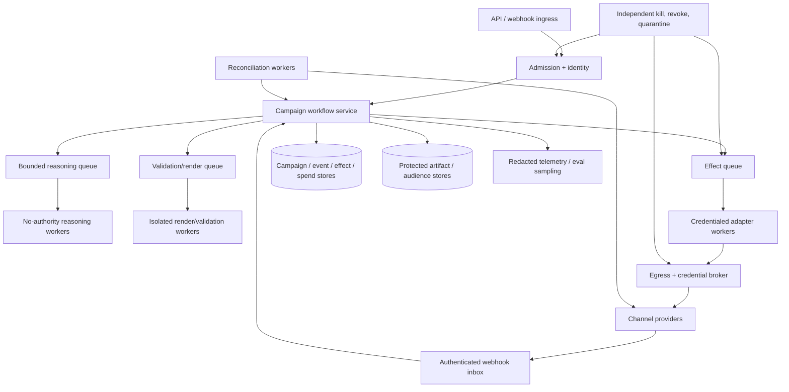
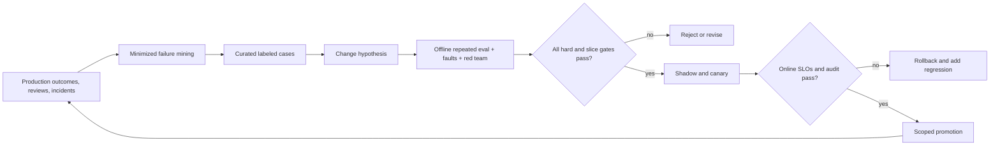

# Deployment, Scale, Cost, and Evolution

[Blueprint home](README.md) · Previous: [Reliability, observability, evaluation, and incidents](08-reliability-observability-evaluation-and-incidents.md)

## Deploy capability slices, not one autonomous agent

Launch planning, drafting, audience activation, publication, budget mutation, experiment operations, and lead handoff as separately gated capabilities. Each slice has its own credentials, workers, SLOs, evaluation set, release flag, and kill switch. A quality improvement in copy generation does not justify wider audience or spend authority.

The smallest production architecture is one service deployment plus managed persistence and queues—not an immediate multi-region microservice fleet. Split components only for trust isolation, scaling, failure containment, data residency, or independent ownership.

## Deployment topology



Reasoning workers do not share an execution identity with effect workers. Rendering external HTML/media and processing uploads use a separate sandbox and egress profile. Audience artifacts use tighter storage and access than ordinary creative. Reconciliation has independent credentials or read paths so an effect-worker outage does not hide outcomes.

## Queue and isolation design

Partition by tenant and provider account where writes can conflict. Enforce per-tenant, per-account, per-channel, and global admission limits. Priority classes should be finite and starvation-resistant:

1. suppression/removal, kill, and incident reconciliation;
2. unknown D3 effect reconciliation and cancellation;
3. scheduled commits approaching a valid window;
4. ordinary D3 effects;
5. reads, planning, drafting, and offline evaluation.

Do not let creative generation exhaust workers needed to stop a campaign. Dead-lettering does not resolve an external effect; D3 dead letters retain an owner, state, and reconciliation deadline.

### Overload behavior

| Constraint | Safe degradation |
|---|---|
| Consent/suppression service | Stop affected activation and sends; continue synthetic drafting only |
| Provider write quota | Hold new D3 effects, prioritize removal/pause/reconciliation, show delay |
| Provider read/report quota | Freeze budget increases and status-dependent commits; reduce dashboard freshness explicitly |
| Model quota/outage | Use deterministic templates/manual planning; effects still require ordinary gates |
| Render/validator saturation | Delay review; never skip checks |
| Workflow/store outage | Stop new commits; recover durable state and reconcile provider outcomes |
| Telemetry outage | Continue only if authoritative ledgers and alerts remain healthy; correctness cannot depend on traces |
| Evaluation backlog | Block release promotion, not live campaign reconciliation |

## Capacity model

Estimate each resource separately:

```text
planning_concurrency = admitted_campaigns × planning_steps_per_campaign × p95_step_seconds / planning_window
effect_rate = scheduled_effects / commit_window + retry_budget + reconciliation_rate
provider_quota_need = reads + mutate_operations + report_queries + audience_rows + conversion_uploads
artifact_volume = renders + provider_results + audience_snapshots + evaluation_fixtures
reconciliation_capacity >= peak_effect_rate + outage_backlog / recovery_objective
```

Recovery capacity includes arrivals and human work during restoration:

```text
recovery_work = event/projection replay
              + consent/suppression tombstone replay
              + provider readback for every nonterminal effect
              + audience/artifact integrity verification
              + spend reservation and handoff reconstruction
              + queued work still inside deadline
              + new suppression, pause, correction and launch arrivals

required_recovery_throughput > arrival_rate + backlog / target_drain_window
review_capacity >= priority_review_arrivals + review_backlog / target_drain_window
```

Include burst factors for launch windows, time zones, events, seasonal traffic, provider outages, webhook redelivery, policy changes, and mass suppression/removal. Google Ads documents daily operations, per-request, service-specific, response-size, and batch limits; Mailchimp documents simultaneous-connection and timeout limits. Read current tenant/access-level values at deployment time and reserve capacity for safety operations.

### Capacity invariants

- No single campaign, tenant, or account can consume all model, provider, queue, or reconciliation capacity.
- Batch size respects provider partial-failure and dependency semantics, not only throughput.
- Concurrent jobs do not mutate the same provider object or shared budget.
- Backlog age is a first-class SLI; queue depth alone hides stuck old work.
- Retry budgets are part of capacity planning and cannot recursively amplify an outage.
- Reconciliation and suppression removals retain reserved quota during overload.

## Cost model

Track total cost per verified outcome:

| Cost class | Driver | Control |
|---|---|---|
| Model | tokens, turns, variants, retries, fallback | per-stage budgets, context projection, variant cap, cache approved static policy |
| Retrieval/data | warehouse bytes/credits, CDP queries, audience rows | governed extracts, query estimates, incremental snapshots, purpose-aware cache |
| Rendering | browsers/media conversion/validation | deterministic templates, bounded variants, reuse immutable renders |
| Provider API | operations, reports, audience/conversion rows, quota scarcity | batching where safe, change feeds, adaptive polling, capability-specific budgets |
| Workflow/storage | waits, events, effects, protected artifacts, backups | retention by class, compaction, archive terminal campaigns |
| Human review | brand, claims, privacy, budget, channel, analytics | high-signal review packages, rule automation, risk-based routing |
| Media | authorized spend, fees, taxes, credits | reservations, caps, pacing, reconciliation |
| Failure | duplicates, rework, incident, reputation, lost experiment | prevention and unknown-outcome recovery; never hide from unit economics |

Useful measures include cost per approved campaign plan, approved asset, verified D3 effect, accepted lead handoff, trustworthy experiment, and incremental outcome where causally measured. “Cost per model call” is too narrow.

## Release engineering

Pin an immutable behavior manifest:

- application and workflow build;
- model snapshots, routing, fallbacks, inference parameters;
- system/task prompts, context compiler, retrieval and compaction policies;
- tool schemas, adapter builds, provider API/client versions and capability tests;
- brand, claim, consent, suppression, targeting, approval, budget, experiment, and lead policies;
- event/effect/artifact schemas and state migration code;
- sandbox, egress, credential, tenant, storage, retention, and telemetry profiles;
- evaluator versions, datasets, slice thresholds, operational limits, and feature flags.

Release sequence:

1. static/schema/connector compatibility and security tests;
2. offline repeated evaluations and failure injection;
3. replay against frozen, permission-compatible historical fixtures;
4. shadow proposals and policy decisions with effects disabled;
5. internal/synthetic tenant;
6. canary tenants/campaigns with D3 still approval-bound;
7. gradual capability- and account-scoped expansion;
8. explicit promotion or rollback based on non-compensating gates.

Long-running campaigns either remain pinned to their release, migrate through a tested state transformer at a safe boundary, or are quarantined/manual. Never resume an old approval under a silently changed model, tool schema, policy, or connector.

## Disaster recovery

Define recovery point and time objectives separately for:

- campaign/events/approvals/effects/spend ledgers;
- consent and suppression source/cursors;
- audience snapshots and protected activation artifacts;
- creative/claims/review artifacts;
- provider resource mapping and reconciliation cursors;
- experiment assignments/readouts and lead-handoff receipts;
- telemetry/evaluation data, which may tolerate more loss.

Test restore into an isolated environment. Before reopening writes:

1. rotate/revalidate workload and connector credentials;
2. replay deletion/suppression tombstones after the restored snapshot;
3. fence pre-disaster workers and messages;
4. query provider resources for every nonterminal D3 effect;
5. reconstruct spend reservations and worst-case exposure;
6. detect provider/manual changes during outage;
7. resume only campaigns whose policy, approvals, schedules, and release remain valid;
8. rate-limit backlog drain and prioritize safety effects.

Multi-region active-active writes are rarely justified initially because provider accounts and campaign effects need a single semantic owner. Prefer a warm standby or cell failover with fencing and provider reconciliation. Add regional cells when residency, tenant isolation, or measured availability demands it.

## Zero-to-production roadmap

Each stage is cumulative. Failing an exit gate means improve the current stage, not add more autonomy.

Retain the concrete exercise artifacts in [the worked campaign lifecycle](10-adapter-qualification-and-worked-campaign-lifecycle.md#stage-06-proof-exercises); a stage label without its measurable evidence grants no new capability.

### Stage 0 — deterministic baseline

Build an objective form, versioned audience query, consent/suppression check, approved templates, human review checklist, provider-native scheduling, spend dashboard, experiment registry, and manual lead handoff.

**Exit gates**

- representative workflows and failure costs are measured;
- systems of record, owners, data rights, provider accounts, and deterministic policies are known;
- template/rule quality, time, review load, delivery, complaint, spend, and handoff baselines exist;
- the proposed agent targets a specific semantic bottleneck that rules do not solve well.

**Stop here when:** stable templates and workflows meet needs. This is a successful outcome, not a failed agent project.

### Stage 1 — first bounded loop

Add a read-only custom loop over synthetic/scrubbed campaign fixtures. It may clarify, normalize a brief, inspect approved policy, draft a typed plan, and generate bounded variants. No live provider, audience, CRM, or spend credentials.

**Exit gates**

- hard turn/tool/token/time/variant budgets and explicit completion work;
- schema/evidence/abstention tests beat deterministic/template baseline on target slices;
- injection and capability-escalation tests cannot reach live effects;
- every output is a reviewable artifact with uncertainty and provenance.

### Stage 2 — useful MVP

Connect authorized objective, brand, claim, metric, and audience-aggregate sources. Add real provider reads and disabled/draft creation in a sandbox or tightly bounded account. Implement context manifests, run working state, approval-package rendering, evaluation fixtures, and human review.

**Exit gates**

- tenant/purpose authorization filters before retrieval and cache access;
- current context excludes raw audience membership and secrets;
- provider draft/read-back and local validators agree on critical fields;
- representative human reviewers find the package useful and correction categories are measured;
- no D3 effect is available.

### Stage 3 — reliable v1 with supervised effects

Add durable campaign state, versioned events, compaction, exact approvals, credential broker, effect/spend/handoff ledgers, schedules, cancellation, idempotency where supported, unknown outcomes, provider webhooks/change reads, and reconciliation. Enable one narrow channel and one account class at a time.

**Exit gates**

- crash/replay/duplicate/partial/timeout/stale-approval tests converge;
- suppression race and deletion propagation pass end to end;
- budget reservations and provider-spend reconciliation hold under lag;
- live send/publish/audience/budget effects have exact preview, receipt, read-back, and kill switch;
- lead handoff deduplicates and cannot mutate account/opportunity state;
- memory decisions are explicit; long-term user memory remains absent unless separately justified.

### Stage 4 — production readiness

Add workload identity, tenant/brand/account isolation, least privilege, D4 separation, hardened egress/credentials, full behavior manifests, distributed traces, SLOs, alerting, release/rollback, canary, incident runbooks, privacy/retention/deletion operations, and calibrated evaluation gates.

**Exit gates**

- zero critical policy/effect failures in required repeated adversarial trials;
- independent stop, revoke, force-proposal, quarantine, reconcile, restore, and backlog-drain drills pass;
- provider UI drift, API deprecation, policy change, and fallback-model tests pass;
- on-call ownership and cross-functional escalation are staffed;
- residual/legal/provider-specific assumptions are signed off by accountable owners.

### Stage 5 — scale and resilience

Add admission control, per-tenant/account queues, priority classes, autoscaling, quota reservation, regional or cell isolation where required, warm standby, conservative failover, capacity forecasts, cost attribution, and safe degradation.

**Exit gates**

- peak launch and outage-backlog load tests preserve suppression/removal/reconciliation capacity;
- no tenant/account can starve others or exceed aggregate authority;
- provider quota, queue-age, worker, store, and artifact limits have tested headroom;
- disaster restore and failover produce no split-brain effects or deletion regression;
- cost per verified success and human review load meet sustainable targets.

### Stage 6 — continuous governed evolution

Add failure mining, reviewer-feedback taxonomy, drift monitors, curated episodic evidence, challenger evaluation, model/tool/schema/policy upgrade gates, experiment-based improvement, deprecation plans, and periodic red-team/incident drills.

**Exit gates**

- feedback cannot directly rewrite prompts, policy, memory, audience logic, or autonomy;
- every behavior change has hypothesis, owner, manifest, evaluation, canary, rollback, and deprecation record;
- curated episodic data passes purpose, privacy, representativeness, leakage, poisoning, and deletion review;
- improvements persist across tenant/channel/locale/risk slices without weakening hard gates;
- stale providers, models, tools, prompts, memories, and policy versions have owners and removal deadlines.

## Governed behavioral evolution



Reviewer edits are evidence, not labels by default. A change may reflect style preference, missing context, policy, factual correction, or risk tolerance. Capture reason codes and adjudicate before adding cases to evaluation or training. Conversion and revenue feedback is especially vulnerable to attribution bias and selective labels; never let it automatically reinforce targeting or claims.

### Drift monitors

| Drift | Signal | Response |
|---|---|---|
| Input | New brief patterns, channels, locales, audience sources | Add held-out slice; hold unsupported scope |
| Model | Schema, abstention, claim, tool-choice, cost changes | Pin/rollback; rerun full critical suite |
| Connector | New API version, field, status, quota, policy, partial-failure behavior | Contract tests; staged adapter upgrade |
| Policy | Consent, advertising, sender, sensitive-targeting, organizational rule change | Recompute affected approvals/campaign eligibility |
| Brand/claims | New/revoked evidence, offer, disclosure, asset | Invalidate affected creative and pause when required |
| Measurement | Metric definition, attribution model, lag, instrumentation, experiment failure | Split vintages; block causal/optimization claims |
| Outcome | Complaint, lead rejection, drift by tenant/channel/cohort | Investigate bias/quality; do not auto-broaden memory |
| Operations | Unknown effects, queue age, spend discrepancy, reviewer fatigue | Reduce autonomy/volume and fix control bottleneck |

## Features deliberately deferred or rejected

| Feature | Position | Reconsider only when |
|---|---|---|
| Autonomous budget increases/reallocation | Rejected | Deterministic envelope, causal evidence, risk owner, repeated tests, and narrow rollback exist |
| Self-modifying prompts/policies | Rejected | Never in live runtime; changes use ordinary release governance |
| General dynamic plugin/MCP writes | Rejected | Publisher/version/schema/permissions are admitted and wrapped by local effect policy |
| Broad browser automation | Rejected | No safe API, task is rare/supervised, dedicated session, exact commit approval, and reconciliation exist |
| Persistent personal marketer memory | Rejected by default | Stable value beats governed settings and correction/deletion/poisoning controls pass |
| Multi-agent planner/copywriter/analyst swarm | Rejected by default | Independent contract and measured lift exceed coordination/cost/security burden |
| Autonomous public correction or incident response | Rejected | Human incident command retains decision rights |
| Opportunity updates or direct seller outreach | Out of scope | Route to sales blueprint; authority never transfers by composition |

## Production readiness checklist

### Product and boundary

- [ ] Deterministic baseline was measured and an agentic bottleneck is explicit.
- [ ] Category separation from sales, competitive intelligence, analytics, executive operations, and editorial ownership is enforced in tools and policy.
- [ ] Definition of done uses provider/ledger state, not final-answer prose.

### State, data, and integrations

- [ ] Campaign, events, effects, spend, artifacts, experiments, and handoffs have stable IDs and schemas.
- [ ] Every connector has pinned current capabilities, account scope, quotas, failure/reconciliation tests, and deprecation owner.
- [ ] Context, compaction, every memory class, retention, correction, and deletion are designed and tested.

### Authority and safety

- [ ] Suppression, claims, budget, publication, and lead-handoff controls remain deterministic.
- [ ] D3 approvals and preauthorized runbooks are exact, current, bounded, attributable, and revocable.
- [ ] D4 administration is unavailable to the agent.
- [ ] Tenant/account/audience/credential/egress boundaries and independent kill switches pass.

### Evidence and operations

- [ ] Outcome records expose attribution model, window, vintage, corrections, and causal limitations.
- [ ] Evaluation covers normal, boundary, adversarial, tool-failure, partial-effect, cancellation, stale-state, and repeated trials.
- [ ] SLOs, dashboards, alerts, runbooks, release/canary/rollback, DR, and backlog recovery are owned and drilled.
- [ ] Cost includes human review, provider/media, failure, reconciliation, and privacy/security operations.
- [ ] Behavioral evolution is governed as a release and cannot silently widen autonomy.

## Sources

- [Google Ads API quotas](https://developers.google.com/google-ads/api/docs/best-practices/quotas)
- [Google Ads API deprecation and sunset](https://developers.google.com/google-ads/api/docs/sunset-dates)
- [Mailchimp Marketing API fundamentals and limits](https://mailchimp.com/developer/marketing/docs/fundamentals/)
- [Google SRE Workbook: Canarying releases](https://sre.google/workbook/canarying-releases/)
- [Google SRE: Service-level objectives](https://sre.google/sre-book/service-level-objectives/)
- [SLSA specification v1.2](https://slsa.dev/spec/v1.2/)
- [Deployment, release, and incident response](../../operations/deployment-release-and-incident-response.md)
- [Scaling, capacity, and SLOs](../../operations/scaling-capacity-and-slos.md)
