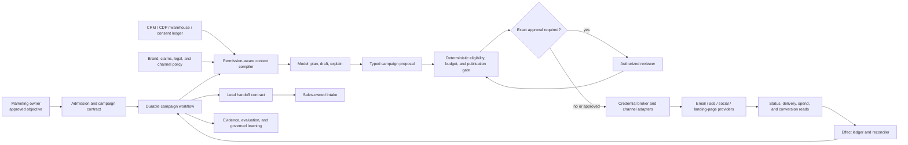

# Marketing Campaign Operations Agent

> **Status:** Pass 2 research-backed production blueprint  
> **Last researched:** 2026-08-31  
> **Scope:** Campaign objectives and audience state, consent and suppression, creative and brand review, channel and advertising-platform activation, spend and pacing controls, experiments and attribution evidence, scheduling and publication, lead handoff, and realized-outcome reconciliation  
> **Evidence packet:** [Research packet](../../research/packets/marketing-operations-agent-blueprint.md)

A production marketing-operations agent should be a **policy-constrained campaign workflow**, not an autonomous growth hacker. The model can turn an approved brief into a structured plan, draft variants, identify missing evidence, and recommend bounded adjustments. Deterministic services and accountable humans own audience eligibility, consent, claims, brand approval, spend authority, publication, experiment validity, and the meaning of realized outcomes.

The recommended design is a **hybrid control plane**: one durable campaign case surrounds model calls; provider adapters expose narrow typed capabilities; consequential effects are approved against immutable revisions; and reconciliation reads each channel's real state after dispatch. This design is deliberately less autonomous than many demos because a fluent mistake can target a suppressed person, publish an unsupported claim, expose a customer list, spend beyond a flight cap, contaminate an experiment, or send duplicate leads to sales.

## Category boundary

This blueprint owns the lifecycle from an approved marketing objective to reconciled campaign outcomes:

- objective, target population, exclusions, channel, offer, creative, schedule, spend, experiment, and success-measurement contracts;
- consent, suppression, preference, jurisdiction, sensitive-targeting, audience-snapshot, and activation eligibility;
- content generation assistance, evidence-bound claims, brand/legal/accessibility review, and immutable approved assets;
- draft, validate, schedule, publish, pause, resume, budget, audience-upload, and status adapters for approved channels;
- spend reservations, hard flight caps, platform budgets, pacing observations, anomaly stops, and approved reallocations;
- experiment registration, assignment evidence, guardrails, sample-ratio checks, result vintages, and attribution observations;
- marketing-qualified lead handoff with deduplication, receipt, rejection reason, and closed-loop outcome ingestion;
- delivery, serving, spend, conversion, suppression, bounce, complaint, lead, and experiment reconciliation.

Nearest overlaps remain separate:

| Neighbor | It owns | This blueprint may consume or emit |
|---|---|---|
| [Sales and revenue operations](../sales-revenue-operations-agent/README.md) | Account/contact truth, opportunity stages, seller routing, direct account engagement, quotes, and revenue workflow | A typed lead handoff and governed aggregate downstream outcomes; never opportunity mutation or seller outreach |
| [Competitive and market intelligence](../competitive-market-intelligence-agent/README.md) | Persistent external-market and competitor monitoring | Approved evidence or a research request; never an autonomous watchlist or scraping expansion |
| [Analytics](../analytics-agent/README.md) | Bounded analysis, metric semantics, statistical investigation, and reproducible analytical artifacts | A versioned experiment/readout request and returned evidence; this agent does not invent metrics or causal conclusions |
| [Executive operations](../executive-operations-agent/README.md) | Personal inbox, calendar, travel, and delegated executive action | A briefing or approval task; never personal delegation or mailbox action |
| Content/editorial ownership | Final editorial quality, publication standards, and content governance | Structured briefs, drafts, claims evidence, review state, and approved immutable assets |

## When not to build an agent

Use ordinary software when the workflow is already expressible as fixed rules:

- a scheduled newsletter with a stable template, one approved audience query, and a human send checklist;
- a lifecycle drip whose triggers, content, delays, and exits are deterministic;
- a paid-media pacing job that applies explicit thresholds and a fixed runbook;
- a dashboard or alert that reports delivery, spend, and conversion metrics;
- a campaign brief form followed by human planning and platform-native execution;
- one bounded attribution or experiment question, which belongs to analytics.

Add a model-directed loop only when representative tasks require semantic interpretation across incomplete briefs, heterogeneous evidence, creative variants, channel constraints, and exception recovery—and when evaluations show a real improvement over templates and rules. Keep deterministic workflow stages even after the model is introduced.

## Representative workflows

1. **Plan and launch:** normalize an approved objective, resolve allowed audience inputs, generate a typed plan and creative variants, collect reviews, reserve spend, freeze an eligible audience revision, validate each provider draft, schedule, commit, and reconcile real serving/delivery state.
2. **Consent-sensitive email:** compile a channel- and purpose-specific audience, subtract current suppressions at commit, validate sender and content requirements, approve an exact recipient-set/content digest, schedule once, then reconcile sent, delivered, bounced, complained, and unsubscribed states.
3. **Paid experiment:** register hypothesis, unit, arms, primary metric, guardrails, assignment, budget, duration, and stopping rules before launch; create platform experiment resources; monitor integrity without winner-chasing; finalize against a mature data vintage; route deeper analysis to analytics.
4. **Pacing exception:** detect spend or delivery drift, refresh provider state, diagnose known deterministic causes, propose a pause or bounded reallocation, require the correct budget authority, commit with a fresh precondition, and verify the provider state and later financial outcome.
5. **Lead handoff:** create a minimal, deduplicated handoff record when the campaign-defined threshold is met; obtain a receipt or typed rejection from sales; never create or change an opportunity; later ingest governed outcome aggregates for measurement.
6. **Cancellation and recovery:** stop new commits, cancel schedules where the provider still permits it, reconcile already-started sends or serving, preserve audience and approval evidence, release unused spend reservations, and surface unavoidable residual effects.

## System context and authority boundaries

Authority changes at three explicit seams: the model emits a proposal, the policy/approval plane authorizes a canonical effect, and the adapter attaches a narrow credential only at execution. Provider state proves publication, serving, spend, and delivery; the model's narration never does.

## Non-negotiable invariants

- A campaign objective is not permission to choose any audience, channel, claim, budget, destination, or send identity.
- Audience eligibility is evaluated from purpose, channel, jurisdiction, source rights, consent evidence, suppression state, sensitive categories, and freshness immediately before activation.
- Suppression is fail-closed and dominates optimization, audience size, experiments, schedules, and prior approvals.
- An approved creative is immutable. Editing copy, destination, media, disclosure, offer, audience, schedule, or sender creates a new revision and may require reapproval.
- Platform policy validation is useful evidence, not proof of legal, factual, brand, or ethical acceptability.
- The model cannot raise a spend ceiling, broaden targeting, promote an experiment, or waive a guardrail.
- A platform's attributed conversion is a vendor-defined observation, not automatically an incremental causal effect or direct-revenue truth.
- A timeout after publish, send, audience upload, budget mutation, or handoff is `unknown`; reconciliation precedes retry.
- Sales owns account/opportunity state after handoff. Marketing may read only the downstream fields or aggregates explicitly provided for measurement.
- Untrusted pages, form content, user-generated text, uploaded assets, provider errors, and tool metadata remain data; they cannot change policy or authority.
- No provider token, raw customer list, or unnecessary personal data enters model context, long-term memory, or diagnostic traces.

## Guide map

| Guide | Production question answered |
|---|---|
| [01. Operating model and architecture](01-operating-model-and-architecture.md) | Which deterministic, custom-loop, framework, workflow, or hybrid design fits, and where does autonomy stop? |
| [02. Objectives, audiences, consent, and lead handoff](02-objectives-audiences-consent-and-handoff.md) | How are campaign intent, eligible populations, suppression, activation, and the sales boundary represented? |
| [03. Content, brand, channels, and publication](03-content-brand-channels-and-publication.md) | How are claims and assets drafted, reviewed, scheduled, published, and withdrawn across channels? |
| [04. Budget, pacing, experiments, and attribution](04-budget-pacing-experiments-and-attribution.md) | How are money, delivery, experimental evidence, attribution, and outcome maturity controlled? |
| [05. Tools, effects, integrations, and reconciliation](05-tools-effects-integrations-and-reconciliation.md) | What contracts make third-party reads and writes bounded, idempotent where possible, and recoverable? |
| [06. State, context, memory, and orchestration](06-state-context-memory-and-orchestration.md) | What persists, what reaches the model, how is it compacted, and when are durable or delegated workers justified? |
| [07. Security, privacy, permissions, and governance](07-security-privacy-permissions-and-governance.md) | How are identities, customer data, credentials, targeting, prompt injection, and organizational roles constrained? |
| [08. Reliability, observability, evaluation, and incidents](08-reliability-observability-evaluation-and-incidents.md) | What evidence, SLOs, failure injection, release gates, and runbooks prove safe operation? |
| [09. Deployment, scale, cost, and evolution](09-deployment-scale-cost-and-evolution.md) | How does the system progress from no-agent baseline to bounded production and governed behavioral improvement? |
| [10. Adapter qualification and worked campaign lifecycle](10-adapter-qualification-and-worked-campaign-lifecycle.md) | How are live CRM/CDP, ads, email/SMS, CMS/DAM, analytics, consent and lead operations qualified and rehearsed from audience compile through rollback? |

## Architecture and runtime decision summary

| Option | Fit | Decision |
|---|---|---|
| Deterministic workflow only | Stable rules, templates, audiences, and channels | Preferred baseline; often the final answer |
| Small custom model loop | Read-only planning and drafting with one team and short runs | Good Stage 1; keep effects unavailable |
| Agent SDK around an application state machine | Typed tools, streaming review UX, provider portability needs | Useful implementation aid; never make SDK conversation state authoritative |
| Durable workflow runtime | Schedules, approvals, provider waits, restarts, and reconciliation span minutes to weeks | Recommended once real external effects are added |
| Multi-agent collaboration | Independently permissioned, measurably better specialist work | Rejected by default; parallel deterministic validators and human roles are simpler |
| Browser/desktop automation for ad platforms | API unavailable for a rare supervised operation | Last resort in a dedicated account/session; do not use for unattended publication or budget control |

Use the team's supported production language. TypeScript is strong for API-heavy control planes and shared web schemas; Python is strong for experimentation and offline evaluation; Java/Kotlin, C#, or Go may be better where those runtimes already own durable business services. A polyglot boundary is justified for isolated analytical workers, not for duplicating campaign policy.

## Definition of done

A campaign run is complete only when:

- the objective, audience, content, channel, schedule, budget, experiment, and approval revisions are recoverable;
- every activated recipient or platform audience was evaluated against a fresh policy/suppression snapshot;
- every external effect is `verified`, `proved_not_committed`, or explicitly `unknown` with an owner and deadline;
- spend reservations and provider-reported spend reconcile within the defined accounting window;
- publication and serving state come from provider reads or signed delivery evidence;
- lead handoffs have an accepted/rejected/duplicate receipt and no opportunity mutation occurred;
- outcome artifacts identify attribution model, event time, report time, data vintage, corrections, and causal limits;
- residual scheduled, serving, privacy, deliverability, or brand risk is disclosed to the owner.

## Stop and escalation conditions

Immediately stop new commits for the affected scope when suppression is stale or unavailable; tenant, brand, sender, or ad-account identity is ambiguous; spend cannot be bounded; an approved artifact differs from the commit payload; an experiment has assignment or instrumentation failure; a provider result is ambiguous and cannot be reconciled; a customer-list exposure is suspected; a policy or credential changed while work waited; or complaint, bounce, policy-disapproval, spend, or conversion-quality guardrails breach their limits.

## Staged path and refresh triggers

The build path is: **Stage 0 deterministic baseline → Stage 1 read-only bounded loop → Stage 2 useful planning/drafting MVP → Stage 3 reliable supervised effects → Stage 4 production controls → Stage 5 scale/resilience → Stage 6 governed evolution**. Each stage has evidence-based exit gates in [guide 09](09-deployment-scale-cost-and-evolution.md); later stages do not erase earlier approval or safety boundaries.

Refresh this blueprint within 90 days for provider APIs, advertising policies, consent/marketing rules, mail-sender requirements, model/tool behavior, or GenAI telemetry conventions; within 180 days for stable workload architecture; and immediately after any audience, suppression, spend, publication, attribution, data-rights, cross-tenant, duplicate-effect, or behavioral-regression incident.

## Canonical foundations

- [Production agent control plane](../../architectures/production-agent-control-plane.md)
- [Agent state and event contracts](../../runtime/agent-state-and-event-contracts.md)
- [Durable execution](../../runtime/durable-execution.md)
- [Tool contracts](../../tools/tool-contracts.md)
- [Idempotency and side effects](../../reliability/idempotency-and-side-effects.md)
- [Context engineering](../../context-memory/context-engineering.md)
- [Memory architecture](../../context-memory/memory-architecture.md)
- [Prompt injection and untrusted data](../../security/prompt-injection-and-untrusted-data.md)
- [Permissions, sandboxing, and secrets](../../security/permissions-sandboxing-and-secrets.md)
- [Evaluation-driven development](../../evaluation/evaluation-driven-development.md)
- [Observability and tracing](../../evaluation/observability-and-tracing.md)
- [Deployment, release, and incident response](../../operations/deployment-release-and-incident-response.md)
