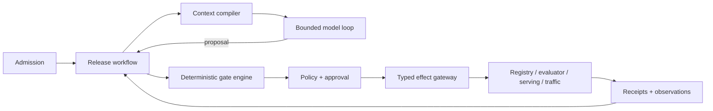

# Reference Architecture, Tooling, and Integrations

## Selected architecture

Use a **hybrid control plane with one bounded agent loop**:



The loop is used only for evidence selection, diagnosis, and proposal construction. Fixed workflow code owns required steps, terminal detection, waits, budgets, and effect ordering. Do not use a general autonomous-agent framework as the release system of record.

## Architecture alternatives

| Path | Use when | Strength | Rejection signal |
|---|---|---|---|
| Deterministic pipeline | Eligibility is a fixed predicate and failures have fixed routing | Lowest risk/cost; easiest audit | Operators still do repeated cross-source judgment after the pipeline fails |
| Custom bounded loop | Small tool surface, one team, clear state machine | Minimal dependencies and full control | Team starts rebuilding durable timers, approvals, tracing, or tool plumbing poorly |
| SDK-assisted loop | SDK provides structured calls, traces, model routing, and pause/resume ergonomics | Faster model integration | Framework state is being treated as release truth or authorization |
| Workflow-first hybrid **(recommended)** | Long evaluations, approvals, bake periods, external effects, recovery | Strong separation of reasoning and durable control | Work is entirely synchronous and effect-free |
| Multi-agent team | Independent roles have separable evidence, authority, and measurable value | Parallel specialist analysis | Shared authority, duplicated context, unclear completion, or no eval gain |

Multi-agent orchestration is rejected for the baseline. Evaluation, security, data, and serving “specialists” are deterministic services or human roles. Add a child agent only after a task-specific evaluation proves better quality or latency and its context, authority, cost, and failure semantics are isolated.

## Component responsibilities

| Component | Owns | Never owns |
|---|---|---|
| Admission gateway | Principal, tenant, target, risk, quota, request identity | Model-derived authority |
| Release workflow | State machine, waits, version fence, budgets, terminal outcome | Whether a remote effect committed without receipt |
| Context compiler | Authorized, fresh, compact evidence view | Durable release state |
| Model loop | Questions, hypotheses, evidence selection, typed proposal | Policy, approval, effect execution |
| Manifest service | Canonical release serialization and digest | Mutable alias interpretation after sealing |
| Gate engine | Schema, signature, lineage, metric, compatibility, policy-input checks | Subjective risk acceptance |
| Approval service | Authenticated decision bound to exact manifest/effect and expiry | General identity or deployment execution |
| Tool gateway | Typed adapters, scoped credentials, timeouts, effect IDs | Broad shell or ambient credentials |
| Effect ledger/reconciler | Intended/dispatched/committed/unknown/compensated state | Diagnostic sampling-only traces |
| Evidence store | Immutable artifacts, hashes, access, retention | Authorization by possession of an ID |
| Monitoring/evaluation | Observations and scores with coverage and provenance | Automatic release authority unless policy explicitly grants it |

## Technology decisions

These are choices, not a shopping list.

| Concern | Selected default | Why | Do not use when |
|---|---|---|---|
| Application/runtime | Python with strict typed schemas | Best ML/model-format ecosystem; easy registry/eval adapters | Platform cannot operate Python securely; put ML-specific adapters behind an RPC boundary |
| API | Ordinary authenticated HTTP/gRPC service | Clear identity and automation boundary | A chat UI is the only authority channel |
| Durable state | PostgreSQL | Transactions, compare-and-set, outbox, queryable audit | A managed workflow/database already supplies equivalent semantics |
| Long waits | Temporal, DBOS, Restate, or existing workflow engine after local comparison | Timers, retries, recovery, versioning | Runs are short, synchronous, and effect-free; a DB worker is simpler |
| Agent SDK | Optional provider SDK or lightweight tool-calling library | Structured output and telemetry convenience | It demands framework-owned state or hides retries/effects |
| Registry/tracking | Existing organisational registry; MLflow is portable default | Versions, aliases/tags, source-run lineage, model/prompt/eval ecosystem | Its tenancy/auth/storage posture does not meet requirements |
| Artifact transport | Existing object store plus OCI registry where non-image artifacts fit | Digest identity, retention, referrer/attestation ecosystem | Tooling cannot verify media types/digests or enforce access |
| Lineage interchange | OpenLineage plus application MLOps facets/references | Standard job/run/dataset model and extensibility | Treating emitted events as complete authoritative lineage |
| Feature metadata | Existing feature store/catalog; Feast is an optional adapter | Feature services and point-in-time retrieval metadata | Agent would become the feature transformation/materialization owner |
| Online serving | Managed endpoint for most teams; KServe for an established Kubernetes ML platform | Avoids building serving control plane; KServe offers protocol/CRD portability | Team lacks platform SRE/GPU/Kubernetes capability |
| Kubernetes rollout | KServe-native traffic where sufficient; Argo Rollouts/service mesh for richer analysis | Explicit canary/analysis/abort and traffic control | Two controllers would compete for the same traffic state |
| Inference protocol | KServe/Open Inference V2 where model/runtime supports it | Standard health, metadata, inference endpoints | Required modality/streaming feature is not represented; version adapter explicitly |
| Metrics | Prometheus-compatible service metrics | Mature aggregation and rollout integration | High-cardinality release identity is placed directly on every series |
| Tracing | OpenTelemetry with an internal stable attribute contract | Cross-service causal telemetry | Experimental semantic fields are assumed stable or raw prompts are captured by default |
| Drift/evaluation jobs | Domain code in isolated batch workers; optional MLflow evaluation tracking | Versioned, reproducible, testable metrics | A vendor detector is treated as universal truth |
| Policy | Existing policy engine or deterministic application code | Versioned, testable, fail-closed commit rules | Natural-language prompt checks are the enforcement mechanism |
| Secrets/identity | Workload identity and short-lived adapter credentials | Limits credential exposure and revocation horizon | Static cross-tenant keys enter prompts or checkpoints |

## Registry decision

MLflow is the default portable example, not an unconditional production mandate. Its current documentation supports model aliases/tags, prompt versions/aliases, evaluation datasets, and tracking. It also documents that model stages are deprecated in favour of aliases/tags and environment separation. Therefore:

- adapters resolve MLflow aliases to immutable version plus artifact digest before use;
- no workflow depends on deprecated stage transitions;
- a production deployment uses a database backend, external artifact store, authentication/SSO boundary, TLS, backups, and explicit workspace/tenant isolation;
- direct artifact-store access is avoided unless clients genuinely need and are authorized for it;
- MLflow permissions do not replace the application's commit-time release policy.

Use SageMaker Model Registry, Vertex AI Model Registry, Azure ML, Databricks/Unity Catalog, or another managed registry when it is already the source of truth and its identity, region, approval, audit, and deployment semantics are verified. Keep the internal release manifest stable across adapters.

## Platform qualification snapshot

The following facts were rechecked against primary documentation on 2026-08-31. They are adapter constraints, not endorsements. Pin the installed product, API/CRD, SDK, chart/image, and backend configuration; “latest” documentation is not a deployment contract.

| Surface observed | Version/status observed | Identity and behavior to preserve | Deployment-specific limit or decision |
|---|---|---|---|
| MLflow | OSS 3.15.2 release observed; stages deprecated since 2.9 | Experiment groups runs; run and Logged Model are different entities; registered-model version is addressable, while aliases/tags are mutable | Classic `mlflow.models.evaluate` and GenAI `mlflow.genai.evaluate` use non-interoperable metric/scorer types; evaluation datasets require a SQL backend; MLflow permissions and tags are not the release ledger |
| Kubeflow Pipelines | Backend/SDK 2.17.0 release observed | Experiment organizes arbitrary runs; a run executes a compiled pipeline package and emits parameter/artifact metadata | Pin pipeline IR digest, component images, parameters, cache policy, pipeline root, and referenced artifact digests; a run history or artifact URI alone does not prove byte-level reproducibility |
| Kubeflow Hub / Model Registry | 0.3.14, REST `v1alpha3`; opt-in alpha component in documented Kubeflow distributions | Registered Model, Model Version, and Model Artifact are separate metadata resources | The project explicitly describes the registry as passive metadata, not a control plane; API is alpha, authentication depends on distribution, and referenced object bytes need independent digest verification |
| KServe | Pre-1.0; official policy snapshot lists 0.19 active and latest two minors supported | `InferenceService` generation/resourceVersion, observed status, serving revision, predictor image/model digest, and traffic fields are different identities | Minor releases may break; canary shape differs by CRD/mode, current `CanarySpec` uses fixed replicas, scale-to-zero is Knative-only, and runtime metrics are not unified |
| Seldon Core 2 | 2.10.2 release observed | Model, Server, Pipeline, and Experiment are separate CRDs; experiment weights are proportional | Core 2 uses multi-model servers/scheduling, optional Kafka for dataflow pipelines, and route-stickiness does not pin a replica for stateful models; qualify its Business Source License and supported Kubernetes/dependency range |
| BentoML / BentoCloud | BentoML 1.4.39 release observed | A built Bento version and a BentoCloud Deployment/configuration revision are separate | Canary routing, managed autoscaling, and rapid rollback described in BentoCloud docs are managed-product features, not guarantees of the OSS framework or a self-hosted deployment |
| SageMaker AI | Current managed documentation | Model Package Group/version ARN, Model object/container, EndpointConfig, Endpoint, variant, and update operation are distinct | Model approval can trigger CI/CD but is not universal authorization; deployment guardrails apply only to real-time and asynchronous endpoints and have documented exclusions; canary capacity is at most 50% of the green fleet |
| Vertex AI | Current v1 resources | Parent Model/version ID, mutable version alias, Endpoint, `DeployedModel.id`, traffic split, and long-running operation are distinct | Omitting a version can resolve the mutable default alias; traffic maps deployed-model IDs and must total 100 or be empty; adapter must verify the returned model version and deployed-model ID |
| Azure ML | CLI `ml` v2 and Python SDK v2 surfaces | Model asset name/version, online Endpoint, named Deployment, traffic map, mirror map, and async operation are distinct | Mirroring is managed-online-only, one deployment, at most 50%; older CLI/SDK updates can clear mirror state; a caller can bypass the normal split by naming a deployment |

The official KServe surfaces were internally inconsistent during research: the release-policy file listed 0.19 as active while indexed release views lagged and the public schedule projected newer minors. Treat the installed chart/image digest and CRDs as truth, then run captured adapter fixtures. Never infer production compatibility from the website selector or a planned release date.

## Data, feature, evaluation, and observability qualification

| Surface | Safe identity | Important limitation |
|---|---|---|
| Feast | Feature repo revision + registry export digest + feature-view/service name + schema/entity/event-time/TTL/source definitions | Point-in-time joins scan backward within TTL; Feast does not make upstream transformations/materialization complete or truthful |
| SageMaker Feature Store | Account/region + feature-group ARN/name + creation time + feature definitions + record identifier + event-time rule + offline table snapshot | Feature groups are mutable and added features cannot be removed; online keeps the latest event-time record while offline is append-history and may lag writes, so parity must be measured |
| Azure managed feature store | Feature-store/workspace + immutable feature-set name/version + transformation/source digest + materialization window/job + online/offline store version | Materialized and on-demand results can differ by window, source lateness, or code; pin the materialization evidence used for training and serving |
| DVC | Git commit + DVC-tracked path + content hash + remote object existence | Git/DVC metadata does not retain remote bytes after garbage collection; protect release snapshots through the full audit/rollback horizon |
| lakeFS | Repository + immutable commit ID + object path + object checksum | Branches/tags are mutable references and garbage collection changes retrievability; approve the commit, not the branch |
| Apache Iceberg / Delta Lake | Catalog/table + immutable snapshot/version ID + schema ID + file-manifest or transaction-log proof | Named branches/tags can move; snapshot expiry or `VACUUM` can destroy time travel; retention must exceed reproducibility, audit, label-delay, and rollback horizons |
| Evidently | Pinned library/image + detector config + reference/current dataset digests + schema + method/threshold + result artifact | Default drift methods and thresholds vary with column type and sample count, ignore null-share changes unless separately tested, and are diagnostics—not production policy |
| Phoenix | Pinned server/SDK + dataset version + experiment/task/evaluator/judge versions + trace/annotation IDs | Useful for LLM experiments and diagnostics; judge output and traces remain evidence, and content capture needs an explicit privacy policy |
| OpenTelemetry / Prometheus | Internal telemetry contract mapped to pinned semantic-convention version; bounded labels plus artifact references | Semantic conventions 1.44.0 were observed while GenAI conventions were moving repositories and many GenAI attributes remained development-stage; release IDs belong in traces/logs or bounded lookup tables, not unbounded metric labels |

## Serving decision

### Managed endpoint

Choose it when the organisation wants model operations rather than a serving-platform product. Qualify:

- immutable artifact/version binding;
- canary/blue-green/shadow capabilities and exclusions;
- status/reconciliation API;
- per-variant metrics and traffic identity;
- request/response capture controls;
- network, encryption, residency, autoscaling, accelerator, quota, and rollback semantics;
- whether rollback restores only runtime configuration or also an older model/feature contract.

### KServe

Choose it only when Kubernetes operations, gateway/mesh, storage, GPU scheduling, monitoring, and CRD upgrades already have owners. KServe's V2 protocol standardizes readiness/liveness/metadata/inference, but its own documentation notes that model servers do not export one unified metric set. Normalize metrics in the adapter and validate each runtime.

Use one writer for traffic state. If KServe's current canary fields meet the workload, do not add Argo Rollouts merely for fashion. Use Argo Rollouts or a managed progressive-delivery system when metric analysis, experiments, pauses, or traffic-provider integration justify it. Treat “inconclusive” as a human-review state, not a pass.

## Tool registry and adapters

Expose domain outcomes, not raw vendor endpoints.

| Namespace | Tools | Effect class |
|---|---|---|
| `release.read` | `get_candidate`, `get_deployment_binding`, `get_gate_report`, `get_rollout` | Read |
| `lineage.read` | `resolve_ancestors`, `get_feature_contract`, `get_dataset_snapshot` | Read |
| `evaluation` | `prepare_suite`, `start_run`, `get_run`, `compare_releases` | Prepare / long job |
| `serving.read` | `get_revision`, `get_health`, `get_capacity_profile`, `sample_observations` | Read |
| `release.prepare` | `build_manifest`, `build_rollout_plan`, `build_rollback_plan` | Pure/prepare |
| `release.commit` | `register_candidate`, `start_rollout`, `change_traffic`, `move_alias`, `pause`, `abort` | Effect; approval/policy |
| `release.reconcile` | `get_operation`, `verify_binding`, `verify_traffic`, `verify_alias` | Read/reconcile |

The model never supplies tenant, principal, credential, policy version, approval ID, or effect ledger status. The runtime envelope injects them.

### Capability descriptor

```json
{
  "tool_id": "release.commit.change_traffic",
  "contract_version": "1.2.0",
  "effect_class": "live_traffic_write",
  "risk": "R3",
  "reversible": true,
  "requires": ["sealed_manifest", "rollout_envelope", "fresh_approval"],
  "supports_idempotency_key": true,
  "supports_status_lookup": true,
  "supports_cancel": false,
  "maximum_targets": 1,
  "credential_profile": "serving-traffic-writer"
}
```

`supports_cancel: false` means the gateway can issue a compensating traffic change, not pretend an accepted write was cancelled.

## Planning and orchestration decision

Use a fixed outer workflow:

```text
intake -> resolve -> verify -> evaluate -> compatibility -> propose
       -> approve -> revalidate -> rollout -> verify -> monitor -> close
```

The model receives one decision at a time: choose missing evidence, classify a failure, or produce a typed proposal. Replan only when a named trigger occurs: stale target, gate conflict, failed tool, new evidence, owner correction, budget risk, or rollout signal. Hard limits apply to model turns, tool calls, evaluation compute, evidence bytes, elapsed time, and rollout exposure.

Parallelize independent reads and deterministic evaluation shards. Serialize manifest sealing, approval binding, registry alias changes, and traffic effects per target. Do not delegate production effects to subagents.

## Deployment variants

| Scale | Concrete shape |
|---|---|
| Local research | CLI/service, SQLite/PostgreSQL, local object store, fixture registry, fake serving adapter; read/propose only |
| MVP | One API/worker deployment, PostgreSQL, object store, one registry adapter, one non-prod endpoint, batch evaluator |
| Production | HA API, durable workers, outbox/queue, policy/approval integration, separate read/write identities, private adapters, monitoring and incident controls |
| Large multi-tenant | Cell-based control/data planes, tenant routing, dedicated high-risk cells, regional evidence stores, fair queues, per-cell reconcilers |

## Integration qualification checklist

For every registry, feature store, evaluator, serving system, traffic controller, incident tool, and provider API record:

- [ ] exact resource identity and tenant/region scope;
- [ ] supported contract/API versions and deprecation channel;
- [ ] authentication, token audience, least-privilege actions, and audit coverage;
- [ ] pagination, consistency, rate limits, timeouts, webhook authenticity, and replay behavior;
- [ ] idempotency-key scope/retention, operation/status lookup, cancellation, and late completion;
- [ ] immutable artifact/version semantics and mutable aliases/tags;
- [ ] partial failure and unknown-outcome behavior;
- [ ] test fixture or sandbox plus adapter contract tests;
- [ ] redaction, retention, residency, export, and deletion behavior;
- [ ] owner and manual fallback when unavailable.

## Architecture anti-patterns

- A general shell tool with registry, object-store, Kubernetes, cloud, and incident credentials.
- Treating an SDK checkpoint or MLflow run as authoritative release state.
- Allowing webhooks to promote directly without authenticated event, current-state read, and deduplication.
- Using both registry alias watchers and GitOps as uncoordinated deployment writers.
- Sending raw prediction payloads, model weights, or full evaluation tables into model context.
- Starting with a workflow engine, service mesh, feature store, and multi-agent team when one DB worker and managed endpoint suffice.

## Related guides

- [Artifacts, registry, lineage, evaluation, and promotion](03-artifacts-registry-lineage-evaluation-and-promotion.md)
- [State, events, context, memory, planning, and orchestration](04-state-events-context-memory-planning-and-orchestration.md)
- [Tool contracts](../../tools/tool-contracts.md)
- [Durable execution](../../runtime/durable-execution.md)
- [Custom loop vs framework vs workflow engine](../../comparisons/custom-loop-vs-framework-vs-workflow-engine.md)
