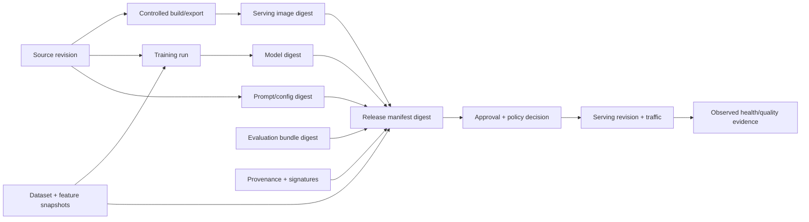
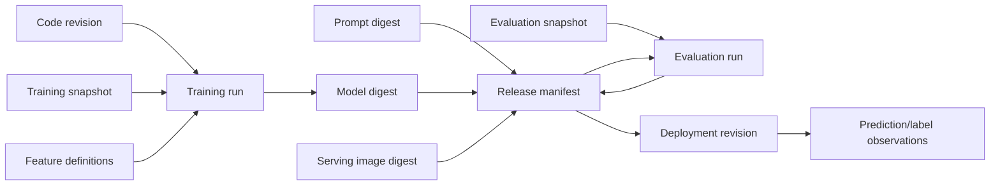
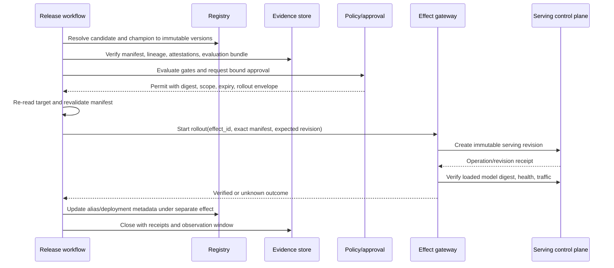

# Artifacts, Registry, Lineage, Evaluation, and Promotion

## Decision

Promote an immutable **release bundle**, not a model file or registry alias. The bundle binds every input that can change behavior or the interpretation of behavior:

- model weights/package and model format;
- prompt/system instructions/templates and inference parameters;
- tokenizer, preprocessing/postprocessing, feature contract, and schema;
- serving image/runtime and accelerator compatibility;
- code, dependency lock, build provenance, and signatures;
- training/evaluation dataset snapshots and lineage;
- evaluator code, metric definitions, judge model, rubrics, and thresholds;
- policy, intended use, risk class, monitoring baseline, and rollback target.

Registry metadata is one view of this bundle. The application-owned manifest and its digest are the stable promotion subject.

## Artifact identity chain



Use content digests for bytes and stable IDs for semantic resources. A model version number can help a person navigate, but it is not sufficient to prove which bytes were evaluated or served.

## Domain identity and version semantics

Do not collapse a logical collection, one immutable snapshot, and one execution that consumed it into a single “version.” The release ledger normalizes provider identifiers into these meanings:

| Domain object | Stable identity | Version/snapshot identity | Mutable pointer or status | Required release evidence |
|---|---|---|---|---|
| Dataset | Tenant/catalog + dataset/table/product ID | Object manifest digest, lakeFS commit, Iceberg snapshot ID, Delta version, or DVC Git revision + path + content hash | Branch, tag, `latest`, table head, partition prefix | Exact rows/files or query predicate; event-time cutoff; schema; extraction/reducer code; exclusions; retention proof |
| Label definition and snapshot | Label contract ID | Contract version + label snapshot/commit + correction watermark | “final,” latest joined outcomes | Population, outcome window, censoring, late/corrected-label rules, prediction join key, coverage by slice |
| Feature definition | Feature-view/set/service ID | Definition version or source revision + canonical schema/transformation digest | Feature repo branch, feature service alias | Entity/join keys, source, event timestamp, TTL/default/null/unit semantics, owner and compatibility range |
| Feature materialization | Definition version + store/region | Materialization job/run + window + source snapshot + online/offline observation watermark | Current online value | Row count, freshness, failed ranges, late data, write/ingest time, online/offline parity sample |
| Experiment | Organisational experiment ID | Not a behavioral version; it groups executions | Name, lifecycle, owner tags | Purpose only; never used as release identity |
| Training run | Execution/run ID | Attempt + pipeline/component/image/code/data/parameter digests | Display name, run status, tags | Terminal state, captured inputs/outputs, cache hits, seed/determinism envelope, environment/hardware, artifact digests |
| Evaluation suite | Suite ID | Immutable suite manifest digest/version | Alias such as `release-current` | Cases/slices, metrics, graders/rubrics, aggregation, thresholds, missing-data rules, expected invariants |
| Evaluation run | Evaluation run ID | Attempt + exact candidate/suite/data/evaluator/judge/policy versions | Dashboard status | Coverage/exclusions, raw result bundle, uncertainty, grader failures, comparison method, terminal receipt |
| Model resource | Tenant/registry + registered-model/product ID | Provider model-version ID | Default/champion alias, approval status, stage, tags | Resolve version to artifact/config digests; bind intended use and source run |
| Model artifact | Media type + content digest | Digest is the byte identity | URI, object key, registry reference | Size, signature/provenance, format/runtime contract, dependency or weight shards, retention and retrievability |
| Prompt/tool behavior | Prompt/tool logical ID | Prompt digest/version + tool schema/adapter contract version | Prompt alias, provider “latest,” feature flag | Template/system text, parameters, model snapshot, tool schemas, policy and routing versions |

For lakehouse data, a timestamp alone is not an immutable snapshot. Resolve it to the provider snapshot/version and preserve its schema and retention. For object prefixes, build a canonical manifest of object version IDs, checksums, sizes, and partitions. For generated training sets, bind the source snapshots **and** the query/transformation/reducer image; pinning only the output location cannot explain or rebuild it.

## Canonical release manifest

This implementable shape is deliberately vendor-neutral:

```yaml
schema: mlops.release/v1
release_id: rel_01K...
tenant_id: tenant_ref
model_product: fraud-risk
intended_use_id: fraud_triage_v3
candidate:
  registry_ref: registry://prod-candidates/fraud-risk/184
  model:
    uri: oci://registry.example/models/fraud-risk@sha256:4ab...
    digest: sha256:4ab...
    media_type: application/vnd.example.mlmodel.v1
    format: onnx
  prompt:
    registry_ref: prompts://fraud-explanation/versions/27
    digest: sha256:591...
  serving_image:
    uri: oci://registry.example/serving/fraud-risk@sha256:9d1...
    digest: sha256:9d1...
  source:
    repository: scm://risk/fraud-model
    revision: 91fd2e7...
  dependencies:
    lock_digest: sha256:2fe...
    runtime_contract: python-3.12-cpu-onnxruntime
lineage:
  training_run_id: train_01K...
  training_dataset: dataset://features/fraud-training@snapshot-2026-08-15
  label_dataset: dataset://labels/fraud-outcomes@snapshot-2026-08-28
  feature_service: feature://fraud-online/v13
  feature_contract_digest: sha256:b12...
  openlineage_run_refs: [ol://training/run/8f...]
evaluation:
  suite_id: fraud-release-suite
  suite_version: 18
  dataset_snapshot_ids: [eval://fraud/holdout@2026-08-20, eval://fraud/safety@7]
  evaluator_image_digest: sha256:31c...
  judge_model_id: null
  result_bundle_digest: sha256:7a9...
  gate_policy_digest: sha256:ae0...
monitoring:
  baseline_id: baseline://fraud-risk/champion-183
  baseline_digest: sha256:cb7...
  label_delay_slo: P7D
  required_coverage: 0.98
target:
  endpoint_id: serving://prod-eu/fraud-risk
  observed_revision: rv_884102
  current_release_id: rel_01J...
rollout:
  plan_id: plan_01K...
  plan_digest: sha256:08f...
  rollback_release_id: rel_01J...
  maximum_canary_percent: 10
provenance:
  slsa_statement_ref: oci-referrer://sha256:4ab.../provenance
  signatures: [sigstore://bundle/7f...]
created_at: 2026-08-31T12:00:00Z
manifest_digest: sha256:aa3...
```

Trusted code resolves references, canonicalizes the document, verifies referenced digests, and calculates `manifest_digest`. The model may draft missing human-readable rationale but may not provide trusted identity, digest, approval, or gate status.

## Manifest validation

Run gates in this order and fail closed before expensive evaluation:

1. **Shape:** schema, size, allowed media types, required fields, canonical serialization.
2. **Identity:** tenant, product, intended-use, source, registry subject, target, current revision.
3. **Integrity:** artifact digests, signatures, trusted builder/signer, provenance subject match.
4. **Safety:** model format/load policy, malware/secret scan, license, dependency and serving image policy.
5. **Lineage:** training code/run, dataset/feature/label snapshots, feature contract, evaluator data.
6. **Compatibility:** input/output signature, tokenizer/preprocessor, runtime, hardware, feature availability.
7. **Evaluation:** suite completeness, deterministic metrics, slices, uncertainty, safety floors, cost/latency.
8. **Release policy:** target, risk, approvals, rollout envelope, rollback compatibility, monitoring coverage.

### Deterministic validator example

```text
assert sha256(fetch(candidate.model.uri)) == candidate.model.digest
assert verify_attestation(subject=candidate.model.digest,
                          builder_allowlist=policy.builders)
assert evaluation.result.manifest_digest == manifest.manifest_digest_without_results
assert target.observed_revision == get_target(target.endpoint_id).revision
assert rollback_target.compatibility_contract == target.required_contract
assert all(hard_gate.status == "pass")
```

The evaluation result normally refers to a candidate-manifest digest that excludes the result bundle itself, avoiding a circular hash. Document the canonicalization rule and retain fixtures.

## Registry model

| Registry object | Meaning | Authority rule |
|---|---|---|
| Model name/product | Long-lived logical product | Scoped to tenant and intended use |
| Immutable version | Registered candidate identity | Resolve to artifact digest before use |
| Alias such as `candidate`/`champion` | Mutable convenience pointer | Never approve or deploy unresolved alias |
| Tag/label | Search and workflow annotation | Not proof of gate/approval unless verified from the release ledger |
| Source run | Lineage reference | Verify that artifacts and run metadata agree |
| Prompt version | Immutable behavioral input | Bind exact version/digest with model and app configuration |
| Evaluation record | Evidence reference | Pin suite/data/evaluator/grader versions and coverage |
| Deployment binding | Which release is observed at target | Reconcile from serving system, not registry alone |

MLflow model stages are deprecated in current documentation; use immutable versions, aliases/tags, and access-controlled environment separation. Managed platforms expose different approval and alias semantics. Normalize them through the internal manifest rather than pretending they are identical.

### Alias change rule

An alias move is an effect, not promotion truth:

```text
prepare:  old_alias_target + new_release_manifest + expected_registry_version
approve:  exact alias change digest + target environment + expiry
commit:   compare-and-set alias, record provider receipt
verify:   re-read alias and serving binding
```

Where possible, deploy by immutable version/digest and update the human-facing alias only after traffic is verified. If an alias is the provider's deployment trigger, treat it as the traffic effect and require the same controls.

## Lineage graph

OpenLineage supplies useful run/job/dataset entities and extensible facets. It does not by itself guarantee complete or truthful lineage. The blueprint stores an application-owned materialized graph with evidence strength:



Each edge records:

- source and target stable IDs;
- edge type (`trained_from`, `evaluated_on`, `serves`, `uses_feature_contract`, `derived_from`);
- observation source and time;
- producer/integration version;
- direct, declared, inferred, or human-attested evidence class;
- tenant, sensitivity, retention, and completeness status.

Declared lineage is not upgraded to direct evidence merely because it arrived in a standard event envelope.

## Feature and data boundary

The agent verifies model/data coupling but does not run general pipelines.

- Bind the feature service/view/version and schema to the model.
- Verify point-in-time-correct training retrieval evidence where relevant.
- Compare training and online feature definitions, transformations, types, units, null handling, freshness, and entity keys.
- Track dataset snapshots by immutable table/file/version identifiers and query/reducer versions.
- Require the DataOps owner to repair missing, stale, or quarantined datasets.
- Refuse release if the serving feature path cannot reproduce the declared contract.

Training/serving parity is a release artifact, not a one-time architectural claim. For a versioned sample of entity/event pairs, log values independently from the training retrieval and online retrieval, canonicalize types/units/nulls, and compare feature-by-feature. Record mismatches caused by source lateness, TTL, defaulting, serialization, transformation code, and materialization gaps separately. A fresh online record can still be semantically wrong, and an offline aggregate can be high quality while the online store is stale.

Feast documents point-in-time joins and separates feature serving from the external transformation engines that create batch/stream features. That separation matches this blueprint: consume feature metadata and evidence; do not absorb the pipeline.

## Evaluation bundle

An evaluation pass is a versioned artifact, not a status string.

```json
{
  "schema": "mlops.evaluation-result/v1",
  "evaluation_run_id": "evalrun_01K...",
  "candidate_manifest_digest": "sha256:19a...",
  "suite": {"id": "fraud-release-suite", "version": 18},
  "inputs": [{"dataset_id": "eval://fraud/holdout@2026-08-20", "digest": "sha256:..."}],
  "evaluator": {"image_digest": "sha256:31c...", "policy_digest": "sha256:ae0..."},
  "coverage": {"eligible": 10000, "scored": 9980, "excluded": 20},
  "slices": [
    {"name": "overall", "n": 9980, "metrics": {"auprc": 0.431}},
    {"name": "new_accounts", "n": 612, "metrics": {"recall_at_fpr": 0.784}}
  ],
  "hard_gates": [
    {"id": "no_cross_tenant_leak", "status": "pass", "evidence_ref": "artifact://..."},
    {"id": "max_p99_ms", "status": "pass", "observed": 83, "limit": 100}
  ],
  "comparison": {"champion_release_id": "rel_01J...", "method": "paired_bootstrap"},
  "uncertainty": {"method": "bootstrap", "confidence": 0.95},
  "created_at": "2026-08-31T13:00:00Z",
  "bundle_digest": "sha256:7a9..."
}
```

### Evaluation hierarchy

| Layer | Examples | Gate type |
|---|---|---|
| Contract | Loadability, signature, schema, finite outputs, determinism envelope | Deterministic hard gate |
| Data/feature | Schema, missingness, leakage, point-in-time, slice coverage | Deterministic hard/diagnostic |
| Model quality | Calibration, ranking/classification/regression task metrics, slice floors | Domain-defined non-compensating gates |
| Safety/fairness/privacy | Forbidden outputs, protected slices, memorization/leakage, misuse cases | Hard gate plus expert review |
| Serving | Cold start, warm-up, p95/p99, throughput, memory/GPU, numerical parity | Hard performance/compatibility gate |
| GenAI/prompt | Task success, groundedness, policy, format, tool effects, repeated reliability | Code + calibrated judge + human |
| Operational | Rollback target, monitoring coverage, ownership, runbook, capacity | Release-readiness hard gate |

Do not let a weighted average offset a safety breach, missing slice, untrusted artifact, or incompatible rollback. Model-based graders are versioned components and require human calibration; they do not grade their own release without independent controls.

## Behavior-bundle gates

The actual promotion subject is the Cartesian coupling of model, data, prompt, features, evaluator, serving, and tools. Two candidates with identical weights are different releases when any coupled input changes.

| Bundle dimension | Deterministic gate | Bounded model analysis | Never delegated to the model |
|---|---|---|---|
| Data/labels | Snapshot IDs/digests, schema, cutoffs, leakage checks, row/slice coverage | Explain conflicting dataset-card, lineage, and quality evidence | Change population, label definition, exclusion, or retention policy |
| Model/prompt | Artifact/prompt/tokenizer/parameter digests; load and signature checks | Compare non-dominating behavioral trade-offs and failure clusters | Declare a safety or mandatory slice failure acceptable |
| Features | Definition/materialization versions, parity/freshness thresholds, entity/event-time rules | Diagnose whether mismatch suggests materialization, serialization, or source defect | Rewrite feature definition or waive skew |
| Evaluation | Suite/data/evaluator/judge/policy binding; hard thresholds and uncertainty computation | Select targeted follow-up cases from an approved catalog | Alter thresholds, rubric, grader, or missing-data rule to obtain a pass |
| Serving/accelerator | Image/runtime/driver/resource contract; load, parity, latency, OOM and rollback checks | Summarize capacity/compatibility trade-offs and propose a qualified profile | Choose an unapproved isolation class or consume rollback reserve |
| Tools/providers | Tool schema, adapter/API version, capability and sandbox contract tests | Explain cross-provider behavioral differences | Broaden credentials, tool scope, region, or data handling |

Promotion requires every non-compensating hard gate to pass and all required evidence to be fresh. The model can return `needs_evidence`, `ineligible`, or a sealed proposal; it cannot turn `unknown` into `pass` or average away a safety case.

## Promotion transaction



If serving succeeds but the registry write fails, the release is not redeployed. The reconciler repairs the registry/deployment mapping using the serving receipt. If the registry alias moved but serving did not, policy determines whether to restore the alias or complete the serving change; the agent must not guess.

## Revocation and re-evaluation

A passed release can become ineligible when:

- a model, image, dependency, dataset, or signer is revoked;
- evaluator defects or contaminated test data are discovered;
- intended use, population, feature contract, or policy changes;
- a provider changes runtime behavior or announces retirement;
- new severe production failures enter the regression suite;
- monitoring coverage falls below the release contract.

Mark the release `evidence_stale` or `revoked`, stop further promotion, identify deployed instances, and run the policy-specific response. Do not rewrite historical evaluation records.

## Failure-injection tests

- Replace a model blob while retaining the registry version; digest verification must fail.
- Move `candidate` between resolve and approval; the sealed manifest must remain unchanged.
- Emit incomplete OpenLineage events; completeness must become unknown, not passed.
- Change evaluator image or threshold after a pass; old evidence must not bind the new policy.
- Commit serving revision then drop the response; reconcile by operation/revision ID.
- Move the registry alias while serving update fails; detect and repair the split brain.
- Load an untrusted pickle/joblib model; quarantine and sandbox policy must prevent production load.
- Remove a required protected slice from the evaluation dataset; coverage gate must fail.
- Present a rollback target with incompatible feature contract; rollback proposal must be rejected.

## Selected sources

- [MLflow Model Registry workflows](https://mlflow.org/docs/latest/ml/model-registry/workflow/)
- [MLflow model evaluation](https://mlflow.org/docs/latest/ml/evaluation/)
- [MLflow Prompt Registry](https://mlflow.org/docs/latest/genai/prompt-registry/index.html)
- [OpenLineage core model](https://openlineage.io/docs/)
- [OpenLineage facets](https://openlineage.io/docs/spec/facets/)
- [Feast point-in-time joins](https://docs.feast.dev/getting-started/concepts/point-in-time-joins)
- [SLSA v1.2 build provenance](https://slsa.dev/spec/v1.2/build-provenance)
- [OCI artifact guidance](https://github.com/opencontainers/image-spec/blob/main/manifest.md#guidelines-for-artifact-usage)
- [Sigstore verification](https://docs.sigstore.dev/cosign/verifying/verify/)
- [scikit-learn model persistence security](https://scikit-learn.org/stable/model_persistence.html)
- [PyTorch `torch.load` security warning](https://docs.pytorch.org/docs/stable/generated/torch.load.html)

## Related guides

- [Tool results, artifacts, and provenance](../../tools/tool-results-artifacts-and-provenance.md)
- [Serving rollout, health, drift, and rollback](05-serving-rollout-health-drift-and-rollback.md)
- [Security, permissions, approvals, reliability, and reconciliation](06-security-permissions-approvals-reliability-and-reconciliation.md)
