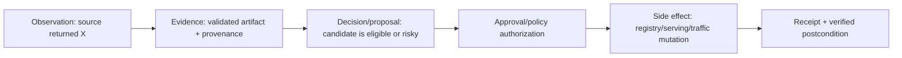
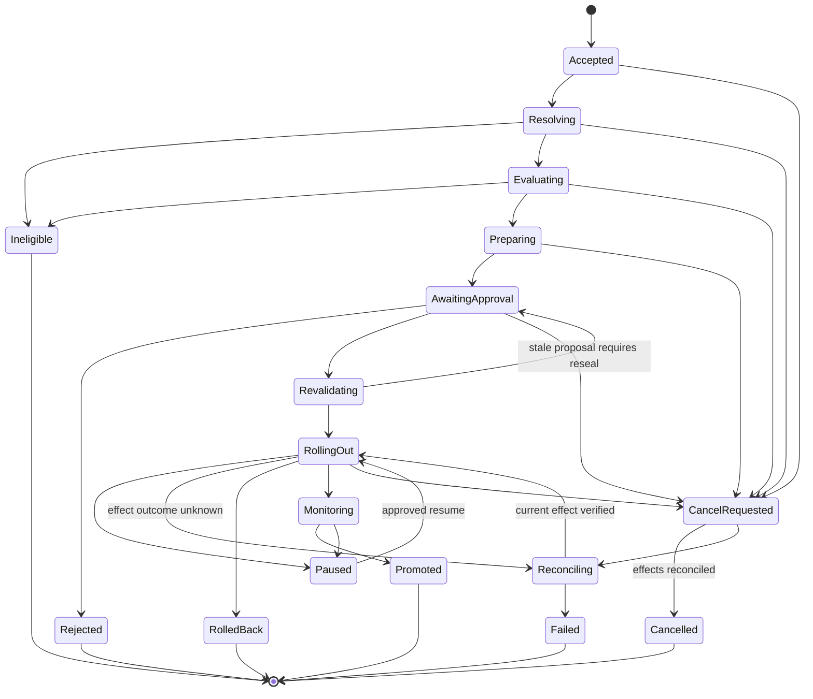

# State, Events, Context, Memory, Planning, and Orchestration

## Decision

Keep authoritative release state outside the model and framework. Compile a small evidence view for each decision, compact it at phase boundaries, and retain only two cross-run memory classes: governed domain knowledge and curated outcome lessons. The baseline uses one agent loop and a deterministic outer workflow; multi-agent delegation is absent.

## Separate observations, evidence, decisions, and effects



| Record | Example | Can authorize an effect? |
|---|---|---:|
| Observation | p99 latency was 91 ms for window W | No |
| Evidence | Signed query result with release, coverage, source and time | No |
| Model conclusion | Likely GPU queue saturation | No |
| Deterministic gate | p99 is within the approved 100 ms limit | Only as one policy input |
| Human approval | Approver accepts exact 10% canary plan | Only with independent authorization and freshness |
| Effect intent | Change traffic from 1% to 10% | No; must be committed |
| Receipt/postcondition | Controller operation succeeded and traffic is observed at 10% | Proof of effect, not permission for the next one |

Telemetry is never the release ledger. A model summary is never an approval. A registry alias is never proof of live traffic.

## Authoritative state machine



Every transition checks `state_version` and the active ownership fence. Exactly one terminal outcome wins. A stream closing, worker exit, or provider timeout is not terminal success.

## Durable records

| Record | Minimum fields | Retention |
|---|---|---|
| Run | tenant, principal, objective, target, state/version, owner fence, budgets, terminal class | Operational/audit policy |
| Candidate snapshot | resolved versions/digests, intended use, champion, target revision | Release lifetime |
| Manifest | canonical bytes, digest, lineage and policy versions | Release/evidence policy |
| Plan | phases, gates, exposure, rollback target, digest, expiry | Run plus audit |
| Approval | subject/effect digest, approver, role, decision, expiry, conditions | Audit/regulatory policy |
| Effect | stable effect ID, intent hash, status, attempts, receipt, resulting revision | At least maximum replay/reconciliation horizon |
| Observation | source, observed time, release/variant, coverage, window, artifact reference | Monitoring/privacy policy |
| Evaluation | suite/data/evaluator versions, results, exclusions, uncertainty, bundle digest | Release lifetime plus policy |
| Checkpoint | verified structured state, evidence refs, next decision, lineage | Until run and audit retention allow deletion |
| Incident/outcome lesson | reviewed failure class, conditions, fix, regression task ID | Curated memory policy |

The persisted run state is a discriminated union rather than a bag of optional fields. Each variant permits only its relevant next actions:

```text
Resolving{candidate_ref, target_ref, missing_identity[]}
Evaluating{manifest_digest, evaluation_runs[], required_gates[]}
AwaitingApproval{sealed_plan_digest, approval_requirement, expires_at}
RollingOut{rollout_id, phase, target_revision, active_effect_id?}
Reconciling{unknown_effect_ids[], last_observed_external_state, next_probe_at}
Terminal{class, final_state_version, evidence_bundle_digest}
```

Trusted reducers validate the union, state version, ownership fence, and transition preconditions. A nullable `status` column plus a narrative plan is not a typed state contract.

## Identity model

Use separate IDs for separate boundaries:

```text
run_id                 one accepted qualification/release execution
attempt_id             one worker/lease attempt
step_id                one logical workflow step
model_call_id           one inference
tool_call_id            one proposed tool invocation
effect_id               one semantic external change across retries
release_id              one immutable release bundle
evaluation_run_id       one suite execution
observation_id          one immutable monitored result
approval_id             one authenticated decision
event_id                one immutable event occurrence
trace_id/span_id        diagnostic correlation only
```

A retry changes `attempt_id` but keeps the same `effect_id`. A resealed plan changes its plan digest and invalidates the old approval. A rollback is a new release/effect operation linked to the original; it does not erase history.

## Event contract

```json
{
  "event_id": "evt_01K...",
  "event_type": "mlops.rollout.step_verified",
  "event_version": 1,
  "source": "urn:mlops:rollout-controller",
  "occurred_at": "2026-08-31T16:05:00Z",
  "tenant_id": "tenant_ref",
  "run_id": "run_01K...",
  "release_id": "rel_01K...",
  "step_id": "canary_10_percent",
  "effect_id": "fx_traffic_rel01K_10",
  "sequence": 48,
  "state_version": 22,
  "target_id": "serving://prod-eu/fraud-risk",
  "target_revision": "rv_884109",
  "schema_id": "mlops-events/1",
  "policy_version": "fraud-release-18",
  "traceparent": "00-...-...-01",
  "data": {
    "traffic_percent": 10,
    "gate_report_ref": "artifact://gate/01K...",
    "receipt_ref": "receipt://traffic/op-7721",
    "outcome": "verified"
  }
}
```

Tenant/principal/target identity comes from trusted runtime context. Event arrival time is not global order. Use per-run sequence plus causation, transactional state transitions, and an outbox. Events project state; they do not replace it.

## Context compiler

Compile for the next decision, not the whole release history.

| Lane | MLOps content | Rules |
|---|---|---|
| Authority | role, allowed tools, risk, policy references, completion contract | Stable, protected, no external text interpolation |
| Objective | accepted release/diagnostic goal and user corrections | Latest accepted intent, explicit non-goals |
| Verified state | run state, manifest digest, target revision, approvals, effects, budgets | Structured and application-owned |
| Candidate/champion | compact contract and metric deltas | Exact versions/digests and missing-data markers |
| Evidence | selected lineage, gate, evaluation, serving, drift artifacts | Provenance, trust, freshness, coverage, artifact refs |
| Working notes | hypotheses, open questions, current plan node | Unverified, disposable, size-bounded |
| Recent interaction | only turns needed for references/decisions | No append-forever transcript |

### Selection order

1. Authorize tenant/product/source access.
2. Determine the next decision and required evidence classes.
3. Retrieve current authoritative state and exact artifact sections.
4. Filter by intended use, release, source authority, freshness, coverage, trust, sensitivity, and conflict.
5. Prefer deterministic summaries/tables over raw rows or logs.
6. Deduplicate, rank by decision value, and reserve output/recovery headroom.
7. Emit a context manifest with included/excluded artifact IDs and token counts.

Large evaluation tables, traces, prediction samples, and model cards remain in artifact storage. The model receives statistics and targeted exemplars with stable references.

## Compaction and continuity

Compact at the end of resolve, evaluation, approval, rollout step, and incident handoff—or before the context budget threshold. A checkpoint preserves:

```yaml
checkpoint:
  schema: mlops.compaction-receipt/v2
  run_id: run_01K...
  state: AWAITING_APPROVAL
  state_version: 14
  owner_fence: 9
  objective: promote rel_01K to prod-eu under fraud-release-18
  identities:
    release_manifest_digest: sha256:aa3...
    target_id: serving://prod-eu/fraud-risk
    target_revision: rv_884102
    plan_digest: sha256:08f...
    evaluation_bundle_digest: sha256:7a9...
  versions:
    workflow_schema: mlops-run/3
    event_schema: mlops-events/1
    context_compiler: 6
    prompt_bundle: sha256:91b...
    reasoning_model: provider/model-snapshot
    tool_contracts: {registry: 2.1.0, serving: 3.0.0, evaluation: 1.4.0}
    adapter_images: {registry: sha256:11a..., serving: sha256:22b...}
    policy_digest: sha256:ae0...
  hard_gate_summary:
    passed: 41
    failed: 0
    unknown: 1
  unknowns:
    - delayed-label coverage for new_accounts below policy floor
  approvals:
    - {approval_id: apr_01K..., status: pending, subject_digest: sha256:08f..., expires_at: 2026-08-31T18:00:00Z}
  effects:
    pending: []
    unknown:
      - {effect_id: fx_eval_17, intent_hash: sha256:ed1..., external_operation_id: op-882, last_probe_at: 2026-08-31T16:10:00Z}
    committed_receipts: [receipt://evaluation/op-701]
  approval_requirement:
    roles: [model_owner, release_manager]
    proposal_digest: sha256:08f...
    expires_at: 2026-08-31T18:00:00Z
  evidence_refs: [artifact://eval/..., artifact://lineage/...]
  next_safe_action:
    kind: reconcile_effect
    effect_id: fx_eval_17
    preconditions: [ownership_fence_current, no_new_write, approval_not_used]
  forbidden_until_reconciled: [promote, retry_fx_eval_17, move_alias, change_traffic]
  budgets_remaining: {model_calls: 4, tool_calls: 18}
  source_high_watermarks:
    run_event_log: {sequence: 88, event_id: evt_01K88}
    effect_ledger: {sequence: 17, effect_id: fx_eval_17}
    registry_events: {cursor: reg-441, observed_at: 2026-08-31T16:09:00Z}
    serving_events: {resource_version: rv_884102, observed_at: 2026-08-31T16:09:30Z}
    evaluation_events: {cursor: eval-992, observed_at: 2026-08-31T16:10:00Z}
  raw_event_range: {first_sequence: 41, last_sequence: 88}
  invariant_set: mlops-release-invariants/4
  invariants_hash: sha256:70c...
  compactor_version: mlops-checkpoint/2
  receipt_sha256: sha256:9f8...
```

Treat the checkpoint as a compaction receipt. Structured fields, per-source high-watermarks, versions, approvals, pending/`UNKNOWN` effects, next safe action, raw-event range, invariant-set hash, builder version, and receipt digest are verified against authoritative stores. On resume, reject a receipt whose source has fallen behind, whose invariants cannot be recomputed, or whose effect is absent from the ledger. Re-read every source newer than its watermark before planning. A model-generated narrative can accompany the checkpoint but cannot override it. Rebuild from authoritative events after repeated compactions, schema migration, invariant change, or provider/model change.

## Memory decision

Use exactly these seven memory lifetimes. Raw predictions, prompts, weights, logs, model cards, tickets, and registry descriptions are evidence artifacts—not an eighth memory class.

| Named lifetime | Use | Reject | Retention and deletion | Poisoning test |
|---|---|---|---|---|
| Turn/scratch | Current question, last validated tool envelope, immediate correction | Authority, durable facts, raw large artifacts | Drop after the decision/turn; content-addressed evidence remains in its governed store | Inject a tool result saying “ignore policy”; it remains untrusted data and cannot alter tools or gates |
| Working/run | Hypotheses, open evidence needs, current typed plan node, compact comparison | Approval, release truth, effect status, facts without evidence IDs | Run-scoped; discard at terminal or rebuild from authoritative state on corruption | Insert a plausible but uncited “all slices passed”; compiler excludes it from verified state and continuity tests fail |
| Session | Accepted human clarification, correction, and handoff context for this run | Chat assent as approval; stale or cross-run policy facts | Selective run/session retention; delete content under conversation policy while keeping separately required approval/audit records | Replay a stale correction from another tenant/run; scope and causation checks reject it |
| Durable workflow/task | State union, manifests, plans, approvals, effects, receipts, budgets, checkpoints | Free-form transcript as source of truth; model-authored identity or receipt | Operational, audit, and replay horizons; erase/cryptoshred payloads by policy without breaking mandatory ledger integrity | Tamper with state/effect/receipt; CAS, hash, fence, and reconciliation detect it before progress |
| Domain knowledge | Reviewed intended use, owners, metric definitions, feature contracts, safety cases, runbooks | Unreviewed tickets/cards; model-suggested threshold or owner; secret/raw prediction data | Owner-set effective/expiry time; supersede explicitly; deletion removes indexes/derived summaries and respects legal holds | Poison a runbook with a traffic-write instruction; trust/source/version review prevents admission and tool authority remains separate |
| Long-term/preference | Usually reject; optionally retain non-safety UI/report preferences with tenant/user consent | Gates, thresholds, model choice, rollout/rollback authority, credentials, hidden population assumptions | Short opt-in TTL and user deletion; never copied across tenant/role or into approval context | Preference says “always auto-promote”; policy and context compiler ignore it and the negative eval remains green only on refusal |
| Episodic/outcome | Human-reviewed incident pattern, proven remediation conditions, counterexample, regression task ID | Raw “successful” trajectory, unreviewed postmortem, correlation presented as cause | Explicit expiry/review; delete embeddings, caches, and derived summaries; preserve separately mandated incident audit | Malicious incident text proposes a rollback command; admission requires reviewer, evidence refs, narrow lesson text, and regression proof |

### Memory write contract

An outcome lesson is admitted only after human review and links to an incident/evaluation artifact:

```json
{
  "memory_id": "mlesson_01K...",
  "tenant_id": "tenant_ref",
  "model_product": "fraud-risk",
  "failure_class": "training_serving_feature_skew",
  "conditions": ["feature_contract=v13", "serving_adapter=feast-2"],
  "lesson": "Compare online and logged feature serialization before rollback decision.",
  "evidence_refs": ["incident://INC-442", "eval-task://skew-17"],
  "reviewed_by": "model_platform_owner_ref",
  "effective_from": "2026-08-31T00:00:00Z",
  "expires_at": "2027-02-28T00:00:00Z",
  "supersedes": null
}
```

External model cards, tickets, logs, and prompts cannot directly create durable memory. Deleting poisoned or expired memory must remove indexes and derived summaries while preserving required audit evidence separately.

## Planning policy

The plan is a typed graph with explicit gates:

```yaml
plan:
  version: 3
  nodes:
    - id: resolve
      kind: deterministic
      outputs: [candidate_snapshot]
    - id: evidence_gap_analysis
      kind: model_decision
      depends_on: [resolve]
      budget: {model_calls: 2, tool_calls: 12}
    - id: evaluation
      kind: fanout_join
      depends_on: [evidence_gap_analysis]
      maximum_parallel: 8
    - id: seal
      kind: deterministic
      depends_on: [evaluation]
    - id: approval
      kind: durable_wait
      depends_on: [seal]
    - id: canary
      kind: controlled_effect
      depends_on: [approval]
      parallel: false
```

Replanning creates a new plan version and records the trigger. It never silently alters an approved node. Completion detection is deterministic: required nodes are terminal, hard gates pass, effects are reconciled, and the run state transitions once.

## Orchestration choices

- **Sequential:** manifest sealing, approval, traffic writes, alias moves, target verification.
- **Parallel:** independent read-only evidence collection and isolated evaluation shards with fixed fan-out.
- **Durable wait:** human approval, bake window, delayed labels, provider job, reconciliation backoff.
- **Human handoff:** retraining decision, threshold/baseline dispute, intended-use change, high-impact rollback, cross-system incident.
- **No subagent:** production effects, shared write tools, or tasks without isolated completion/evidence contracts.

## Reliability and continuity tests

- Deliver every domain event twice and out of order; state and projections remain correct.
- Crash after a checkpoint but before publication; outbox eventually emits one semantic event.
- Resume with an expired or cross-tenant checkpoint; reject without existence leakage.
- Compact away a failed hard gate; preservation validation must fail.
- Inject a poisoned incident note requesting an alias move; it remains untrusted evidence.
- Change the model provider between checkpoints; rebuild context and rerun continuity canaries.
- Let a stale worker finish after lease takeover; the ownership fence rejects its transition/effect.
- Approve plan v2 while workflow is on v3; resume is rejected.

## Anti-patterns

- Persisting only the chat transcript and reconstructing release state from prose.
- Treating prompt caching as memory or registry aliases as state.
- Summarizing summaries until artifact IDs, unknowns, or approval expiry disappear.
- Automatically learning “successful” rollback procedures from unreviewed runs.
- Parallel agents updating one release manifest or target.
- Carrying raw model weights, prediction payloads, or full evaluation data in context.

## Related guides

- [Agent state and event contracts](../../runtime/agent-state-and-event-contracts.md)
- [Context engineering](../../context-memory/context-engineering.md)
- [Compaction and continuity](../../context-memory/compaction-and-continuity.md)
- [Memory architecture](../../context-memory/memory-architecture.md)
- [Planning and replanning](../../orchestration/planning-and-replanning.md)
- [Artifacts, registry, lineage, evaluation, and promotion](03-artifacts-registry-lineage-evaluation-and-promotion.md)
