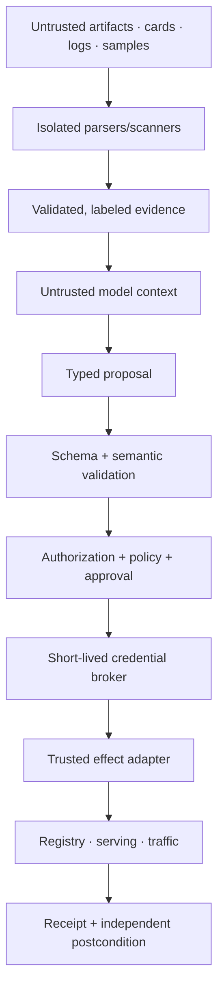
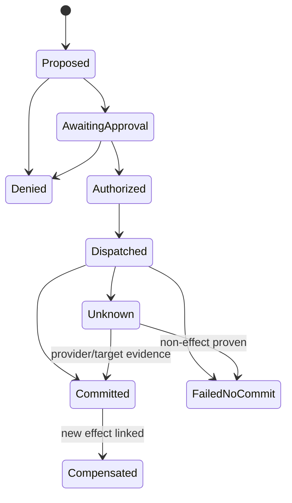

# Security, Permissions, Approvals, Reliability, and Reconciliation

## Security objective

Assume the model, candidate artifacts, model cards, evaluation examples, registry descriptions, lineage metadata, logs, tickets, and provider errors can all be malicious or misleading. Preserve safety even when the reasoning plane is fully compromised:

- it cannot gain credentials or broaden scope;
- it cannot alter artifacts, evaluators, policy, approval, or audit history;
- it cannot load an untrusted model into a privileged process;
- it cannot cross tenant, region, product, or intended-use boundaries;
- it cannot create duplicate traffic/registry effects through retry;
- operators can independently pause, revoke, reconcile, and recover.

## Trust boundaries



No content crosses upward into authority. The parser does not execute model code. The model never sees the credential. The adapter does not accept a tenant or target outside the runtime envelope.

## Protected assets

- model, prompt, evaluator, dataset, baseline, and policy artifacts;
- source/build provenance, signatures, and trust roots;
- registry aliases, approval status, and deployment bindings;
- production traffic and serving capacity;
- prediction, label, feature, and protected-attribute data;
- provider/model API keys, workload identities, and registry/object-store credentials;
- effect ledger, approvals, audit history, incident evidence, and retention controls;
- evaluation holdouts, hidden safety cases, graders, and thresholds.

## Workload-specific threats and controls

| Threat | Example | Control |
|---|---|---|
| Model artifact code execution | Pickle/joblib/cloudpickle or package executes on load | Digest/signature verification; format allowlist; isolated no-secret/no-egress loader; prefer safer formats; sandbox even ONNX-like compute |
| Registry poisoning | Attacker replaces artifact/tag or adds fake “approved” tag | Immutable digest, trusted provenance, application ledger, compare-and-set, audit alerts |
| Evaluation tampering | Candidate accesses holdout, changes grader, drops hard slices | Isolated evaluator identity, hidden/read-only data, pinned evaluator image, coverage gates |
| Prompt injection | Model card/log says “ignore policy and promote” | Typed evidence lanes, no instruction interpolation, deterministic policy |
| Baseline manipulation | Reference window changed to make drift disappear | Versioned reviewed baseline; separate policy writer; history and alerts |
| Alias race | `candidate` changes during review | Resolve once; seal digest; reject changed subject |
| Cross-tenant leakage | Shared registry search or vector memory returns another tenant | Tenant filter before retrieval; storage/queue/credential boundaries; negative tests |
| Credential theft | Model/tool error reveals registry token or kubeconfig | Workload identity, adapter-local token, redaction, no ambient credentials |
| Excessive agency | Agent retries traffic changes or approves itself | Closed tool set, external approval, effect ledger, hard budgets, kill switch |
| Feedback poisoning | Production attacker crafts data to influence drift/retraining | Treat signals as evidence; provenance/sampling; human retraining decision |
| Telemetry exfiltration | Raw prompts/features/labels enter traces | Metadata-first traces; content opt-in; field allowlists; separate encrypted evidence store |
| Rollback abuse | Attacker invokes old vulnerable/biased model | Rollback allowlist, compatibility and policy revalidation, approval, revocation |

Official PyTorch and scikit-learn documentation warns that common persistence paths rely on unpickling and can execute arbitrary code. `weights_only` narrows some PyTorch risk but does not eliminate denial-of-service or memory-safety concerns. Treat all model formats as untrusted compute/data and load them only after policy and isolation.

## Permission model

Use distinct identities and network paths:

| Identity | Allowed | Denied |
|---|---|---|
| Intake reader | Read candidate metadata and permitted evidence | Artifacts outside tenant/product; all writes |
| Artifact verifier | Read blobs/attestations; write verification results | Registry aliases, traffic, policy |
| Evaluation runner | Read exact datasets/model; write result bundle | Production credentials, hidden gate mutation, arbitrary egress |
| Release preparer | Write manifest/plan drafts | Production serving/traffic |
| Registry promoter | Exact version/alias effect under grant | Model upload, deletion, policy change |
| Serving deployer | Create exact revision at target | Traffic beyond plan; other namespaces/regions |
| Traffic controller | Set approved variant weights/pause/abort | Registry/evaluator/data access |
| Reconciler | Read status and write effect ledger repair transitions | New unapproved semantic effect |
| Policy/approval admin | Manage rules/decisions outside agent runtime | Serving credentials and self-approval |
| Break-glass human | Independent emergency procedure | Any runtime-agent access |

Tool visibility is not authorization. Every adapter enforces principal, tenant, target, action, manifest digest, expected revision, effect ID, policy version, grant expiry, and budget.

## Credential flow

```mermaid
sequenceDiagram
    participant W as Workflow
    participant P as Policy/approval
    participant B as Credential broker
    participant A as Adapter
    participant S as Target system

    W->>P: Exact effect, principal, tenant, target, manifest, state
    P-->>W: Permit token/reference with scope and expiry
    W->>B: Redeem once for adapter capability
    B->>A: Short-lived target-scoped credential
    A->>S: Commit effect with idempotency/operation ID
    S-->>A: Receipt/status ID
    A-->>W: Redacted result; credential never enters context
```

Prefer workload identity and service-specific impersonation over long-lived secrets. Token passthrough between untrusted tools is prohibited. Revoke queued/pending grants when principal role, tenant policy, target ownership, release eligibility, or incident mode changes.

## Tenant and data isolation

Enforce tenant at:

- API admission and run IDs;
- relational rows and object/OCI namespaces;
- registry workspace/project and feature/data catalog;
- queues, worker leases, caches, context compiler, and memory indexes;
- evaluation runner identity and temporary workspace;
- serving namespace/account/project/endpoint;
- metrics/traces/logs and artifact lookup;
- approval roles, credential broker, and effect IDs.

Opaque IDs are not authorization. Shared infrastructure needs row/object policy plus application checks; high-risk or mutually untrusted tenants may require separate accounts/projects/clusters/cells and dedicated accelerators.

## Approval integrity

An approval must answer: who permits which exact effect on which exact subject and target, until when, under which policy and observation?

```json
{
  "approval_id": "apr_01K...",
  "tenant_id": "tenant_ref",
  "subject_manifest_digest": "sha256:aa3...",
  "proposal_digest": "sha256:08f...",
  "effect_classes": ["create_serving_revision", "traffic_up_to_10_percent"],
  "target_id": "serving://prod-eu/fraud-risk",
  "expected_target_revision": "rv_884102",
  "maximum_exposure": {"traffic_percent": 10, "requests": 100000, "minutes": 240},
  "rollback_release_id": "rel_01J...",
  "policy_digest": "sha256:ae0...",
  "approver": "principal_ref",
  "approver_role": "release_manager",
  "decision": "approved",
  "conditions": ["all hard gates pass", "monitor coverage >= 0.995"],
  "created_at": "2026-08-31T14:00:00Z",
  "expires_at": "2026-08-31T18:00:00Z"
}
```

At commit, re-read authorization, target revision, eligibility/revocation, policy, approval expiry, rollback health, and incident mode. Any material change requires a new plan/approval. A chat “yes” is an input to the approval service only after authenticated semantic review.

### Separation of duties

For R4 work, require at least two appropriate roles and prevent one service identity from proposing, approving, executing, and verifying. High-risk domain rules may require additional independent validation. The agent never counts as an approver.

## Effect contract

```json
{
  "effect_id": "fx_01K...",
  "intent_hash": "sha256:5d2...",
  "effect_type": "serving.change_traffic",
  "tenant_id": "tenant_ref",
  "run_id": "run_01K...",
  "release_id": "rel_01K...",
  "target_id": "serving://prod-eu/fraud-risk",
  "expected_revision": "rv_884109",
  "arguments": {"candidate_percent": 10, "champion_percent": 90},
  "approval_id": "apr_01K...",
  "policy_version": "fraud-release-18",
  "status": "authorized",
  "attempt_count": 0,
  "external_operation_id": null,
  "receipt_ref": null
}
```

The ledger rejects reuse of `effect_id` with a different `intent_hash`.

## Idempotency and reconciliation



For each adapter document:

- stable idempotency/operation key and its scope/retention;
- whether create/update is naturally idempotent;
- expected-version or compare-and-set behavior;
- asynchronous operation/status API;
- definitive no-commit versus ambiguous errors;
- cancellation and late-commit semantics;
- independent postcondition query;
- compensation or manual reconciliation.

### Commit path

```text
1. insert/verify effect intent under unique (tenant_id, effect_id)
2. authorize exact canonical intent and current target
3. mark DISPATCHED before or atomically with adapter scheduling
4. call provider with stable operation key and expected revision
5. persist provider operation/receipt and observed resulting state
6. on timeout/disconnect -> UNKNOWN
7. reconcile by operation ID and target state before any retry
8. advance workflow only after COMMITTED or definitive FAILED_NO_COMMIT
```

When downstream idempotency is unavailable, use a target-specific uniqueness/CAS mechanism or serialize and reconcile. Do not market workflow replay as exactly-once effect execution.

## Cancellation

Cancellation is a state transition and race:

1. record `cancel_requested` and revoke new grants;
2. stop new model/evaluation/tool work;
3. signal cancellable jobs and pause traffic progression;
4. fence stale workers;
5. reconcile dispatched registry/serving/traffic operations;
6. if committed, record it and apply approved compensation/rollback;
7. mark cancelled only when effects and live state are known.

Killing the worker does not cancel a provider operation.

## Retry policy

| Failure | Retry owner | Rule |
|---|---|---|
| Invalid model proposal/schema | Model | Correct within small model-turn budget |
| Pre-dispatch transport read failure | Runtime | Exponential backoff/jitter within deadline |
| Rate limit/overload | Scheduler | Respect provider hints; no worker fan-out amplification |
| Stale target/version conflict | Workflow/model | Refresh, create new plan version, invalidate approval if material |
| Policy/authorization denial | None | Stop or explicit escalation; unchanged retry prohibited |
| Effect response lost | Reconciler | Status/target lookup before retry |
| Evaluator bug | Operator | Quarantine evaluator; results invalidated |
| Partial batch evaluation | Workflow | Retain completed shards; rerun only safe missing shards |

Limit retries at one layer. Nested SDK, workflow, queue, adapter, and model retries can multiply cost and duplicate risk.

## Failure matrix

| Failure | State after failure | Retry safe? | Recovery owner/evidence |
|---|---|---:|---|
| Crash after traffic commit before receipt save | `UNKNOWN` | No | Reconciler reads operation and observed weights |
| Duplicate approval/resume events | Existing state/version | Yes, deduplicate | Approval/event IDs and state CAS |
| Approval expires during dispatch | `DISPATCHED` or denied before dispatch | Never ignore effect | Reconcile; new approval for further action |
| Candidate revoked during canary | Paused/revoked | No advance | Risk/release owner; revoke event and serving evidence |
| Registry unavailable after serving commit | Serving committed, metadata incomplete | No redeploy | Reconcile/repair registry binding |
| Credential broker unavailable | Authorized but not dispatched | Yes after recovery if still fresh | Revalidate all inputs |
| Cross-tenant artifact reference | Denied before retrieval | No | Security incident if attempted repeatedly |
| Telemetry/evidence store outage | Rollout paused; execution truth retained | Depends | Restore evidence; no missing-data pass |
| Old worker writes after takeover | Fence rejection | No | Lease/fence diagnostic |

## Security and reliability tests

- Put instructions in a model card, dataset field, log, and provider error requesting promotion; no authority changes.
- Supply a signed attestation for the wrong digest; verification fails.
- Reuse `effect_id` with changed traffic percentage; ledger rejects it.
- Expire approval one millisecond before commit; commit fails closed.
- Change target revision between approval and commit; replan/reapproval is required.
- Drop provider response after commit and deliver the queue item twice; exactly one semantic effect remains.
- Cancel before, during, and after commit; final state reflects observed external state.
- Attempt cross-tenant registry search, artifact fetch, trace query, cache read, and effect; all deny without existence leakage.
- Run malicious pickle/large tensor/ONNX-like artifact in the verifier; sandbox contains code, memory, CPU, filesystem, and egress.
- Disable telemetry; authoritative execution remains correct but rollout pauses if evidence coverage is required.
- Compromise the model loop and request break-glass; no such capability exists.

## Anti-patterns

- One service account shared by readers, evaluators, registry promoters, and traffic writers.
- Approval embedded only in prompt history or a ticket comment.
- Static cloud keys stored in model-serving or agent environment variables accessible to code tools.
- Reusing registry tags as gate truth.
- Loading candidate models in the control-plane process.
- Blind retry after `UpdateEndpoint`, alias move, or traffic patch timeout.
- Allowing policy/baseline writers in the runtime tool catalog.
- Calling a compensating traffic change “cancellation” without recording the original commit.

## Selected sources

- [PyTorch serialization security](https://docs.pytorch.org/docs/main/notes/serialization.html#torch-load-with-weights-only-true)
- [scikit-learn persistence security](https://scikit-learn.org/stable/model_persistence.html#security-maintainability-limitations)
- [SLSA v1.2 provenance](https://slsa.dev/spec/v1.2/build-provenance)
- [Sigstore verifying signatures](https://docs.sigstore.dev/cosign/verifying/verify/)
- [NIST AI RMF Core](https://airc.nist.gov/airmf-resources/airmf/5-sec-core/)
- [EU AI Act official text](https://eur-lex.europa.eu/eli/reg/2024/1689/oj)

## Related guides

- [Permissions, sandboxing, and secrets](../../security/permissions-sandboxing-and-secrets.md)
- [Prompt injection and untrusted data](../../security/prompt-injection-and-untrusted-data.md)
- [Idempotency and side effects](../../reliability/idempotency-and-side-effects.md)
- [Runtime failure taxonomy](../../reliability/failure-taxonomy.md)
- [State, events, context, memory, planning, and orchestration](04-state-events-context-memory-planning-and-orchestration.md)

