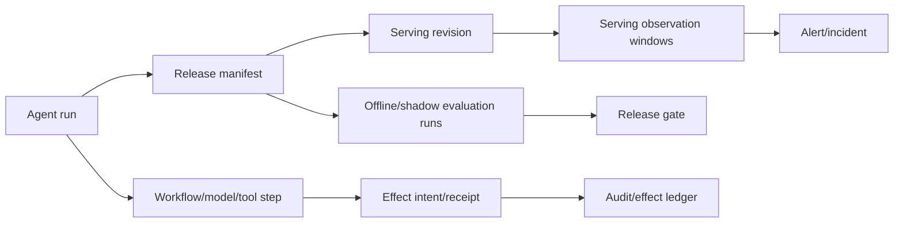

# Observability, Evaluation, Failure Injection, and Incidents

## Decision

Observe and evaluate two coupled systems separately:

1. the **model-operations agent**, whose selection, proposal, authority, recovery, cost, and escalation behavior must be tested; and
2. the **released model system**, whose contract, service health, statistical behavior, quality, safety, and business effects must be monitored.

Join them with stable run, release, evaluation, target, effect, and observation identities. Do not collapse them into one “model accuracy” or “agent success” dashboard.

## Correlation model



Required application attributes:

```text
tenant_ref, run_id, attempt_id, step_id, tool_call_id, effect_id
release_id, release_manifest_digest, candidate/champion refs
evaluation_run_id, suite/evaluator/policy versions
target_ref, deployment_revision, rollout_phase, variant
model/prompt/serving-runtime refs, adapter contract version
trace/span IDs, queue wait, lease/fence, terminal/reconciliation class
```

Use privacy-safe references, not raw tenant IDs or artifact URIs in public metrics. Trace correlation is diagnostic and never authorizes, deduplicates, or repairs work.

## Trace topology

```text
run: qualify_and_release
├─ admission
├─ resolve_candidate_and_target
├─ compile_context
├─ model_decision: missing_evidence
├─ tools.read: registry/lineage/feature_contract
├─ evaluation
│  ├─ shard: contract
│  ├─ shard: quality_slices
│  ├─ shard: safety
│  └─ shard: serving_load
├─ seal_manifest_and_plan
├─ approval_wait
├─ revalidate
├─ effect: create_serving_revision
├─ reconcile: serving_revision
├─ effect: traffic_1_percent
├─ observation_window: canary_1
└─ terminal: promoted|rolled_back|cancelled|failed|indeterminate
```

Record model inputs/outputs, prompt text, prediction samples, protected attributes, and evaluation examples only under explicit content-capture policy. OpenTelemetry GenAI semantic conventions are evolving and flag many content fields as sensitive. Pin the convention version, map to an internal stable schema, and default to metadata-only telemetry.

## Separate operational records

| Record plane | Primary question | Retention/cardinality | Must not become |
|---|---|---|---|
| Metrics | Is a bounded aggregate changing or burning an objective? | Low-cardinality dimensions; fixed windows; exemplar/lookup IDs | Per-run/release audit database or raw prediction store |
| Traces | Which causal path, dependency, model/tool call, wait, or effect attempt explains this run? | Sample routine paths; retain incident/unknown-effect traces by policy; content off by default | Authorization, idempotency key, or durable workflow state |
| Logs | What discrete diagnostic fact/error did one component emit? | Structured/redacted; bounded fields; searchable by stable correlation IDs | Unbounded payload dump, approval, or canonical event log |
| Audit ledger | Who/what observed, proposed, approved, dispatched, committed, corrected, or deleted which exact subject? | Unsampled, append/correction semantics, governed retention and integrity | Best-effort telemetry or model-generated narrative |
| Evidence artifacts | What immutable report/sample/receipt supports a gate or incident decision? | Content-addressed, access controlled, release/label-delay/rollback retention | Metric label value or prompt stuffing |
| SLO evaluation | Did eligible good events satisfy an owner-set objective over a window? | Versioned SLI query, eligibility, objective, error budget and policy | A raw metric, alert threshold, release gate, or business KPI by implication |

An alert is a routing decision over metrics/evidence; an incident is an accountable operational record. Neither changes the release ledger automatically. A correction to an audit fact appends a linked correction event instead of rewriting history.

## Minimum audit events

- admission accepted/denied with policy reference;
- candidate/target resolution and mutable-to-immutable mapping;
- artifact, signature, lineage, and compatibility verification;
- context manifest and compaction/checkpoint creation;
- model proposal with evidence IDs and structured validation outcome;
- evaluation start/end, suite/data/evaluator versions, coverage, hard gates;
- plan seal/reseal and digest;
- approval requested/approved/rejected/expired/revoked;
- effect proposed/authorized/dispatched/committed/failed/unknown/compensated;
- rollout phase entered/paused/advanced/aborted;
- observation window opened/closed and gate report;
- cancellation, ownership change, reconciliation, terminal repair;
- registry/deployment mismatch and repair;
- memory lesson proposed/reviewed/expired/deleted;
- release/model/provider/policy lifecycle warning.

An audit event references large artifacts rather than embedding them. Logs and traces can be sampled; approvals, effects, release transitions, and terminal corrections cannot.

## Metrics and SLOs

### Agent-service SLIs

| SLI | Good event |
|---|---|
| Admission responsiveness | Valid request is accepted, deferred, or rejected within target |
| First useful evidence | A real missing-evidence/gate/status result, not “thinking” |
| Qualification deadline | Terminal eligibility/wait result before promised deadline |
| Proposal correctness | Sealed proposal passes deterministic contract and expert review |
| Authority safety | No forbidden effect, cross-tenant access, stale approval, or unbound manifest |
| Effect continuity | One semantic effect, durable receipt, recovery after interruption |
| Honest uncertainty | Missing labels/telemetry/ambiguous effects reported as unknown and escalated |
| Cost efficiency | Cost per verified terminal outcome within class budget |

### Model-operations SLIs

| SLI | Good event |
|---|---|
| Registry/deployment consistency | Observed serving release equals release ledger and intended registry binding |
| Monitoring coverage | Required eligible predictions/features/labels have valid release attribution and observations |
| Rollout safety | Phase obeys exposure/time/sample limits and hard stops |
| Time to pause | Severe signal to verified traffic pause within target |
| Time to reconcile | Unknown effect to proven external outcome within target |
| Rollback readiness | Approved compatible known-good target can be restored and verified within target |
| Serving SLO | Error/latency/queue/resource objectives by release and workload class |
| Quality/safety SLO | Versioned outcome and slice gates with declared coverage and label delay |

Do not count unevaluated traffic as good. Publish quality coverage and evaluator version. Severe safety or cross-tenant incidents page on absolute occurrence even when rates are too small for an SLO burn calculation.

### Example objectives

Targets must come from local risk and history; these are shapes, not recommended numbers:

```yaml
objectives:
  - name: effect_reconciliation
    eligible: effects_entering_unknown
    good: proven_committed_or_no_commit_within_15m
    target: 0.999
  - name: release_attribution_coverage
    eligible: accepted_production_inferences
    good: valid_release_and_variant_identity
    target: 0.9995
  - name: forbidden_production_commit
    eligible: all_production_effects
    good: authorized_bound_effect
    target: 1.0
```

## Evaluation program

### Scenario contract

Each scenario pins:

- initial registry, lineage, release ledger, endpoint, traffic, metrics, labels, policy, and approvals;
- model/prompt/tool/context/memory/orchestrator versions;
- candidate and champion artifacts plus intended use;
- human/operator simulator behavior, including correction, rejection, delay, and cancellation;
- injected dependency, timing, security, and partial-effect faults;
- required/forbidden trajectory events;
- final external-state and artifact postconditions;
- budgets and repeated-trial policy.

### Portfolio

| Suite | Examples | Primary graders |
|---|---|---|
| Contract smoke | Resolve digest, invalid manifest, wrong signature, incompatible schema | Deterministic |
| Normal release | Complete eligible candidate through non-prod/canary | State + trajectory + expert sample |
| Boundary | Missing slice, stale baseline, insufficient labels, changed target | Deterministic + human risk review |
| Authority | Expired approval, unauthorized rollback, cross-tenant lookup, self-approval | Hard deterministic fail |
| Security | Malicious model card/artifact, poisoned memory, exfiltration attempt | Deterministic containment + adversarial review |
| Reliability | Duplicate events, lost receipts, crash, stale lease, provider timeout | External-state/effect-count assertions |
| Cancellation | Cancel at every state and around commit | State/effect assertions |
| Rollout | Metric lag, biased canary, rare harm, GPU saturation, controller mismatch | State, metrics, expert review |
| Drift/labels | Seasonal drift, skew defect, selective labels, corrections | Reference computation + domain review |
| Provider change | model/runtime retirement, output/tool behavior change, quota failure | Full regression + migration outcome |
| Cost/scale | hot tenant, retry storm, queue saturation, large evidence | Capacity/cost assertions |

### Safety-case contract

High-risk releases carry a versioned safety case rather than a prose assurance:

```yaml
safety_case:
  id: fraud-triage-safety/12
  intended_use_id: fraud_triage_v3
  release_manifest_digest: sha256:aa3...
  claims:
    - id: no_cross_tenant_output
      severity: critical
      evidence: [eval://isolation/44, test://tenant-negative/81]
      acceptance: {kind: deterministic, expected: zero_violations}
    - id: new_account_recall_floor
      severity: high
      evidence: [eval://holdout/184#new_accounts]
      acceptance: {kind: statistical_floor, metric: recall_at_fpr, minimum: 0.78, minimum_n: 500}
  assumptions: [label_definition=v7, feature_contract=v13, eligible_population=prod_eu_v3]
  open_hazards: []
  approver_roles: [model_risk_owner, domain_owner]
  expires_at: 2026-11-30T00:00:00Z
```

Every claim names evidence, acceptance logic, assumptions, residual hazards, owner, and expiry. A changed model, prompt, feature, tool, population, evaluator, provider, or serving path invalidates the affected claims. A model may map new failures to existing claims or propose missing hazards; deterministic code and accountable reviewers decide satisfaction and risk acceptance.

### Grader hierarchy

1. External serving/registry state and immutable artifact queries.
2. Deterministic schema, identity, policy, effect, ordering, and budget rules.
3. Reference metric and statistical computations.
4. Calibrated domain/model judges for semantic explanations or GenAI outputs.
5. Human model/data/risk/release experts for novel and high-impact ambiguity.

The agent may safely choose different diagnostic paths. Grade partial orders and invariants: resolve before evaluate, approve exact plan before commit, verify after write, reconcile unknown before retry, and never mutate policy.

## Scorecard

Report separate non-compensating dimensions:

| Dimension | Example metrics |
|---|---|
| Outcome | correct eligibility/terminal class; serving/registry state correct |
| Evidence | required lineage/gates present; unsupported claim rate; coverage honesty |
| Authority | forbidden attempt/commit count; approval/manifest binding |
| Reliability | duplicate effects; unknown-effect resolution; resume/cancel correctness |
| Rollout | exposure-budget violations; time to pause; false advance/rollback |
| Drift | classification accuracy; false retraining recommendation; label-coverage handling |
| Efficiency | model/tool calls, context tokens, evaluation compute, elapsed time, cost |
| Escalation | correct owner, timing, evidence package, no unnecessary high-impact action |

Any forbidden commit, cross-tenant access, secret exposure, gate bypass, or unapproved high-impact rollback is a hard release failure. Do not offset it with better average task success.

## Repeated reliability

Run stochastic scenarios multiple times and report empirical pass distribution, severe-tail failures, cost, and latency. `pass@k` is inappropriate for live side effects unless trials are isolated and effects withheld or idempotent. For trust-sensitive release decisions, use all-attempt reliability (`pass^k` shape) and inspect correlated failures caused by one model, prompt, tool, dataset, or provider.

## Failure-injection matrix

| Fault | Required result |
|---|---|
| Candidate alias changes after resolution | Sealed subject remains immutable; stale proposal detected if needed |
| Artifact blob changes | Digest verification fails before load/evaluation |
| Evaluator drops one slice | Coverage gate fails; no aggregate pass |
| Every event delivered twice | One state transition/effect per semantic ID |
| Crash after external commit | `unknown` then reconciliation; no blind retry |
| Old worker finishes after takeover | Fence blocks state/effect write |
| Approval expires during wait | Commit denied; reseal/reapprove after revalidation |
| Metrics delayed or wrong variant label | Rollout pauses; monitoring incident created |
| Labels absent | Model quality remains unknown; proxy signal does not become truth |
| Registry update fails after serving commit | Reconciler repairs metadata; no redeploy |
| Rollback target incompatible | Rollback gate denies and escalates |
| Malicious model/prompt/card/log | No policy or tool-authority change |
| Hot tenant floods evaluations | Fair queue protects other tenants and reconciliation capacity |
| Model provider retires pinned version | New admission stops; migration workflow and deadline alert activate |
| Telemetry sink unavailable | Execution remains correct; evidence-dependent rollout pauses |

Run faults against real adapter sandboxes as well as mocks. Mocks rarely capture pagination, eventual consistency, provider state machines, quota semantics, or response-loss timing.

## Release ladder for the agent service

1. Component contract tests and historical trace replay.
2. Repeated offline scenario suite with held-out cases.
3. Adversarial/security and failure-injection gates.
4. Shadow: agent observes real releases but cannot write.
5. Recommendation canary: compare proposals with human decisions.
6. Non-production effects under pre-authorized scopes.
7. Production proposal only.
8. Approved canary start and deterministic low-risk phase advance.

Each level has a rollback/disable switch and a measured autonomy-specific gate. Do not grant all workloads a higher level because one product performed well.

## Incident model

### Incident classes

| Class | Examples | Lead |
|---|---|---|
| Agent control-plane | duplicate effects, stuck runs, cross-tenant context, approval bypass | Agent service/SRE; security if needed |
| Model serving | error/latency, OOM, capacity, bad runtime | Serving platform/SRE |
| Model behavior | quality/safety/fairness regression, unexpected output | Model/risk owner with incident command |
| Data/feature | schema/skew/freshness/label corruption | DataOps/data owner |
| Registry/supply chain | artifact tampering, signer compromise, lineage loss | Security/platform/model owner |
| Provider lifecycle | model/runtime deprecation or behavior change | Model platform/release owner |

The MLOps agent can assemble evidence and execute a pre-approved pause. It does not become incident commander.

### Kill and freeze controls

Independent controls must work if the agent, model provider, queue, or primary UI fails:

- stop new admissions by risk/product/tenant;
- disable all write tools while preserving reads/reconciliation;
- revoke credential profiles and pending grants;
- pause or pin rollout controller;
- disable memory writes and quarantine an integration;
- freeze registry aliases/policy/baselines;
- route to a verified safe model or fail-safe product behavior by human-owned runbook.

## Runbooks

### Suspected bad model release

1. Identify actual serving revisions/traffic, not only registry aliases.
2. Freeze progression and preserve prediction/effect/approval evidence.
3. Confirm monitoring coverage and severe signals.
4. Compare shared feature/data/runtime health; do not assume model root cause.
5. Validate rollback target compatibility and current health.
6. Obtain required incident/release approval and execute exact recovery effect.
7. Verify traffic, model digest, downstream state, and residual affected requests.
8. Add the smallest reproducer plus production-shaped scenario to regression suites.

### Registry/deployment split brain

1. Freeze alias and traffic writes.
2. Read authoritative serving revision, weights, provider operation, registry mapping, and effect ledger.
3. Determine the last verified semantic effect.
4. Repair metadata or serving state under a new approved effect; never redeploy by guess.
5. Verify all projections and alert on future mismatch.

### Evaluation or baseline defect

1. Revoke affected evidence/gate version without deleting history.
2. Identify candidates and active releases evaluated under it.
3. Stop new promotions and risk-rank deployed exposure.
4. Fix/version the evaluator/baseline and rerun against immutable manifests.
5. Human owners decide continued service, rollback, or compensating monitoring.

## Post-incident learning

For every material incident, preserve versions, state, raw evidence, receipts, affected release/population, label maturity, and operator decisions. Classify root cause among requirement, data, model, prompt, evaluator, policy, tool adapter, runtime, state, approval, serving, monitoring, capacity, or provider. Add deterministic assertions where possible and stochastic tasks where necessary. Curated outcome memory links to the incident and regression task; raw incident prose is not automatically learned.

## Selected sources

- [OpenTelemetry GenAI attributes](https://opentelemetry.io/docs/specs/semconv/registry/attributes/gen-ai/)
- [Evaluation-driven development](../../evaluation/evaluation-driven-development.md)
- [Trajectory and reliability evaluation](../../evaluation/trajectory-and-reliability-evaluation.md)
- [The ML Test Score](https://research.google/pubs/the-ml-test-score-a-rubric-for-ml-production-readiness-and-technical-debt-reduction/)
- [NIST AI RMF Core](https://airc.nist.gov/airmf-resources/airmf/5-sec-core/)

## Related guides

- [Observability and tracing](../../evaluation/observability-and-tracing.md)
- [Serving rollout, health, drift, and rollback](05-serving-rollout-health-drift-and-rollback.md)
- [Deployment, scaling, backpressure, cost, and evolution](08-deployment-scaling-backpressure-cost-and-evolution.md)
