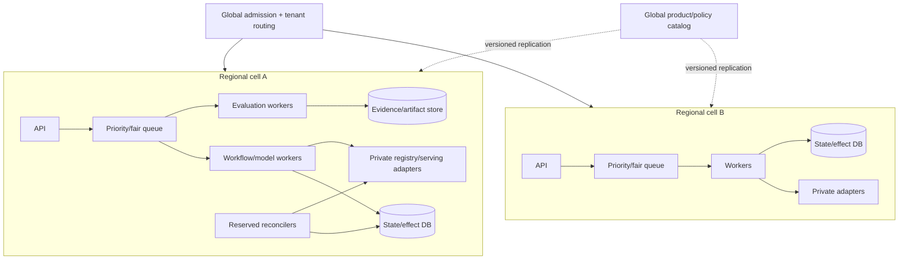
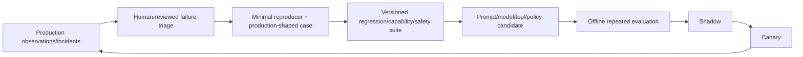

# Deployment, Scaling, Backpressure, Cost, and Evolution

## Production position

Scale by workload class and tenant cell, not by adding model loops. Protect reconciliation, pause/abort, and incident work from exploratory evaluation. Capacity includes model-provider quotas, evaluation compute, artifact bandwidth, serving CPU/GPU, state stores, rollout observation, and human approvals.

## Reference deployment



Start as one cell. Introduce cells only for scale, failure containment, residency, or strong tenancy. Do not put global mutable release state in a cache. Assign one home cell per run/target and use ownership fencing during failover.

## Workload classes and queues

| Class | Promise | Queue/priority | Must protect |
|---|---|---|---|
| Interactive read/qualification | First useful evidence quickly | Bounded online queue | Read capacity and small model route |
| Evaluation | Complete before release deadline | Batch/fair queue by tenant/product/risk | Compute, data access, hidden-set isolation |
| Rollout control | Timely phase decision | High-priority target-serialized queue | Traffic writer and monitoring freshness |
| Reconciliation | Restore known external state | Reserved highest operational capacity | Provider read/status quota and effect ledger |
| Incident pause/abort | Immediate containment | Independent priority path | Credentials/controller access/kill switch |
| Continuous monitoring/failure mining | Scheduled deadline | Background queue | No starvation of live releases |
| Provider migration replay | Planned bulk deadline | Batch/low-priority pool | Held-out suite and budget |

Use separate concurrency budgets even if queues share a broker. An evaluation burst must not prevent reconciliation of an unknown traffic effect.

## Admission and backpressure

Admission reserves or validates:

- tenant/product/risk entitlement;
- active run/target lock and rollout exclusivity;
- deadline and maximum queue age;
- model-call/token budget and provider route availability;
- evaluation CPU/GPU/memory/data-scan budget;
- artifact bytes and state/trace storage budget;
- serving capacity for candidate plus rollback headroom;
- approval capacity for deadline-sensitive work;
- reconciliation and incident reserve.

```text
estimated_service_demand =
    model_calls * tokens_per_call / provider_token_rate
  + evaluation_shards * shard_runtime
  + artifact_bytes / effective_bandwidth
  + rollout_windows * observation_job_demand
```

This estimate informs admission; it is not a promise. Track prediction error and revise by task slice.

### Queue contract

```yaml
job:
  job_id: job_01K...
  tenant_id: tenant_ref
  workload_class: evaluation
  risk: R3
  home_cell: in-west-1-a
  target_key: prod-eu/fraud-risk
  deadline_at: 2026-08-31T18:00:00Z
  cost_reservation_usd: 50
  resource_profile: {cpu: 8, memory_gib: 32, gpu_class: none}
  attempt_limit: 3
  idempotency_key: evalrun_01K...
  state_version: 4
```

Workers use leases and fencing. Slow or poisoned jobs cannot hold an unbounded worker, output, retry, or artifact budget.

## Multi-tenant isolation and fairness

Apply tenant/product/risk quotas to:

- active and queued runs;
- model input/output tokens and concurrent requests;
- evaluation CPU/GPU hours and data scans;
- artifact and trace bytes/retention;
- registry/feature/serving/provider request rates;
- rollout targets and exposure;
- approvals and human-review backlog;
- incident/reconciliation reserve consumption.

Use weighted fair scheduling plus per-tenant caps. A tenant with large GPU evaluations must not monopolize small CPU contract tests. High-risk tenants may require dedicated cells, stores, registry projects, service identities, and GPU isolation. GPU time-slicing increases utilization but lacks memory/fault isolation; apply only where the threat and performance model permits.

## Capacity signals

Scale based on the binding resource:

| Resource | Signals | Unsafe reaction |
|---|---|---|
| Model provider | token/request quota, throttle, queue and latency | Add workers that amplify throttling |
| Evaluation pool | eligible queue age, CPU/GPU/memory, job runtime | Launch more jobs than data/provider can serve |
| Artifact store | throughput, latency, request quota, cache hit | Put mutable alias results in stale shared cache |
| State DB | transaction latency, lock/conflict, outbox lag | Bypass state and write provider directly |
| Serving platform | queue, p99, GPU memory/utilization, replica/cold-start | Advance canary to “test at scale” |
| Human approval | oldest wait, deadline pressure, staffing | Auto-approve or weaken policy |
| Reconciler | unknown-effect age, provider read quota | Shed reconciliation as background work |

Autoscale workers from eligible queue demand, service-time estimates, and downstream headroom. Drain leases/checkpoints before scale-down.

## Accelerator-pool contract

Treat an accelerator pool as a versioned operational dependency, not `gpu: 1`:

```yaml
accelerator_pool:
  pool_id: k8s://prod-eu/nodepool/inference-a100
  region_zone_policy: eu-west/multi-zone
  accelerator: {vendor: nvidia, product: A100-80GB, resource_name: nvidia.com/mig-3g.40gb}
  isolation: mig
  software: {driver: 580.65.06, device_plugin: 0.18.0, gpu_operator: 25.10.1, cuda: "13.0"}
  scheduling: {taints: [inference=true], priority_class: model-serving, topology_policy: spread}
  autoscaling: {node_min: 4, node_max: 20, pod_min: 2, pod_max: 16, demand_metric: queue_concurrency}
  reserves: {champion_replicas: 2, rollback_replicas: 2, incident_percent: 10}
  quotas: {regional_devices: 24, tenant_devices: 8}
  cold_start_slo_seconds: 420
  verified_at: 2026-08-31T10:00:00Z
```

Values above are illustrative and must come from the target estate. Validate node provision time, image/model pull and load time, device allocation, memory fragmentation, MIG/time-slice semantics, driver/runtime compatibility, per-model batching/concurrency, topology, quota, preemption and scale-down. HPA/KPA can request replicas while no accelerator node or quota exists; pod readiness can be green before sustainable queue service. Couple workload autoscaling with node capacity and never consume champion/rollback reserve to make a candidate appear healthy.

## Graceful degradation

| Pressure/failure | Safe degraded mode | Never do |
|---|---|---|
| Agent model unavailable | Deterministic gates and human/manual proposal workflow | Skip evidence/gates |
| Weak provider route only | Use it for low-risk summarization if qualified; hold high-risk decisions | Silent quality downgrade for releases |
| Registry degraded | Read cached immutable artifacts only if freshness contract permits; freeze writes | Promote from stale mutable aliases |
| Evaluation capacity exhausted | Defer low-priority work; preserve deadline/status | Mark unrun tests passed |
| Monitoring blind | Pause rollout progression; retain current safe traffic | Treat no alarm as health |
| Approval backlog | Hold exact proposal durably | Auto-approve near deadline |
| Serving capacity constrained | Keep champion headroom; reduce candidate exposure/defer | Remove rollback capacity first |
| Cell failure | Route compatible new work; recover fenced durable runs by policy | Run same active effect in two cells |

## Cost model

Attribute cost to tenant, product, release, evaluation suite, rollout, and verified outcome:

```text
release_cost =
    agent_model_tokens
  + evaluation_compute_and_judges
  + dataset_scan_and_egress
  + artifact_storage_and_transfer
  + duplicate_serving_capacity * bake_time
  + inference_canary_shadow_cost
  + telemetry_and_label_join
  + human_review
  + retry_reconciliation_incident_cost
```

Track:

- cost per eligible/ineligible/released/rolled-back outcome;
- marginal cost of each evaluation slice and detector;
- shadow/canary double-compute and GPU warm capacity;
- model/prompt judge route cost and calibration benefit;
- storage growth by raw prediction/evaluation/trace retention;
- recovery amplification after provider or cell failure;
- opportunity cost of reserved rollback/incident capacity.

Optimize in this order: remove unnecessary model calls; deterministically reduce evidence; cache immutable authorized artifacts; batch safe evaluation; choose qualified lower-cost model routes; tune serving batching/concurrency; change capacity commitments. Never cut mandatory safety coverage or rollback headroom merely to hit average cost.

## Model routing and provider policy

The agent's reasoning model and the released model are separate release subjects.

### Agent reasoning route

- Route by task, risk, data/region policy, tool/structured-output capability, context need, deadline, and measured eval quality.
- Set a non-downgradable capability floor for production release/rollback proposals.
- Permit at most one bounded escalation unless the failure class changes.
- Pin a tested provider/model snapshot where available; do not use auto-updating aliases for high-impact paths.
- Provider failover is a behavioral release, not a transport retry.

### Released foundation model/provider

Record provider, exact model/version/deployment, region, API surface, inference parameters, safety configuration, tokenizer/context/tool behavior, quota class, price basis, and lifecycle date. OpenAI documentation states prompting behavior can change between snapshots and recommends pinned versions plus evals. Bedrock documents active/legacy/EOL states and provider-specific lifecycle. Monitor lifecycle APIs/pages and create migration work before expiry.

## Change qualification matrix

Every change below runs an appropriate release suite; none is “configuration only”:

| Change | Minimum qualification |
|---|---|
| Model weights/fine-tune | Full quality/safety/slice/serving/rollback suite |
| Prompt/system instruction | GenAI task, safety, format, tool trajectory, cost/latency |
| Foundation model/provider | Full behavioral, tool/schema, safety, latency, cost, residency, fallback |
| Evaluator/judge/rubric | Backtest against expert labels; disagreement and gate-impact audit |
| Dataset/label definition | Lineage, population, leakage, slice, comparability, owner approval |
| Feature contract/store | Point-in-time and training-serving parity, freshness, load, rollback compatibility |
| Serving runtime/image | Load/parity, performance, resource, security, rollout/rollback |
| Adapter/API/CRD | Captured-fixture and sandbox contract tests, error/idempotency/reconciliation |
| Policy/baseline/threshold | Historical backtest, false positive/negative, independent review |
| Context compiler/memory | Required evidence recall, injection, compaction, cross-tenant, deletion |

## Deployment and release of the agent service

Deploy application changes independently from model/prompt/policy/evaluator artifacts, but bind their versions in an agent release manifest:

```yaml
agent_release:
  app_image_digest: sha256:...
  workflow_schema: mlops-run/3
  tool_contracts: {registry: 2.1.0, serving: 3.0.0, evaluation: 1.4.0}
  agent_model_routes: agent-routes/9
  prompt_bundle_digest: sha256:...
  context_compiler_version: 6
  memory_policy_version: 4
  release_policy_digest: sha256:...
  evaluator_bundle_digest: sha256:...
  database_migration: 018_add_observation_coverage
```

Use backward-compatible event/state readers, expand/migrate/contract schema changes, shadow and canary, release-level dashboards, and a kill switch. Long-running runs need explicit pin, migrate, version-branch, cancel/restart, or operator-repair policy.

## Disaster recovery

Define RPO/RTO separately for:

- run/workflow state and approvals;
- effect ledger and external operation IDs;
- immutable manifests/evaluation/attestation artifacts;
- registry metadata and deployment mapping;
- monitoring observations and label joins;
- policy/product catalog and curated memory.

Backups are insufficient. Restore into an isolated environment, verify referential integrity and tenant boundaries, then reconcile all nonterminal effects against external registry/serving/traffic state before resuming. A recovered database must not replay already-committed traffic changes under new IDs.

## Recovery-load and failover admission

Capacity planning must include the surge after failure, not only steady state:

```text
recovery_load =
    due_timers_and_expired_approvals
  + queued_admissions_before_outage
  + unknown_effect_reconciliation_reads
  + artifact/cache rehydration
  + evaluator shard retry after safe deduplication
  + serving model/image reload and cold start
  + monitoring/label-window catch-up
  + operator and provider API rate-limit demand
```

On recovery, admit in this order: independent pause/abort; external-state reconciliation; state/effect integrity; active rollout observation; time-sensitive label/monitoring windows; then ordinary qualification and evaluation. Jitter and rate-limit catch-up, expire work whose deadline or approval passed, preserve original effect IDs, and measure time to clear the backlog without violating live-serving headroom. DR passes only when the restored control plane proves every nonterminal external effect before resuming writes and the serving plane can restore champion plus rollback capacity inside the declared RTO.

## Continuous evaluation and evolution



Govern feedback:

- preserve sampling, consent, privacy, release identity, and label provenance;
- distinguish user feedback from ground truth and from business outcomes;
- review severe failures and hard negatives before dataset admission;
- prevent production examples from leaking into held-out gates;
- version grader and dataset corrections;
- audit whether monitoring/feedback coverage excludes affected groups;
- require owners to approve retraining, new data, intended-use, and threshold changes;
- deprecate obsolete model/prompt/evaluator/tool versions with migration and rollback plans.

## Operational cadence

| Cadence | Review |
|---|---|
| Per release | Exact manifest, gate report, approval, rollout, monitoring coverage |
| Daily/on-call | Unknown effects, registry/deployment mismatch, rollout pauses, severe signals |
| Weekly | Queue/SLO/cost/tenant fairness, detector health, provider lifecycle notices |
| Monthly | Failure mining, eval slices, label coverage/bias, memory review, capacity forecast |
| Quarterly/risk-based | Access/SoD, recovery drill, baseline/policy review, high-risk documentation |
| Before any major change | Full change qualification matrix and adapter/provider refresh |

## Acceptance tests

- One hot tenant cannot violate another tenant's qualification or reconciliation SLO.
- Evaluation overload sheds/defer safely while pause/abort and reconciliation remain available.
- Cell failover fences the previous owner and creates no duplicate effect.
- Restored state reconciles every nonterminal operation before scheduling work.
- Provider/model retirement generates an owned migration deadline and blocks new unsafe use.
- Agent provider failover passes the same behavioral and governance gates.
- Cost dashboards reconcile model, compute, storage, serving, telemetry, and human-review spend.
- Degraded modes are exercised and do not relax authority or evidence requirements.

## Selected sources

- [Kubernetes multi-tenancy](https://kubernetes.io/docs/concepts/security/multi-tenancy/)
- [Kubernetes Dynamic Resource Allocation hardening](https://kubernetes.io/docs/concepts/security/hardening-guide/dynamic-resource-allocation/)
- [NVIDIA GPU sharing](https://docs.nvidia.com/datacenter/cloud-native/gpu-operator/latest/gpu-sharing.html)
- [OpenAI backward compatibility and pinned models](https://platform.openai.com/docs/api-reference/backward-compatibility)
- [Amazon Bedrock model lifecycle](https://docs.aws.amazon.com/bedrock/latest/userguide/model-lifecycle.html)
- [Google production ML pipelines](https://developers.google.com/machine-learning/managing-ml-projects/pipelines)
- [Hidden Technical Debt in Machine Learning Systems](https://papers.neurips.cc/paper_files/paper/2015/file/86df7dcfd896fcaf2674f757a2463eba-Paper.pdf)

## Related guides

- [Queues, scheduling, and backpressure](../../operations/queues-scheduling-and-backpressure.md)
- [Model routing, cost, and latency](../../operations/model-routing-cost-and-latency.md)
- [Scaling, capacity, and SLOs](../../operations/scaling-capacity-and-slos.md)
- [Deployment, release, and incident response](../../operations/deployment-release-and-incident-response.md)
- [Zero-to-production stages and exit gates](09-zero-to-production-stages-and-exit-gates.md)
