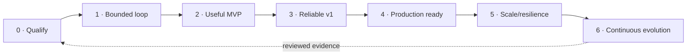
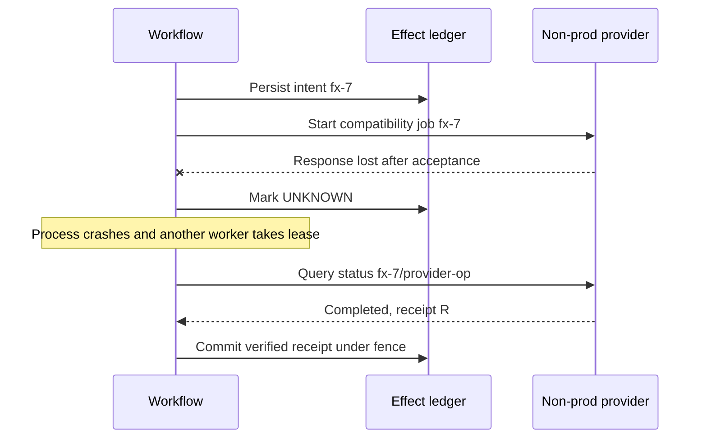

# Zero-to-Production Stages and Exit Gates

## How to use this roadmap

Stages 0–6 are evidence gates, not calendar phases or a feature checklist. Do not advance because components exist. Advance when the current stage's failure modes are measured, authority boundary works, and exit evidence is reviewed. A product can remain permanently at a lower autonomy level while improving reliability, scale, and evaluation.



Every stage retains these invariants:

- model output is a proposal, not authority;
- immutable release identity precedes evaluation and approval;
- training/retraining and high-impact rollback stay human-owned;
- observations, evidence, decisions, approvals, effects, and receipts stay separate;
- no stage hides unknown effects or missing quality labels;
- deterministic automation remains the fallback and comparison baseline.

## Stage 0 — qualify the problem and build the deterministic baseline

### Stage 0 objective

Prove that an agent is needed. Build the ordinary release evidence path first: resolve artifacts, run fixed validation, generate a report, and hand the decision to a human.

| Contract | Stage 0 decision |
|---|---|
| Architecture | CLI/CI job or small service; fixed workflow; fixture/real read-only registry; no model loop required |
| Authority | Read-only; may write local/report artifacts but no registry, serving, or traffic mutation |
| Inputs | Candidate immutable ref, champion ref, intended use, target contract, fixed policy/eval suite |
| Outputs | Machine-readable completeness/gate report and human review packet |
| State/events | One run record; `accepted → resolved → eligible/ineligible/unknown`; event IDs and artifact refs |
| Failure handling | Explicit missing/stale/unavailable/unknown; bounded read retries; no effect ambiguity |
| Evaluation | Validator unit/contract tests; historical candidates; measure human time, unresolved cases, and false conclusions |
| Exit gate | A repeated, valuable judgment gap remains after deterministic automation; target workflows and non-goals are approved |

### Minimal architecture

```text
candidate ref -> resolver -> deterministic validators -> evidence bundle -> human
```

### Implement first

1. Candidate/champion resolution to immutable versions/digests.
2. Release manifest schema and canonical hash.
3. Fixed artifact/signature/lineage/evaluation/compatibility checks.
4. A structured `pass | fail | unknown` report with evidence IDs.
5. Twenty or more representative historical/constructed scenarios, weighted by risk rather than count.

### Stage 0 failure tests

- mutable alias changes during resolution;
- missing dataset/feature version;
- stale evaluation bound to another digest;
- candidate with good aggregate score but failing required slice;
- registry outage and truncated pagination;
- model artifact format that cannot be loaded safely.

### Stay deterministic when

- every production decision is a fixed predicate;
- humans rarely perform additional evidence search or diagnosis;
- model-generated explanations do not improve review time or correctness;
- the environment cannot safely expose even read-only heterogeneous evidence;
- evaluation cannot distinguish a good agent path from plausible prose.

## Stage 1 — first bounded agent loop

### Stage 1 objective

Add the smallest model-directed decision: select additional read-only evidence and produce a typed eligibility/rollout proposal over fixtures or historical snapshots.

| Contract | Stage 1 decision |
|---|---|
| Architecture | Custom single-agent loop around deterministic resolver/gates; strict structured output; in-memory working context |
| Authority | Read-only tools; no external writes; hard tool/model/time/token budgets |
| Inputs | Stage 0 report, small authorized tool catalog, fixture registry/lineage/evaluation/monitoring data |
| Outputs | Evidence requests, hypotheses marked unverified, and typed proposal with cited evidence IDs |
| State/events | `run_id`, `step_id`, `model_call_id`, `tool_call_id`; explicit completion/stop reason; transcript not authoritative |
| Failure handling | Invalid arguments return correction; repeated/confused calls stop; tool failure becomes partial/unknown; no substitute hallucination |
| Evaluation | Tool selection/arguments, evidence recall, unsupported claims, loop termination, cost, repeated reliability, injection hard negatives |
| Exit gate | The bounded loop beats Stage 0 plus human/manual baseline on predeclared quality or time without authority/safety regression |

### Loop

```text
compile next-decision context
-> model emits one of {read_tool, propose, stop, escalate}
-> validate and execute authorized read
-> store raw artifact + compact evidence envelope
-> enforce budgets and explicit completion
```

### Tool surface

Start with three to six tools:

- get candidate/champion immutable manifests;
- resolve required lineage ancestors;
- get evaluation gate report and selected slice evidence;
- get target serving contract/current release;
- fetch an authorized artifact section.

No general SQL, shell, object-store, registry-admin, Kubernetes, or cloud tool.

### Stage 1 exit evidence

- correct tool and semantic arguments on representative tasks;
- zero cross-tenant or write attempts in required trials;
- all claims cite available evidence or disclose uncertainty;
- hard step/tool/token/deadline limits terminate loops;
- malicious descriptions/logs remain data;
- multiple trials report reliability and tail cost, not one demo.

## Stage 2 — useful MVP in one real non-production environment

### Stage 2 objective

Connect one real registry, one evaluation runner, and one non-production serving target. Add evidence-bearing effects for isolated compatibility tests while production remains propose-only.

| Contract | Stage 2 decision |
|---|---|
| Architecture | One API/worker service, PostgreSQL or equivalent, object store, context compiler, typed adapters, one non-prod endpoint |
| Authority | Read production metadata if approved; execute only pre-authorized non-prod evaluation/compatibility jobs; draft prod proposal |
| Inputs | Real candidate artifacts, lineage/feature contract, eval datasets, non-prod target, owner-set policy |
| Outputs | Immutable release/evaluation bundle, compatibility result, sealed but not executable production rollout proposal |
| State/events | Durable run and evaluation-job records; candidate/target snapshots; result artifact references; job IDs and terminal states |
| Failure handling | Adapter error taxonomy; bounded runtime retries; status lookup for long jobs; partial evaluation coverage; cancellation of supported jobs |
| Evaluation | Real adapter contract tests, end-to-end non-prod scenarios, artifact security, serving parity/load, human proposal review |
| Exit gate | A team can safely qualify a real candidate and reproduce evidence; no manual hidden step is required to know what was evaluated |

### Useful MVP implementation slice

1. Python service and strict schemas.
2. Existing registry adapter (MLflow or managed platform) resolving aliases to digests.
3. Isolated evaluator with read-only exact dataset/model access.
4. Non-production model loader/endpoint and semantic smoke/load test.
5. Evidence store with immutable hashes and access policy.
6. Context manifest and structured working notes.
7. External human review of the production proposal; no production commit tool.

### Stage 2 event slice

```text
candidate.resolved
artifact.verified | artifact.rejected
lineage.verified | lineage.incomplete
evaluation.started | evaluation.completed | evaluation.partial
compatibility.started | compatibility.completed | compatibility.failed
proposal.sealed
run.completed | run.ineligible | run.cancelled
```

### Stage 2 failure tests

- real registry pagination, rate limit, stale alias, and permission denial;
- evaluation worker dies after some shards complete;
- candidate load attempts code execution or resource exhaustion;
- non-prod endpoint accepts operation but status polling loses response;
- context fills with large evaluation artifacts; evidence remains accessible by reference;
- human rejects or corrects proposal; agent preserves correction without changing policy.

## Stage 3 — reliable v1 with durability and effect integrity

### Stage 3 objective

Make long waits, retries, cancellation, external jobs, and preparation effects recoverable. Production remains human-approved and normally propose-only; if a production start tool exists, it is disabled until Stage 4 gates pass.

| Contract | Stage 3 decision |
|---|---|
| Architecture | Durable workflow or DB-backed state machine; transactional state/outbox; effect ledger; reconcilers; versioned adapters |
| Authority | Non-prod effects under scoped grants; create approval requests; no self-approval; production effect capability dark/disabled |
| Inputs | Stage 2 bundles plus authenticated approvals, target revisions, durable timers, provider operation IDs |
| Outputs | Resumable run, exact approval package, receipts, reconciliation result, cancellation/terminal audit |
| State/events | Full accepted/resolving/evaluating/preparing/waiting/reconciling/terminal state machine; state versions, leases/fences, effect IDs |
| Failure handling | Unknown outcome first-class; idempotency/intent binding; status reconciliation; stale approval/target detection; checkpoint migration policy |
| Evaluation | Duplicate delivery, crash around commit, stale lease, approval race, compaction continuity, adapter version replay, DR restore rehearsal |
| Exit gate | Process/queue loss and duplicate events cannot lose or duplicate semantic work; every nonterminal effect can be inspected and repaired |

### Required reliable-v1 capabilities

- durable task state is separate from session history;
- effect intent is stored before dispatch;
- effect IDs survive worker/provider retry and bind canonical intent;
- approvals bind exact manifest/plan/target/policy and expire;
- cancellation fences new work and reconciles late effects;
- checkpoints preserve unknowns, receipts, approvals, budgets, and evidence refs;
- raw artifacts remain accessible after context compaction;
- adapter contract versions and captured fixtures support upgrades;
- curated outcome memory exists only after human review.

### Stage 3 gate scenario



### Stage 3 exit evidence

- crash injection at every effect/checkpoint boundary;
- concurrent duplicate resume/approval/event delivery;
- maximum replay horizon is covered by effect/idempotency retention;
- old state/event fixtures load or follow a documented repair policy;
- compaction canary retains required facts through multiple cycles;
- operations view shows stuck/unknown runs and a safe repair path.

## Stage 4 — production readiness and bounded controlled release

### Stage 4 objective

Operate as a production service with authenticated multi-tenant admission, least privilege, controlled rollout, observability, SLOs, runbooks, incident controls, and a release process for the agent itself.

| Contract | Stage 4 decision |
|---|---|
| Architecture | HA API/workers, durable state, private adapter network, identity/credential broker, policy/approval service, rollout controller, observability |
| Authority | Exact human-approved production start; deterministic advancement only inside sealed low-risk envelope; high-impact rollback remains explicit approval |
| Inputs | Verified manifest/eval/compatibility bundle, current target, named approval, rollout/rollback envelope, monitoring coverage |
| Outputs | Serving revision and traffic receipts, phase gate reports, registry/deployment reconciliation, post-release monitoring and audit |
| State/events | Production rollout phases, pause/abort/rollback/monitoring, incident/freeze/revocation, one terminal outcome |
| Failure handling | Independent kill switch, missing-data pause, incident handoff, registry/serving split-brain repair, restore/reconcile, safe degradation |
| Evaluation | Offline + shadow + recommendation canary + non-prod + production canary ladder; authority/security hard gates; SLO and incident drills |
| Exit gate | Named owners accept risk; security/operational review passes; bounded production canary and rollback rehearsal meet objectives |

### Production commit preconditions

- authenticated principal and tenant are current;
- exact manifest, evaluation, plan, policy, and approval digests verify;
- target revision and current serving release match the approved observation;
- candidate and rollback target are not revoked and remain compatible;
- serving and rollback capacity exist;
- monitoring attribution/freshness/coverage is ready;
- change/incident mode permits the action;
- effect ID is new or resolves to the same intent/receipt;
- kill/pause path has been tested independently.

### Minimum rollout authority

Start at 1% or the locally justified smallest exposure. The agent can request `pause` or `abort`; a deterministic controller can execute it when the envelope pre-authorizes containment. Advancement requires fixed gates and may require per-phase human confirmation. Full promotion and high-impact rollback remain accountable human decisions even if the UI is fast.

### Stage 4 SLO/release gates

- zero known forbidden commits and cross-tenant reads in required trials;
- effect reconciliation and release-attribution coverage meet targets;
- time-to-pause and rollback rehearsal meet risk-specific objectives;
- traces/evidence explain sampled failures without secret-bearing telemetry;
- monitoring blindness halts progression;
- on-call can freeze writes and reconcile state without the agent model;
- agent application/prompt/model/tool/policy releases use shadow/canary and rollback.

## Stage 5 — scale, isolation, and resilience

### Stage 5 objective

Support more tenants, products, evaluations, regions, and accelerator-heavy serving without widening authority or allowing overload to corrupt correctness.

| Contract | Stage 5 decision |
|---|---|
| Architecture | Cell-based deployment, tenant home-cell routing, fair priority queues, reserved reconcilers/incident path, regional evidence stores, DR |
| Authority | Same Stage 4 per-effect envelope; scale never grants broader actions |
| Inputs | Forecasts, tenant/risk/residency class, demand/resource profiles, deadlines, quotas, failover policy |
| Outputs | Admission/defer/reject decision, scheduled work, capacity/cost evidence, isolated failover/recovery |
| State/events | Home cell, queue job/lease/fence, quota reservations, cell/region status, failover causation |
| Failure handling | Backpressure, noisy-neighbor containment, poison-job isolation, retry-storm suppression, cell restore and external reconciliation |
| Evaluation | Load/soak/overload, hot tenant, provider throttling, GPU exhaustion, cell loss, queue catch-up, DR restore, fairness |
| Exit gate | Rated load and failure drills meet SLOs while effect count, tenant isolation, and protected operational capacity remain correct |

### Scale controls

- separate workload classes and service promises;
- per-tenant/product active, queued, token, compute, artifact, provider, and rollout quotas;
- bounded queues with explicit maximum age and deadline expiry;
- target-serialized production effects;
- independent admission for interactive, evaluation, rollout, reconciliation, and incident work;
- autoscaling constrained by downstream model/tool/data/provider quotas;
- dedicated or stronger-isolation cells for high-risk tenants;
- serving champion/rollback capacity protected during candidate load;
- cost reservations and per-release attribution.

### Stage 5 failure tests

- one tenant submits large GPU evaluations while others submit small contract checks;
- provider throttles 50% of reads and 100% of writes;
- poison job repeatedly crashes a worker;
- queue resumes after a long outage and would create a retry storm;
- cell fails during unknown traffic effect;
- restored DB is behind external serving state;
- time-sliced GPU neighbour exhausts memory/compute;
- region failover would violate data residency or provider/model availability.

Pass only when safe rejection/defer behavior is explicit and recovery work retains capacity.

## Stage 6 — continuous evaluation and controlled evolution

### Stage 6 objective

Turn reviewed production failures, drift investigations, provider lifecycle changes, and owner feedback into versioned evaluation and release improvements without creating a self-authorizing retraining loop.

| Contract | Stage 6 decision |
|---|---|
| Architecture | Failure-mining pipeline, governed eval-data workflow, model/prompt/tool/policy candidate registry, offline/shadow/canary loop, deprecation service |
| Authority | Agent proposes scenarios, fixes, migrations, or retraining need; humans approve dataset, grader, policy, intended use, training, promotion, high-impact rollback |
| Inputs | Incidents, user/operator corrections, quality labels, monitoring coverage, provider lifecycle, cost/SLO trends, audit results |
| Outputs | Reviewed regression tasks, updated suites/graders/runbooks, migration plan, deprecation/retirement records, release candidate evidence |
| State/events | Failure/incident lineage, dataset admission/rejection, grader calibration, change proposal/review, lifecycle warning/deadline/deprecation |
| Failure handling | Feedback poisoning review, holdout contamination controls, evaluator drift, false improvement detection, version rollback, source deletion/retention |
| Evaluation | Full change-qualification matrix; expert calibration; held-out/generalization sets; online sampling; counterfactual router/provider audits |
| Exit gate | At least one complete failure-to-regression-to-safe-release cycle works; governance prevents unreviewed feedback/retraining/policy mutation |

### Continuous evolution loop

1. Detect a production failure, near miss, stale evidence, drift investigation, or lifecycle deadline.
2. Preserve raw state, versions, release identity, coverage, and human decisions.
3. Classify root cause and create a minimal reproducer plus production-shaped case.
4. Human reviewers admit/correct the scenario and protect held-out data.
5. Propose the smallest prompt/model/tool/context/policy/runbook change.
6. Run the entire applicable suite with uncertainty and hard gates.
7. Shadow, canary, and monitor as a new release.
8. Deprecate superseded artifacts/adapters/models only after consumers and rollback horizons are known.

### Stage 6 anti-automation rules

- Drift does not directly trigger training.
- Production data does not automatically enter training or eval datasets.
- User feedback is not automatically ground truth.
- A model does not rewrite its prompt, policy, grader, memory, or tool schema in production.
- Evaluator/judge changes cannot retroactively rewrite history.
- Provider auto-updating aliases are not accepted as silent model upgrades.
- Performance/cost improvements cannot trade away hard safety/authority gates.

## Cross-stage deliverable matrix

| Capability | 0 | 1 | 2 | 3 | 4 | 5 | 6 |
|---|---:|---:|---:|---:|---:|---:|---:|
| Deterministic release baseline | Required | Retained | Retained | Retained | Retained | Retained | Regression baseline |
| Model-directed loop | No/experiment | Fixture read-only | Real read + non-prod prepare | Durable bounded | Production proposal | Same authority | Improvement proposals |
| Durable state/effects | Simple run | IDs/transcript | Run/jobs | Full | HA/operational | Cell/failover | Versioned evolution |
| Context/compaction | Report | Bounded prompt | Typed lanes | Checkpoints/continuity | Privacy/ops controls | Cost/cell aware | Change-evaluated |
| Long-term memory | None | None | None | Curated lessons only | Governed | Tenant/cell isolated | Reviewed refresh/deletion |
| Production effects | None | None | None | Disabled/dark | Exact approved envelope | Same envelope at scale | New releases only |
| Evaluation | Validators | Loop/tool eval | Real E2E | Reliability/faults | Security/SLO/canary | Load/DR/fairness | Failure-mining/upgrade |

## Implementation and operator exercises

These are executable review exercises, not discussion prompts. Run them against fixtures at Stages 0–1, a sandbox at Stages 2–3, and the actual production control paths under controlled drills at Stages 4–6.

| Exercise | Injection | Required operator/agent behavior | Exit evidence |
|---|---|---|---|
| Deterministic alternative | Supply a complete candidate whose eligibility is a fixed predicate | Stage 0 pipeline reaches the correct result without a model; team documents why any proposed model step adds measurable value | Baseline quality/time/cost and decision to remain deterministic or bounded agent gap |
| Identity race | Move candidate alias and dataset branch after resolution | Sealed model/data digests stay fixed; changed target/branch is surfaced and approval does not drift | Original/new resolutions, manifest digest, stale event, no effect |
| Bad-model promotion | Aggregate improves while mandatory slice or safety case fails | Model explains but cannot waive; deterministic gate rejects/pauses | Gate report, coverage, proposal outcome, zero traffic writes |
| Training-serving skew | Serve an older feature transformation with fresh timestamps | Parity job identifies exact feature/materialization mismatch; model rollback is not assumed to help | Entity/event-pair diff, definition/job/watermarks, DataOps handoff, repaired parity |
| Offline-online mismatch | Change label maturity, decision threshold, and canary population | Contract check decomposes definition/population/label/coverage differences before comparison | Two metric contracts, join/coverage report, quality remains `UNKNOWN` where appropriate |
| Lost effect response | Commit traffic then drop the response and restart workers | Effect becomes `UNKNOWN`; resume uses compaction receipt and provider/target reconciliation before progress | Stable effect ID, operation/traffic evidence, one commit, verified receipt |
| GPU exhaustion | Exhaust candidate pool during ramp while injecting node-scale delay | Ramp stops; champion/rollback reserve remains; platform owner receives placement/quota/memory evidence | Queue/OOM/pending-pod timeline, capacity decision, recovery-load result |
| Unsafe rollback | Remove old feature/runtime support before a candidate failure | Rollback gate rejects; incident owner selects compatible degraded mode or roll-forward hotfix | Compatibility failure, named decision, new hotfix manifest/effect or safe stop |
| Injection and poisoning | Put promotion instructions in model card, trace, provider error, domain memory candidate and ticket | Content remains evidence; no tool/policy/approval scope changes; unreviewed memory write denied | Negative-test trace, authorization log, memory rejection/deletion proof |
| Restore storm | Restore a database behind live serving with due timers and queued jobs | Writes stay frozen; reconcilers and incident paths get reserved capacity; stale work expires; no duplicate effect | Restore watermark, external-state inventory, backlog-clear curve, RPO/RTO and effect-count assertions |
| Controlled evolution | Change model + prompt + tool schema + evaluator and claim “configuration only” | Behavior bundle gets a new manifest and full applicable gates; affected safety claims are re-opened | Change impact map, suite version, shadow/canary results, owner approvals, rollback plan |

For every exercise, record expected and forbidden state transitions, maximum exposure, time/cost budget, exact fault timing, repeated-trial count, cleanup, and responsible reviewer. A screenshot or narrative “worked” is not exit evidence.

## Canonical exit-evidence bundle

Each stage review produces one signed index so another operator can reproduce the decision without chat history:

```yaml
stage_exit:
  blueprint_stage: 4
  implementation_release: agent-release/27
  environment: prod-eu-sandbox
  reviewed_at: 2026-08-31T20:00:00Z
  reviewers: [agent_platform_owner_ref, model_release_owner_ref, security_owner_ref]
  architecture_decisions: [adr://mlops/agent-fit/4, adr://mlops/serving-adapter/8]
  versions:
    state_event_tool_schemas: sha256:11a...
    behavior_bundle: sha256:22b...
    policy_and_safety_cases: sha256:33c...
    platform_adapter_matrix: sha256:44d...
  evidence:
    baseline_comparison: artifact://eval/deterministic-vs-agent/9
    scenario_scorecard: artifact://eval/stage4/27
    fault_and_security_runs: artifact://eval/faults/27
    load_capacity_recovery: artifact://load/stage4/27
    dr_and_reconciliation: artifact://dr/stage4/27
    slo_cost_audit: artifact://ops/stage4/27
    runbooks_and_drill_receipts: artifact://runbooks/stage4/27
  hard_failures: []
  accepted_limitations: [decision://risk/limited-prod-products]
  authority_ceiling: approved_canary_start_deterministic_advance
  rollback_disable_receipt: artifact://ops/kill-switch-test/27
  decision: pass
  bundle_digest: sha256:55e...
```

The gate engine verifies this index, artifact digests, reviewer roles, unresolved hard failures, limitation expiry, and authority ceiling. A stage can pass with documented deferrals, but never with a hidden mandatory control or an accepted forbidden effect.

## Final production acceptance checklist

### Product and authority

- [ ] Deterministic automation was measured first and remains available.
- [ ] Ownership boundaries with DataOps, infrastructure, DevOps, analytics/product, SRE, and training are explicit.
- [ ] Retraining, intended-use, baseline/policy, high-impact promotion, and high-impact rollback have named human accountability.
- [ ] The model has no path to self-approval, break-glass, or policy mutation.

### Identity, state, and effects

- [ ] Every release binds immutable model, prompt, evaluator, data/feature, runtime, policy, and rollback identities.
- [ ] State transitions use version/lease fencing and exactly one terminal outcome.
- [ ] Effects use stable intent-bound IDs, receipts, unknown state, and reconciliation.
- [ ] Cancellation and restore cannot duplicate or lose external effects.

### Evidence and evaluation

- [ ] Evaluation reports coverage, exclusions, slices, uncertainty, and evaluator versions.
- [ ] Observations, evidence, conclusions, approvals, and effects are stored separately.
- [ ] Missing labels/telemetry are unknown or pause, never pass.
- [ ] Offline, shadow, canary, adversarial, fault, cancellation, and partial-effect suites gate release.

### Security and operations

- [ ] Candidate models load only in a constrained verifier/serving boundary.
- [ ] Tenant scope is enforced at storage, queue, tool, credential, context, memory, trace, and serving layers.
- [ ] Independent freeze, revoke, pause, reconcile, and incident paths work without the model.
- [ ] Capacity, backpressure, fair scheduling, cost, DR, and provider-lifecycle drills pass.

## Explicit deferrals

Do not add these before evidence requires them:

- multi-agent committees;
- autonomous retraining or self-improving prompts/policies;
- a new feature store, data catalog, service mesh, workflow engine, or Kubernetes platform solely for the agent;
- learned model routing before a static safe route and representative labels exist;
- cross-region active/active effects without a proven ownership/fencing model;
- universal drift thresholds or one composite “model health” score.

## Related guides

- [Mission, boundary, requirements, and authority](01-mission-boundary-requirements-and-authority.md)
- [Reference architecture, tooling, and integrations](02-reference-architecture-tooling-and-integrations.md)
- [Observability, evaluation, failure injection, and incidents](07-observability-evaluation-failure-injection-and-incidents.md)
- [Deployment, scaling, backpressure, cost, and evolution](08-deployment-scaling-backpressure-cost-and-evolution.md)
