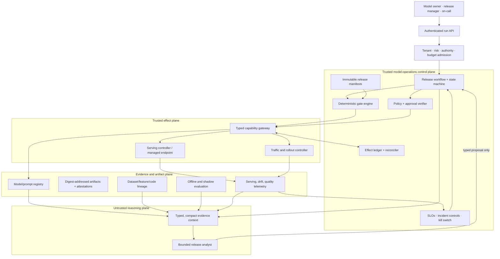

# MLOps and Model Operations Agent Blueprint

> **Status:** Research-backed Pass-2 production blueprint  
> **Last researched:** 2026-08-31  
> **Scope:** Model, prompt, and evaluation-artifact promotion; registry lineage; serving health; drift evidence; controlled rollout; and evidence-bound rollback  
> **Research packet:** [MLOps and model operations research packet](../../research/packets/mlops-agent-blueprint.md)

## Production position

Build this agent as an **untrusted release analyst inside a deterministic model-operations control plane**. The model may assemble evidence, detect missing prerequisites, compare a candidate with a champion, propose a rollout, diagnose a degradation, and explain a recovery. Trusted application code must own identity, policy, artifact verification, approval, traffic changes, effect receipts, and terminal release state.

The recommended implementation is a hybrid:

- a small Python service for the bounded model loop, typed adapters, evaluation reducers, and ML ecosystem integration;
- an application-owned relational release ledger plus immutable object/OCI artifact storage;
- a durable workflow only when approvals, bake periods, label delays, or reconciliation outlive one process;
- MLflow or an existing managed registry behind an adapter—not as the authorization or release-state authority;
- KServe plus the organisation's progressive-delivery controller on Kubernetes, or a managed endpoint when the platform team does not already operate Kubernetes;
- Prometheus metrics and OpenTelemetry traces, augmented by privacy-governed prediction/label observations;
- explicit human approval for training-triggered releases, production promotion, policy/baseline changes, and high-impact rollback.

The autonomy ceiling is **supervising a pre-authorized low-risk canary**. It is not open-ended retraining or production administration.

## Scope and ownership boundary

| This blueprint owns | It consumes but does not own | It must hand off |
|---|---|---|
| Immutable model/prompt/evaluation release identity | Training outputs and data-quality attestations | Broken ingestion, backfill, transformation, or data-contract repair to DataOps |
| Candidate/champion comparison and promotion evidence | Feature definitions and point-in-time lineage | Infrastructure/GPU provisioning to infrastructure operations |
| Registry state, aliases, deployment binding, and lineage graph | CI build provenance and signed serving images | Ordinary application delivery to DevOps |
| Serving compatibility, shadow/canary plans, traffic evidence | Business metric definitions and owner-set thresholds | Business interpretation and metric redesign to analytics/product |
| Serving health, data/skew/drift signals, delayed-label quality, rollback evidence | Incident telemetry and incident-command state | Live multi-service incident command to SRE |
| Controlled release, pause, abort, and rollback effects | Approved retraining candidates | Whether to retrain, redefine labels, or change intended use to accountable model owners |

The boundary is intentionally strict. A drift alert is evidence that investigation is needed; it is not permission to retrain, promote, or redefine the population. A rollback can restore a prior serving bundle but cannot undo predictions already consumed or repair changed upstream data.

## Definition of done

A run is complete only when it produces one of these durable outcomes:

1. **Rejected:** the candidate is ineligible, with machine-checkable gate failures and evidence references.
2. **Waiting:** an exact release/rollback proposal is sealed, its required approver role and expiry are recorded, and no effect remains untracked.
3. **Promoted:** the exact artifact digests are bound to the serving revision; rollout gates passed; the registry/deployment mapping is reconciled; and a post-release monitoring window is active or completed.
4. **Rolled back or rolled forward:** traffic and serving state are independently verified, downstream consequences are disclosed, and the incident/change owner accepts the residual risk.
5. **Indeterminate:** a possible effect cannot yet be proven; the run is paused for reconciliation rather than reported as failed or retried blindly.

A fluent recommendation, an updated registry tag, a successful deployment API response, or a green readiness probe is not completion by itself.

## When not to build an agent

Prefer deterministic automation when all decisions reduce to known predicates over structured evidence:

```text
candidate manifest valid
AND required tests passed
AND human approval present
AND target revision unchanged
=> execute fixed canary workflow
```

A conventional CI/CD pipeline, registry webhook, policy engine, and rollout controller are safer and cheaper for that case. Add the model loop only when operators repeatedly need bounded synthesis across heterogeneous evaluation reports, lineage gaps, serving compatibility, and ambiguous monitoring evidence. Keep the final gates deterministic after adding the model.

## Reference architecture



The boxes are logical responsibilities, not a mandate for many services. At small scale the API, workflow, gate engine, and effect ledger can be one application and one PostgreSQL database. Preserve the trust and state boundaries before distributing them.

## Non-negotiable invariants

1. A release names immutable model, prompt, evaluator, dataset snapshot, feature contract, serving image, runtime, and policy versions.
2. A mutable alias such as `champion` is a discovery pointer, never the deployed subject or approval binding.
3. Promotion reuses verified artifacts; it does not retrain or rebuild them in the production step.
4. Observations, evidence, model conclusions, approvals, and side effects are different record types.
5. An evaluation pass is bound to the exact release manifest and evaluator version.
6. Production writes use an effect ID, expected target revision, commit-time authorization, receipt, and reconciliation route.
7. Readiness, service reliability, data drift, model quality, safety, and business outcome are separate signals.
8. Missing or delayed labels produce `unknown`, not an invented quality pass.
9. Automatic rollback is allowed only inside a pre-approved envelope with a verified compatible target; high-impact rollback requires a human decision.
10. The agent cannot approve its own proposal, change policy thresholds, redefine a baseline, decide unconstrained retraining, or use break-glass credentials.
11. Model, data, prompt, feature, evaluator, tool, adapter, serving-runtime, accelerator, and policy changes are one **behavior-bundle release** when any of them can alter outputs, safety, latency, cost, or recovery.

## Representative workflows and autonomy

| Workflow | Default authority | Human accountability |
|---|---|---|
| Inspect candidate completeness and lineage | Autonomous read | Model owner resolves missing or disputed lineage |
| Compare candidate and champion evidence | Autonomous analysis | Domain owner owns metric meaning and acceptance thresholds |
| Draft release manifest and canary plan | Propose only | Release manager accepts exact scope and exposure budget |
| Execute non-production compatibility test | Pre-authorized bounded effect | Platform owner defines eligible environments and budgets |
| Start production canary | Exact external approval required | Named release owner accepts release risk |
| Advance low-risk canary step | Deterministic gates inside approved envelope | Release owner remains accountable and can pause |
| Pause/abort traffic | Pre-authorized when it only stops exposure | Incident/release owner decides next action |
| Roll back high-impact model or prompt | Proposal plus explicit approval | Model owner and incident/change authority accept downstream consequences |
| Trigger retraining | Create recommendation/ticket only | Training/data owners approve policy, data, compute, and intended-use changes |

## Architecture and technology decision map

| Decision | Default | Change the default when |
|---|---|---|
| Loop | One bounded planner-verifier loop; no multi-agent team | Independent specialist review measurably improves a defined eval and has separate authority/state |
| Runtime | Python 3 service with strict JSON Schema/Pydantic-style validation | Existing platform has a better-supported typed runtime; keep ML adapters isolated behind APIs |
| Persistence | PostgreSQL for state/effects; object/OCI store for artifacts | A managed model platform already supplies equivalent transactional, tenancy, and audit guarantees |
| Durability | DB-backed worker for short runs; durable workflow for long waits and rollout timers | Every run completes synchronously with no ambiguous external effect |
| Registry | Existing enterprise registry; MLflow is the portable default adapter | A managed cloud registry is already the organisational source of model identity |
| Serving | Managed endpoint by default for teams without serving-platform expertise; KServe for an existing Kubernetes ML platform | Batch-only models need job promotion rather than online traffic control |
| Rollout | Shadow, then canary/blue-green with deterministic analysis | Stateful or policy-constrained workloads require dual-run, replay, or scheduled cutover |
| Monitoring | Prometheus/OpenTelemetry plus domain-specific observation jobs | Provider-native telemetry is sufficient and exports equivalent raw evidence and retention |
| Drift | Versioned statistical monitors with owner-set baselines and label-aware quality | No valid reference population exists; monitor schema/health and escalate rather than manufacture drift |
| Memory | Durable release/effect state and curated incident outcomes only | A proven cross-run retrieval use case survives provenance, poisoning, deletion, and eval gates |

## Guide map

| Guide | Decision it owns |
|---|---|
| [Mission, boundary, requirements, and authority](01-mission-boundary-requirements-and-authority.md) | Workload fit, ownership seams, actors, risk, autonomy, and acceptance criteria |
| [Reference architecture, tooling, and integrations](02-reference-architecture-tooling-and-integrations.md) | Custom/framework/hybrid choice, runtime, products, adapters, and deployment shapes |
| [Artifacts, registry, lineage, evaluation, and promotion](03-artifacts-registry-lineage-evaluation-and-promotion.md) | Release identity, manifests, provenance, gates, aliases, and reproducible promotion |
| [State, events, context, memory, planning, and orchestration](04-state-events-context-memory-planning-and-orchestration.md) | Lifecycle, contracts, compaction, memory classes, loop bounds, and handoffs |
| [Serving rollout, health, drift, and rollback](05-serving-rollout-health-drift-and-rollback.md) | Shadow/canary control, signals, label delay, stop rules, and recovery |
| [Security, permissions, approvals, reliability, and reconciliation](06-security-permissions-approvals-reliability-and-reconciliation.md) | Threats, least privilege, effect integrity, cancellation, duplicates, and uncertain outcomes |
| [Observability, evaluation, failure injection, and incidents](07-observability-evaluation-failure-injection-and-incidents.md) | Trace model, SLOs, eval portfolio, fault tests, runbooks, and incident learning |
| [Deployment, scaling, backpressure, cost, and evolution](08-deployment-scaling-backpressure-cost-and-evolution.md) | Cells, tenancy, capacity, GPU economics, provider change, and continuous improvement |
| [Zero-to-production stages and exit gates](09-zero-to-production-stages-and-exit-gates.md) | Stages 0–6 with architecture, authority, I/O, state/events, failures, evaluation, and exit gates |

## Top stop and escalation conditions

Stop before any write when artifact digests, target revision, tenant, intended use, feature/data lineage, evaluator version, approval scope, rollback target, or monitoring coverage is missing or inconsistent. Pause and escalate when:

- an effect may have committed but no receipt was recorded;
- a baseline or gate would need to be relaxed to pass the candidate;
- the requested population, label, feature, or business objective changed;
- the only rollback target has incompatible schema, features, runtime, or downstream contract;
- quality labels are absent and proxy signals disagree;
- the rollout observes a severe safety, fairness, privacy, or policy event;
- the agent would need infrastructure, DataOps, incident-command, or break-glass authority;
- the provider changes or retires a model/runtime before the replacement passes the full release suite.

## Stage summary

| Stage | Deliverable | Authority ceiling |
|---:|---|---|
| 0 | Deterministic release/evidence baseline and agent-fit proof | Read-only report |
| 1 | First bounded loop over fixtures with typed tools | Read-only proposal |
| 2 | Useful MVP against one non-production registry/endpoint | Approved non-prod compatibility effects |
| 3 | Reliable v1 with durable state, receipts, reconciliation, and compaction | Sealed production proposal; no autonomous promotion |
| 4 | Production service with identity, tenancy, SLOs, runbooks, and controlled canary | Approved production start; deterministic step advance |
| 5 | Cell-based scale, quotas, backpressure, DR, and cost controls | Same bounded authority at larger scale |
| 6 | Failure-mining and versioned evolution loop | Propose changes; owners approve policy and high-impact actions |

The complete per-stage contract is in [Zero-to-production stages and exit gates](09-zero-to-production-stages-and-exit-gates.md).

## Refresh triggers and limitations

Refresh before adopting a new registry major version, model/prompt API, serving CRD/API, inference runtime, GPU scheduling mode, feature-store schema, telemetry convention, provider model lifecycle change, or high-risk regulatory interpretation. Re-run the full evaluation suite after any prompt, model, evaluator, dataset, context compiler, tool schema, policy, runtime, or rollout-controller change.

This blueprint is provider-neutral and was not validated against a live estate. Exact IAM actions, region availability, quotas, model formats, retention, and legal controls must be qualified locally. Drift methods and thresholds remain domain-specific; no universal statistic proves that a model is safe or useful.

## Canonical repository links

- [Production agent control plane](../../architectures/production-agent-control-plane.md)
- [Agent state and event contracts](../../runtime/agent-state-and-event-contracts.md)
- [Durable execution](../../runtime/durable-execution.md)
- [Tool contracts](../../tools/tool-contracts.md)
- [Tool results, artifacts, and provenance](../../tools/tool-results-artifacts-and-provenance.md)
- [Context engineering](../../context-memory/context-engineering.md)
- [Memory architecture](../../context-memory/memory-architecture.md)
- [Permissions, sandboxing, and secrets](../../security/permissions-sandboxing-and-secrets.md)
- [Prompt injection and untrusted data](../../security/prompt-injection-and-untrusted-data.md)
- [Idempotency and side effects](../../reliability/idempotency-and-side-effects.md)
- [Evaluation-driven development](../../evaluation/evaluation-driven-development.md)
- [Observability and tracing](../../evaluation/observability-and-tracing.md)
- [Queues, scheduling, and backpressure](../../operations/queues-scheduling-and-backpressure.md)
- [Deployment, release, and incident response](../../operations/deployment-release-and-incident-response.md)
