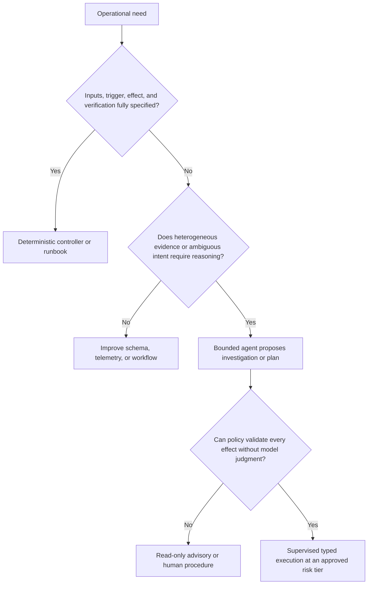

# Purpose, Operating Model, and Category Boundaries

## The problem worth solving

Network incidents and changes cross representations that humans must mentally join: service intent, physical and logical topology, controller configuration, per-device state, routing adjacencies, RIB and FIB entries, DNS caches, certificate deployment, load-balancer health, sampled flows, and active measurements. The useful role for an agent is to perform this bounded evidence synthesis and produce a reviewable plan.

That role does not require unrestricted autonomy. Most repeatable operations should remain deterministic. Google SRE's treatment of automation is a useful warning: automation is a force multiplier, but it can amplify mistakes and decay as its environment changes. A network agent should reduce ambiguity at the edge of a deterministic system, not move deterministic safeguards into prose.

## Choose the smallest operating model

Use this decision rule for every proposed capability:



Examples suitable for deterministic automation include renewing a known certificate through an established ACME profile, collecting a fixed health bundle, comparing intended and running configuration, or rolling a tested configuration across redundant devices under a fixed policy. The agent adds value when an operator asks “why can only one site reach this service?” and the answer requires topology, route, DNS, traffic-policy, and probe evidence.

## Category seams

Network operations is a distinct agent category because several control seams differ from adjacent categories.

| Seam | Network operations | Infrastructure operations | SRE / incident response | Security investigation |
|---|---|---|---|---|
| Environment | Routers, switches, DNS, PKI termination, load balancers, network controllers, cloud network APIs | Compute, hosts, clusters, storage, platform APIs | Live services, alerts, incident channels, mitigations | Security sensors, case systems, endpoint/cloud/network evidence |
| Authority | Network configuration and bounded connectivity recovery | Platform desired state | Incident coordination and service-risk decisions | Investigation and containment decisions |
| State and time | Converging distributed control/forwarding planes, caches, sessions, TTLs | Declarative resources and reconciliation | Fast-changing incident hypotheses and service telemetry | Evidence timelines and chain of custody |
| Ground truth | Intent plus device/controller state plus independent path evidence | Provider/platform state and declared infrastructure | User-visible service indicators and incident evidence | Correlated, integrity-preserved security evidence |
| Recovery | Make-before-break, staged withdrawal, route/DNS/traffic correction, network rollback | Reconcile resource desired state | Time-bounded mitigation and incident command | Containment, eradication, credential/evidence procedures |
| Evaluation | Reachability invariants, convergence, path diversity, fault-domain safety | Resource correctness and drift | Detection/diagnosis/mitigation outcomes | Investigation accuracy, evidence handling, containment safety |

The seams imply concrete enforcement:

- A network plan may request a new subnet attachment, node interface, or application endpoint, but the infrastructure agent owns its creation.
- During an incident, SRE owns priority, communication, and acceptable service risk. The network agent owns network evidence and only the approved network effects.
- When compromise is suspected, the network agent freezes autonomous mutation of affected management/control paths, preserves evidence, and hands the investigation to security. It may execute a security-approved containment step, but does not decide attribution or eradication.

## In-scope capabilities

The production service may own:

- layered physical, L2, L3, overlay, service, and dependency topology;
- declared network intent and the field-level authority map;
- discovery, drift, freshness, and contradiction reporting;
- routing policy, adjacencies, RIB/FIB, next-hop and convergence evidence;
- authoritative and recursive DNS records, delegations, DNSSEC, transfers, and cache-aware rollout;
- network-facing certificate inventory, renewal, deployment, and served-identity verification;
- load-balancer listeners, clusters/backends, health, traffic weights, drain state, and traffic policy;
- metadata-minimized telemetry, IPFIX/flow evidence, active reachability and path probes, and exceptional packet capture;
- typed staging, diff, validation, commit, confirm, cancel, rollback, and reconciliation;
- connectivity recovery through preapproved and tested network runbooks.

## Explicit non-goals

The agent is not:

- a replacement for routing protocols, DNS servers, PKI, load balancers, SDN controllers, or configuration management;
- a general SSH shell or vendor CLI copilot with standing credentials;
- an autonomous “self-healer” for novel, high-blast-radius faults;
- proof that a digital representation exactly matches the physical network;
- an application deployment, host repair, database, or cluster-scaling agent;
- an incident commander or owner of service SLO trade-offs;
- an attacker-identification, malware, forensics, or threat-hunting system;
- a justification for default packet-payload surveillance;
- authorized to change carrier contracts, legal intercepts, public trust anchors, root CA material, or globally existential configuration.

## Operator contract

Every task begins with an immutable envelope, not a chat message alone.

```yaml
task:
  id: nettask-2026-08-31-0042
  tenant: retail-eu
  requester: user:operator-184
  objective: "Restore HTTPS reachability to checkout from two EU sites"
  mode: investigate_and_propose
  allowed_domains: [topology, routing, dns, tls, load_balancing]
  targets:
    include: [site:fra1, site:ams1, service:checkout]
    exclude: [network:management, region:us]
  active_probe_budget:
    max_total: 60
    max_per_target_per_minute: 5
    payload_capture: forbidden
  deadline: 2026-08-31T16:30:00+05:30
  change_authority: none
```

The orchestrator resolves identities and scope before the model sees the task. The model cannot change the tenant, mode, excluded targets, probe budget, deadline, or change authority. If the evidence indicates that the objective requires a wider scope, a new task and authorization are required.

## Bounded investigation loop

A read loop needs stop conditions as much as a write loop:

1. Convert the objective into a small hypothesis set and required evidence.
2. Query the cheapest, least sensitive evidence with adequate freshness.
3. Preserve contradictions rather than averaging them away.
4. Run independent probes only when they can distinguish live hypotheses.
5. Stop when one explanation is supported, all useful in-scope probes are exhausted, confidence remains below the decision threshold, the budget expires, or evidence points outside network authority.
6. Report evidence, gaps, alternative explanations, and the next authorized action.

Parallel probes are allowed only when they are independent and bounded. A scheduler enforces per-target, per-site, protocol, and global budgets; cancels redundant work; and prevents a model-generated fan-out from becoming a denial of service.

## Autonomy policy

Confidence never grants authority. Permission comes from identity, policy, risk tier, target class, plan validation, approval, and window. A high-confidence N4 action remains N4. A low-confidence N0 conclusion should be labeled uncertain, not converted into more invasive access.

Recommended progression:

| Stage | Agent authority | Production effects |
|---|---|---|
| Deterministic baseline | None | Existing controller/runbooks only |
| Bounded read loop | Query approved evidence and probes | None |
| Change-proposal MVP | Produce typed diff, verification, and rollback plan | None |
| Reliable v1 | Execute a narrow N3 catalog through a deterministic worker | Approved reversible effects only |
| Mature service | Broader multivendor coverage backed by conformance evidence | Still policy-bounded; N4 remains specialist-supervised |

Promote a capability only when its tool contract, capability coverage, replay/lab evaluation, authorization, audit, reconciliation, independent verification, rollback, and operator procedure are all production-ready. A demonstration is not an operating capability.

## Primary evidence

- [RFC 9315: Intent-Based Networking — Concepts and Definitions](https://www.rfc-editor.org/rfc/rfc9315.html)
- [RFC 8342: Network Management Datastore Architecture](https://www.rfc-editor.org/rfc/rfc8342.html)
- [RFC 8345: A YANG Data Model for Network Topologies](https://www.rfc-editor.org/rfc/rfc8345.html)
- [Google SRE: Automation at Google](https://sre.google/sre-book/automation-at-google/)
- [CISA: Enhanced Visibility and Hardening Guidance for Communications Infrastructure](https://www.cisa.gov/resources-tools/resources/enhanced-visibility-and-hardening-guidance-communications-infrastructure)

See the [dated research packet](../../research/packets/network-operations-agent-blueprint.md) for scope notes and additional sources.

