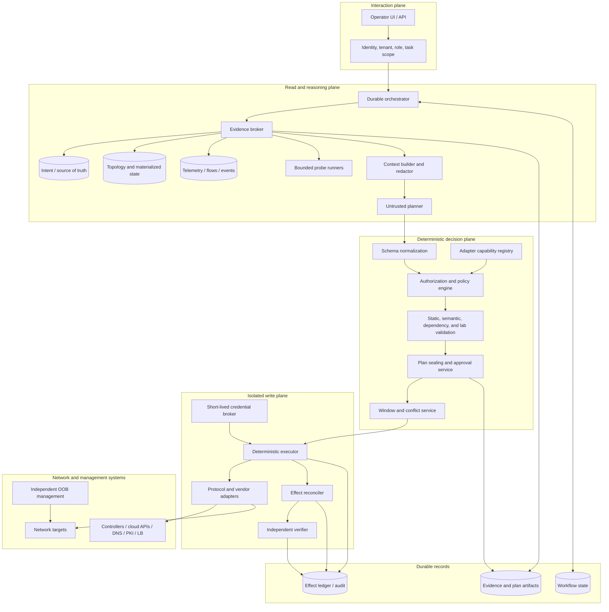

# Reference Architecture and Trust Boundaries

## Architecture thesis

The safe architecture treats the language model, every retrieved document, and every string returned by a network target as untrusted. The model can select from typed read operations and draft a typed plan. Deterministic services decide whether the evidence is fresh, the target is in scope, the adapter can provide the promised semantics, the risk is acceptable, approval is valid, the window is open, and the resulting path is healthy.

This arrangement is deliberately a hybrid. A fully deterministic controller cannot interpret every ambiguous request or correlate every vendor representation. A model-centric “agent loop” cannot safely own locks, credentials, transactions, or network recovery. Each component does the work it can verify.

## Logical architecture



The arrows are allowlisted data flows, not a flat service mesh. In a high-assurance deployment, the write plane cannot accept arbitrary traffic from the planner, and the planner cannot reach management networks or the credential broker.

## Component responsibilities

| Component | Owns | Must not own |
|---|---|---|
| Identity and task gateway | Human/workload identity, tenant, role, requested mode, immutable scope | Inferring permissions from natural language |
| Durable orchestrator | State machine, deadlines, retries of safe reads, checkpoints, cancellation, human waits | Network protocol semantics or free-form tool execution |
| Evidence broker | Query planning limits, provenance, freshness, normalization entry, artifact references | Treating missing telemetry as absent state |
| Context builder | Redaction, size limits, data/instruction separation, stable identifiers | Durable truth, locks, credentials, raw packet archives |
| Planner | Hypotheses, evidence requests, proposed plan, operator explanation | Authorization, credentials, commit, approval, verification |
| Policy engine | Field/target/effect authorization, risk tier, separation of duties, window and coverage gates | Model-based exceptions |
| Capability registry | Exact adapter, target OS/API, model revision, and operation semantics proven by tests | Vendor-family assumptions |
| Validator | Schema, intent, dependency, semantic, invariant, simulation/lab, rollback and verification checks | Production mutation |
| Plan/approval service | Canonicalization, digest, signatures, approver eligibility, expiry | Approving a materially changed artifact |
| Credential broker | Short-lived target/effect-scoped identity issuance and revocation | Delivering standing secrets to prompts or general workers |
| Executor | Interpret a small typed plan language, acquire scoped leases, stage/commit/confirm/cancel | Replanning, target discovery, or widening scope |
| Reconciler | Determine effect status from current/native operation state after ambiguity | Blind write retry |
| Verifier | Collect independent control/forwarding/service evidence against acceptance criteria | Reusing only the adapter's success response |
| Effect ledger | Append dispatch intent, native IDs, receipts, evidence, terminal outcome | Mutable conversational memory |

## Trust zones and allowed flows

### Interaction plane

The user request is authenticated but not inherently authorized. Tenant, target selectors, mode, and change authority are resolved into the task envelope. Ticket text, chat history, attachments, and copied command output remain untrusted content.

### Read plane

Read workers use a read-only identity and management path. Active probes have separate egress identities and rate policies because a “read” can still generate traffic or disclose reachability. Packet capture is a separately privileged operation, not another getter.

### Decision plane

Deterministic gates consume canonical structured data. Policy evaluates the concrete effects—resource, field, before value, after value, protocol, target class, tenant, and risk—not the planner's description. A plan that cannot be normalized is rejected.

### Write plane

The executor is isolated from the public internet and general model tooling. Egress is restricted to approved management endpoints, DNS/PKI/controller APIs, audit, and identity services. Credentials are minted after approval for the exact operation and expire at the end of the window. Read-plane compromise must not create a route to write authority.

### Independent recovery plane

Out-of-band management, AAA, audit ingestion, time synchronization, and emergency credentials must not depend solely on the network being changed. The agent is unable to recover a production network if its only control path traverses that network.

## Sealed plan artifact

The approval binds to normalized effects and evidence, not a mutable chat transcript.

```yaml
plan:
  schema: netchange/v1
  id: ncp-2026-08-31-0188
  tenant: retail-eu
  objective: "Move 5% of checkout traffic to pool checkout-v2 in fra1"
  risk: N3
  snapshot:
    topology_version: topo-672981
    intent_revision: git:80acb72
    observed_at: 2026-08-31T10:22:08Z
    freshness_policy: traffic-change/v4
  steps:
    - id: stage-endpoints
      tool: change.stage
      target: lb:fra1-edge-a
      resource: cluster/checkout-v2
      expected_version: etag:8e6d
      patch_ref: artifact://sha256/2e53...
    - id: validate-stage
      depends_on: [stage-endpoints]
      tool: change.validate
      assertions: [all_backends_healthy, capacity_headroom_ge_30pct]
    - id: commit-weight
      depends_on: [validate-stage]
      tool: change.commit
      target: traffic-policy:checkout-fra1
      expected_version: generation:442
      patch_ref: artifact://sha256/847a...
  blast_radius:
    max_traffic_percent: 5
    failure_domains: [fra1/edge-a]
  verify_ref: artifact://sha256/ba14...
  rollback_ref: artifact://sha256/94ce...
  stop_conditions:
    - checkout_5xx_rate_delta_gt_0.5_percent
    - p95_latency_delta_gt_50_ms
    - any_backend_tls_identity_failure
  policy_version: network-change/v19
  adapter_manifest_digest: sha256:41d2...
  tool_schema_digest: sha256:a8c1...
  model_version: model-release-2026-08-20
  expires_at: 2026-08-31T12:00:00Z
  digest: sha256:3ad8...
```

The digest covers the canonical plan, referenced artifact digests, topology and intent versions, target identities, expected versions, verification and rollback, policy/tool/adapter versions, scope, and expiry. Any change produces a new digest and invalidates approval.

## Authority and approval separation

Use separate roles for proposing, approving, executing, and verifying at higher risk. A single person may perform multiple roles only where policy explicitly allows it for a low-risk tier; the model never counts as an approver. N4 work should require reviewers with the relevant domain—routing, DNS/DNSSEC, PKI, or traffic engineering—and an independent service-risk owner when customer traffic is affected.

Break-glass is not “skip policy.” It is a separate human-owned procedure with stronger identity, narrow emergency roles, explicit targets and duration, independent out-of-band access, immediate alerting, complete recording, and mandatory credential rotation and review afterward. A model may assemble evidence for the human but cannot invoke break-glass.

## Failure containment

The architecture must fail closed for writes and degrade usefully for reads:

- if topology or target version is stale, read/diagnosis may continue with a warning; write eligibility stops;
- if telemetry is delayed, mark a gap and reduce confidence; never convert a missing measurement into a healthy value;
- if the policy, approval, lease, credential, or window service is unavailable, do not dispatch;
- if a provider call times out after dispatch, persist `UNCERTAIN` and reconcile;
- if verification cannot reach an independent vantage point, do not confirm a reversible commit;
- if the audit ledger cannot record dispatch intent before the effect, do not dispatch;
- if the model is unavailable, active deterministic workflows continue; new reasoning waits or falls back to a documented runbook.

## Deployment cell boundary

For strong tenant or regional isolation, deploy cells containing read caches, probe queues, orchestrator workers, executor workers, leases, and tenant-scoped credentials. Global services may distribute signed policies, adapter artifacts, model release metadata, and schema versions, but should not be a shared single writer for all networks. A cell compromise must not grant credentials or data access to another cell.

## Primary evidence

- [RFC 6241: Network Configuration Protocol](https://www.rfc-editor.org/rfc/rfc6241.html)
- [OpenConfig gNMI specification](https://openconfig.net/docs/gnmi/gnmi-specification/)
- [RFC 8342: Network Management Datastore Architecture](https://www.rfc-editor.org/rfc/rfc8342.html)
- [CISA: Enhanced Visibility and Hardening Guidance for Communications Infrastructure](https://www.cisa.gov/resources-tools/resources/enhanced-visibility-and-hardening-guidance-communications-infrastructure)
- [OWASP: Prompt Injection](https://genai.owasp.org/llmrisk/llm01-prompt-injection/)
- [OWASP: Excessive Agency](https://genai.owasp.org/llmrisk/llm062025-excessive-agency/)

See [Security, identity, tenancy, and isolation](08-security-identity-tenancy-and-control-plane-isolation.md) for threat controls and [Plans, approvals, staged change, and verification](06-plans-approvals-staged-change-and-verification.md) for execution semantics.

