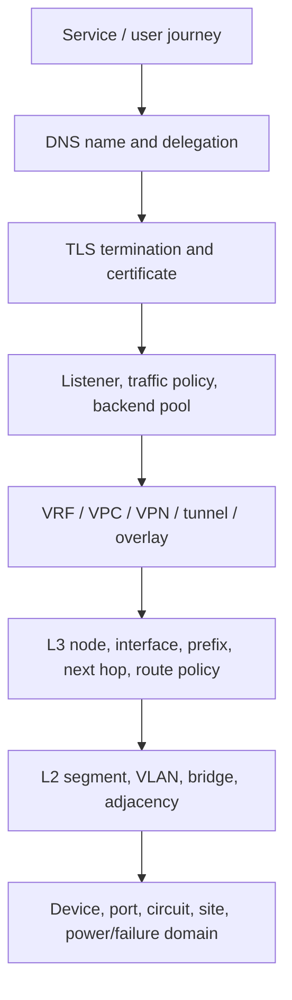
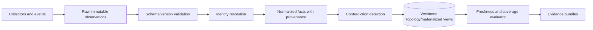

# Topology, Intent, Discovery, and Freshness

## Topology is a versioned claim graph

A useful topology is not a diagram of device names. It is a versioned graph of entities, relationships, supporting layers, ownership, and evidence. RFC 8345 deliberately models generic networks, nodes, links, termination points, and supporting relationships; RFC 8346 augments that model for Layer 3. Those models are a strong semantic foundation, but production identity and provenance still need organization-specific rules.

Model at least these layers when they exist:



Edges are first-class records. A logical link may be supported by multiple lower-layer paths; a service may depend on several names, termination points, routes, health checks, and provider resources. The graph must represent alternatives and failure domains, not flatten them into one “connected” edge.

## Four classes of fact

Keep these representations separate:

| Class | Meaning | Examples | Safe use |
|---|---|---|---|
| Declared / intended | What an authority says should exist | Git intent, IPAM allocation, controller policy, approved zone data | Desired-state comparison and plan generation |
| Discovered / operational | What a target reports now | Interfaces, neighbors, sessions, running config, RIB/FIB, active certificate | Current-state and drift evidence subject to target trust |
| Inferred | A derived relationship or hypothesis | Service-to-prefix dependency, likely asymmetric path, shared failure domain | Planning aid only; retain derivation and confidence |
| Observed | What a measurement saw | Active probe, flow sample, packet at a sensor, TLS handshake | Evidence for a specific vantage point, interval, and coverage |

RFC 8342's intended and operational datastores and origin metadata help avoid the common error of calling configuration “state.” The system should preserve a disagreement between declared and observed facts as a contradiction, not silently choose the newest record.

## Field-level authority map

No complete network source of truth exists in most organizations. Define authority per entity and field:

```yaml
authority_map:
  - entity: ip_prefix
    field: allocation
    authority: netbox:ipam
  - entity: bgp_policy
    field: intended_terms
    authority: git:network-intent
  - entity: interface
    field: admin_enabled
    authority: controller:campus
  - entity: interface
    field: oper_status
    authority: device_direct
  - entity: dns_rrset
    field: intended_records
    authority: git:dns-zones
  - entity: dns_rrset
    field: recursively_observed_answers
    authority: probe:dns-vantage
```

For each mapping, record ownership, update mechanism, consistency expectation, and conflict procedure. A webhook or event is a hint to refresh, not proof of current truth. For example, NetBox event rules are delivered asynchronously; reconciliation must re-read the API and compare a stable version.

## Stable identity

Names and management addresses change. Canonical keys should include the tenant and administrative domain plus a stable provider or inventory identifier:

```text
tenant / authority-domain / entity-kind / immutable-id
```

Aliases—hostnames, interface labels, IPs, circuit IDs, cloud self-links, DNS names—are versioned attributes. Never join solely on a display name. Cross-domain mappings need evidence: controller node ID to inventory device ID, cloud forwarding rule to VIP, listener to certificate, route target to VPC/VRF, or DNS record to load balancer.

## Provenance and freshness envelope

Every fact delivered to the planner should include enough information to judge its use:

```json
{
  "entity": "route:retail-eu:fra1:vrf-shop:203.0.113.0/24",
  "field": "fib_next_hops",
  "value": ["198.51.100.9@if:xe-0/0/1"],
  "source": "gnmi:router-fra1-a",
  "source_kind": "device_operational",
  "observed_at": "2026-08-31T10:19:14.182Z",
  "valid_until": "2026-08-31T10:19:44.182Z",
  "source_version": "boot-id:441/seq:983312",
  "collection": {"mode": "stream", "gap_since": null},
  "coverage": {"target": "complete", "path": "network-instances/.../afts"},
  "tenant": "retail-eu",
  "confidence": "direct_report"
}
```

The `valid_until` value comes from an operation-specific policy, not a universal TTL. An inventory serial number, BGP session, backend health, and lock state age differently. Before mutation, perform a direct target read of all preconditions even if a materialized view looks fresh.

### Illustrative freshness classes

| Evidence | Example policy, not a universal default | Write consequence when stale |
|---|---|---|
| Immutable hardware/provider ID | Refresh daily or on event | Block only if identity cannot be resolved |
| Intended revision and ownership | Exact revision named by plan | Any drift invalidates plan |
| Running config and generation/ETag | Direct read immediately before stage | Block target write |
| Adjacency, route, FIB, endpoint health | Seconds to a few polling intervals, with gap awareness | Block or re-read depending on operation |
| DNS authoritative answer and SOA serial | Observe immediately before plan and through propagation window | Block if serial/record prereqs changed |
| Recursive DNS answer | Per vantage and cache/TTL timeline | Treat as rollout evidence, not authority |
| Flow samples | Windowed; include sampling and exporter loss | Never conclude “no traffic” without coverage |
| Packet capture | Exact point and interval only | No inference outside point/interval |

OpenConfig gNMI Get paths may be collected at different times, and Subscribe updates are independent messages rather than a same-time global snapshot. A snapshot builder must expose its skew and gaps; it must not invent simultaneity.

## Discovery pipeline



Recommended rules:

- store raw observations or stable references long enough to debug parser and normalization errors;
- qualify every parser by adapter, protocol, target OS/API, and schema revision;
- reject identity collisions to a quarantine queue instead of merging likely matches;
- retain both sides of a contradiction and identify which field authority applies;
- use monotonic sequence/boot identifiers where available to detect stale streams after restart;
- mark gaps explicitly when a subscription is suspended, reset, or overloaded;
- rebuild materialized views from durable observations and authoritative reads;
- expire inferred edges faster than stable declared relationships unless reconfirmed.

RFC 8641 YANG-Push supports periodic and on-change subscriptions, synchronization, and state-change notifications, but a publisher may reject an unsustainable subscription and on-change streams can be dampened. A streaming transport is not a freshness guarantee by itself.

## Contradiction handling

Common contradictions are valuable signals:

- inventory says a circuit terminates on port A while discovery sees LLDP on port B;
- intended BGP policy contains a prefix but the device candidate or running policy does not;
- the RIB selects a route but the FIB is missing its next hop;
- a load-balancer controller reports a programmed listener while probes cannot establish a connection;
- authoritative DNS serves the new RRset while recursive vantage points still serve the old value;
- the certificate manager reports issuance while the endpoint serves another fingerprint.

Do not resolve these by majority vote. Determine the field authority, inspect time and coverage, preserve the discrepancy, and block writes whose preconditions depend on the unresolved fact.

## Topology query contract

A topology read must declare both scope and completeness:

```yaml
tool: read.topology_snapshot
arguments:
  tenant: retail-eu
  roots: [service:checkout]
  layers: [service, dns, tls, traffic, overlay, l3, physical]
  max_depth: 8
  as_of: 2026-08-31T10:20:00Z
  max_skew_seconds: 30
  require_sources: [network-intent, device-operational]
result:
  snapshot_id: topo-672981
  complete: false
  gaps:
    - "flow exporter router-ams1-b unavailable since 10:17:02Z"
  contradictions:
    - "backend checkout-17 is desired ready but EndpointSlice reports terminating"
```

`complete: false` does not make the snapshot useless. It makes the limitation explicit so policy can decide whether the specific read or write can proceed.

## Intent compilation and assurance

Intent is a declarative goal, not executable truth. RFC 9315 emphasizes translation, mapping, and assurance. Compile high-level intent into explicit invariants and vendor-neutral intermediate effects before any adapter rendering:

```yaml
intent:
  service: checkout
  from: sites/eu-retail
  to: vip/checkout-eu
  requirements:
    - tcp_443_reachable
    - tls_identity: checkout.example
    - path_diversity: 2
    - prohibited_transit: [internet-untrusted]
    - max_rtt_ms: 80
```

The compiler should emit required topology edges, routing/traffic/DNS/certificate constraints, and measurable acceptance criteria. If the organization cannot define how to observe an outcome, the agent cannot truthfully assure it.

## Primary evidence

- [RFC 8345: A YANG Data Model for Network Topologies](https://www.rfc-editor.org/rfc/rfc8345.html)
- [RFC 8346: A YANG Data Model for Layer 3 Topologies](https://www.rfc-editor.org/rfc/rfc8346.html)
- [RFC 8342: Network Management Datastore Architecture](https://www.rfc-editor.org/rfc/rfc8342.html)
- [RFC 9315: Intent-Based Networking — Concepts and Definitions](https://www.rfc-editor.org/rfc/rfc9315.html)
- [RFC 8641: Subscription to YANG Notifications for Datastore Updates](https://www.rfc-editor.org/rfc/rfc8641.html)
- [OpenConfig gNMI specification](https://openconfig.net/docs/gnmi/gnmi-specification/)
- [NetBox documentation](https://netboxlabs.com/docs/netbox/v4.4/)

