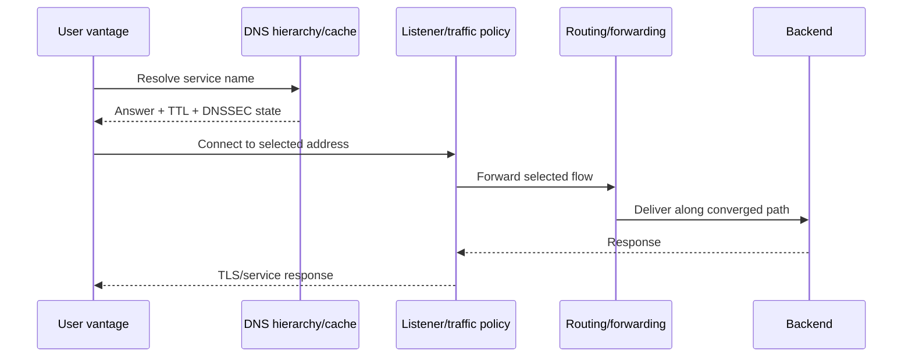
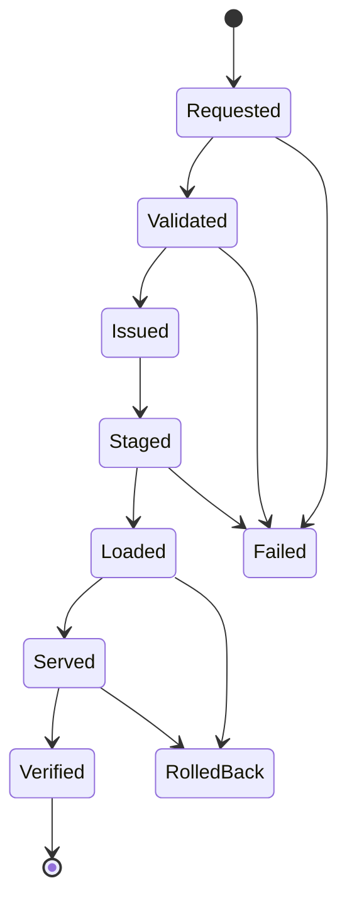

# Routing, DNS, Certificates, and Traffic Policy

## One service path, four different consistency models

A user connection can depend on a DNS answer, certificate selection, load-balancer policy, several routing domains, and healthy endpoints. These systems do not converge or roll back in the same way. The plan must carry domain-specific preconditions, propagation expectations, verification, and stop conditions while coordinating shared service risk.



A successful mutation at any one participant proves only that participant accepted work within its stated transaction scope.

## Routing changes

### Evidence required before change

For a routing policy, adjacency, prefix, next-hop, metric, or path-preference change, collect:

- exact intended and running policy with stable versions;
- affected prefixes, address families, VRFs, peers, route reflectors, and failure domains;
- current session and BFD state, negotiated capabilities, timers, and graceful-restart state;
- Adj-RIB-In, selected RIB, advertised route view where available, and programmed FIB/next-hop state;
- alternative paths and whether they truly avoid the same physical/provider failure domain;
- current prefix counts, maximum-prefix thresholds, filters, AS-path/community behavior, RPKI validation state, and route-leak protections;
- traffic volume and direction, active reachability from both sides where applicable, and rollback path health;
- management reachability independent of the route being changed.

BMP provides structured routing monitoring, including route views that are more reliable than screen scraping, but it does not prove a packet traversed the selected forwarding path. Likewise, a RIB entry does not prove the FIB or downstream path is usable.

### Safer sequence

1. Compile policy and calculate the exact route/prefix delta.
2. Validate default-reject, import/export, maximum-prefix, RPKI, route-role, and management-path invariants.
3. Analyze reachability and failure scenarios in a configuration-analysis engine or representative lab.
4. Stage the smallest target set and re-read the diff.
5. Change one redundant member or peer/fault domain first.
6. Observe announcements/withdrawals, selected paths, FIB programming, convergence, flow shift, loss, and service probes.
7. Continue only if the canary acceptance window passes; otherwise cancel/roll back and reconcile.

RFC 8212's EBGP default-reject behavior and RFC 9234's route-role/leak controls are safer baselines. RFC 7454 remains useful operational guidance for filtering and prefix limits. These are controls the policy engine should check, not suggestions delegated to the model.

### Convergence traps

- BFD can improve failure detection but misconfiguration or fate-sharing mistakes can generate serious false down/up behavior.
- Graceful restart may retain stale routes that blackhole or loop traffic; long-lived graceful restart is not a default safety mechanism.
- Route reflectors and add-path/multipath behavior can make one route collector's view incomplete.
- ECMP means a single traceroute may sample only one path. Paris traceroute-style techniques reduce some flow-hash artifacts but still provide vantage-specific evidence.
- Control-plane convergence can precede or lag data-plane programming.
- Returning the previous policy does not instantly restore flows; protocols and stateful devices must reconverge.

High-risk BGP export, default-route, core policy, RPKI exception, and route-reflector work remains N4 even when a simulator reports no violation.

## DNS changes

### Treat DNS as a cache-timed rollout

An RRset update has at least four states: intended zone content, accepted provider/auth-server change, authoritative observations, and recursive/client observations. Caches mean a rollback is another forward change with delayed visibility.

For planned endpoint migration:

1. Inventory the exact zone, RRset, aliases/dependencies, delegation, SOA serial behavior, DNSSEC chain, transfer topology, and recursive consumers.
2. Lower the TTL sufficiently before the migration—earlier than the old TTL—and confirm authoritative and representative recursive observations.
3. Keep old and new endpoints healthy through the overlap period.
4. Use an exact version, prerequisite, ETag, or provider transaction to avoid overwriting concurrent work.
5. Validate zone syntax, CNAME/exclusivity rules, delegation, DNSSEC signatures, and target health.
6. Publish a small weighted or scoped change when supported.
7. Observe authoritative servers directly and recursive resolvers from relevant networks; include positive and negative cache timelines.
8. Restore the normal TTL only after stability and the rollback horizon.

RFC 2136 prerequisites provide compare-and-swap-like semantics for dynamic update. Provider semantics vary: Amazon Route 53 applies a change batch transactionally within one hosted zone and then exposes asynchronous status; Google Cloud DNS applies an atomic collection change but `done` does not prove every authoritative server—or any recursive cache—serves it. Azure DNS exposes ETags for conditional updates. The adapter manifest must state these exact scopes.

### DNS failure modes

- Changing TTL during or after the endpoint change does not shorten the lifetime of records already cached.
- Negative caching can hide a newly created name even when authoritative data is correct.
- A prematurely removed old endpoint breaks clients holding the previous answer.
- An empty or corrupt catalog zone can propagate mass zone deletion; RFC 9432 highlights the exceptional blast radius.
- DNSSEC rollover timing errors can make valid data appear bogus; use published rollover timelines rather than model-derived timing.
- A healthy A/AAAA answer does not prove the port, TLS identity, or application is usable.
- Resolver policy, split horizon, ECS, DNS64, and local caches can produce legitimate vantage differences.

Serve-stale behavior can improve resolver availability during authoritative failure, but it also means observed data may be intentionally old. Include the stale indicator and resolver policy when available.

## Certificate lifecycle at network termination points

The network agent may manage certificates only at termination points within its explicit ownership: load balancers, gateways, proxies, DNS-based validation records, and network appliances. It does not become the root CA or application identity authority.

### Issuance is not deployment

A certificate workflow has distinct states:



The endpoint must be independently handshaken after reload. Verify:

- reference identity against `subjectAltName` according to RFC 9525, without Common Name fallback;
- chain building to the intended trust store, key usage and algorithm policy;
- not-before/not-after with clock-skew allowance;
- expected served leaf fingerprint and intermediate chain at every relevant termination point;
- SNI, ALPN, protocol/cipher policy, stapling/revocation behavior where required;
- backend/mTLS identities separately from the public listener;
- old and new certificate overlap until all targets and paths are confirmed.

ACME automates issuance and renewal. ACME Renewal Information can communicate a CA-recommended renewal window, but the platform still needs retry budgets, rate-limit handling, inventory completeness, and independent deployment verification. Short-term automatically renewed certificates reduce some exposure but make clock, automation, and outage dependencies more critical.

Never put private keys, ACME account keys, challenge credentials, or full certificate-manager secrets in model context or traces. The credential/key service performs key operations and returns identifiers and non-secret metadata.

### Rollback rule

Keep the previously valid certificate loaded or quickly selectable through an explicit overlap horizon. Rollback means reselecting the prior known-good identity only if it remains valid and allowed by current policy. If it has expired, been revoked, or the compromised key drove the rotation, rollback is forbidden; the recovery plan must deploy a different valid certificate.

## Load balancers and traffic policy

### Dependency ordering

Traffic configuration references dependencies: listener → route/virtual host → cluster/pool → endpoint → network path → certificate/secret. Eventual-consistency APIs can temporarily accept a reference before the dependency is usable.

Envoy's xDS documentation describes ACK/NACK, warming, resource versions, and make-before-break ordering. In the general case:

1. Create and warm endpoint/cluster dependencies.
2. Confirm health, capacity, network reachability, and certificate identity.
3. Create the listener/route reference.
4. Shift a small traffic weight or isolated cohort.
5. Observe errors, latency, resets, saturation, connection distribution, and user-path probes over an explicit window.
6. Increase in bounded stages.
7. Drain stateful/long-lived connections when appropriate.
8. Remove old routes, clusters, endpoints, and secrets last.

An xDS ACK means a resource version was accepted, not that the service path is healthy. A Kubernetes Gateway `Programmed` condition means the implementation expects the resource to be ready soon; it is not data-plane proof. Endpoint readiness can also differ from serving/terminating state. Verification must reach the listener and backend behavior.

### Stateful and asymmetric paths

Changing traffic distribution can break state even when each endpoint is healthy. Account for connection tracking, source-IP preservation, NAT/SNAT port capacity, consistent hashing, stickiness, session resumption, QUIC/UDP, firewall state, reverse-path checks, and asymmetric routing through stateful middleboxes. Drain and rollback timelines should reflect the longest relevant connections, not only request latency.

### Traffic canary acceptance

Define both a canary and a comparison baseline when possible. For example:

```yaml
traffic_canary:
  cohort: "header x-network-canary=true OR 5-percent stable hash"
  duration: 15m
  minimum_requests: 10000
  compare_to: "same region, same service, previous pool"
  gates:
    - metric: tls_handshake_failure_rate
      max_absolute: 0.001
    - metric: http_5xx_rate
      max_delta: 0.005
    - metric: p95_latency_ms
      max_delta: 50
    - invariant: no_backend_capacity_below_30_percent
```

Thresholds are service-specific and approved by the service-risk owner. The model may propose candidates from historical data, but policy uses reviewed values.

## Cross-domain change ordering

For a new HTTPS endpoint, a common safe order is:

1. establish network reachability and backend capacity;
2. issue and stage the certificate and listener without public traffic;
3. validate the listener directly;
4. add DNS/traffic policy with a small scope or weight;
5. verify from multiple client networks;
6. expand traffic;
7. wait through DNS cache and connection drain horizons;
8. remove the old endpoint and dependencies.

Removal uses the reverse dependency direction. The exact plan must reflect the product's semantics; “DNS last” is not universal if a load balancer address or validation challenge has different dependencies.

## Primary evidence

### Routing

- [RFC 7454: BGP Operations and Security](https://www.rfc-editor.org/rfc/rfc7454.html)
- [RFC 8212: Default External BGP Route Propagation Behavior](https://www.rfc-editor.org/rfc/rfc8212.html)
- [RFC 9234: Route Leak Prevention and Detection Using Roles](https://www.rfc-editor.org/rfc/rfc9234.html)
- [RFC 7854: BGP Monitoring Protocol](https://www.rfc-editor.org/rfc/rfc7854.html)
- [RFC 5880: Bidirectional Forwarding Detection](https://www.rfc-editor.org/rfc/rfc5880.html)
- [RFC 9494: Long-Lived Graceful Restart for BGP](https://www.rfc-editor.org/rfc/rfc9494.html)

### DNS and certificates

- [RFC 2136: Dynamic Updates in the Domain Name System](https://www.rfc-editor.org/rfc/rfc2136.html)
- [RFC 9364: DNS Security Extensions](https://www.rfc-editor.org/rfc/rfc9364.html)
- [RFC 9432: DNS Catalog Zones](https://www.rfc-editor.org/rfc/rfc9432.html)
- [RFC 9803: Operational Considerations for DNS TTLs](https://www.rfc-editor.org/rfc/rfc9803.html)
- [RFC 9525: Service Identity in TLS](https://www.rfc-editor.org/rfc/rfc9525.html)
- [RFC 8555: Automatic Certificate Management Environment](https://www.rfc-editor.org/rfc/rfc8555.html)
- [RFC 9773: ACME Renewal Information](https://www.rfc-editor.org/rfc/rfc9773.html)

### Traffic policy

- [Envoy xDS protocol](https://www.envoyproxy.io/docs/envoy/latest/api-docs/xds_protocol.html)
- [Kubernetes Gateway API](https://gateway-api.sigs.k8s.io/)
- [Kubernetes EndpointSlice API](https://kubernetes.io/docs/reference/kubernetes-api/discovery-resources/endpoint-slice-v1/)

