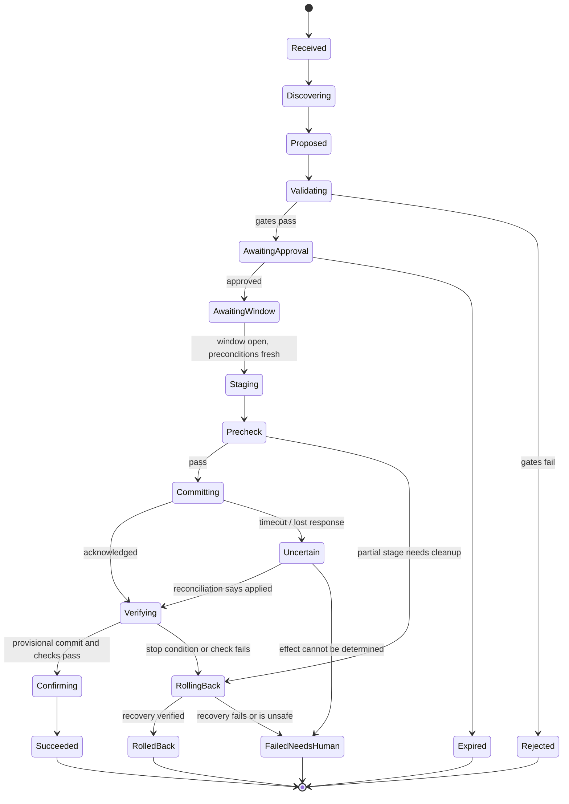
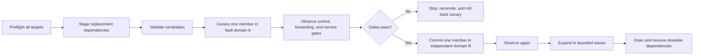

# Plans, Approvals, Staged Change, and Verification

## A network change is a guarded state machine

Chat-style “tool call succeeded” logic is not adequate for configuration that may converge after the caller disconnects. Persist the workflow before every side effect and make ambiguity explicit.



Only terminal states may produce a closed result. `UNCERTAIN` is not an error string; it is a durable operational state with an owner, reconciliation deadline, and blocked conflict scope.

## Plan structure

A plan is a directed acyclic graph of normalized effects and checks. It must include:

- immutable task, tenant, requester, objective, mode, and target scope;
- exact topology, intent, target, adapter, schema, policy, and tool versions;
- before values and optimistic-concurrency expectations;
- ordered dependency steps and allowed parallel groups;
- fault-domain and traffic/prefix/zone blast-radius budgets;
- preconditions, invariants, stage validation, canary criteria, observation windows, and stop conditions;
- native atomicity and asynchronous-state expectations;
- exact rollback or compensating plan plus its prerequisites and expiry;
- independent verification vantages and evidence coverage;
- approvals, separation-of-duty requirements, window, expiry, and plan digest;
- expected cost, duration, rate/probe budget, and communication/escalation owner.

The model proposes this artifact through a schema. A deterministic normalizer rejects unbounded selectors, hidden defaults, free-form commands, unsupported capabilities, unspecified values, and ambiguous target identities.

## Change DAG and fault-domain scheduling

“Apply to all devices” must become a topology-aware schedule.



The scheduler understands physical site, chassis, line card, provider, route-reflector cluster, DNS server set, load-balancer cell, availability zone, region, and management-path dependencies. “Two devices” is not redundancy if both share the same power, circuit, controller, or failure mode.

Parallel steps are allowed only when:

- no dependency edge connects them;
- their combined fault-domain and traffic budgets remain within policy;
- the adapter and target support concurrent operations;
- independent verification can attribute failures;
- rollback of either cannot invalidate the other's preconditions.

## Validation gates

Use layered gates, from cheapest and most deterministic to most realistic:

1. **Schema and type:** exact resource model, required fields, ranges, references, secret classification.
2. **Authorization and policy:** tenant, target, field, before/after, risk, prohibited paths, separation of duties.
3. **Freshness and concurrency:** exact intended revision, target generation/ETag, lease, no conflicting open operation.
4. **Semantic:** route filters, DNS constraints, certificate identity, listener dependencies, capacity, management reachability.
5. **Invariant:** required reachability, isolation, path diversity, default-reject, no route leak, no cross-tenant reference.
6. **Differential analysis:** before/after routes, reachability, policy, and failure scenarios over declared coverage.
7. **Representative lab:** render and apply with the exact adapter/target versions where risk requires it.
8. **Target-native stage/validate:** candidate syntax/semantics and returned diff.
9. **Canary:** smallest representative production fault domain or traffic slice.
10. **Independent verification:** control-plane, forwarding, and user-path criteria over the observation horizon.

A later gate does not erase an earlier limitation. A lab that lacks a vendor feature must report the gap; a successful canary does not authorize a blast radius larger than the plan.

## Approval and window contract

Approval is valid only for the sealed digest, eligible approver roles, named window, risk tier, target scope, and expiry. Check it again immediately before dispatch. Invalidate it if:

- topology, intent, target version, adapter capability, or policy changes beyond allowed tolerance;
- the window closes or an overlapping freeze/emergency begins;
- a conflicting operation acquires the resource/fault-domain lease;
- prechecks or lab artifacts no longer satisfy the plan;
- rollback prerequisites disappear;
- the plan, verification, or target set changes.

Maintenance windows should encode timezone, start/end instants, freeze periods, minimum time remaining for verification and rollback, and who can extend or stop. Do not start a 40-minute stage with 15 minutes left.

## Preflight and dispatch protocol

Immediately before each effect:

1. renew the scoped workflow/fault-domain lease;
2. re-read exact before values and native generation/ETag;
3. confirm management/OOB path and credential broker health;
4. confirm redundancy, rollback path, and verification vantages;
5. persist an effect-ledger intent containing operation ID, idempotency strategy, target, effect digest, and deadline;
6. mint the narrow short-lived credential;
7. dispatch once;
8. persist the native request/commit/change ID and receipt;
9. transition to verification or reconciliation based on observed outcome.

No system can generally promise exactly-once effects across an executor and heterogeneous targets. It can promise durable intent-before-dispatch, stable operation identity, conditional writes where available, and reconciliation before retry.

## Idempotency and ambiguous outcomes

### Idempotency strategies

Choose and record one per operation:

- native idempotency/request key;
- optimistic concurrency with ETag, fingerprint, generation, or expected current value;
- compare-and-swap prerequisite such as DNS UPDATE prerequisites;
- declarative set-to-value where reapplying is proven safe;
- native candidate/commit identifier;
- create-if-absent with stable external ID;
- non-idempotent: no automatic retry, reconciliation and human decision required.

### Reconciliation algorithm

When a response is lost after dispatch:

```text
1. Keep the conflict/fault-domain lease and mark the effect UNCERTAIN.
2. Query the native operation ID if one was returned or durably received.
3. Read the exact affected resource and target generation directly.
4. Compare current semantic state with before and intended after states.
5. Inspect dependent state and audit/controller events for partial application.
6. Classify: NOT_APPLIED, APPLIED, PARTIAL, SUPERSEDED, or INDETERMINATE.
7. Resume verification only for APPLIED.
8. Retry only NOT_APPLIED when the original idempotency/preconditions remain valid.
9. Roll back or repair PARTIAL only through a newly validated recovery path.
10. Escalate SUPERSEDED or INDETERMINATE; never guess.
```

Cloud/provider status is intermediate evidence. Route 53 `INSYNC`, a Google Cloud DNS completed change, an Azure provisioning state, NETCONF `ok`, gNMI Set success, xDS ACK, or Gateway `Programmed` condition still requires domain and service-path verification.

## Independent verification

Verification must test the plan's outcome, not simply query the writer. Use an acceptance matrix:

| Layer | Example check | Independent source |
|---|---|---|
| Configuration | Exact semantic diff applied, no unrelated drift | Fresh direct read through a read identity |
| Control plane | Expected adjacency/route/advertisement and no excess prefixes | Device plus BMP/collector view |
| Forwarding | Expected FIB/next hop on each relevant path | Direct modeled state and counters |
| DNS | New authoritative record/serial and expected recursive timeline | Multiple named authoritative and recursive vantages |
| TLS | Expected SAN/chain/fingerprint actually served | TLS probes from relevant networks |
| Traffic policy | Correct resource versions, endpoints, health, and distribution | Controller plus flow/service metrics |
| Service path | Connect, handshake, request, response within objective | Independent synthetics/canary telemetry |
| Isolation | Prohibited source/destination remains unreachable | Authorized negative tests and policy analysis |

Negative tests are important but potentially disruptive; scope and rate-limit them. Failure to observe traffic is inconclusive unless exporter, sampling, time, and path coverage are known.

## Rollback and forward recovery

Rollback is not a byte-for-byte restore command. Before executing it:

- re-read current state and detect intervening changes;
- validate that old dependencies, endpoints, routes, certificates, credentials, and capacity remain viable;
- recalculate the recovery blast radius and fault-domain budget;
- ensure reverting one target will not split protocol or configuration compatibility;
- choose rollback, roll-forward, traffic drain, or isolation based on current evidence;
- seal and authorize the recovery artifact according to the original plan's emergency policy.

Automatic rollback is reasonable only for a narrow, reversible canary with known current prerequisites and independent management. Broad recovery and any failure involving OOB, AAA, DNS delegation/DNSSEC, core routing, or trust material require a human specialist.

## Completion record

The final record includes all targeted and actual resources, normalized before/after, timestamps, approvers, leases, credential reference (never secret), native operation IDs, adapter/tool/model/policy versions, evidence artifacts, gaps, stop conditions, rollback status, and terminal classification. “Successful” requires that every mandatory acceptance criterion passed within its observation window.

## Primary evidence

- [RFC 6241: NETCONF candidate, validation, rollback, and confirmed commit](https://www.rfc-editor.org/rfc/rfc6241.html)
- [OpenConfig gNMI SetRequest semantics](https://openconfig.net/docs/gnmi/gnmi-specification/)
- [Amazon Route 53 ChangeResourceRecordSets](https://docs.aws.amazon.com/Route53/latest/APIReference/API_ChangeResourceRecordSets.html)
- [Google Cloud DNS changes](https://docs.cloud.google.com/dns/docs/reference/rest/v1/changes)
- [Azure DNS zones and records](https://learn.microsoft.com/en-us/azure/dns/dns-zones-records)
- [Google SRE Workbook: Canarying Releases](https://sre.google/workbook/canarying-releases/)
- [Batfish symbolic engine](https://github.com/batfish/batfish/blob/master/docs/symbolic_engine/README.md)

For general workflow mechanics, see [durable execution](../../runtime/durable-execution.md) and [idempotency and side effects](../../reliability/idempotency-and-side-effects.md).

