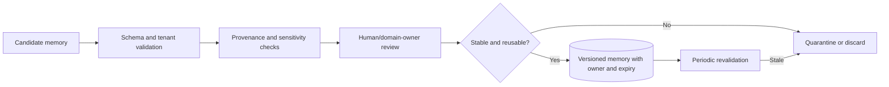

# State, Memory, Context, Reliability, and Recovery

## The prompt is not the control plane

A network workflow can outlive a model request, credential, maintenance window, process, or region. Its authoritative state belongs in durable stores with explicit schemas. The prompt contains a redacted working view; it is neither a lock, transaction log, source of truth, nor proof of what happened.

Separate five kinds of state:

| State | Contents | Lifetime | Authority |
|---|---|---|---|
| Workflow state | Task phase, deadlines, owners, waits, leases, next transition | Task lifetime plus audit retention | Durable orchestrator |
| Effect ledger | Intent-before-dispatch, native IDs, receipts, reconciliation, terminal outcome | Long-lived/immutable policy | Append-only audit/effect store |
| Evidence artifacts | Raw or normalized observations, provenance, hashes, sensitivity | Source-specific retention | Evidence store and source systems |
| Working context | Selected facts, hypotheses, contradictions, artifact links, budgets | One reasoning turn/checkpoint | Reconstructable context builder |
| Curated memory | Reviewed stable operational knowledge | Explicit TTL/review lifecycle | Memory governance workflow |

Within those state stores, make every model-facing memory lifetime explicit:

| Memory class | Network-operations use | Admission and authority policy |
|---|---|---|
| Turn/scratch memory | One reasoning call's temporary parsing, candidate hypotheses, and calculations | Ephemeral and non-authoritative; discard after trace retention |
| Working/run memory | Current plan step, evidence references, tool results, budgets, contradictions, and proposed action | Reconstructed from the durable task and checkpoints; never proof of target state |
| Session memory | Authenticated operator clarifications, selected task/site/device, and UI presentation state | Bound to tenant, actor, task, and expiry; cannot carry approval, credential, or maintenance-window authority |
| Durable task memory | Workflow aggregate, versions, events, leases, approvals, effect intents/receipts, reconciliation, and recovery state | Authoritative application state with fencing, audit, retention, correction, and deletion controls |
| Domain memory | Versioned topology/intent rules, source-of-truth mappings, approved runbooks, adapter capabilities, verification profiles, and policy | Curated by named owners; freshness/effective dates required and target/source systems remain authoritative |
| Long-term memory | Reviewed stable operating lessons, measurement limits, and time-bound postmortem/exception guidance | Optional derived data with provenance, owner, scope, review/expiry, deletion, poisoning controls, and release governance |
| Episodic outcome memory | Selected completed changes, incidents, rollbacks, corrections, and drift events for evaluation | Reviewed and tenant-scoped or approved de-identified; never authoritative for a new topology or device |
| User preference memory | Presentation and notification convenience only | Rejected for intent, routing policy, risk, approvals, verification thresholds, or change authority |
| Raw vector/conversation memory | Unbounded configs, packets, telemetry, tickets, prompts, or model conclusions | Rejected as a production source of truth; use permissioned evidence/artifact retrieval instead |

## Durable task record

At minimum persist:

```yaml
workflow:
  task_id: nettask-2026-08-31-0042
  tenant: retail-eu
  state: VERIFYING
  state_version: 27
  objective: "Restore HTTPS reachability to checkout from two EU sites"
  scope_digest: sha256:12d9...
  plan_digest: sha256:3ad8...
  topology_snapshot: topo-672981
  leases:
    - key: fault-domain/fra1/edge-a
      fencing_token: 8841
      expires_at: 2026-08-31T10:51:00Z
  pending_effects:
    - operation_id: op-77218
      state: APPLIED_AWAITING_VERIFICATION
      native_id: provider-change/C0792
  approvals:
    - role: network-change-approver
      subject: user:neteng-51
      artifact_digest: sha256:3ad8...
      expires_at: 2026-08-31T11:30:00Z
  deadlines:
    verify_by: 2026-08-31T10:50:00Z
    rollback_complete_by: 2026-08-31T11:10:00Z
  next_action: "collect verification bundle verify-checkout-fra1/v3"
```

Use compare-and-swap state versions and fencing tokens so a resumed or duplicate worker cannot execute with an old lease. A queue delivery can repeat; the transition must be safe under repetition.

## State, event, artifact, and effect boundaries

| Record | What it proves | What it cannot prove |
|---|---|---|
| Current task projection | Latest legal workflow state under one aggregate version | Complete history or target outcome |
| Domain event | A typed transition/observation was accepted with actor, causation, and version | That a queued consumer processed it or traffic works |
| Evidence artifact | Immutable raw/normalized observation with provenance, time, coverage, and integrity | Universal/current truth outside its vantage and window |
| Plan/diff artifact | Exact intended effects, dependencies, preconditions, verification, and recovery | Approval, dispatch, target acceptance, or convergence |
| Effect intent/attempt | What was authorized and crossed the dispatch boundary | Applied or verified network outcome without receipt/reconciliation |
| Native receipt | Provider/device/controller response or job identity | Forwarding, cache, traffic, TLS, or service success |
| Verification bundle | Acceptance evidence from required independent vantages | Behavior outside declared coverage/window |
| Trace/metric/log | Operational observation correlated to records above | Durable authority or reconstruction of missing state/effects |

Use an application-owned event envelope even when a workflow product keeps its own history:

```yaml
network_event:
  event_id: evt-945
  event_type: network_effect_dispatched.v3
  aggregate_type: network_task
  aggregate_id: nettask-2026-08-31-0042
  prior_version: 27
  new_version: 28
  tenant_id: retail-eu
  actor: executor/net-write-cell-eu-2
  causation_id: op-77218/a1
  correlation_id: change-ticket-882
  behavior_bundle_id: net-behavior/8.4
  payload_ref: artifact://sha256/...
  payload_sha256: "..."
  occurred_at: 2026-08-31T10:44:00Z
```

Commit the legal state transition, event, and downstream outbox record in one local transaction or equivalent atomic boundary. Delivery may repeat or reorder across partitions; consumers deduplicate by event/effect ID and validate aggregate version/causation. Telemetry can reference this envelope but cannot mutate the task or mark an effect successful.

## Checkpoint discipline

Checkpoint:

- after task scope and identity resolution;
- after each evidence bundle and topology/version choice;
- after plan normalization and sealing;
- when approval or a window is awaited;
- immediately before dispatch intent is recorded;
- after receiving a native operation ID or response;
- before and after every canary/wave transition;
- after verification or rollback evidence;
- before handing off to a human or adjacent agent category.

Never checkpoint a credential, private key, raw secret, or full packet payload. Store a broker/artifact reference with access policy.

## Context construction and compaction

Raw telemetry and configs do not belong in the model context. The context builder retrieves only facts needed for the current decision and includes:

- stable entity and task IDs;
- provenance, observation time, expiry, version, coverage, and sensitivity;
- exact normalized before/after for affected fields;
- unresolved contradictions and alternative hypotheses;
- tool budgets and stop conditions;
- pending/uncertain effects and native IDs;
- plan, policy, adapter, and approval digests;
- artifact links for details.

When compacting, preserve identifiers, numerical thresholds, temporal order, evidence gaps, pending side effects, and the difference between fact, inference, and operator statement. Discard prose repetition and large payloads. A compacted summary must never turn “not observed because exporter was down” into “no traffic.”

Rebuild context from durable records after every pause or process restart. Do not rely on the model's recollection of earlier turns.

Record the exact projection supplied to every model call:

```yaml
context_manifest:
  context_manifest_id: ctx-net-01K
  tenant_id: retail-eu
  task_id: nettask-2026-08-31-0042
  state_version: 27
  decision_type: choose_next_verification_probe
  included:
    - {kind: topology_snapshot, id: topo-672981, trust: derived, max_age_seconds: 30}
    - {kind: effect, id: op-77218, state: APPLIED_AWAITING_VERIFICATION}
    - {kind: evidence_bundle, id: verify-checkout-fra1/v3, trust: observed}
  excluded_counts: {raw_telemetry_records: 82491, prior_chat_turns: 16}
  authority: {mode: read_and_probe, write_tools: []}
  budgets: {remaining_steps: 2, probes: 10, tokens: 12000}
  context_builder_release: net-context/3.1.0
  behavior_bundle_id: net-behavior/8.4
  manifest_sha256: "..."
```

The builder reauthorizes every artifact and target against current tenant, purpose, scope, retention, and sensitivity policy. It records missing or excluded coverage; truncation cannot silently look like a complete topology, route table, flow window, or event sequence.

Persist a schema-validated compaction receipt so a resumed worker can prove its continuity boundary:

```yaml
compaction_continuity_receipt:
  continuity_version: 2
  compaction_id: cmp-net-01K
  task_id: nettask-2026-08-31-0042
  state_version: 27
  source_event_range: [evt-1, evt-944]
  tenant_id: retail-eu
  scope_digest: sha256:12d9...
  plan_digest: sha256:3ad8...
  topology_snapshot: topo-672981
  retained:
    evidence_bundle_ids: [verify-checkout-fra1/v3]
    contradiction_ids: [rib-fib-disagreement-7]
    coverage_gap_ids: [carrier-as64520-unobserved]
    pending_effect_ids: [op-77218]
    unknown_effect_ids: []
    approval_ids: [approval-net-991]
    active_lease_fencing_tokens: [8841]
  deadlines: {verify_by: "2026-08-31T10:50:00Z", rollback_by: "2026-08-31T11:10:00Z"}
  budgets: {remaining_steps: 2, probes: 10}
  next_action: collect_verification_bundle
  explicit_omissions: [raw_gnmi_updates, repeated_operator_prose, superseded_hypothesis_text]
  context_builder_release: net-context/3.1.0
  compactor_release: net-compactor/2.2
  behavior_bundle_id: net-behavior/8.4
  prior_receipt_sha256: "..."
  receipt_sha256: "..."
```

On resume, compare the receipt with the event log, inventory/topology versions, target capability registry, lock service, approval store, and effect ledger; then reconcile accepted/pending native operations before selecting another tool. Missing identifiers, numerical intent, version/freshness, lease fencing, authority, contradictions, evidence gaps, deadlines, budgets, or ambiguous effects invalidate the receipt. Compaction changes representation, never truth or authorization.

Test repeated compaction across more cycles than the longest expected investigation/change. Assert that fault-domain relationships, prefix/VRF/view/SNI identities, before/after values, negative evidence limitations, TTL and convergence windows, management/OOB dependencies, approvals, leases, rollback deadlines, `UNCERTAIN` effects, and stop/handoff conditions cannot disappear or change meaning. Hash chaining can expose replacement, but the event/evidence/effect stores—not the receipt—remain authoritative.

## Curated memory policy

Long-term memory can safely retain a small class of reviewed, stable facts:

- approved runbook and verification profile identifiers with owners and versions;
- field-level source-of-truth mappings;
- adapter capabilities proven for exact target versions;
- stable site/fault-domain labels from authoritative inventory;
- postmortem decisions or exception policies with expiry and reviewer;
- known measurement limitations with supporting evidence.

Do not store live routes, health, topology guesses, credentials, raw configuration, packet payloads, personal data, copied ticket prose, model conclusions, or previous approvals as reusable memory.



Retrieval is still untrusted input. Memory cannot grant authorization, change a plan, or override fresh target evidence. Partition storage, indexes, caches, and embedding/search services by tenant; enforce deletion and legal retention consistently.

## Reliability model

Design around partial failure:

| Failure | Required behavior |
|---|---|
| Duplicate queue delivery | Compare workflow version; resume idempotently; never redispatch an uncertain effect |
| Worker dies before dispatch | Another worker may acquire a new fenced lease and continue |
| Worker dies after dispatch | Reconcile native/current state before any retry |
| Telemetry stream resets | Mark gap and boot/sequence boundary; invalidate affected freshness |
| Source-of-truth event lost | Periodic authoritative reconciliation repairs materialized view |
| Policy/identity/broker unavailable | Writes fail closed; safe reads may continue |
| Model unavailable or malformed | Deterministic active workflows continue; planning pauses/falls back to runbook |
| Adapter schema mismatch | Quarantine target capability; no write; retain raw evidence for parser diagnosis |
| Approver or window expires | Invalidate execution eligibility; preserve proposal |
| Verification vantage unavailable | Do not confirm provisional change; cancel/rollback if deadline requires |
| Region/cell fails | Recover durable state, invalidate stale leases/approvals, reconcile outstanding effects |

Retry policies differ by operation. Safe reads can use bounded exponential backoff with jitter and deadlines. Rate-limited probes respect target budgets. Writes use native idempotency or conditional semantics; after dispatch ambiguity, reconciliation replaces generic retry.

## Reconciliation loops

Use three separate loops:

1. **Workflow reconciliation:** find tasks whose deadline, wait, lease, or pending transition requires action.
2. **Effect reconciliation:** query native operations and current target state for non-terminal effects.
3. **World reconciliation:** compare declared, discovered, and observed state to repair materialized topology and find drift.

Each loop has rate limits, a backlog SLO, and dead-letter/escalation handling. Do not let a model repeatedly decide whether to retry; deterministic state and policy drive the loop.

## Connectivity recovery

Recovery begins by protecting control:

1. Freeze conflicting writes within the affected scope and fault domains.
2. Confirm identity, audit, time, credential broker, and independent OOB reachability.
3. Establish which production and management paths are still usable.
4. Reconcile every in-flight effect; do not assume the last response reflected reality.
5. Preserve current evidence and identify the smallest tested recovery action.
6. Choose automatic canary rollback only when its current prerequisites and blast radius are known.
7. Otherwise move to a human-led recovery runbook with network specialists and SRE/security as appropriate.
8. Verify restored control plane, forwarding, DNS/TLS/traffic path, and service behavior before reopening changes.

Confirmed commit can be a powerful safety net when the device supports it and verification finishes within the timeout. It is not a substitute for OOB access: rollback can fail, shared configuration can interact, and the control session itself may depend on the changed path.

## Recovery after control-plane loss

If the agent's management route, AAA, or control plane is impaired:

- stop automated production dispatch globally or in the affected cell;
- use a separately documented, human-owned OOB procedure;
- fence old executors and revoke issued credentials;
- recover authoritative workflow and ledger state before issuing new changes;
- rotate emergency credentials after use;
- reconcile device/controller state with plan and ledger records;
- require an after-action review before restoring autonomy.

Automation cannot safely improvise its way out of losing its own trusted path.

## Retention and deletion

Set separate policies for workflow/audit records, normalized telemetry, flow data, raw configuration, packet captures, model inputs/outputs, and curated memory. Packet artifacts should have the shortest practical default and explicit legal/security ownership. A tenant deletion or legal hold must cover derived indexes and cached summaries, not only the primary object.

## Primary evidence

- [RFC 8342: Network Management Datastore Architecture](https://www.rfc-editor.org/rfc/rfc8342.html)
- [RFC 8641: YANG-Push](https://www.rfc-editor.org/rfc/rfc8641.html)
- [RFC 6241: NETCONF](https://www.rfc-editor.org/rfc/rfc6241.html)
- [Google SRE: Automation at Google](https://sre.google/sre-book/automation-at-google/)
- [CISA: Enhanced Visibility and Hardening Guidance](https://www.cisa.gov/resources-tools/resources/enhanced-visibility-and-hardening-guidance-communications-infrastructure)

See the repository guides on [durable execution](../../runtime/durable-execution.md), [execution boundaries](../../runtime/execution-boundaries.md), and [idempotency](../../reliability/idempotency-and-side-effects.md) for cross-cutting patterns.
